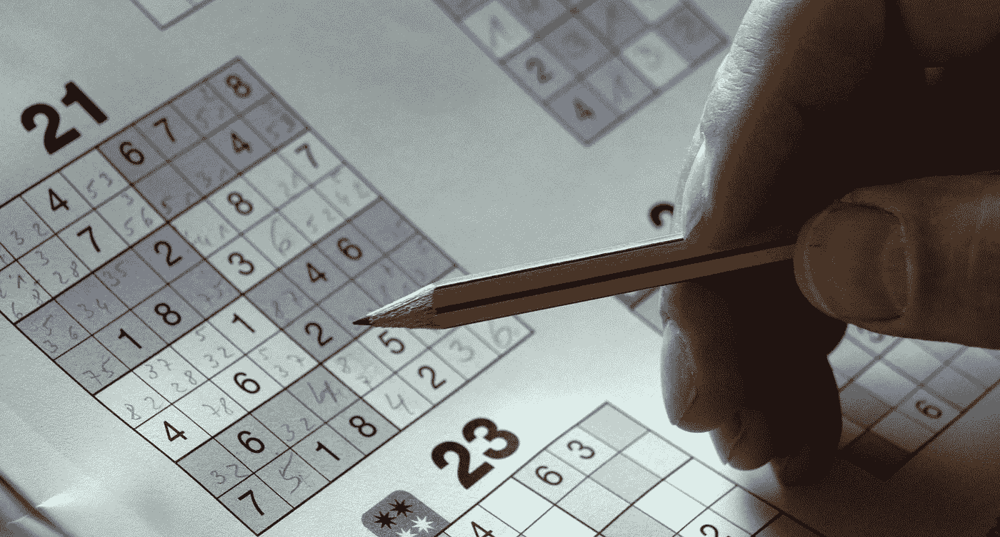
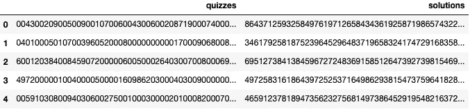
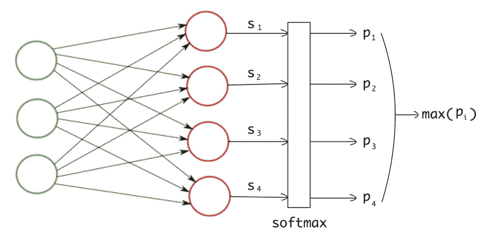
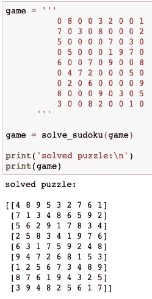

# 用卷积神经网络解决数独

> 原文：<https://towardsdatascience.com/solving-sudoku-with-convolution-neural-network-keras-655ba4be3b11?source=collection_archive---------3----------------------->



Image from [Pixabay](https://pixabay.com/photos/sudoku-puzzles-mysterious-folder-552944/)

很久以前我曾经解过**数独**。几天前，我想知道我是否可以用卷积神经网络( **CNN** )来解决这个问题。我知道数独有空间特征，因为它有特殊的数字排列，CNN 擅长提取空间特征。让我们看看这个实验如何进行。

# 数据收集

我在 [Kaggle](https://www.kaggle.com/bryanpark/sudoku) 上找到了以下数据，里面包含了 100 万个未解和已解的数独游戏。请看看下面的数据。



Sudoku Dataset

数据集包含 2 列。列`quizzes`具有未解决的游戏，列`solutions`具有各自已解决的游戏。每场比赛由一串 81 个数字代表。下面是一个由字符串转换而来的`9x9`数独。数字`0`代表未破游戏中的空白位置。

```
[[0 0 4 3 0 0 2 0 9]
 [0 0 5 0 0 9 0 0 1]
 [0 7 0 0 6 0 0 4 3]
 [0 0 6 0 0 2 0 8 7]
 [1 9 0 0 0 7 4 0 0]
 [0 5 0 0 8 3 0 0 0]
 [6 0 0 0 0 0 1 0 5]
 [0 0 3 5 0 8 6 9 0]
 [0 4 2 9 1 0 3 0 0]]
```

# 数据处理

我们的任务是将未解决的数独输入到神经网络中，并从中获得已解决的数独。这意味着我们必须向网络提供 81 个数字，并且需要从网络获得 81 个输出数字。

我们必须将输入数据(未解决的游戏)转换成一个 3D 数组，因为我们必须将它提供给 CNN。我把每串 81 个数字转换成`(9,9,1)`的形状。然后，我将输入数据除以`9`并减去`0.5`进行归一化。通过这样做，数据变得以零均值为中心，并且在`(-0.5 – 0.5)`的范围内。神经网络通常使用以零为中心的标准化数据表现更好。

# 电力网设计

在典型的多类分类中，神经网络输出每个类的分数。然后，我们对最终分数应用 softmax 函数，将它们转换成概率。并且数据被分类到具有最高概率值的类中(参考下图)。



Multiclass Classification

但是在数独游戏中，场景是不同的。我们必须为数独游戏中的每个位置获取 81 个数字，而不仅仅是一个。对于每个数字，我们总共有 9 个类，因为一个数字可以在 1 到 9 的范围内。

为了符合这个设计，我们的网络应该输出`81x9`数字。其中每行代表 81 个数字中的一个，每列代表 9 个类别中的一个。然后，我们可以应用 softmax 并取每行的最大值，这样我们就有 81 个数字被分类到 9 类中的一类。

我为此任务创建了以下简单的网络。网络由 3 个**卷积**层和一个**密集**层组成，用于分类。

Sudoku CNN

注意，我正在将密集图层的输出整形为`(81, 9)`的形状，然后在上面添加一个 softmax 图层。我用`sparse_categorical_crossentropy`损失和`adam`优化器编译了这个模型。

因为我们使用的是`SCC` loss，所以我们不需要提供一个独热编码的目标向量。我们的目标向量形状是`(81,1)`,其中向量元素表示 81 个数字的真实类别。

# 培养

我训练了 2 个纪元的网络，批次大小为 64。第一个时期的学习率是 0.001，第二个时期的学习率降低到 0.0001。最后的训练损失降到了 0.34。我尝试了一些不同的网络架构和策略，但无法进一步减少损失，所以我继续使用这个网络。是时候测试网络了。

# 解决数独

现在，我试着用我们训练有素的网络来解决这个游戏。我看到网络总是预测一些错误的值。下面是网络预测的一场比赛。您可以看到一些数字在行和列中重复出现。

```
> Input (Unsolved)[[0 1 6 9 0 4 0 0 7]
 [0 0 4 0 3 0 0 8 0]
 [0 0 3 0 6 1 9 2 0]
 [5 0 9 1 4 0 8 0 0]
 [1 7 0 0 0 0 0 0 0]
 [0 0 8 7 0 0 0 6 5]
 [6 0 0 0 0 2 0 4 0]
 [0 2 0 8 0 5 3 1 0]
 [0 3 0 0 0 0 0 0 9]]> Output[[2 1 6 9 8 4 5 3 7]
 [2 9 4 2 3 7 6 8 1]
 [7 8 3 5 6 1 9 2 4]
 [5 6 9 1 4 6 8 7 3]
 [1 7 2 5 5 8 4 9 4]
 [4 4 8 7 2 9 1 6 5]
 [6 9 1 3 1 2 5 4 8]
 [9 2 7 8 9 5 3 1 6]
 [4 3 1 4 1 6 2 5 9]]
```

我不得不尝试其他方法，而不是改变网络架构来解决游戏，因为训练损失不会低于某个数字。

# 一个更人性化的解决游戏的方法

作为人类，当我们解决数独时，我们一个接一个地填充数字。我们不会简单地看一遍数独，然后把所有的数字都填满。一个接一个地填写数字的好处是，每次我们填写一个数字，我们就能对下一步行动有更好的想法。

我现在在解数独的时候用了同样的方法。我没有一次预测所有 81 个数字，而是在所有空白位置中挑选一个概率值最高的数字，并将其填入数独中。在填完一个数字后，我们再次将这个谜题输入网络并进行预测。我们不断重复这个过程，用概率最高的数字一个接一个地填充空白位置，直到我们没有空白位置。

这种方法提高了性能，网络能够解决这个数据集中几乎所有的游戏。对 1000 个游戏的测试准确率为 0.99。

下面是一个从网上摘下来的数独游戏，模型正确地解决了它。你可以在我的`jupyter`笔记本中用你的数独游戏替换下面的`game`字符串，并检查结果。



Sudoku solved by CNN

然而，我需要在从网上挑选的更真实的游戏上检查我的模型，因为那些游戏可能与随机生成的不同。手动复制字符串格式的数独要花费很多时间，所以我把这部分留到将来。

下面是这个项目与保存模型的 **GitHub** 链接。我会继续张贴更多这样的项目。

[](https://github.com/shivaverma/Sudoku-Solver-CNN/blob/master/sudoku.ipynb) [## shivaverma/数独求解器-CNN

### 此时您不能执行该操作。您已使用另一个标签页或窗口登录。您已在另一个选项卡中注销，或者…

github.com](https://github.com/shivaverma/Sudoku-Solver-CNN/blob/master/sudoku.ipynb) 

如果你喜欢这篇文章，那么你也应该看看下面的文章。

[](https://medium.com/@shivajbd/solving-jigsaw-using-neural-nets-cc543a5f025c) [## 用神经网络解决拼图游戏

### 神经网络能解决一个 2x2 的拼图游戏吗？

medium.com](https://medium.com/@shivajbd/solving-jigsaw-using-neural-nets-cc543a5f025c)