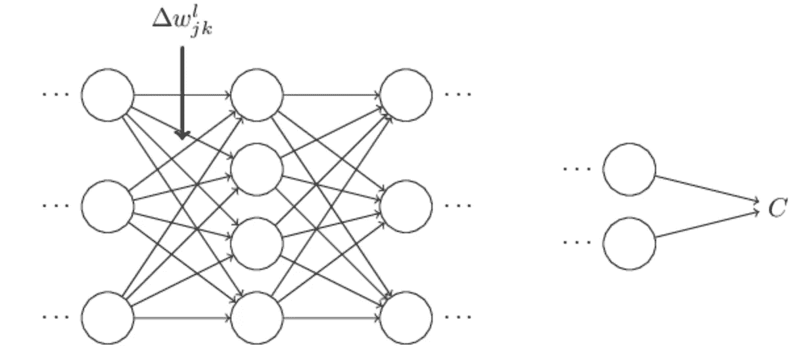
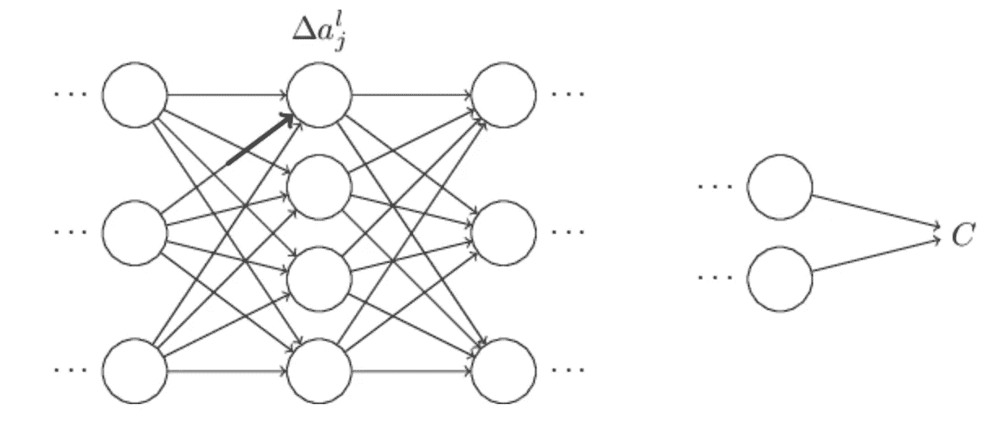
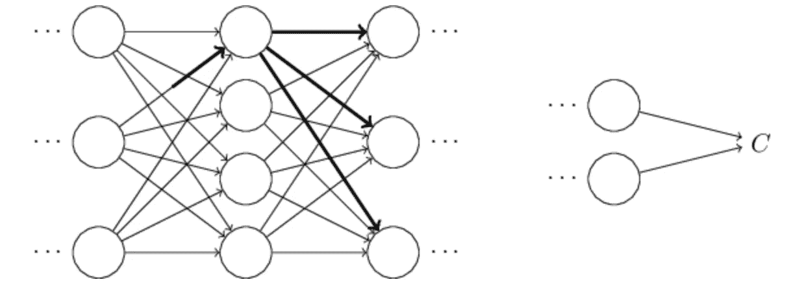
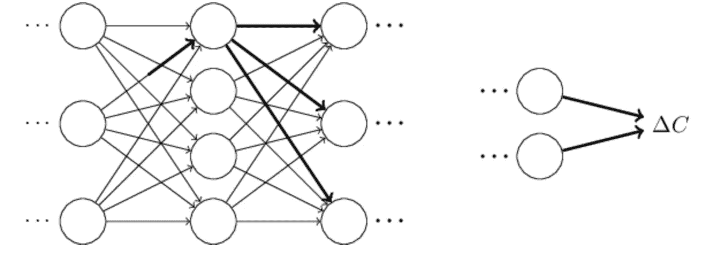
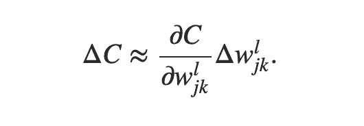
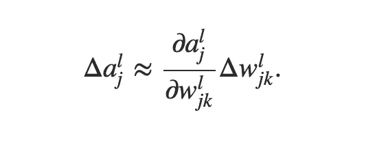
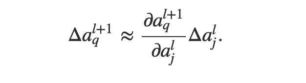
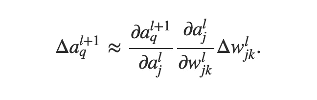
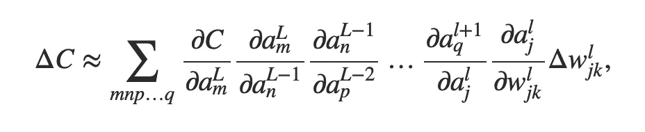

# 解开反向传播之谜

> 原文：<https://towardsdatascience.com/solving-the-mystery-of-backpropagation-73b18cae8e40?source=collection_archive---------26----------------------->

Photo by [Cristina Gottardi](https://unsplash.com/@cristina_gottardi?utm_source=medium&utm_medium=referral) on [Unsplash](https://unsplash.com?utm_source=medium&utm_medium=referral)

在大多数广泛使用的基于神经网络的人类级超越学习系统中，该算法是相当重要的。1986 年发表在《自然》杂志上的一篇论文使这一方法广为人知，这篇论文的作者是[大卫·鲁梅尔哈特](http://en.wikipedia.org/wiki/David_Rumelhart)、[杰弗里·辛顿](http://www.cs.toronto.edu/~hinton/)和[罗纳德·威廉姆斯](http://en.wikipedia.org/wiki/Ronald_J._Williams)。

原始论文的结论是，“将该程序应用于各种任务表明，有趣的内部表示可以通过权重空间中的梯度下降来构建，这表明值得在神经网络中寻找更具生物学意义的梯度下降方法”。好吧，反向传播可能不完全是在我们的自然神经元网络中发生的，但它肯定在数学学习系统中表现出了巨大的成果。这将催生一个激动人心的人工智能新时代。

反向传播算法处理连续调整神经网络内部参数(权重和偏差)的系统方法，以使网络做出的预测误差最小。如果你想从事机器学习和深度学习的复杂应用，了解它的内部工作方式似乎是至关重要的。

反向传播最聪明的地方似乎是用来计算成本函数相对于网络中每个权重和偏差的偏导数的方法。这为思考这个优雅的算法是如何第一次被发现的铺平了道路。

但是，如果你仔细观察神经网络的行为，可能会有一种系统的方法来推断衍生品的奥秘。

想象将单个权重 *w* 值改变一个小因子*δw*的情况，如下图所示；

现在，这一变化将影响涉及该重量的立即激活，使其改变*δa*。

*δa*的变化将依次影响下一层中的所有其他节点。

最终，以类似的方式穿过所有层，开始整个变化的δw 影响最终的成本函数。

现在，我们可以把它看作是变化的向前传播。换句话说，我们可以用我们操纵的权重的第一次变化来表示网络成本的最终变化。

The change in cost as a partial derivative of the weight change performed

现在，计算成本的变化看起来就像是一项计算𝜕C/𝜕w 的任务。看看它是如何在网络上传播的，我们可以用公式表示它与第一个δw 之后发生的所有变化的关系。

上述表达式显示了由于*δw .*导致的最直接激活的变化，这将依次影响*δa*之后的下一次激活。

现在这里的*δa*可以用之前的表达式代替，你会得到下面的表达式；

我们倾向于在这里看到一种模式。从*δw*的第一次变化开始，随后的激活受到前一层激活变化的影响。∂a/∂a 开始成为我们经过的每一个节点的通用术语。现在很清楚，对于每一层中的每个节点，模式将如下所示；

这里的 *m，n，p* …项表示不同的层，而 *∑* 表示我们对每层中的所有节点求和。

我们记得，反向传播算法的任务是找到所有参数的偏导数*，即*。关于网络末端成本变化的所有权重和偏差。因此，如果我们简化上面的等式，这表明我们可以根据激活和权重的值来制定所有权重和偏差的表达式。这个计算每个参数变化幅度的过程，给了我们一个方向，如果我们想降低网络中的总成本。计算出的导数给出了梯度下降的方向。非常直观和优雅。

这就是大卫·鲁梅尔哈特等人。艾尔。想出了反向传播的解决方案？嗯，也许吧。但该算法最吸引人的地方在于，这些持续适应成本变化的过程如何最终产生一个模拟输入数据表示的参数空间，从而可以预测/识别相同分布的新实例。

这一事实通常被视为反向传播的奥秘，这使得批评者将深度神经网络称为黑盒。但他们真的是吗？

我的论点是，如果我们系统地评估并花时间实际思考在神经网络的优化期间发生了什么，也许我们能够解决这个问题。但是，许多层次和抽象层次似乎太多了，有时我们的短期记忆无法保留和形成整个过程的整体画面。这就是机器正在帮助我们做的事情。

我最后的想法是，这是我们能想出的最好的办法吗？因为如果你仔细想想，通过反向传播进行泛化的整个过程是一个非常数据饥渴和耗时的过程。对于机器来说，是否会有更好的方法来获得现实世界中物体的表现呢？这些问题是研究的前沿。我们从未像现在这样兴奋地去研究它们。

*帖子中提出的观点直接受到了迈克尔·a·尼尔森的著作* ***【神经网络与深度学习】*** *的影响。强烈推荐给任何想从零开始学习深度学习的人。*

*感谢阅读。*