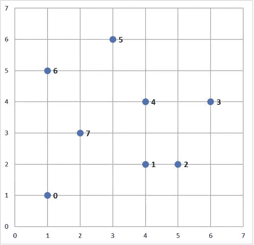
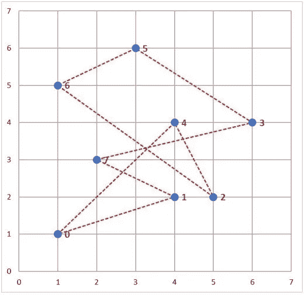
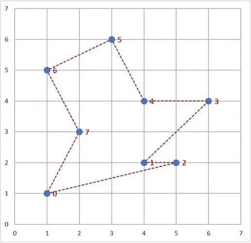
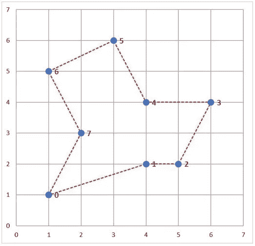

# 用 Python 解决旅行推销员问题

> 原文：<https://towardsdatascience.com/solving-travelling-salesperson-problems-with-python-5de7e883d847?source=collection_archive---------2----------------------->


## 如何使用随机优化算法通过 Python 的 mlrose 包解决旅行推销员问题

mlrose 提供实现一些最流行的随机化和搜索算法的功能，并将它们应用于一系列不同的优化问题领域。

在本教程中，我们将讨论旅行推销员问题的含义，并通过一个例子来说明如何使用 *mlrose* 来解决这个问题。

这是关于使用 *mlrose* 解决随机优化问题的三个系列教程中的第二个。第 1 部分可在此处找到[，第 3 部分可在此处](/getting-started-with-randomized-optimization-in-python-f7df46babff0)[找到](https://medium.com/@gkhayes/fitting-a-neural-network-using-randomized-optimization-in-python-71595de4ad2d)。

# 什么是旅行推销员问题？

旅行推销员问题(TSP)是一个经典的优化问题，其目标是确定一组 *n* “城市”(即节点)的最短旅行，在同一城市开始和结束，并且恰好访问所有其他城市一次。

在这种情况下，一个解决方案可以用一个由 *n* 个整数组成的向量来表示，每个整数都在 0 到 *n-1* 的范围内，指定了访问城市的顺序。

TSP 是一个 NP-hard 问题，这意味着，对于较大的 *n* 值，在合理的时间内评估每个可能的问题解决方案是不可行的。因此，tsp 非常适合使用随机优化算法来解决。

## 例子

考虑以下包含 8 个城市的地图，编号为 0 到 7。



一名销售人员想去这些城市中的每一个，在同一个城市开始和结束，并且访问其他城市一次。

一个可能的城市旅行如下图所示，可以用解向量 *x* = [0，4，2，6，5，3，7，1]来表示(假设旅行从城市 0 开始并结束)。



然而，这并不是这些城市中最短的游览。这个问题的目的是找出 8 个城市中最短的 T21 之旅。

# 用 mlrose 求解 tsp

假设 TSP 的解可以用一个范围为 0 到 n-1 的整数向量来表示，我们可以定义一个离散状态优化问题对象，并使用一个随机优化算法来解决它，就像我们在之前的教程中对 8 皇后问题所做的那样。

[回想一下，离散状态优化问题是状态向量的每个元素只能取一组离散的值。在 *mlrose* 中，这些值被假定为 0 到( *max_val* -1)范围内的整数，其中 *max_val* 在初始化时定义。]

然而，通过这种方式定义问题，我们最终可能会考虑无效的“解决方案”，这涉及到我们不止一次地访问一些城市，而一些则根本不访问。

另一种方法是定义一个优化问题对象，该对象只允许我们将第 *n* 个城市的有效旅游视为潜在的解决方案。这是一种更有效的解决 tsp 的方法，可以使用`TSPOpt()`优化问题类在 *mlrose* 中实现。

我们将使用这种替代方法来解决上面给出的 TSP 示例。

解决该问题所需的步骤与解决 *mlrose* 中任何优化问题的步骤相同。具体来说:

1.  定义一个适应度函数对象。
2.  定义一个优化问题对象。
3.  选择并运行随机优化算法。

在开始这个例子之前，你需要导入 *mlrose* 和 *Numpy* Python 包。

```
import mlrose
import numpy as np
```

# 定义一个适应度函数对象

对于示例中的 TSP，目标是找到八个城市中最短的行程。因此，适应度函数应该计算给定旅程的总长度。这是在 *mlrose* 的预定义`TravellingSales()`类中使用的适应性定义。

默认情况下，`TSPOpt()`优化问题类假设`TravellingSales()`类用于定义 TSP 的适应度函数。因此，如果要使用`TravellingSales()`类来定义适应度函数对象，那么可以跳过这一步。然而，如果需要，也可以手动定义适应度函数对象。

为了初始化`TravellingSales()`类的适应度函数对象，需要指定所有城市的( *x* ， *y* )坐标或者每对可能旅行的城市之间的距离。如果指定了前者，则假设每对城市之间的旅行是可能的，并且城市对之间的距离是欧几里德距离。

如果我们选择指定坐标，那么这些应该作为对的有序列表输入(其中对 *i* 指定城市 *i* 的坐标)，如下所示:

或者，如果我们选择指定距离，那么这些应该作为一个三元组列表输入，给出所有城市对之间的距离 *d* ， *u* 和 *v* ，对于这些城市，旅行是可能的，每个三元组的形式为( *u* ， *v* ， *d* )。

指定城市的顺序并不重要(即，假设城市 1 和 2 之间的距离与城市 2 和 1 之间的距离相同)，因此每对城市只需要被包括在列表中一次。

使用距离方法，可以如下初始化适应度函数对象:

如果在初始化适应度函数对象时指定了坐标列表和距离列表，则距离列表将被忽略。

# 定义一个优化问题对象

如前所述，在 *mlrose* 中解决 TSP 的最有效方法是使用`TSPOpt()`优化问题类定义优化问题对象。

如前一步所示，如果已经手动定义了一个适应度函数，那么初始化`TSPOpt()`对象所需的唯一附加信息就是问题的长度(即旅程中要访问的城市数量)以及我们的问题是最大化还是最小化问题。

在我们的例子中，我们想要解决长度为 8 的最小化问题。如果我们使用上面定义的`fitness_coords`适应度函数，我们可以如下定义一个优化问题对象:

```
problem_fit = mlrose.TSPOpt(length = 8, fitness_fn = fitness_coords,
                            maximize=False)
```

或者，如果我们先前没有定义适应度函数(并且我们希望使用`TravellingSales()`类来定义适应度函数)，那么这可以作为优化问题对象初始化步骤的一部分，通过指定坐标列表或距离列表而不是适应度函数对象来完成，类似于手动初始化适应度函数对象时所做的。

在我们的例子中，如果我们选择指定一个坐标列表，而不是一个适应度函数对象，我们可以将优化问题对象初始化为:

```
coords_list = [(1, 1), (4, 2), (5, 2), (6, 4), (4, 4), (3, 6), 
               (1, 5), (2, 3)]problem_no_fit = mlrose.TSPOpt(length = 8, coords = coords_list,
                               maximize=False)
```

与手动定义适应度函数对象一样，如果在初始化优化问题对象时指定了坐标列表和距离列表，则距离列表将被忽略。此外，如果除了坐标列表和/或距离列表之外还指定了适应度函数对象，则坐标/距离列表将被忽略。

# 选择并运行随机优化算法

一旦优化对象被定义，剩下要做的就是选择一个随机优化算法，并用它来解决我们的问题。

这一次，假设我们希望使用一种遗传算法，其默认参数设置为群体大小( *pop_size* )为 200，突变概率( *mutation_prob* )为 0.1，每步最多尝试 10 次( *max_attempts* )，并且对算法的最大总迭代次数没有限制( *max_iters* )。

这将返回以下解决方案:

```
The best state found is:  [1 3 4 5 6 7 0 2]The fitness at the best state is:  18.8958046604
```

该算法找到的解决方案路线如下图所示，总长度为 18.896 个单位。



与上一教程中给出的 8 皇后示例一样，通过调整优化算法的参数，该解决方案有可能得到改进。

例如，将每步的最大尝试次数增加到 100，并将变异概率增加到 0.2，会产生总长度为 17.343 个单位的旅程。

```
The best state found is:  [7 6 5 4 3 2 1 0]The fitness at the best state is:  17.3426175477
```

该解决方案如下图所示，可以证明是解决该问题的最佳解决方案。



# 摘要

在本教程中，我们介绍了旅行推销员问题，并讨论了如何使用 *mlrose* 有效地解决这个问题。这是一个关于 *mlrose* 如何解决一个非常特殊的优化问题的例子。

mlrose 致力于解决的另一种非常特殊的优化问题是机器学习权重优化问题。也就是为神经网络、回归模型等机器学习模型寻找最优权重的问题。

我们接下来将讨论如何使用 *mlrose* 来解决这个问题，在我们的第三篇也是最后一篇教程中，可以在这里找到[。](https://medium.com/@gkhayes/fitting-a-neural-network-using-randomized-optimization-in-python-71595de4ad2d)

***要了解更多关于 mlrose 的信息，请访问这个包的 GitHub 资源库，这里有***[](https://github.com/gkhayes/mlrose)****。****

**Genevieve Hayes 博士是数据科学家、教育家和人工智能及分析专家，拥有*[*Genevieve Hayes Consulting*](https://www.genevievehayes.com/)*。你可以在*[*LinkedIn*](https://www.linkedin.com/in/gkhayes/)*或者*[*Twitter*](https://twitter.com/genevievekhayes)*上关注她。她还是* [*价值驱动数据科学*](https://www.genevievehayes.com/episodes/) *的主持人，这是一个每月两次的播客，面向希望最大化其数据和数据团队价值的企业。**

**想要发掘企业数据的价值，但不知道从哪里开始？**[***下载免费的数据科学项目发现指南。***](https://www.genevievehayes.com/discovery-guide/)**