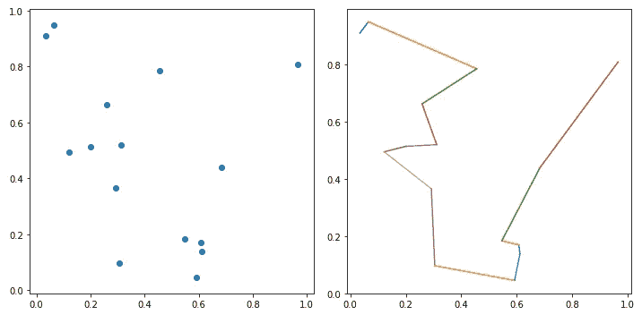
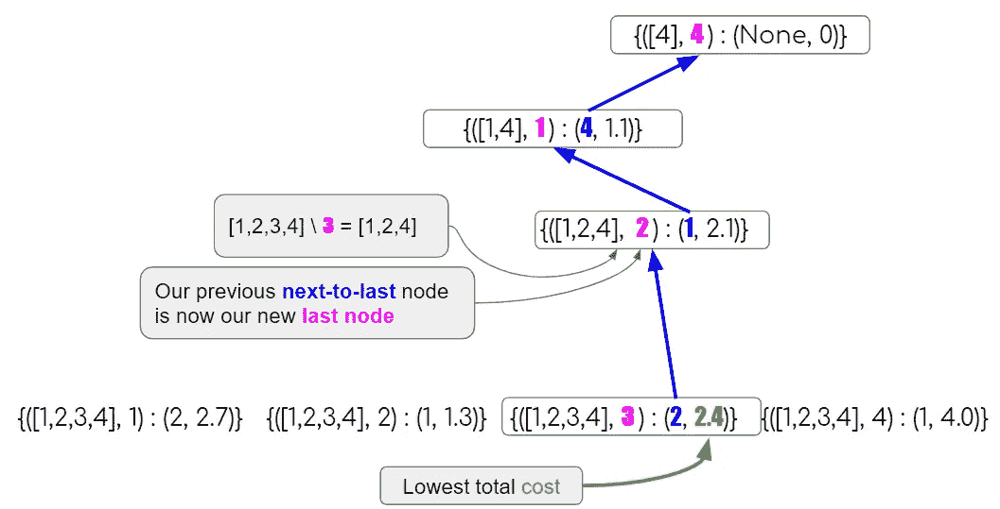
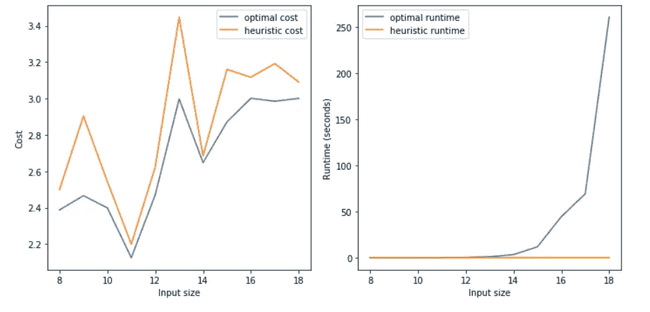
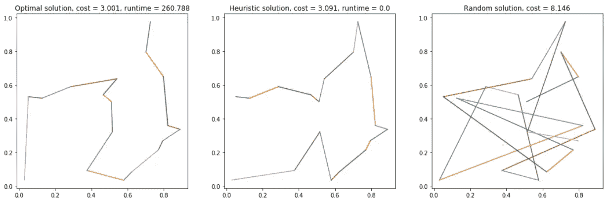

# 用动态规划法求解 TSP

> 原文：<https://towardsdatascience.com/solving-tsp-using-dynamic-programming-2c77da86610d?source=collection_archive---------7----------------------->

## 是的，因为没有足够的解决方案

当我在为我的运输系列中的另一篇文章( [I](https://medium.com/hackernoon/yats-yet-another-tsp-solution-6a71aeabe1f8) 、 [II](/bounded-clustering-7ac02128c893) ，敬请关注 III)进行研究时，我正在为[旅行销售员问题](https://en.wikipedia.org/wiki/Travelling_salesman_problem) (TSP)寻找一个[动态规划](https://en.wikipedia.org/wiki/Dynamic_programming)解决方案。

我确实找到了许多资源，但是没有一个是我喜欢的。要么是它们太抽象，太理论化，出现在一个我不喜欢看的长视频里，或者，你知道，不是我的风格。好像我不明白其中的逻辑。

所以说实话，我甚至不想写这篇文章，因为我认为它已经被写了一千遍了。但是，生活难道不令人惊讶吗？

> **关于这篇文章后面的完整代码，你可以去** [**这里**](https://github.com/DalyaG/CodeSnippetsForPosterity/tree/master/SolvingTSPUsingDynamicProgramming) **。**

# 背景

你可以在本帖中读到一个更好、更令人愉快的版本，但要点如下。我们在一个平面上有`n`个点，我们希望找到恰好访问每个点一次的最短路径。

Yup, this is already a spoiler with the solution! Did I mention I wasn’t planning on writing this post?

# DP 速成班

实际上，我真正想说的是，这是**而不是**DP 速成班😇

如果您不习惯动态编程的概念，我推荐一个比我更好的介绍，介绍这个漂亮的方法。幸运的是，一个有趣且直观的工具已经存在了！请访问 Siraj Raval 的精彩视频，加入我们的讨论🤓

# 构建 DP 树

在动态编程(DP)中，我们边走边构建解决方案。在我们的例子中，这意味着我们的初始状态将是任何要访问的第一个节点，然后我们通过添加每个可能的节点来扩展每个状态，以形成大小为 2 的路径，等等。每次我们访问以前访问过的部分解决方案时，我们只保留最好的分数。

啊哈！
但是你问什么是“已访问部分解决方案”？
而且你问的没错！
弄清楚什么应该“保留在内存中”是成功的 DP 解决方案的关键要素之一。经过反复试验，我决定在内存中保留每个部分解决方案的最后一个的*和倒数第二个*的*节点。*

For the partial solution [1,2,3,4], where 4 in the last node visited, we ask ourselves — what is the best way to get there? We can either come from 3 and have a total cost of 1.8, or come from 2 and have a total cost of 1.5.

一旦你确定了你想在内存中保存什么，代码就非常简单了，而且对于不同的问题，在不同的 DP 实现之间几乎没有变化:

# 回溯最短路径

一旦我们到达了树的末端，意味着我们在备忘录中保存的路径是完整的，那么“剩下的一切”就是折回我们的步骤以找到最佳路径。

幸运的是，我们记住了每个部分路径中的最后一个和倒数第二个节点！

Our optimal path in pink: [4,1,2,3]

因此，第一步将是查看最后一层，包括所有完整路径，并选择总成本最低的最后一个节点。

从那里，我们可以使用倒数第二个节点来追溯我们的步骤。

# 与启发式解决方案相比

好了，现在我们有了 TSP 问题的最优解，我们可以用它做什么呢？

嗯，事情是…那不多…

TSP 是一个 [NP 完全](https://en.wikipedia.org/wiki/NP-completeness)问题，求解到最优是高度不可伸缩的。幸运的是，在[之前的帖子](https://medium.com/hackernoon/yats-yet-another-tsp-solution-6a71aeabe1f8)中，我们使用快速启发式方法解决了 TSP 问题。在那篇文章之后，你们中的许多人问我——这个解决方案与最优方案相比如何？而我终于可以回答了！

哇！！这就是指数增长的样子！！😨

撇开复杂性不谈，启发式的解决方案总是让它接近最优解😅

对于这个实验中的最大输入，即使我们看最终结果，它看起来也非常相似🎯

# AAAA，那是所有的人！敬请期待我们的下一次冒险！

> **这篇文章后面的完整代码你可以去** [**这里**](https://github.com/DalyaG/CodeSnippetsForPosterity/tree/master/SolvingTSPUsingDynamicProgramming) **。**

