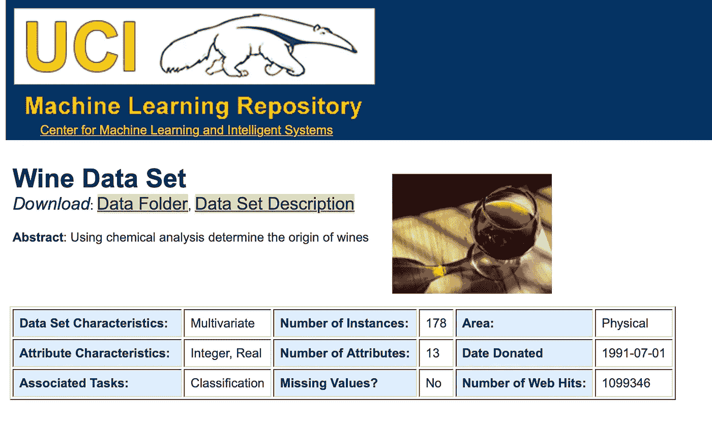

# 关于数据文件您不知道的一些事情如果您是数据科学的新手，请从 web 导入数据文件:第 1 部分

> 原文：<https://towardsdatascience.com/something-you-dont-know-about-data-file-if-you-just-a-starter-in-data-science-import-data-file-e2e007a154c4?source=collection_archive---------9----------------------->

## *要成为数据科学领域的大师，你必须了解如何管理你的数据以及如何从网络上导入数据，因为大约。现实世界中 90%的数据直接来自互联网。*

Data Engineer Life ( Source: Agula)

*如果你是数据科学领域的新手，那么你必须努力快速学习概念*。*现在，你在正确的地方可以更快地学习一些东西。*

M 此外，根据我的经验，我认识了许多数据科学领域的新手或处于学习过程中的人。所有这些人都急于在几秒钟内覆盖伦敦到纽约的距离，等待它**Elon Musk HYPERLOOP(仍然 Elon Hyperloop 需要 4.67 小时来完成 5585 公里的范围)，我认为这项技术仍在工作中。

Source: DailyExpress( Elon Musk Hyper-loop Concept)

还有，你很努力地想在一小时内走完这段距离。你不是能在几分钟内看完所有网站内容，并做出一个独特的新内容的 AI。数据科学是一个你必须创造策略的领域，就像罗伯特·布朗(Robert R. Brown)的《像兔子一样富裕》(顺便说一下，如果你想更多地了解金融世界，并喜欢为未来存钱，这是一本值得一读的好书)。让我们回到正题；数据科学是一个你需要花一些时间去获得一些有用的、深入的知识的领域。
在本主题中，我们将介绍一些我们每天在项目中使用的不同数据格式。作为一名数据科学家，我们都花了很多时间来准备数据(70%的时间花在数据准备、清理和处理缺失值上)。大多数数据人能理解我的观点，是的，没关系，这就是我们现在的生活。我们都能理解操作完全不同的数据种类所带来的挑战。有时候，处理不同的数据类型会让你很苦恼，但是等等，我还没有谈到非结构化信息或半结构化数据。

Data makes me mad( source: Critique Cricle)

对于任何一个数据科学家和数据工程师来说，处理不同的数据格式都是一项令人厌倦的任务。现实世界中的实际数据非常混乱，你很难得到清晰的表格数据。因此，对于数据科学家来说，了解不同的数据格式、处理所有这些格式的挑战，并找到在现实生活中处理这些数据的最佳方法，是非常重要的。
我们将讨论一些对数据科学家领域有用的文件格式。不过，大部分的数据技能(**)。csv()、文本、酸洗文件、Excel 文件、电子表格和 Matlab 文件**，所有这些文件都在本地环境下工作。然而，作为一名数据科学家，你的大部分时间这些技能已经足够了。因为大部分时间你都要处理从万维网上导入的数据。

 [## 忘记 API 用漂亮的汤做 Python 抓取，从 web 导入数据文件:第 2 部分

### API 并不都是为你准备的，但是美丽的汤会永远伴随着你。

towardsdatascience.com](/forget-apis-do-python-scraping-using-beautiful-soup-import-data-file-from-the-web-part-2-27af5d666246) 

比如说；您需要从 UCI 机器学习数据集库中导入葡萄酒数据集。你是如何从网上获得这些数据的？现在，您可以尝试使用您最喜欢的网络浏览器来下载该数据集。

Wine Data-Set(Source:uci.edu)

现在有一些导航到适当的网址点，并点击适当的超链接下载文件。然而，这种方法产生了一些严重的问题。首先，它不是用代码编写的。此外，假装可再生性问题。如果有人想复制您的工作流，他们不一定要在 Python 之外这样做。其次，不具备可扩展性；如果你想下载 50、100 或 1000 个这样的文件，分别需要 50、100 和 1000 倍的时间。如果您使用 python，您的工作流可以具有可再现性和可伸缩性。
我们将在这一部分使用 python 来学习如何从**WWW(world Wide Web)**导入和本地数据集。我们还将直接从 www(万维网)上加载熊猫数据框中的同类数据集。无论它们是平面文件还是不同的文件，您都可以将这些技能放在发出 HTTP 请求的更广泛的意义上。特别是，您会喜欢 HTTP GET 请求，用简单的英语来说就是从 web 上获取数据。您将使用这些新的请求技能来学习从互联网上抓取 HTML 的基础知识。此外，您将使用精彩的 Python 包 Beautiful Soup 来传递 HTML 并将其转换为数据。漂亮的汤来传递 HTML 并把它变成数据。
现在有一些很棒的套餐。帮助我们导入您将要使用的 web 数据，并熟悉 **URLlib(urllib 包)**。这个模块实现了一个高级接口，用于在万维网上检索数据。特别是， **urlopen()函数**与内置函数 open 相关，但是接受通用源定位器而不是文件名。现在让我们通过一个为红酒数据集导入一个质量数据集的例子，直接从 web 导入。

这里发生的是导入一个名为 URL 的函数，它是从 url live 包的 request 子包中检索的。

1.  **来自 Web 的平面文件(打开并阅读):**

我们刚刚学习了如何从互联网上导入文件，在本地保存并存储到数据帧中。如果我们想加载文件而不在本地保存它，我们也可以使用 pandas。因此，我们将使用函数 **pd.read_csv()** ，并将 URL 作为第一个参数。

**2。来自 Web 的非平面文件:**

熊猫的功能是如此有用的本地存储文件，它有一个近亲，帮助我们加载各种文件。在下一个练习中，我们使用 pd.read_excel()导入 excel 电子表格。

**3。HTTP 请求(执行)使用 urllib:**
HTTP 是超文本传输协议，是网络数据通信的基础。我们将执行 **urlretrieve()** 执行一个 GET 请求。在本练习中，您将 ping 服务器。

**4。使用 urllib 的 HTTP 请求(打印):**

我们已经知道如何 ping 服务器，现在我们将提取响应并打印 HTML。

**5。HTTP 请求(正在执行)使用请求**

现在，您对如何使用 urllib 包使用 HTTP 请求有了全面的了解，您将弄清楚如何在更高的层次上做同样的事情。同样，我们将 ping 服务器，您必须将这个程序与之前的程序进行比较。(使用 urllib 的 HTTP 请求(执行))。我们不会在这里关闭连接。

我想现在你已经对如何从网上提取数据有了一点概念。
在下一部分中，我们将了解美丽的汤，如何在数据科学中使用 API，然后我们将在整个系列中讨论 Twitter API。所以，请在 medium 和 Twitter 上关注我。因此，在您的数据科学之旅中，您不会错过任何一个重要主题。此外，欢迎来到数据科学世界。

我已经发表了第 2 部分，你可以看看，让你的数据工程师技能更上一层楼。欢迎在我的 [linkedin](https://www.linkedin.com/in/sahil-dhankhad-303350135/) 上提问。

 [## 忘记 API 用漂亮的汤做 Python 抓取，从 web 导入数据文件:第 2 部分

### API 并不都是为你准备的，但是美丽的汤会永远伴随着你。

towardsdatascience.com](/forget-apis-do-python-scraping-using-beautiful-soup-import-data-file-from-the-web-part-2-27af5d666246) 

参考:

1.  [葡萄酒数据集](https://s3.amazonaws.com/assets.datacamp.com/production/course_1606/datasets/winequality-red.csv)
2.  [https://datacamp.com/](https://datacamps.com/extracting)使用 python 从 web 导入数据
3.  [https://docs.python.org/3/howto/urllib2.html](https://docs.python.org/3/howto/urllib2.html)
4.  [https://archive.ics.uci.edu/ml/datasets/wine](https://archive.ics.uci.edu/ml/datasets/wine)