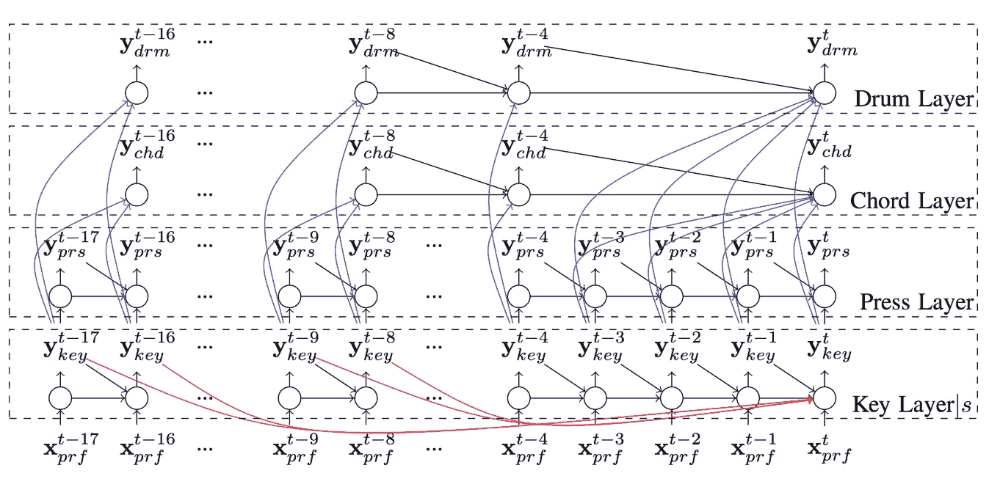
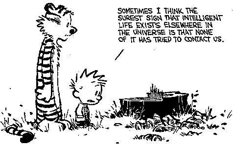

# 抱歉，项目不会给你带来工作

> 原文：<https://towardsdatascience.com/sorry-projects-dont-get-you-jobs-3e5d8e74bfdc?source=collection_archive---------0----------------------->

## 我们如何高估了数据科学项目在工作过程中的作用——以及 4 个真正重要的面试技巧。

from Unsplash.com

## TLDR:如果你想成为一名数据科学家，就不要再追求项目了，先专注于掌握这四项技能。

# 概述

> ***1。问题*** *:我们如何高估了项目在数据科学招聘过程中的作用。*
> 
> ***2。轶事:*** *我自己的数据科学项目如何在网上疯传，但在实际采访中收效甚微。*
> 
> ***3。解决方法:*** *掌握招聘经理实际测试的 4 项技能，这些技能暗中测试你的“智力”。*
> 
> ***4。结论*** *:数据科学项目在求职中的作用。*

# 序言:项目思维

对于有抱负的数据科学家如何获得利润丰厚的数据科学职位，存在巨大的误解，这与项目有关。

我所说的项目是指在 Jupyter Notebook 上尝试一些最新的机器学习或深度学习算法，并将这些工作上传到 Github 上，就好像这最终会赢得招聘经理的心一样。

但是你猜怎么着？他们不会从你的个人项目中读取太多代码。如果你这样想，你就有了我所说的项目思维。

> **项目思维定势:**(名词)做越来越多的 ML 项目并把它们放在简历上的思维定势最终会让你得到那份高薪的数据科学工作，这在现实中不会打动多少人。

我怎么知道这个？因为我自己就是那个笨蛋。在应用程序执行许多不同的项目来扩展我的“投资组合”之前，我花费了宝贵的时间。我在项目上取得了很大进展——完成了一些获得数据领域杰出人物认可的项目。

但是现在，作为旧金山的一名数据科学家，我意识到我错了，更糟糕的是，有那么多人在追随我的脚步。这是一个警告你关于项目的故事，以及关于项目将带你去哪里的现实(剧透，不太远)。

PS:记住我只申请了加州旧金山的数据科学家职位。所以我要说的可能不适用于你所在的地区或你申请的职位。这是一个人的观点(实际上是两个人，你会在下面看到)。但这个故事也有一个可概括的方面，因为我看到世界各地的人们都对“项目”的(虚假)诱惑力和潜力感到敬畏。

# 1.轶事:我如何成为项目的“上帝”

在我申请数据科学职位之前，我花了 4-5 周的时间在我的项目上，因为那是我认为正确的行动方针。作为一名职业钢琴家，我想在音乐方面有所作为。这让我想到了神经网络，特别是 LSTMs 被用来产生新的音乐。

我花了整整两周的时间阅读这方面的学术论文，回想起来，我大概理解了其中的 30%。但是在那 30%里，有些事情真的困扰着我。我觉得一些研究人工智能音乐的人并不具备音乐基础方面的深厚知识。这可以从他们通过超级复杂的神经网络架构创造新声音的方式中看出，这些架构似乎没有反映出真正的音乐家是如何创作音乐的。

Example of academic research where music is created using LSTMs.

这让我如此困扰，以至于我决定基于隐马尔可夫模型从头开始创建一个算法。大约 800 行纯 python 代码后，我开发了自己的音乐制作算法。我称之为[流行音乐制作人](https://github.com/haebichan/PopMusicMaker)。

流行音乐制作人将音乐数据作为输入，分解音符，找出这些音符之间的统计关系，并根据这些统计数据重新创作一首全新的流行歌曲。

Architectural Basis of Pop Music Maker.

## 一切都失控了

我在 TowardsDataScience.com 上写了一篇关于我的机器的文章，没几天，这篇文章就爆了。每天都有成千上万的人开始阅读它，尤其是当有人在 HackerNews 上发布了我的文章之后。当我意识到发生了什么的时候，这篇文章已经在 Twitter 和 LinkedIn 上成为热门话题。到了 Travis oli phant(Numpy 的创始人和 Anaconda 的创始人)和 O'Reilly Media 的 Ben Lorica 在他们自己的社交媒体上分享了我的内容。

随着越来越受欢迎，每天都有数百人通过我创建的 flask 网站使用我的算法。这导致我的网站不断崩溃，因为部署我的代码的 AWS EC2 实例太小，无法处理大流量。一些互联网上的人开始说我是骗子，因为当他们想尝试我的算法时，网站不可用。

 [## 制作音乐:当简单概率胜过深度学习

### 概述:我如何发现一个使用深度学习制作音乐的问题，并通过创作自己的原创来解决它…

towardsdatascience.com](/making-music-when-simple-probabilities-outperform-deep-learning-75f4ee1b8e69) 

很快，这些批评在许多社交媒体网站上迅速演变成一场全面的激烈争论。一些拥有博士学位的研究人员对我在基于贝叶斯理论的方法中犯的错误大发雷霆。其他人来拯救我，捍卫我的工作(包括本·洛里卡)。简而言之，我重新点燃了互联网部分地区[贝叶斯与频率统计](https://www.theregister.co.uk/2017/06/22/bayesian_vs_frequentist_ai/)的圣战。

起初，我决定向那些出于某种原因感到受到侮辱的人道歉，并礼貌地询问我如何才能改进我的方法。但是经过几天的道歉，我再也受不了了。辩论让我精疲力尽，我只想远离互联网。我关掉了所有的电子设备。

## 那么这个故事的重点是什么呢？

我讲这个故事是因为你会认为，尽管存在争议，但在我的简历中加入这个项目将有助于我获得数据科学的工作。结论:没有。除了一个来自小型创业公司的人伸出援手，没有人真正关心。总的来说，我面对的炽热只是一个微小的火花，被湾区科技的强风吹灭了。

更重要的是，招聘委员会的人并没有真正在项目上测试我。因为招聘过程不是基于你做过多少项目。这是我在很多数据科学申请者身上看到的一个普遍假设。

不要只是从我这里拿走；在我对 DoorDash 的 Jeffrey Li 进行的 TDS 独家采访中，Jeff 谈到了有抱负的数据科学家身上的陷阱:

> *“我在市场上看到的大多数数据科学家的最大陷阱是能够*将机器学习模型与商业影响*联系起来。所以很多非常非常聪明的人建立了这个非常复杂的五层神经网络，它能做出很好的预测，得分很高。但是，当我们深入研究特定模式的业务影响时，他们通常很难回答这个问题。”*

如果数据科学招聘不是基于项目，那是基于什么？这是基于招聘方所说的“智力测试”。

# 2.臭名昭著的“智力测试”

我真的不喜欢“智力”这个词，因为这是一个暗示生物禀赋的词(你要么拥有它，要么没有)。但不幸的是，我看到它在科技招聘领域被频繁使用——而且是秘密使用。

我总是从私下渠道听到各种形式的“那个人不够聪明/不适合技术角色”。我第一次听说这些表达是从我的好朋友那里，他们是加利福尼亚湾区的软件工程师。

对我来说，这个词感觉非常压抑和飘渺。但在对这个在科技界使用的词“智能”反思了很长时间后，我开始理解它的实际含义。通过理解它的含义，我发现它没有任何“生物学”的东西——这意味着任何人都可以通过足够的准备来提高。更重要的是，我发现了破解数据科学面试的秘方。

## 打破“智力测试”

智力测试是所有招聘过程的基础。这是技术挑战、带回家和白板问题的基础。测试有四个主要因素。这些是:

1.  分析思维
2.  变量提取
3.  边缘案例检测
4.  最佳处理

前三分之一是最重要的。第四个是值得拥有的，一旦招聘经理从你那里得到足够的关于前三个方面的信号，就会被问到。但是这四个都是为了提取你未来技术角色的潜力和能力的信号。

> 简而言之:*以下四项技能非常重要，但对统计、编码和 SQL 的理解也很重要。我假设这是一个大家都知道的显而易见的真理，所以我不会在这里进入知识基础。*

## 1.分析思维

分析思维指的是将一个巨大的问题分解成可消化的部分，然后依次解决的能力。简而言之，它构建了一个包含多个检查点的思维路线图，最终通向最终的解决方案。

这部分智力可以通过实际的编码挑战或者理论上的商业/产品问题来衡量。经理会给你一大堆问题陈述，从一开始你可能会觉得没有结尾。这是有意的，因为测试的目的不在于结束。所以你的解决方案实际上是否有效并不重要。主要的一点是评估你在协调一个多步骤计划来解决一个复杂问题的能力。

这种能力需要测试，因为在实际的数据科学角色中，会有太复杂的问题，无法强行解决。必须绘制战略路线图，并概述与对业务或技术堆栈的影响相关的每个步骤的优缺点。但是，即使要实现这一点，数据科学家也需要具备灵活的战略头脑，以生成各种带有可识别检查点的工作解决方案。

对于想在这方面做得更好的申请者来说，尽可能多地解决 Leetcode 问题。阅读数据科学产品问题。产品问题的一个例子是:

> 一家送餐公司正在发布一款带有新用户界面的新应用。目标是通过增加送货人的旅行次数来增加他们的收入。概述一个测试策略，看看新的应用程序是否比旧的更好。

## 2.变量提取

*变量提取*指的是你能想出多少相关变量来解决手头的问题。例如，我给了你这个场景:“一栋大楼里有两部电梯，有些人抱怨其中一部比另一部慢。你需要知道什么来确认投诉是否合法？”

这种思维实验通常由不熟悉数据科学但想衡量你的“智力”的产品/非数据人员提出。这里所说的智力，是指他们专门评估你能在多大程度上提出解决面试官自己也会思考的问题所需的变量。

但是你和你从未见过的人如何在认知过程中保持一致呢？好消息是，这些实验中 99%的变量(我认为)都属于这些类别:

1.  时间(高峰时间会影响一部电梯的速度吗？)
2.  位置(可能有些楼层比其他楼层住的人多？)
3.  技术细节(也许电梯有一个技术问题，这是人们内部感知之外的问题)
4.  用户统计(楼里的人都是谁？当工作人员去另一个电梯的时候，来访者会去一个电梯吗？)

变量提取之所以重要，是因为它触及了实验的核心。进行实验需要相关的测试变量，如果你能通过想出你的经理没有想到的更合适的变量来增加测试的准确性，这是一种非常有价值的技能。

你可以通过尽可能多的不同数据来提高这方面的智力。摆弄时序数据，摆弄地理数据。无论什么拓宽了数据熟悉的知识边界。

## 3.边缘案例检测

边缘案例检测通常在你与招聘经理合作完成前两个部分之后。在前两者发出足够的信号后，经理会给你一个曲线球。他/她会想出一些办法来彻底推翻你想出的路线图和为解决问题而提取的变量。

这是面试中很难的一部分，因为你会因为你的逻辑漏洞当场暴露而感到慌乱。让自己冷静下来，仔细倾听经理给你的暗示。通常他们心里已经有一些答案，你必须撬开，他们会扔面包屑，引导你在他们自己的脑袋里找到答案。

他们抛出这样的曲线球，让你的思维过程脱轨，看看你在没有遇到的情况下表现如何。在实践中，在您的数据科学工作流中会有数百个您没有想到的边缘案例，尤其是当您的工作在生产中运行时。

怎么练:这个真的练不出来。当它发生的时候，深呼吸，问问题来澄清如果你需要的话，跟着面包屑。

## 4.最佳处理

最后一项是可选的，通常在技术面试结束时进行，如果还有时间的话。这项技能建立在智力测试的第一个测量之上(*分析思维*)。一旦你想出了一个特别的方法，经理会问你是否有比你想出的更好的方法来解决问题。

他们这样做是因为行业中的所有数据科学工作一开始都是粗略的，需要多次迭代才能改进。但这只是在作品的初稿完成之后。这就是为什么这个方面的排名低于前三个，我认为。

# 3.最后一句话:项目实际上是从哪里来的？

我相信项目确实在应用阶段的开始就发挥了作用。对我来说，它们解决了以下问题:

1.  建立自信。很多人认为完成项目是申请公司前的必要步骤(一种内部仪式)。
2.  寻址*变量提取*和*优化*组件。项目允许您处理许多不同形式的数据。它为您提供了通过摆弄管道等来优化数据处理的空间。
3.  提供一个机会来获得最初的招聘电话。招聘人员的角色不是智力测试，而是将候选人交给招聘经理进行测试。他们还向招聘人员展示了你对数据科学的主动性和承诺，这些项目是展示的好方式。

但是在最初的筛选之后，项目就没什么分量了。这有三个原因:

1.  项目不会帮助你通过技术挑战。
2.  项目不会对你作为数据科学家的潜力进行任何外部验证——只是告诉经理你复制或记忆现有代码的能力有多强。
3.  招聘经理没有时间一页一页地阅读你的笔记本。他们每天收到数百份申请。而且他们还要管理自己的团队，这已经是全职工作了。

强调我的最后一点，你需要的是对你已经完成的工作的外部确认。换句话说，在你的机器学习项目中获得 83%的 AUC，对于经理来说，你作为未来数据科学家的潜力没有什么信号。但是说有数百人试用过你的机器可能会给你所展示的数字提供更有意义的背景。

还是不相信我要说的话吗？最后，听听哥伦比亚大学数据科学研究所的主任[的看法](/the-most-dangerous-data-science-problem-that-we-arent-talking-about-9ba56ebbe498)，他也是我在 TDS 访谈中采访的对象:

> 总监 Jeannette Wing *:“计算机科学家每天都在使用某些技术和方法来解决问题。有的是:*
> 
> *1。我如何设计一个算法来解决这个特殊的问题*
> 
> *2。我如何将这个特殊的问题分解成更小的部分*
> 
> *3。我如何定义抽象层*
> 
> *4。如何定义组件之间的接口*
> 
> 这个问题解决技术的集合和一个人处理一个大系统或大问题的方法的集合——这就是我所说的像计算机科学家一样思考。”

然后是 IBM 的首席数据科学家，我问他，“数据科学家最重要的特质是什么？”。

> 他的回答是:IBM 的每个人都有一个共同点，那就是他们都是顾问。他们需要能够与客户合作。他们需要与高管开会，并能够明智地讨论解决方案。

如果你喜欢这篇文章，请关注我的简介。一如既往，祝你好运！

 [## Haebichan Jung - Medium

### 阅读容格在媒介上的作品。数据科学项目负责人|数据科学家。每天…

medium.com](https://medium.com/@haebichan)