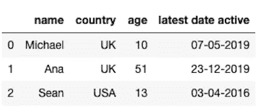
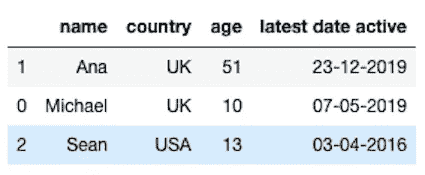
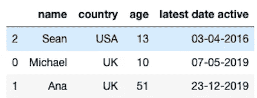
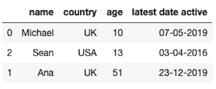
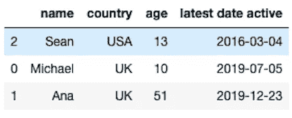

# 对熊猫中的数据框进行排序

> 原文：<https://towardsdatascience.com/sorting-data-frames-in-pandas-a5a3af6f346a?source=collection_archive---------7----------------------->

## 如何快速有效地排序数据帧


许多初学数据的科学家试图通过编写复杂的函数来对数据框进行排序。这不是最有效或最简单的方法。不要重新发明轮子，使用 pandas 包提供的 sort_values()函数。让我们看看现实生活中的例子，以及如何在您的代码中使用 sort_values()函数。

**加载数据集**

我们将使用 python 字典来创建一些假的客户端数据，并将这些数据加载到 pandas 数据框中。我们将保持简单，所以我们将只有四列:姓名，国家，年龄和最近的活动日期。数据集很简单，但我们将给出一个很好的概述，说明如何以几种不同的方式对数据帧进行排序。

```
import pandas as pd
import numpy as np
client_dictionary = {'name': ['Michael', 'Ana', 'Sean'], 
                     'country': ['UK', 'UK', 'USA'], 
                     'age': [10, 51, 13],
                     'latest date active': ['07-05-2019', '23-12-2019', '03-04-2016']}
df = pd.DataFrame(client_dictionary)
df.head()
```



就在上面，我们有我们的客户数据框。它只有三个客户端，但足以展示所有不同的排序可能性。

**按字母顺序排序**

让我们从按字母顺序排列名字的数据帧开始。我们将使用 panads sort_values()函数，并通过使用一个名为“by”的参数来指定要按哪个列名排序:

```
df.sort_values(by='name')
```

我们可以看到，数据框现在是根据名称列按字母顺序排序的。



我们可以通过使用 ascending=False 作为函数参数来颠倒排序:

```
df.sort_values(by='name', ascending=False)
```



**按号码排序**

让我们试着做同样的事情，但是现在按年龄排序。代码看起来完全一样，只是我们更改了将用于排序的列名:

```
df.sort_values(by='age')
```



**按日期排序**

同样，同一行代码也适用于日期！我们唯一需要确保的是我们的日期被识别为日期类型，而不是字符串。我们将使用 astype()方法做到这一点，然后应用排序函数:

```
df['latest date active'] = df['latest date active'].astype('datetime64[ns]')
df.sort_values(by='latest date active')
```



**按多列排序**

排序值函数可以处理多列。它将首先根据列列表中的第一个元素对数据帧进行排序。如果使用第一列有不可排序的值，它将前进到列表中的下一列。让我们看一下先按国家排序，再按姓名排序的例子:

```
df.sort_values(by=['country','name'])
```


这里我们可以看到我们的条目是按国家排序的。所有英国条目都在美国条目之上，然后它们甚至根据其名称列进一步排序。

**使用原位参数**

最后但同样重要的是，如果希望当前数据框保存排序结果，请记住使用 inplace 参数并将其设置为 True:

```
df.sort_values(by=['country','name'], inplace=True)
```

**结论**

您可以使用单行代码高效地对数据框进行排序。神奇的是使用熊猫包中的 sort_values 函数。如果您了解如何使用本概述中概述的参数，您将能够根据自己的需要对任何数据框进行排序。希望你会觉得有用，快乐排序！

*原文发布于 aboutdatablog.com:* [整理熊猫](https://www.aboutdatablog.com/post/sorting-data-frames-in-pandas)、*中的数据帧 2019 . 10 . 16。*

*PS:我正在 Medium 和*[***aboutdatablog.com***](https://www.aboutdatablog.com/)*上撰写以简单易懂的方式解释基本数据科学概念的文章。你可以订阅我的* [***邮件列表***](https://medium.com/subscribe/@konkiewicz.m) *在我每次写新文章的时候得到通知。如果你还不是中等会员，你可以在这里加入*[](https://medium.com/@konkiewicz.m/membership)**。**

*下面还有一些你可能喜欢的帖子*

*[](/what-are-lambda-functions-in-python-and-why-you-should-start-using-them-right-now-75ab85655dc6) [## python 中的 lambda 函数是什么，为什么你现在就应该开始使用它们

### 初学者在 python 和 pandas 中开始使用 lambda 函数的快速指南。

towardsdatascience.com](/what-are-lambda-functions-in-python-and-why-you-should-start-using-them-right-now-75ab85655dc6) [](/jupyter-notebook-autocompletion-f291008c66c) [## Jupyter 笔记本自动完成

### 数据科学家的最佳生产力工具，如果您还没有使用它，您应该使用它…

towardsdatascience.com](/jupyter-notebook-autocompletion-f291008c66c) [](/7-practical-pandas-tips-when-you-start-working-with-the-library-e4a9205eb443) [## 当你开始与图书馆合作时，7 个实用的熊猫提示

### 解释一些乍一看不那么明显的东西…

towardsdatascience.com](/7-practical-pandas-tips-when-you-start-working-with-the-library-e4a9205eb443) [](/pandas-data-manipulation-functions-7b3519fc1370) [## Pandas 数据操作函数:apply()、map()和 applymap()

### 以及如何在熊猫身上正确使用它们…

towardsdatascience.com](/pandas-data-manipulation-functions-7b3519fc1370)*