# 使用图像的声音分类

> 原文：<https://towardsdatascience.com/sound-classification-using-images-68d4770df426?source=collection_archive---------11----------------------->

## 介绍

本周我读到了深度学习的一个非常酷的应用。使用图像对音频文件进行分类。这些图像被称为 ***光谱图*** 。

***频谱图*** 是信号频率随时间变化的直观表示。现在，声音分类或音频标记有各种应用。然而，一个真正有趣的应用程序是由一位名叫莎拉·胡克的女士开发的。

她创办了一个名为 Delta Analytics 的非营利组织，他们一起帮助建立了一个系统，将旧手机挂在坎扬雨林的树上，用它来听链锯的声音。然后，他们使用深度学习来识别链锯何时被使用。这一系统将向护林员发出警报，护林员将反过来阻止雨林中的非法砍伐。

## 数据集

对于本文，我使用了 [UrbanSound8k 数据集](https://www.kaggle.com/impradhumn/urbansound8k)。它包含来自 10 个类别的 8732 个带标签的城市声音摘录。所有音频文件都≤4s，这使得创建频谱图更容易，因为较长的音频文件需要裁剪和重叠。让我们看看有哪些类别:

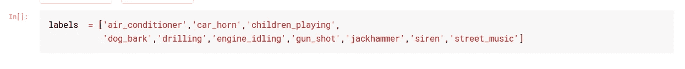

我们可以通过以下方式收听 Jupyter 中的一个音频文件:

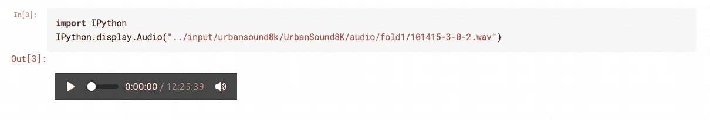

在我们将音频文件转换成频谱图之前，我们需要检查这些文件是如何存储的。在我们使用的数据集中，音频文件分布在名为`fold1 to fold11.`的文件夹中，我们使用数据的方式是，假设我们使用的是`fold1`。那么`fold2 to fold11`将由我们的训练集组成，而`fold1`将是我们的验证集。这样，我们需要一个接一个地使用所有的文件夹作为我们的验证集，而其余的文件夹构成我们的训练数据。我们的最终精度将是所有这些的平均值。(K 折叠交叉验证)

## 密码

我们有两个选项可以将音频文件转换成频谱图， ***matplotlib*** 或 ***librosa*** 。我们将选择后者，因为它更容易使用，并且在声音领域广为人知。在我们使用它之前，我们只需要安装一个小的依赖项来确保 librosa 工作良好。

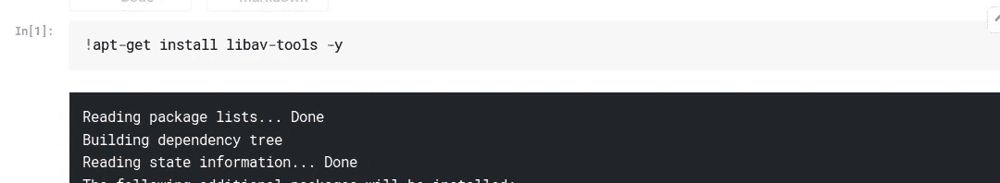

我们现在可以将音频文件转换成频谱图。现在，我没有自己写这个代码，我只是用了别人的代码。这样做是没问题的，只要你理解代码是做什么的。

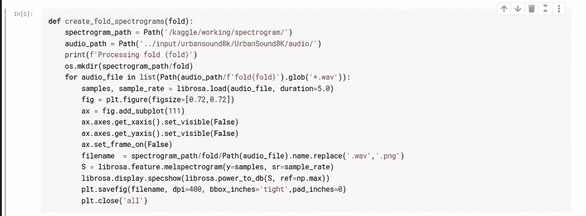

Python 的好处在于，仅仅是经常查看代码就能让你对正在发生的事情有一个公平的想法。我对这段代码的第一印象是，我们正在打开一个声音文件，初始化一个绘图，将声音文件转换成声谱图，最后保存绘图。如果我们想详细地理解代码，我们总是可以钻研文档。

由于我们正在创建和存储地块，这将需要大量的时间来运行。因此，我选择只做一次折叠，而不是所有的折叠。

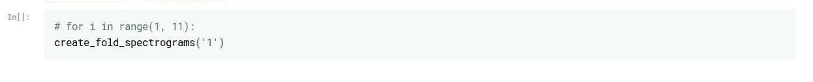

一旦我们有了所有的光谱图，我们可以把它当作一个图像分类问题，并遵循标准程序。关于频谱图需要注意的一点是，在不丢失大量数据的情况下将它们转换回音频是非常困难的。

## 分类

我们首先使用[数据块 api](https://docs.fast.ai/data_block.html) 创建一个数据束。

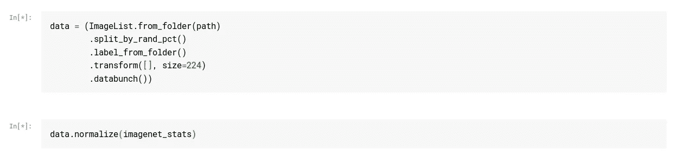

请注意，我们没有对数据进行任何转换。这是因为无论条件如何，光谱图总是以相同的方式生成，这与单击图像不同，单击图像可能会因照明或其他因素而变化。然而，有一些音频转换可以应用(更多的在另一篇文章中)。

让我们来看看一些光谱图:

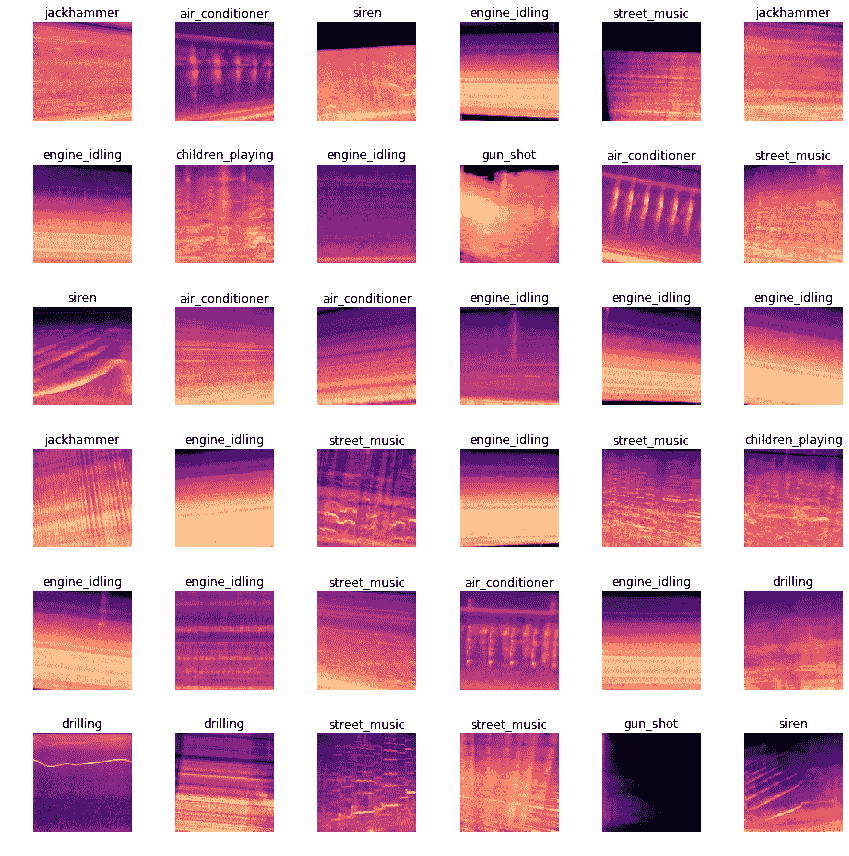

我们现在可以使用[转移学习](https://becominghuman.ai/how-do-pretrained-models-work-11fe2f64eaa2)来训练我们的神经网络对这些图像进行分类。

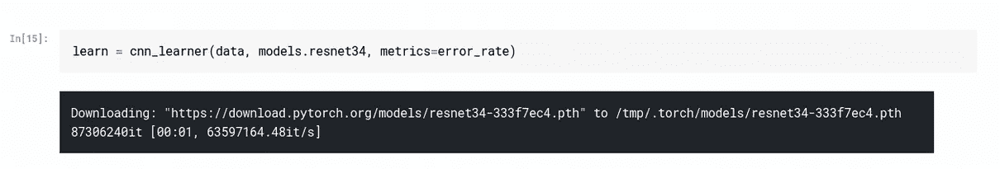

我们训练了几个纪元。

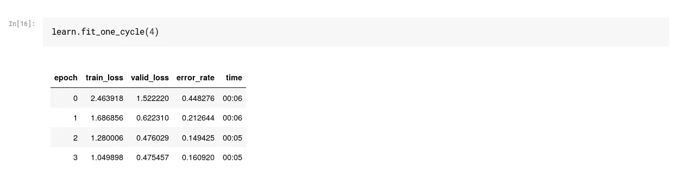

[解冻模型](https://becominghuman.ai/how-do-pretrained-models-work-11fe2f64eaa2)，[找到学习率](https://becominghuman.ai/learning-rate-and-golf-87c8d4697e31)，再训练一些。

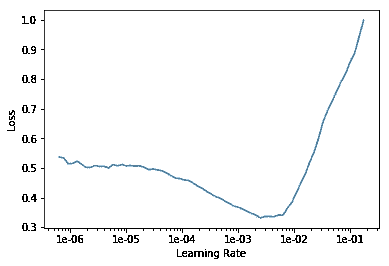

一旦我们对我们的模型满意，我们就可以节省重量。

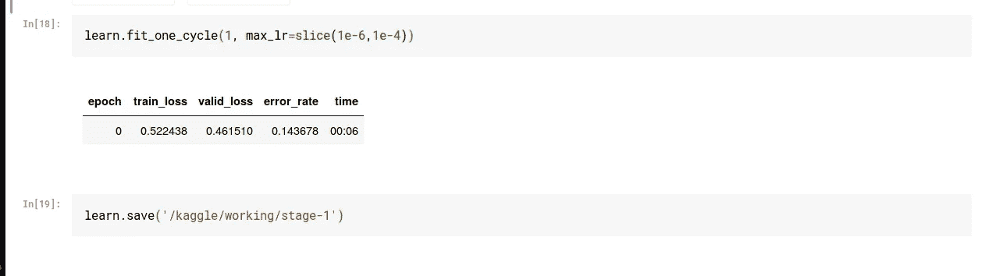

由于一个与生成的输出文件数量相关的 Kaggle 错误，我无法提交我的内核。一旦我解决了这个错误，我会发布一个链接。

[参考笔记本。](https://github.com/etown/dl1/blob/master/UrbanSoundClassification.ipynb)

这就是本文的全部内容。

如果你想了解更多关于深度学习的知识，可以看看我在这方面的系列文章:

 [## 深度学习系列

### 我所有关于深度学习的文章的系统列表

medium.com](https://medium.com/@dipam44/deep-learning-series-30ad108fbe2b) 

~快乐学习。