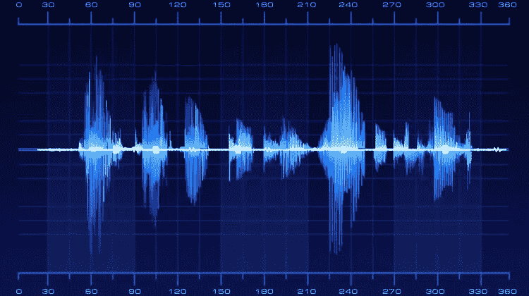
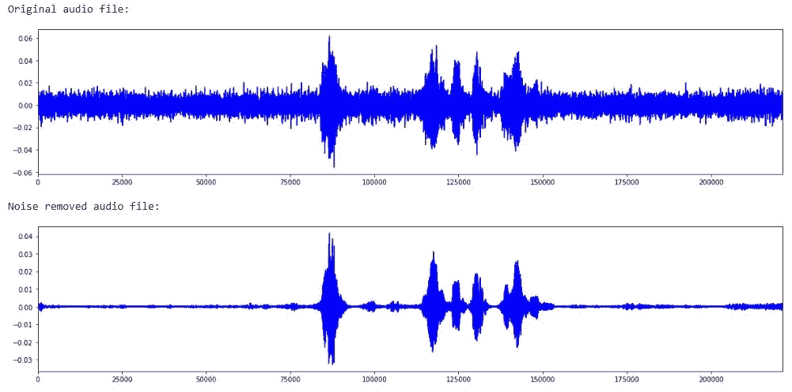
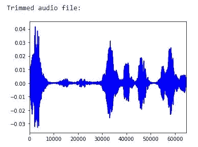
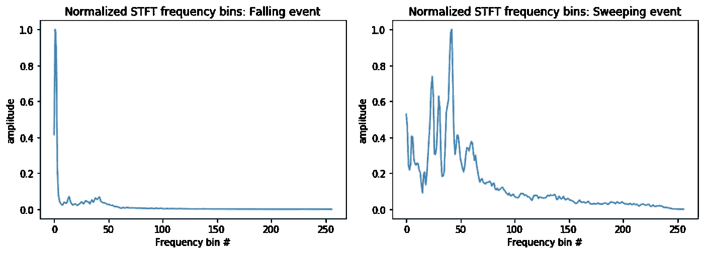
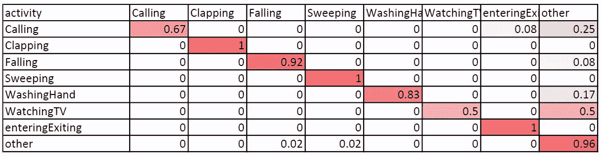

# 声音事件分类:从 A 到 Z

> 原文：<https://towardsdatascience.com/sound-event-classification-using-machine-learning-8768092beafc?source=collection_archive---------11----------------------->



音频(声音)是我们接收到的感知环境的主要感官信息之一。我们周围的几乎每一个动作或事件都有其独特的声音。音频有 3 个主要属性，帮助我们区分两种声音。

*   振幅——声音的响度
*   频率——声音的音高
*   音色——声音的质量或声音的特性(例如，钢琴和小提琴之间的声音差异)

假设一个声音事件是一个动作产生的音频片段。动作可以是说话、哼唱、打响指、行走、倒水等。作为人类，我们从很小的时候就开始训练用声音来识别事件。有人可以说，人类学习新的声音事件和识别声音事件的效率非常高。听播客仅使用声音识别能力来理解播客。有时，我们使用声音识别和其他感官信息来感知周围环境。

然而，系统地(最好使用计算机程序或算法)识别音频事件是非常具有挑战性的。这主要是因为，

*   录音剪辑的噪声——传感器噪声和背景噪声。
*   一个事件可能以不同的响度级别和不同的持续时间发生。
*   将有限数量的示例输入算法。

我们来看声音分类部分。假设问题是仅使用声音将给定的音频剪辑分类为以下事件之一。

*   打电话——通过电话交谈
*   掌声
*   跌倒——一个人跌倒在地上
*   扫地——用扫帚扫地
*   洗手——用水槽和水龙头洗手
*   看电视—电视声音
*   进/出—门打开或关闭的声音
*   其他—以上事件都不是

本文中使用的音频数据来自斯里兰卡莫拉图瓦大学收集的辅助生活数据集。音频剪辑是用两个 MOVO USB 全向麦克风录制的。wav 文件。声音事件分类是通过执行音频预处理、特征提取和分类来完成的。

# 音频预处理

首先，我们需要想出一个方法来表示音频剪辑(。wav 文件)。然后，音频数据应该被预处理以用作机器学习算法的输入。Librosa 库为用 python 处理音频提供了一些有用的功能。使用 Librosa 将音频文件加载到 [numpy](https://numpy.org/) 数组中。该阵列将由各个音频剪辑的幅度以称为“采样率”的速率组成。(采样率通常为 22050 或 44100)

将一个音频片段加载到数组中后，第一个挑战——噪声——应该得到解决。Audacity 使用“频谱门控”算法来抑制音频中的噪音。该算法的一个很好的实现可以在 [noisereduce](https://pypi.org/project/noisereduce/) python 库中找到。该算法可以在 noisereduce 库的文档中找到。

```
import noisereduce as nr# Load audio file
audio_data, sampling_rate = librosa.load(<audio_file_path.wav>)# Noise reduction
noisy_part = audio_data[0:25000]  
reduced_noise = nr.reduce_noise(audio_clip=audio_data, noise_clip=noisy_part, verbose=False)# Visualize
print("Original audio file:")
plotAudio(audio_data)
print("Noise removed audio file:")
plotAudio(reduced_noise)
```



Visualization of the Noise reduction with waveform plots

生成的音频片段中包含一个空长度(不必要的静音)。让我们来修剪比响度阈值静音的前导和尾随部分。

```
trimmed, index = librosa.effects.trim(reduced_noise, top_db=20, frame_length=512, hop_length=64)print(“Trimmed audio file:”)
plotAudio(trimmed)
```



Noise Reduced and silence trimmed audio file waveform

# 特征抽出

预处理的音频文件本身不能用于分类为声音事件。我们必须从音频片段中提取特征，以使分类过程更加高效和准确。让我们从每个音频片段中提取短时傅立叶变换(STFT)的绝对值。为了计算 STFT，快速傅立叶变换窗口大小(n_fft)被用作 512。根据等式 **n_stft = n_fft/2 + 1** ，在 512 的窗口大小上计算 257 个频率仓(n_stft)。将窗口移动 256 的跳跃长度，以便在计算 STFT 时具有更好的窗口重叠。

```
stft = np.abs(librosa.stft(trimmed, n_fft=512, hop_length=256, win_length=512))
```

对于数据集，频率仓的数量、窗口长度和跳跃长度是根据经验确定的。对于特征生成中的参数，没有一组通用的值。这将在**调整和增强结果**部分再次讨论。

让我们回顾一下音频片段的绝对 STFT 特征的含义。考虑一个包含`t`个样本的音频剪辑。假设我们正在 STFT 获得`f`个频率仓。考虑窗口长度为`w`，窗口跳数为`h`。计算 STFT 时，将固定长度的`w`窗口滑动`h`步，得到一系列窗口。这将产生 **1+(t-w)/h** 个窗口。对于每个这样的窗口，记录范围 **0** 到 **sampling_rate/2** 内的频率仓的振幅(单位为 Hz)。当确定频率仓的值时，频率范围被等分。例如，考虑 n_fft=16 且采样速率为 22050 的 STFT 频段。那么将有 9 个频率仓具有以下值(以 Hz 为单位)。

```
[     0   ,   1378.125,   2756.25 ,   4134.375, 5512.5  ,   6890.625,   8268.75 ,   9646.875,  11025   ]
```

音频剪辑的绝对 STFT 特征是一个 2 维数组，它包含每个窗口的所提到的频率振幅仓。

因为声音事件具有不同的持续时间(样本数)，所以使用频率轴上的平均值来展平二维特征阵列。因此，将使用固定大小的阵列 257(STFT 频率仓的数量)来表示音频剪辑。这看起来像是音频剪辑的不良表示，因为它不包含时间信息。但是每个给定的音频事件都有其独特的频率范围。例如，扫频事件的刮擦声使其特征向量比落频事件具有更多的高频振幅。最后，通过最小-最大归一化对特征向量进行归一化。应用归一化以使每个声音事件位于共同的响度级别。(如前所述，振幅是一种音频属性，我们不应在此用例中使用振幅来区分声音事件)。下图显示了由绝对 STFT 特征捕获的声音事件的归一化 STFT 频率特征。



Normalized STFT Frequency signatures of Sweeping (right) and Falling (left) sound events

# 事件分类

现在，声音事件被预处理并使用 STFT 特征有效地表示。STFT 特征用于训练完全连接的神经网络(NN ),该神经网络将用于分类新的声音事件。神经网络由 5 个完全连接的层组成。这些层中有 256、256、128、128 和 8 个神经元。所有层都有 [ReLU](https://www.kaggle.com/dansbecker/rectified-linear-units-relu-in-deep-learning) 激活函数，4ᵗʰ层有一个丢弃层，以减少对训练数据的过拟合。使用 [Keras 密集层](https://keras.io/layers/core/)可以轻松构建神经网络(模型)。该模型是使用“[亚当](https://machinelearningmastery.com/adam-optimization-algorithm-for-deep-learning/)优化器编译的。

```
# build model
model = Sequential()model.add(Dense(256, input_shape=(257,)))
model.add(Activation(‘relu’))

model.add(Dense(256))
model.add(Activation(‘relu’))

model.add(Dense(128))
model.add(Activation(‘relu’))

model.add(Dense(128))
model.add(Activation(‘relu’))
model.add(Dropout(0.5))model.add(Dense(num_labels))
model.add(Activation(‘relu’))model.compile(loss=’categorical_crossentropy’, metrics=[‘accuracy’], optimizer=’adam’)
```

上述神经网络模型在 880 个样本上训练，并在 146 个样本上验证。它对看不见的音频事件进行分类，平均准确率为 93%。下图显示了与预测相对应的标准化混淆矩阵。



Confusion Matrix of the NN model’s prediction

# **调谐和增强结果**

到目前为止，我们已经获得了一个非常好的模型。我们能做得更好吗？总会有更好的模式。极限是我们希望我们的分类有多好。查看混淆矩阵，我们可以观察到，像看电视这样的一些活动已经被错误分类，误差为 50%。因此，我们应该考虑调整模型，预处理和特征提取步骤。

我们可以通过编程来检查特征提取中频率仓数量、窗口长度和跳跃长度的最佳值。可以使用可视化方法来确定参数的最佳值。特征类型(这里是 STFTs 的绝对值)也可以由经验决定。机器学习模型是需要调优的必要部分。可以以这种方式确定层数、漏失层属性、激活函数、优化器和学习速率。

> *注:为了提高上述神经网络的精度，进行了一定程度的调整。你仍然可以提高。*

下一步，我们可以实现一个连续的声音事件分类器，它接受音频流并实时对声音事件进行分类。希望这篇文章对你有用。在不久的将来，一篇关于连续音频分类的补充文章将会发表。

在[这个](https://github.com/chathuranga95/SoundEventClassification) Git 仓库中找到完整的 python 代码。