# 声音 UX

> 原文：<https://towardsdatascience.com/sound-ux-sound-representation-of-machine-learning-estimation-on-image-and-temperature-data-by-5b71bb4bb745?source=collection_archive---------29----------------------->

## 通过粒度合成对图像和温度数据进行机器学习估计的声音表示

本研究的目的是通过发音显示捕获的图像和温度数据。发音是一种将各种数据转换为声音的技术，用于辅助功能、媒体艺术和交互设计。我们提出了一种系统，通过图像和温度数据中的机器学习，根据移动对象之间的最小距离和路径预测来生成声音。声音依赖于基于 k-means、拟合和光流的路径预测数据的最小距离，并通过粒度合成和拍现象声音来设计。我们还检查了光流上的流动矢量图像分类和结果的声音分配。

本研究中考虑了环境智能，并提出了智能空间的概念，其中设备通过各种协议连接。环境智能必须是嵌入式的、环境感知的、个性化的、自适应的和预期的。[1]机器学习和人工智能是实现自适应和预期功能的关键技术。我们已经通过对象跟踪和对象识别考虑了环境空间，并且已经假设该空间具有通过各种协议彼此连接的设备，具有智能并且通过声音激活来提供服务。我们也考虑基于几种方法的研究，如 r .默里·斯查费和巴里·特鲁阿克斯提倡的声景、交互设计和媒体艺术

## **发音和机器学习**

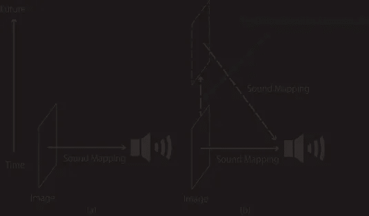

Figure 1\. Conceptual Diagram

为了实现所提出的系统，考虑了通过发音和机器学习的响应系统。发音是一种从各种类型的数据到声音的转换技术，这种技术有很多实现方式。在这里，我们关注从图像数据到声音的转换。图 1 显示了这个过程的概念图。与图像中的对比度轮廓相关的数据通过声音设计被映射到指定的声音。图 1(a)显示了来自图像数据的实时声音映射，声音指示图像的当前状态。声音不包含未来信息。图 1(b)显示了来自图像数据的实时声音映射，包括指示当前状态的声音，以及机器学习和 AI 的预测。此外，系统可以将当前状态和预测作为未来信息进行比较。该系统是根据图 1(b)所示的类型设计的，图像数据使用实时数据和预测进行超声处理。

**声音导航**

我们考虑了声音导航以及图像和温度的声音表示。对声音导航的研究，包括诸如可访问性、交互设计和媒体艺术等领域，已经进行了。[4]为了用声音表示图像或温度数据，考虑了以下目标。

**1 方向和距离的声音表示**

从图像中提取的数据被转换成数字声音，并表示为空间信息。声音是根据距离和方向的不同而设计的。音高或音调取决于距离和方向，声音也因不同而变化。换句话说，如果物体的估计轨迹和实际轨迹之间的距离很大，则分配给这些轨迹的声音显著不同。

**2 使用光流的运动物体的声音表现**

光流信息由运动物体的速度矢量组成，图像中的点显示为矢量。流向量用于定义当前状态。我们使用相关系数和指定的声音来计算状态。

## **温度的发音**

我们考虑了温度的发音。所实现的系统可以从传感器连续获得温度数据，并且我们检查了测井数据的发音。

**系统型号**

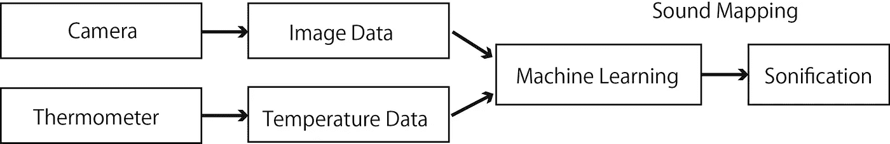

**Figure 2 System Model**

图 2 显示了本研究中使用的系统模型。这个系统的一个目的是用声音来表示方向和距离。我们通过机器学习实现了系统的嵌入式算法，以估计路径预测，并通过声音揭示预测和对象之间的差异。

## **机器学习**

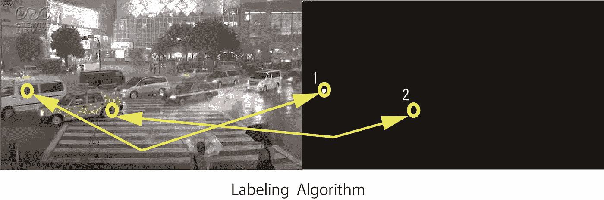

・**Figure 3\. Object Tracking**

图 3 示出了对象跟踪图像。基于通过强度变化进行阈值处理并从原始图像中减去该图像，由照相机捕获的图像被转换成二进制图像。(右)如果图像中的对象连续移动，则减影图像中会保留白色像素，并通过标记算法为检测到的对象分配编号。(左)作为学习数据的对象的轨迹用于图像中的路径预测和状态。

**通过多项式近似的路径预测**

通过目标跟踪记录轨迹点，通过多项式逼近估计路径预测。多项式近似由最小二乘法导出。

**距估计轨迹点的最小距离**

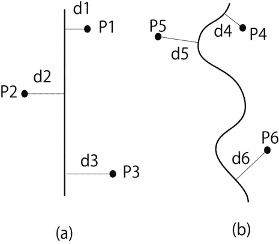

**Figure 4\. Minimum Distance from Estimated Trajectory Point**

图 4 显示了从直线(a)和曲线(b)的估计轨迹点的最小距离。在系统中计算基于公式的最小距离。

**移动物体轨迹的 K 均值聚类**

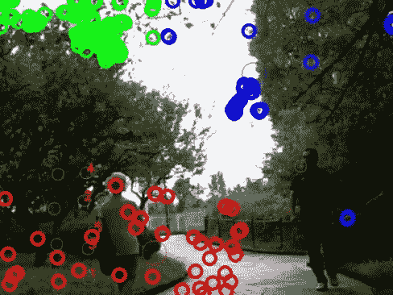

**Figure 5\. K-means Clustering for Moving Objects**

系统中的摄像机可以检测与移动物体上的许多点相关的数据。为了将点分成若干组，在系统中使用了 K-均值聚类。图 5 示出了在三个集群的情况下移动对象的 k 均值聚类，并且三个组在图中由不同的颜色表示。红点表示与行人相关的移动物体上的点。将这些点分类成组取决于群集的数量，这必须决定。基于轮廓系数确定最佳聚类数。[5]图 6 示出了聚类数和轮廓系数之间的关系。在图 6 中，簇的数量是 3，轮廓系数随着接近 1 而提高。

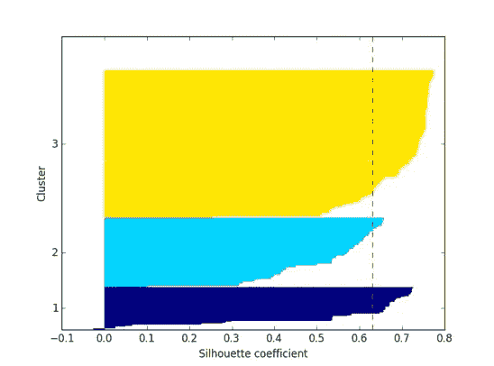

**Figure 6\. Silhouette Coefficient[5]**

图 7 示出了通过 k 均值和拟合的路径预测。该系统在将移动物体分类成组(三个集群)后，通过拟合来估计行人的轨迹。图 8 显示了估计轨迹的最小距离。该系统计算移动物体(行人)的最小距离并估计轨迹。

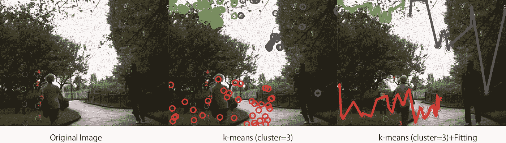

**Figure 7\. Path Prediction**

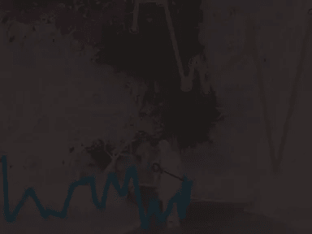

Figure 8\. Minimum Distance from Estimated Trajectories

## **光流**

Gunnar Farneback 算法的高斯滤波器用于计算光流，并计算图像中均匀间隔的网格的速度矢量，以便测量作为大气的矢量流。图 9 示出了通过光流计算的速度矢量的例子。还计算了相关系数和向量之和。我们研究了基于光流速度矢量的客观标准的计算。

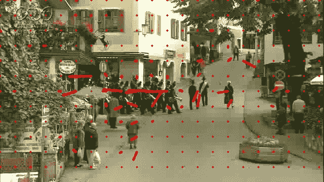

Figure 9\. Example of Velocity Vectors by Optical Flow

## **温度数据**

该系统使用温度计获取温度数据，然后用于确定空间的状态。来自温度数据的参数通过 OSC [7]发送到声音引擎(Max/MSP ),并进行发音。

## **发音**

声音是为系统设计的，考虑了以下因素:

每拍的声音被分配给与预测轨迹的距离。

通过粒度合成的声音和通过距离控制参数的节拍变化。

**声音分配**

在系统通知表示距离或速度信息的声音之前，声音是通过声音映射生成的，距离被映射到声音。我们在声音映射中考虑了节拍和颗粒合成。

## **击败**

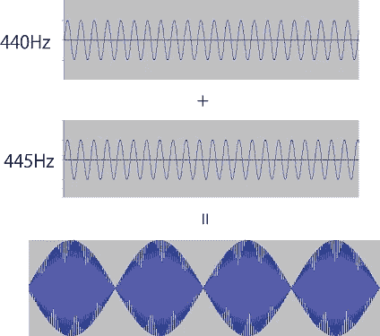

Figure 10\. Beat

拍是两个频率略有不同的波之间的干涉图案。图 10 显示了 440 Hz 和 445 Hz 正弦波产生拍频的情况。该模式是周期性振动。图 11 显示了一个最大/MSP 节拍补丁示例。

Figure 11\. An Example of Max/MSP Patch (Beat)

## **颗粒合成**

我们研究了系统中颗粒合成的声音生成。颗粒合成得到的声音由颗粒组成，颗粒是被分裂成小波片段的样本。图 12 显示了颗粒合成的原理。通过以下程序制造颗粒。

1.样品中谷物的提取

2.乘以窗口函数

提取的样本 *s* ( *n* )乘以一个窗口函数，得到一个区间之外的值。我们根据移动物体和估计轨迹之间的距离，通过改变振幅和频率来设计颗粒。交叉合成是通过卷积进行的信号处理，它涉及两个谱函数的相乘。

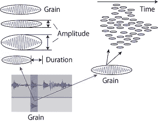

Figure 12\. Granular Synthesis

我们通过交叉合成设计声音，并假设抽象的声音，其中包括一些音高和环境声音，如汽车噪音。图 13 显示了利用正弦波和汽车噪声的两个 880Hz 样本进行交叉合成获得的频谱。

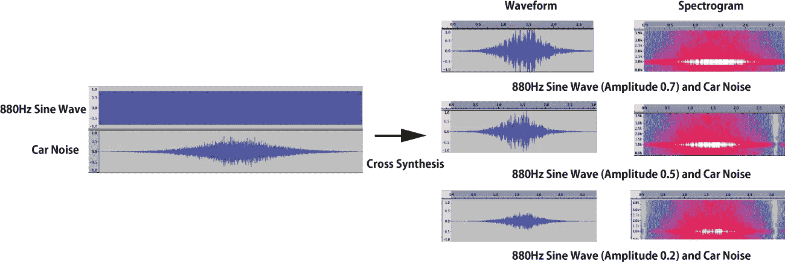

Figure 13\. Spectrum by Cross Synthesis (Car Noise and Sine Wave)

在图 13 中，上方正弦波的最大幅度为 0.7，下方正弦波的最大幅度为 0.2。由于正弦波的影响，880 Hz 左右的频率存在于较低正弦波的底部。相比之下，由于汽车噪音的影响，较高正弦波的顶部存在一个频率范围。这意味着自波动以来，熵在上层的顶部增加了。图 14 显示了颗粒合成贴片(Max/MSP)。声音的产生取决于与运动物体和轨迹之间的距离有关的控制参数。

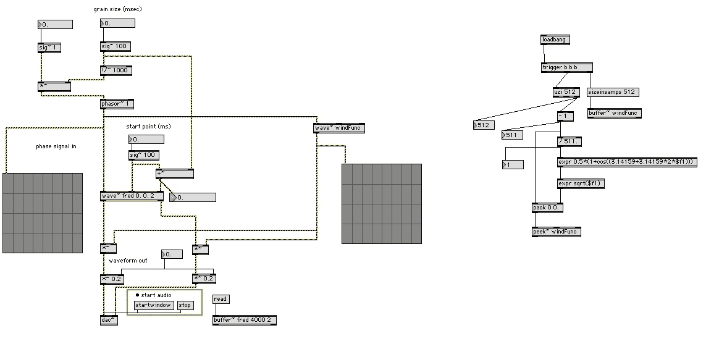

Figure 14\. Granular Synthesis Patch (Max/MSP)

## **系统实现**

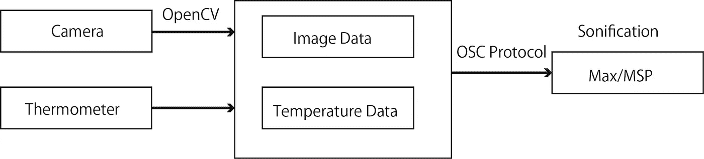

Figure 15\. System Implementation

该系统由数据分析器、摄像机、温度计和声音引擎组成(图 15)。数据分析器通过 OpenCV 和传感器数据库分析图像数据和温度数据。一些关于移动物体的数据和温度数据存储在一个文件中，并由与机器学习相关的 python 脚本进行分析。获得的数据通过 OSC 协议发送到声音引擎(Max/MSP ),声音通过粒度合成和实时节拍生成。

## **总结**

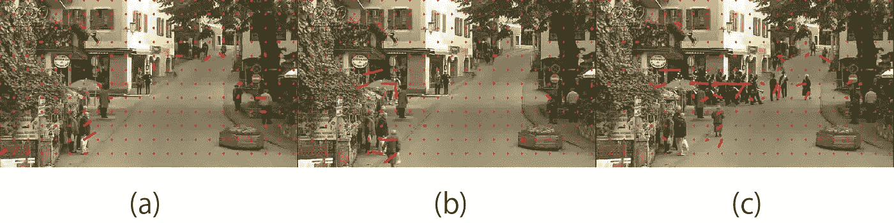

Figure 16\. Correlation Coefficients of Velocity Vectors

基于光流数据的结果，我们研究了速度矢量的相关系数。图 16 显示了速度矢量图像(a)、(b)和(c)。红线表示速度矢量。如果存在移动物体，图像中会出现许多红线。我们计算了每个组合的速度向量的相关系数。表 1 显示了这些组合的结果。图 16(a)和(b)没有显示速度矢量，而图 16(c)中出现了许多速度矢量。基于速度向量的相似性，图 16(a)和 16(c)之间的相关系数非常低(0.026171)，而图 16(b)和 16(c)之间的相关系数很高(0.2745)。

本研究的结论如下:

1 相关系数和平均值是判断图像情况的标准。

2 运动物体和轨迹之间的距离是影响路径预测的一个重要因素。

## 参考

1.阿尔茨，e。和 b。埃根(编辑。) [2002].家庭实验室的环境智能研究。恩德霍芬菲利普斯研究公司。

2.“建筑用户界面:建筑设计和人机交互发展的主题、趋势和方向”，Martyn Dade-Robertson，《国际建筑计算杂志》，2013 年 3 月 1 日

3.“为响应式环境设计声音表现”Takuya Yamauchi，第 22 届听觉显示国际年会(ICAD2016)，澳大利亚国立大学，堪培拉，2016 年 7 月 3 日至 7 日

4.“声音珠宝”山内拓哉和岩武彻莱昂纳多音乐杂志第 18 期麻省理工学院出版社

5.《Python 机器学习》，塞巴斯蒂安·拉什卡，Packt 出版社

6.建筑用户界面:建筑设计和人机交互发展的主题、趋势和方向。

7.Wright，m .，Freed，A .，“开放式声音控制:与声音合成器通信的新协议”，国际计算机音乐会议，塞萨洛尼基，希腊，1997 年