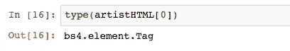

# 今日汤

> 原文：<https://towardsdatascience.com/soup-of-the-day-97d71e6c07ec?source=collection_archive---------8----------------------->

## 数字音乐

## 美汤网刮——初学者指南


尽管有成千上万可爱干净的数据集可供数据科学家们使用(大部分在 [Kaggle](https://www.kaggle.com/) 上)，但你总是会有那些讨厌的假设不在他们的范围之内。从头开始创建你*需要的数据集是一个潜在的令人生畏的前景——即使你能在网页上看到数据，实际上将它转换成可供分析的格式可能涉及大量的手工工作。*

令人高兴的是，网络抓取自动化了从网页中检索信息的过程，通过使用正确的工具，我们可以创建可靠的数据存储，然后进行分析。

> 注意——这是一系列文章中的第一篇。在这里，我们将一步一步地用漂亮的 Soup 库介绍 webscraping Metacritic 的机制。随后的博客将深入探讨我们对其背后进行的分析。

# **第一步。对 HTML 的理解刚刚好**

超文本标记语言(HTML)是告诉网络浏览器在页面上显示什么信息的代码。重要的是，它没有说太多关于*如何*显示信息(网站通常组合两组代码，HTML 和[层叠样式表](https://en.wikipedia.org/wiki/Cascading_Style_Sheets) (CSS)来呈现页面，CSS 负责页面的外观)。

这很重要，因为我们感兴趣的是网页的*信息*，我们知道这些信息将被存储在 HTML 代码中的某个地方。

有益的是，大多数浏览器提供了一种简单的方法来查看 HTML 代码的哪一部分引用了页面上的特定元素。


Right-click on any element on the page, then select ‘Inspect Element’


This brings up the browser’s ‘Inspector’, and shows which line of the HTML refers to which element on the web page


This process also works in reverse — we can hover over a line of code in the Inspector, and it’ll highlight the part of the web page that this code refers to

HTML 代码本身可能看起来吓人，但是结构比看起来要简单。内容通常包含在“标签”中，标签是在<>括号内的东西。例如，当声明一段文本时，HTML 代码可能如下所示:

```
<p>My text here, inside the paragraph tags</p>
```

HTML 有不同类型的标签，做不同的事情——最常见的(正如你在上面的截图中看到的)是:

*   **表头:** < h1 > < /h1 >(注意，我们可以有 h1，h2，…，h6，这取决于想要的表头层次结构)。
*   **有序列表:** <李></李>
*   **无序列表:** < ul > < /ul >(即项目符号样式列表)
*   **超链接:**<a href = "*EXAMPLE _ URL*"></a>
*   **Span:**<Span></Span>(用于[识别段落](https://www.w3schools.com/tags/tag_span.asp)中的子字符串——如果您希望您的同伴 CSS 代码只格式化句子中的某些单词，这很有用)
*   **语义元素:** < div > < /div >

注意——语义元素是一个包罗万象的范畴，而“div”是一个你会在 HTML 的许多块中经常看到的术语。这些“div”标签的典型用途是创建“子元素”，其中可以包含列表、其他标题和其他子元素。

这就像计算机文件资源管理器中的文件夹树结构——根“我的文档”文件夹可能包含文档和文件，但也可能包含其他文件夹。这些文件夹可以依次包含更多的文件夹。

因此，如果我们想在这个元符号页面上隔离特定专辑的“发布日期”,我们可以看到它包含在几个嵌套的子元素中。最终，我们可以在代码本身中找到发布日期。


正如我们所看到的，许多标签还具有其他属性来进一步区分它们自己。这些通常被标记为元素的“id”或“class”。当我们从 HTML 代码中提取数据时，这些将是至关重要的。

# 第二步。将 HTML 提取到 Jupyter 笔记本中


我们可以在浏览器中看到 HTML 现在我们需要将它放入 Jupyter 笔记本(或等效物)中，以便我们可以分析它。为此，我们使用 python 的'[请求](https://2.python-requests.org/en/master/)库。

请求的语法非常简单。假设我们想从上面提到的 Metacritic 中获取 HTML。我们可以使用。get()方法:

```
**import** requestsurl = [https://www.metacritic.com/browse/albums/artist/a?num_items=100](https://www.metacritic.com/browse/albums/artist/a?num_items=100)page = requests.get(url)
```

我们现在可以在“page”变量上调用一些其他有用的方法。例如，我们可以检查[状态码](https://en.wikipedia.org/wiki/List_of_HTTP_status_codes)。

```
page.status_code
```

如果这返回‘200’，那么我们都很好，尽管其他的[状态代码](https://en.wikipedia.org/wiki/List_of_HTTP_status_codes)可能表明我们需要修改最初的‘请求’。

# 第三步。阅读 HTML 汤

一旦我们有了“请求”对象(“页面”)，我们就可以使用 [Beautiful Soup](https://www.crummy.com/software/BeautifulSoup/bs4/doc/) 库中的 html.parser 特性来理解它的内容。

```
**from** bs4 **import** BeautifulSoupsoup = BeautifulSoup(page.content, ‘html.parser’)
```

然而，如果我们实际调用“soup”变量，我们会看到事情仍然有点混乱(当然远远谈不上美好)。


This output goes on for quite some time…

这就是浏览器的检查器派上用场的地方。因为我们可能有一个好主意，知道我们想从页面中获得什么信息，所以我们能够在 inspector 中找到相应的 HTML。

因此，如果我想在这个页面上创建一个所有艺术家名字的列表，我可以在第一个这样的名字上‘检查元素’,并查看信息是如何存储在 HTML 中的。


我们可以看到，艺术家名“A Camp”存储在一个“有序列表”(由

*   标记表示)中，其类为“stat product_artist”。给定网站的结构，我们可以猜测所有艺术家的名字将以相同的方式存储(尽管我们当然可以通过检查元素来检查这一点，就像我们对“A Camp”所做的那样)。

我们用漂亮的汤。findAll()方法，使用类“stat product_artist”查找有序列表的所有实例，将这两个特征指定为单独的参数。

```
artistHTML = soup.findAll(‘li’,class_=”stat product_artist”)
```


这给了我们一个“bs4.element.ResultSet”类型的对象。仔细观察这个对象，我们可以看到它看起来有点像 python 列表。


特别是，我们可以索引这个 ResultSet 对象来隔离不同的艺术家名字(我们可以使用' len '函数来检查我们有多少，在这个例子中是 99)。


请注意，“bs4.element.ResultSet”对象中的这些元素本身是类型为“bs4.element.tag”的对象。



这意味着他们带来了一些新的方法，可以帮助我们提取我们需要的信息。

> 在这一点上我们应该注意，这不是获取艺术家姓名信息的唯一方式。我们还可以在 HTML 中更深入一层，尝试 soup.findAll('span '，class_= "data))。然而，这种方法增加了一层复杂性——事实证明，使用这种标签存储的每个相册有三种不同类型的信息；艺术家姓名、发行日期和 metascore。这是可以管理的，但是所描述的方法可能会更加直接。

# 第四步。从 HTML 标签中提取数据

获取存储在标签中的信息(并确保它以正确的格式返回给我们)并不总是最直接的任务，可能需要一些尝试和错误。我倾向于先采用几种不同的方法。

。get_text()往往是最可靠的。有时，我们需要对它输出的字符串进行编辑，以使它们成为所需的形式。因此，我们应该在不同的元素上尝试该方法，以确保我们可以在所有元素上进行相同的编辑。


我们可以看到，我们需要去掉艺术家姓名两边的子字符串。我们可以为此使用一个[正则表达式方法](https://docs.python.org/3/library/re.html)，但是，我们可以偷懒，将两个。请改为 replace()方法:

```
artistHTML[0].get_text().replace(‘\n’, ‘’).replace(‘Artist:’, ‘’)
```

我们现在可以遍历 artistHTML 中的不同元素，提取艺术家的名字，并将它们放入一个列表中。我们可以使用循环来实现这一点:

```
artists = []
**for** element **in** artistHTML:
    artist = element.get_text()
    artist_final = artist.replace(‘\n’,’’).replace(‘Artist:’,’’)
    artists.append(artist_final)
```

…或者是列表理解，我发现这样更有条理:

```
artists = [element.get_text().replace(‘\n’,’’).replace(‘Artist:’,’’)
           **for** element **in** artistHTML]
```

然后这些列表可以按原样存储，或者例如可以将它们放入熊猫数据帧中。

如前所述，从汤里提取数据有许多不同的方法。和大多数“编码”一样，很少有一种正确的方法来做某事——[漂亮的汤文档](https://www.crummy.com/software/BeautifulSoup/bs4/doc/)是一个很好的地方来看看不同的元素方法在起作用。

# 第五步。正在获取所有数据…

一旦我们从网页中提取了我们想要的所有数据。根据站点的结构，下一个任务是从新页面中提取数据。


例如，如果我们想要 Metacritic 中的所有艺术家的名字，我们将需要转到第 2 页，然后是第 3 页，依此类推(这只是针对以“A”开头的艺术家！).显然，我们希望这样的过程可以通过代码自动完成。有几种方法可以解决这个问题。

1.  **第二次猜测网址**

我们刚刚抓取的网址是:

```
[https://www.metacritic.com/browse/albums/artist/a?num_items=100](https://www.metacritic.com/browse/albums/artist/a?num_items=100)[&page=0](https://www.metacritic.com/browse/albums/artist/a?num_items=100&page=1)
```

如果我们跟随链接到第 2 页，然后到第 3 页，我们看到的网址是:

```
[https://www.metacritic.com/browse/albums/artist/a?num_items=100&page=1](https://www.metacritic.com/browse/albums/artist/a?num_items=100&page=1)[https://www.metacritic.com/browse/albums/artist/a?num_items=100&page=2](https://www.metacritic.com/browse/albums/artist/a?num_items=100&page=2)
```

显然，我们有一个模式 URL 末尾的数字是页码减一。这意味着我们可以非常简单地遍历 URL，依次抓取每个 URL。

首先，我们需要确定给定字母有多少页(以“A”开头的艺术家有 11 页，但显然以其他字母开头的艺术家会有多或少)。

鉴于这个数字显示在页面上，我们可以在 HTML 中找到它。我们可以使用步骤 2、3 和 4 中描述的过程来分离这个数字，并将其分配给 python 中的一个变量(我们称之为“pages”)。


```
**for** page_number **in** range(pages): url = f'https://www.metacritic.com/browse/albums/artist/a?num_items=100&page={page_number}' page = requests.get(url)*# We then include the scraping code* ***inside*** *the loop, ensuring that data from each new URL is appended to data collected from the previous pages - either in lists, or Pandas dataframes*
```

**2。在 HTML 本身中查找下一个 URL**

对于组织良好的网站(如 Metacritic ),第二次猜测 URL 就足够了，但是对于其他不太整洁的网站，这种方法可能不起作用。然而，假设我们在页面上有一个“下一页”按钮，我们可以在 HTML 中找到它及其相应的超链接。


假设我们在寻找一个超链接，我们应该留意标签。我们可以像第 3 步一样使用 soup.findAll()方法。注意，即使只有一个这样的元素，findAll 方法仍然是一个类似列表的对象，我们需要对它进行索引。


考虑到 URL 就在标签本身中，我们信任的。get_text()方法将在这里工作。相反，我们可以查看元素的属性，使用。attrs 的财产。


注意 attrs 对象看起来很像一本字典。因此，我们可以使用“href”键来查找所需的值。然后我们可以使用 f 字符串输出完整的 URL。


这个 URL 可以被传递到请求中(参见步骤 1)，并且生成的页面可以被抓取。通过将这些代码行作为循环的一部分，我们可以让我们的抓取代码自动依次遍历每个页面。

> 网络搜集是一项非常强大的技术，也是任何数据科学家弓上的一根弦。上面的指南是作为一个起点写的，尽管还有许多其他的免费技术(事实上，除了漂亮的汤之外还有其他的刮库)。
> 
> 刮的开心！