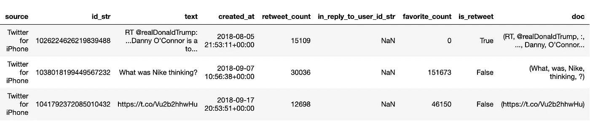
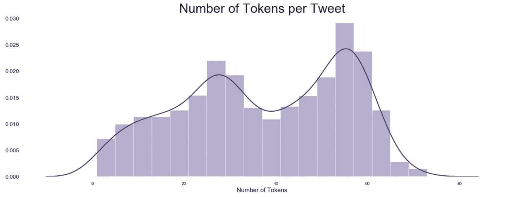
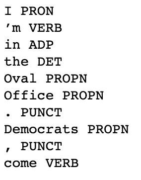
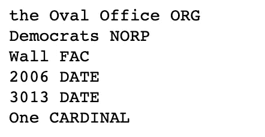
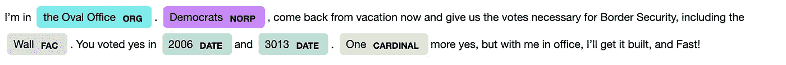

# 空间基础

> 原文：<https://towardsdatascience.com/spacy-basics-4b606a70f97b?source=collection_archive---------18----------------------->

## NLP 和 spaCy 入门指南


Photo by [Patrick Tomasso](https://unsplash.com/@impatrickt?utm_source=unsplash&utm_medium=referral&utm_content=creditCopyText) on [Unsplash](https://unsplash.com/search/photos/words?utm_source=unsplash&utm_medium=referral&utm_content=creditCopyText)

文本数据的一个主要挑战是提取有意义的模式，并使用这些模式找到可操作的见解。

NLP 可以被认为是一个由两部分组成的问题:

1.  **加工。**将文本数据从原始形式转换成计算机可以理解的形式。这包括数据清理和特征提取。
2.  **分析。**利用处理后的数据提取见解并做出预测。

这里我们将重点关注处理步骤。

我们将使用通过抓取唐纳德·特朗普的推文创建的数据集。创建你自己的 Twitter 数据集的教程可以在这里找到:

[](/my-first-twitter-app-1115a327349e) [## 我的第一个 Twitter 应用

### 如何使用 Python 和 Tweepy 创建自己的数据集

towardsdatascience.com](/my-first-twitter-app-1115a327349e) 

我们将专门关注 [spaCy](https://spacy.io/) “一个用于 Python 中高级**自然语言处理** (NLP)的**免费开源库**”

spaCy 对于 NLP 任务来说是一个很好的选择，特别是对于处理文本来说，它有大量的特性和功能，其中很多我们将在下面讨论。

完整的笔记本可以在这里找到[。](https://github.com/terrah27/donald_trump_tweets/blob/master/spaCy%20Basics.ipynb)

## 标记化

根据[researchgate.net](https://www.researchgate.net/post/What_is_differance_between_String_and_token_in_Natural_Language_Processing_techniques)的说法，令牌的一个很好的定义是“两个空格之间，或者空格和标点符号之间的一串连续的字符。”在英语中，标记通常是单个单词，但也可以是标点符号和数字。

首先，我们使用`spacy.load()`方法加载模型包并返回 nlp 对象。接下来，我们调用字符串上的`nlp()`, spaCy 标记文本并创建一个文档对象:

```
# Load model to return language object
nlp = spacy.load('en')# Calling nlp on our tweet texts to return a processed Doc for each
df['doc'] = [nlp(text) for text in df.text]
df.sample(3)
```



Dataframe with Doc column added.

在标记化之后，我们可以做各种事情。

我们可以做一些基本的事情，比如计算每个文档的令牌数，并用直方图显示出来:

```
# Sum the number of tokens in each Doc
df['num_tokens'] = [len(token) for token in df.doc]# Visualize histogram of tokens per tweet
g = sns.distplot(df.num_tokens)
```



Histogram of tokens per tweet

或者我们可以利用 spaCy 提供的许多可用的[令牌属性](https://spacy.io/api/token#attributes)。

## 词性标注

Spacy 使使用标记属性获得词性标签变得容易:

```
# Print sample of part-of-speech tags
for token in sample_doc[0:10]:
    print (token.text, token.pos_)
```



Tokens and their part-of-speech tags.

## 命名实体

除了词性标签，我们还可以预测文档中出现的命名实体。

根据[维基百科](https://en.wikipedia.org/wiki/Named_entity)，一个命名实体“是一个现实世界的物体，比如人、地点、组织、产品等等。，可以用一个合适的名字来表示。”

```
for ent in sample_doc.ents:
    print(ent.text, ent.label_)
```



Named entities from sample tweet.

而且，如果我们不知道输出意味着什么，spaCy 必须了解 NORP 代表民族、宗教或政治团体。

在这种情况下，该模型正确地预测了“民主党人”是一个 NORP，但却错误地把“椭圆形办公室”归类为一个组织。

我们可以使用 spaCy 的 visualizer displaCy 来可视化命名实体:

```
# Visualize named entities with displacy
spacy.displacy.render(sample_doc, style='ent', jupyter=True)
```



displaCy entity visualization.

## 词汇化

词汇化是将每个单词还原到它的词根，或[词汇](https://simple.wikipedia.org/wiki/Lemma_(linguistics)#cite_note-vocab-1)。

比如*谈*、*谈*、*谈*都是同一个词的形式。它们都有一个共同的词根:说话。

在 spaCy 中，我们调用`token.lemma_`来获得每个单词的词条。

## 结论

这里我们探讨了 spaCy 的一些基本功能，包括标记化、词性标注和词条化。这些只是图书馆提供的众多工具中的一部分。

在以后的文章中，我们将探索使用上述方法从文本数据中获得洞察力。