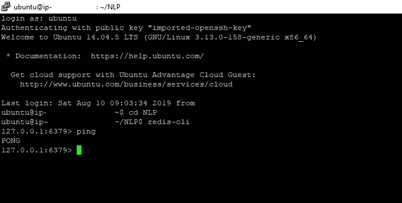
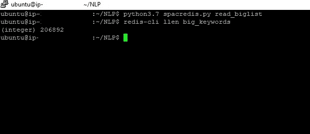
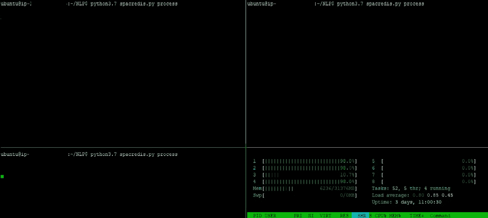

# Spacy + Redis =魔法

> 原文：<https://towardsdatascience.com/spacy-redis-magic-60f25c21303d?source=collection_archive---------14----------------------->

Source : [Pixabay](https://pixabay.com/photos/ace-cards-hooded-hood-man-adult-1869825/)

我是 Spacy 的常客，过去我曾用它解决过一些有趣的问题。自然语言处理中的一个基本问题是寻找单词或短语之间的相似性。许多自然语言处理库提供了通过余弦相似度分数来检查单词/短语是否相似的功能。

# **问题**

找到两个词之间的相似之处很容易。如果你说了 20 万个单词会怎么样！！并且想要对照包含 10k 个单词的表格来检查每个单词的相似性。更不用说为每个单词存储 3 个最相似的单词，并写入 csv 文件或您的数据库。

您的普通笔记本电脑可能无法处理这样的内存密集型工作。

即使有，那也是极其缓慢的！！

# **输入 Redis**

**什么是 Redis**

Redis 代表**Re**mote**Di**dictionary**S**server。它是一个快速、开源、内存中的键值数据存储，可用作数据库、缓存、消息代理和队列。Redis 由 Salvatore Sanfilippo 开发。

**为什么要用 Redis？**

因为它快得惊人！！

现在，下一个显而易见的问题是，是什么让它变得如此之快？

答案是，与将数据存储在磁盘或 SSD 上的数据库相比，所有 Redis 数据都驻留在内存中。通过消除访问磁盘的需要，Redis 等内存中的数据存储避免了寻道时间延迟，可以在几微秒内访问数据。

**回到问题**

好吧，那么，回到我们的问题。由于我的笔记本电脑没有足够的计算能力和存储空间，我决定在 AWS 上构建一个 EC2 实例。

你可以参考我的这篇[文章](/how-to-host-a-r-shiny-app-on-aws-cloud-in-7-simple-steps-5595e7885722)，按照步骤 1 到 3 来创建 EC2 实例并选择合适的机器映像。对于这个任务，我推荐至少有 64 GB 内存的更高的实例类型。

一旦创建了 EC2 实例，就必须执行以下步骤

> [安装 Redis](https://redis.io/download)
> 
> [安装 Python](https://www.python.org/downloads/) (推荐 3.5+版本，你可能还要安装其他包，比如 numpy，pandas)
> 
> [安装空间](https://spacy.io/usage/)
> 
> 安装 Tmux(我会谈到为什么我们需要它)

假设您已经正确安装了以上所有组件，让我们来看看代码。

**第一步:启动 redis 服务器并访问它**

初始部分是不言自明的，我们导入所需的包。然后我们进入 redis 服务器。

**第二步:从大名单中读出单词。**

Redis 支持许多数据结构。我们将在本文中广泛讨论的数据结构之一是列表(在 redis 的上下文中)。列表是一系列有序的值。与列表交互的一些重要命令有 [RPUSH](http://try.redis.io/#help) 、 [LPUSH](http://try.redis.io/#help) 、 [LLEN](http://try.redis.io/#help) 、 [LRANGE](http://try.redis.io/#help) 、 [LPOP](http://try.redis.io/#help) 和 [RPOP](http://try.redis.io/#help) 。要了解更多，可以访问 redis 的这个精彩的[互动教程](http://try.redis.io/#help)。

在下面的代码片段中，我们定义了一个函数来读取 20 万个单词。单词存储在 csv 文件“big_Keywords”中名为“keyword”的列中。单词被一个一个地读取，并存储在“big_words”键下的列表中。

你可以在这里插入包含大量单词的文件，而不是“big_keywords”文件。

**第三步:通过空间进行单词相似度。**

所以让我们解开上面的代码。首先，我们下载预训练的空间模型“en_vectors_web_lg”。然后我们读取包含 10k 字的参考文件‘small _ topics . CSV’。(您可以在这里插入自己的文件)。

接下来，我们使用命令 LPOP (lpop)从更大的列表“big_keywords”中逐个删除元素。(记得我们之前创建了一个列表‘big _ keywords’并通过 LPUSH 将单词放入这个列表中)。

然后我们有了标准的循环，我们做的核心工作是从两个列表中寻找单词之间的相似性。然后，我们通过命令 [Zadd](https://redis.io/commands/zadd) 将结果以格式(big_word，topic，score)存储到一个集合中。

例如(苹果，菠萝，0.7)，苹果是大列表中的一个单词，它在小列表“主题”中有一个相近的匹配。0.7 的分数是余弦相似性分数。

现在这里有一个小问题。使用 Zadd 时，值按升序存储，但是我们希望值按降序存储。因为余弦值为 1.0 意味着完全匹配。所以我们要寻找精确的单词匹配或者至少是最接近的匹配。为此，我们使用命令 [zrevrangebyscore](https://redis.io/commands/zrevrangebyscore) 。

现在我们已经得到了我们想要的排序列表，我们通过 lpush 将它们放入名为“results”的列表中。

**第四步:调用函数。**

我们最终完成了所有的逻辑工作，现在剩下的就是将结果放入一个新的 csv 文件中。之后，我们编写一小段代码来调用每个函数。

# **给我看看魔法**

Source : Pixabay

我把这篇文章命名为 Spacy + Redis= Magic。现在是时候揭示 Spacy 和 Redis 的组合到底有什么神奇之处了。

首先，我们确保我们的 redis 服务器启动并运行。您可以通过输入命令“redis-cli”后跟“ping”来检查这一点。如果 redis 安装正确，服务器启动并运行，那么您应该得到' pong '

现在神奇的部分来了，我们现在阅读 200K +以上的单词。

> 不可思议的是，这 200，000+单词在不到 3 秒的时间内就被读完了！！
> 
> 单词读得太快了，以至于一开始我以为单词根本没读。我通过命令“llen”验证了这些单词是否被阅读。

**输入 Tmux**

我之前告诉过你我们需要 Tmux。那么 Tmux 是什么呢？

Tmux 代表终端多路复用器，它非常有用，因为它允许您在命令行环境中平铺窗口窗格。这反过来允许你在一个终端上运行或监视多个程序。

有各种快捷方式来分割窗格，如

> ctrl + b %:垂直分割屏幕
> 
> ctrl+b”:将屏幕水平分成两半
> 
> ctrl+b c:创建一个新的窗格
> ctrl+b 箭头键让你从一个屏幕导航到另一个屏幕。

你可以在这里[这里](https://github.com/tmux/tmux)和[这里](https://www.hamvocke.com/blog/a-quick-and-easy-guide-to-tmux/)阅读更多优秀资源

**我如何在我的案例中使用 Tmux**

如果你还记得的话，我告诉过你，考虑到大量单词的性质，寻找相似单词的整个过程是一个非常耗费记忆的过程。我们有一台拥有多个内核的远程机器。使用尽可能多的内核是理想的，因为这将加快我们的进程。

通过 Tmux，我们可以同步屏幕并同时运行我们的流程，如下所示。

整个过程可能需要 18-20 小时。如果我们不使用 Redis，这个练习可能需要几天时间！！

一旦整个过程完成，我们可以输入命令“**python 3.7 spac redis . py dump**”。这将生成结果 csv 文件。

完整的代码可以在下面的要点链接中找到

希望你喜欢这篇文章。

你可以联系我

[领英](http://www.linkedin.com/in/venkat-raman-Analytics)

[推特](https://twitter.com/venksaiyan)

**参考资源:**

*   [Redis_AWS](https://aws.amazon.com/redis/)
*   [数字 _ 海洋 _redis](https://www.digitalocean.com/community/tutorials/how-to-install-and-use-redis)
*   [Redis_Interactive](http://try.redis.io/)
*   [Tmux](https://medium.com/actualize-network/a-minimalist-guide-to-tmux-13675fb160fa)
*   [Redis 博客](https://codeburst.io/redis-what-and-why-d52b6829813)
*   [Redis Github](https://github.com/antirez/redis)
*   [Tmux_sync_panes](https://blog.jpalardy.com/posts/tmux-synchronized-panes/)