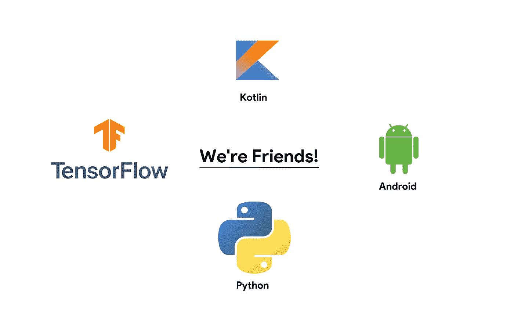
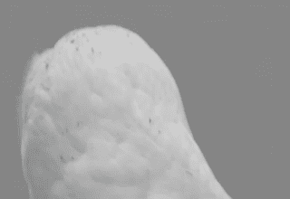

# 基于 TensorFlow Lite 的 Android 文本分类

> 原文：<https://towardsdatascience.com/spam-classification-in-android-with-tensorflow-lite-cde417e81260?source=collection_archive---------9----------------------->

## 📱[移动机器学习](https://equipintelligence.medium.com/list/stories-on-mobile-ml-with-kotlin-and-tf-lite-3ebee822c87b)

## 使用 Android 中的 TF Lite 模型对文本进行分类



[机器学习](https://www.expertsystem.com/machine-learning-definition/)已经被证明在一些用例中表现出色，比如我们将在你的 Android 应用中执行的垃圾邮件分类。我们将在 Python 中开始使用它，这是我们使用 Keras ( TensorFlow)创建分类器的地方。

> 本文假设您已经初步了解 TensorFlow、文本分类和 Android 应用程序开发。🤔

# 路线图

1.  ***我们在 Python 中使用***[***tensor flow***](https://www.tensorflow.org)***和***[***Keras***](https://www.tensorflow.org/guide/keras)***创建一个分类器。***
2.  ***将 Keras 模型转换为***[***tensor flow Lite***](https://www.tensorflow.org/lite)***模型***
3.  ***将 Keras 的 tokenizer 词汇表转换成 JSON 文件。***
4.  ***在 Android 中加载 TF Lite 模型和 JSON 文件。***
5.  ***在 Android app 中对模型进行推理。***

我将参考这个项目的 GitHub 资源库的各种文件。您可以在旁边打开它，以获得更好的学习体验。😀

Python 项目回购->[https://github.com/shubham0204/Spam_Classification_TF](https://github.com/shubham0204/Spam_Classification_TF)

Android 项目回购->[https://github . com/Shu bham 0204/Spam _ class ification _ Android _ Demo](https://github.com/shubham0204/Spam_Classification_Android_Demo)

# 先从(Python 开始！😍)


Exciting hearing “Python”?

首先，我们需要使用 [Pandas](https://pandas.pydata.org/) 解析 CSV 文件中的数据。然后，我们需要对消息进行标记，填充它们，并将它们存储在 [NumPy 数组](https://jakevdp.github.io/PythonDataScienceHandbook/02.02-the-basics-of-numpy-arrays.html)中，用于训练和测试。最后，我们有了生成 5 个文件的`DataProcessor.py`脚本。**(参见**[**data processor . py**](https://github.com/shubham0204/Spam_Classification_TF/blob/master/DataProcessor.py)**文件)**

```
android / 
        - word_dict.json
processed_data / 
        - x.npy
        - y.npy
        - test_x.npy
        - test_y.npy
```

想知道`word_dict.json`文件是从哪里来的？你知道我们需要一个`tf.keras.preprocessing.text.Tokenizer`对象来标记消息。

Tokenizer 维护一个 Python `dict`对象，该对象包含成对的单词及其索引。我们使用以下方法将这个`dict`转换成一个 JSON 文件:

Snippet 1

> 我们可以使用记号赋予器将文本转换成整数序列。但是，对于 Android 中的推理，我们将需要这个词汇。此外，代码将输出所有序列的最大长度。**我们在 Android 中将需要这个最大长度。**

我们需要在 TensorFlow 中创建一个分类器。如果你是一个经验丰富的 ML 开发人员，这很容易，对不对？**(参见**[**model . py**](https://github.com/shubham0204/Spam_Classification_TF/blob/master/Model.py)**文件)**

Snippet 2

**注意: *activations.leaky_relu 是自定义实现，在官方 TensorFlow 版本中不可用。可以尝试使用*** `***tf.keras.layers.LeakyReLU***` ***中的 LeakyReLU 图层。***

我们可以轻松达到 86%的准确率😎对于[垃圾短信收集数据集](https://www.kaggle.com/uciml/sms-spam-collection-dataset)由[Kaggle.com](https://www.kaggle.com/uciml)[上的](https://www.kaggle.com/)UCI 机器学习。接下来，我们将把训练好的 Keras 模型保存到一个 h5py ( .h5)文件中。我们可以通过调用方法来实现这一点:

```
model.save( 'models/model.h5' )
```

现在，为了在 Android 上使用这个模型，我们需要将这个文件(model.h5)转换为 TensorFlow Lite 模型。那很简单😅我们也可以使用[后训练量化](https://www.tensorflow.org/lite/performance/post_training_quantization)来减少模型的大小。**(参见**[**tflitebufferconverter . py**](https://github.com/shubham0204/Spam_Classification_TF/blob/master/TFLiteBufferConverter.py)**文件)**

Snippet 3

Python 中的工作已经完成。现在，我们将只使用 Android 中`android/`目录下列出的文件。**(参见** [**安卓/**](https://github.com/shubham0204/Spam_Classification_TF/tree/master/android) **目录)**

```
android/
    - word_dict.json
    - model.tflite
```

# 创建 Android 应用程序(Kotlin Now！)


First impressions with Kotlin

Android 应用程序将使用我们在 Python 中训练的模型将消息分类为垃圾邮件或非垃圾邮件。这将是一个简单的应用程序，有一个 EditText 和一个用 Kotlin 编程的按钮😤。

还记得 GitHub Repo->[https://GitHub . com/shubham 0204/Spam _ Classification _ Android _ Demo](https://github.com/shubham0204/Spam_Classification_Android_Demo)吗

## 从一个项目开始

1.  ***我们创建一个简单的空项目(很可能在 Android Studio 中)***
2.  ***选择 Kotlin/Java 作为编码语言。***
3.  ***将 Python 项目中*** `***android/***` ***目录下的所有文件复制到你 app 的 assets 文件夹中。(参见***`[***assets/***](https://github.com/shubham0204/Spam_Classification_Android_Demo/tree/master/app/src/main/assets)`*【文件夹】*
4.  ***在您的*** `***build.gradle***` ***( app 级)*** 中添加 TensorFlow Lite(版本 1.13.1)依赖项

```
dependencies {
    // Other app dependenciesimplementation **'org.tensorflow:tensorflow-lite:1.13.1'** }
```

在你的`build.gradle`(应用级)中，添加这些不允许压缩`.tflite`文件的行。

```
android {
      ...
    }
    buildTypes {
        release {
            ...}
    }
    aaptOptions {
        noCompress **"tflite"** }
}
```

## 从 JSON 文件加载词汇表

我们从应用程序的 assets 文件夹中加载`word_dict.json`文件。我们将把它解析成一个包含单词索引对的`HashMap`。**(参见**[**classifer . kt**](https://github.com/shubham0204/Spam_Classification_Android_Demo/blob/master/app/src/main/java/com/ml/quaterion/spamo/Classifier.kt)**文件)**

Snippet 4

现在，我们可以使用`data`散列表从单词中获取我们在 Python 中用于训练的索引。

> 在主(UI)线程上解析如此巨大的 JSON 文件不是一个好的做法，因为它可能会干扰线程上的其他进程。因此，我们使用 [Kotlin 协程](https://developer.android.com/kotlin/coroutines)来高效地执行这项任务。

## 标记和填充文本

这个任务是用 Python 执行的。但是，由于我们倾向于将标记化和填充的整数序列提供给我们的模型，我们将在 Kotlin 中编写两个方法来实现这一点。**(参见**[**classifer . kt**](https://github.com/shubham0204/Spam_Classification_Android_Demo/blob/master/app/src/main/java/com/ml/quaterion/spamo/Classifier.kt)**文件)**

Snippet 5

`this.maxlen`的值为 171。记得吗？我们的 Python 项目告诉我们，最大长度是 171，我们将所有序列填充到 171 的长度。`vocabData`是散列表，我们在前面的方法中加载了它。

注意，如果这个单词在词汇表中不存在(`data` HashMap)😔然后我们返回一个索引 0。

## 从资产文件夹加载模型

我们以 MappedByteBuffer 的形式从`assets`文件夹中加载模型。**(参见**[**main activity . kt**](https://github.com/shubham0204/Spam_Classification_Android_Demo/blob/master/app/src/main/java/com/ml/quaterion/spamo/MainActivity.kt)**文件)**

Snippet 6

## 对邮件进行分类

现在，我们将所有方法组合在一起，对消息进行分类并打印结果。**(参见**[**main activity . kt**](https://github.com/shubham0204/Spam_Classification_Android_Demo/blob/master/app/src/main/java/com/ml/quaterion/spamo/MainActivity.kt)**文件)**

Snippet 7

## 结果😎


# 还有呢！

# 仅此而已。累了吧？😴



That’s awesome!

希望你觉得这个博客有趣。对于任何建议和疑问，请在评论区自由表达。

TensorFlow 和 Android 可能会成为👫

谢谢你。😀