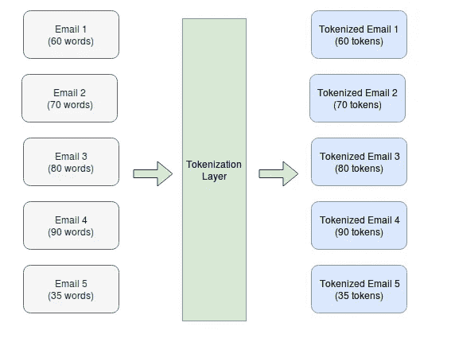
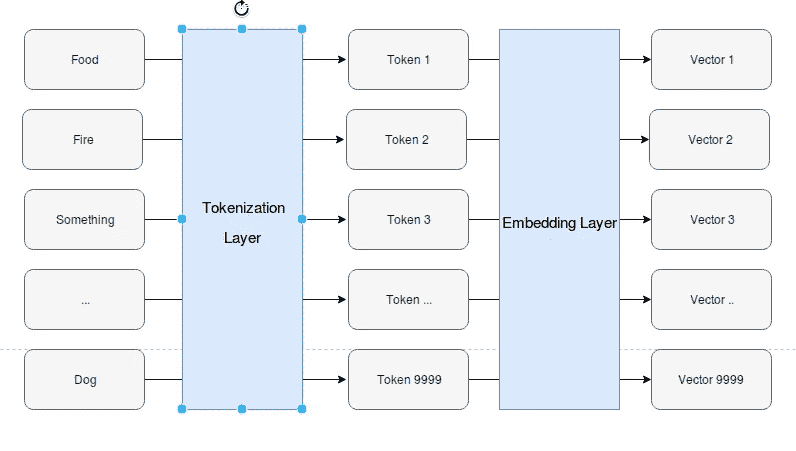
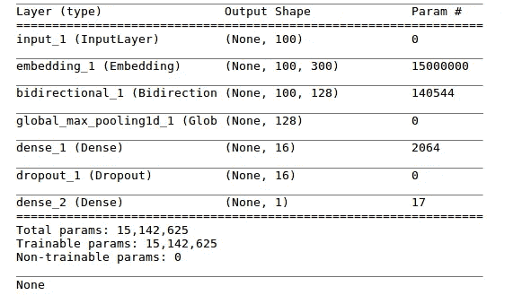
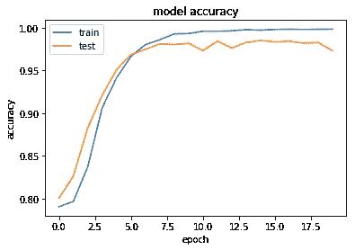
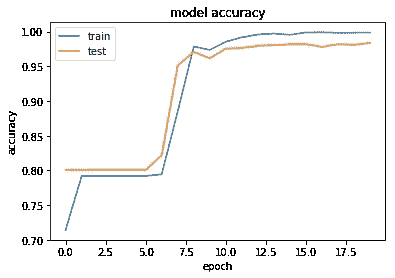

# 具有深度学习的垃圾邮件过滤系统

> 原文：<https://towardsdatascience.com/spam-filtering-system-with-deep-learning-b8070b28f9e0?source=collection_archive---------6----------------------->

## 并探讨了单词嵌入的幂特征提取


Photo by [Ant Rozetsky](https://unsplash.com/@rozetsky?utm_source=medium&utm_medium=referral) on [Unsplash](https://unsplash.com?utm_source=medium&utm_medium=referral)

深度学习在许多行业变得非常流行，许多有趣的问题都可以通过深度学习技术来解决。在本文中，我将向您展示如何利用深度学习模型来设计一个超级有效的垃圾邮件过滤系统。

不久前，我写了一篇关于用传统的机器学习算法过滤垃圾邮件的文章。

在那篇文章中，我介绍了从数据探索、数据预处理、特征提取到为算法选择正确的评分标准。有兴趣的可以看这里的文章[！](https://medium.com/@edricgan.44/email-spam-detection-1-2-b0e06a5c0472)

今天，在构建垃圾邮件过滤系统时，我将更多地关注以下两个部分:

1.  单词嵌入
2.  GRU +双向深度学习模型

# **什么是文字嵌入？**

单词嵌入是以矢量化格式表示的文本数据。因此，对于像“dog”这样的单词，单词 embedding 会将其转换为一个形状为(1，x)的向量，x 是一个可以配置的值。

直觉上，你可以把这个向量看作是描述这个词的一种方式。如果这个词是一个形状向量(1300)，这意味着有 300 个不同的特征描述这个词。

那些特征是什么？老实说，我们不知道。深度学习将在训练过程中识别这些特征。

训练过程的最终结果是从单词到有意义的单词向量的映射。


听起来像个很酷的魔术，是吧？更酷的是，两个单词向量之间的余弦距离实际上意味着一些重要的东西。

具有更接近语义的单词在向量空间中将具有更短的余弦距离。

例如，向量“男人”和向量“女人”之间的余弦距离非常接近。

```
w2v.most_similar('man')# Output
# [('woman', 0.699),('person', 0.644),('him', 0.567)]# 'woman' has the highest similarity score with 'man'
```

**预训练权重的单词嵌入**

有一些开源的单词嵌入已经在大量的文本数据上进行训练，它们的权重开放给公众下载。

通过使用开源单词嵌入，您可以节省收集文本数据的时间。而且，还可以节省生成单词嵌入的时间和计算资源。

使用预先训练的单词嵌入的缺点是单词嵌入可能在来自不同域的数据源上被训练。这可能并不总是适合您正在应用的用例。

例如，在科学期刊的文本数据上训练的预训练单词嵌入可能不太适合检测恶意推文之类的问题。这个单词嵌入的好处不会那么显著。

**预训练单词嵌入的不同变体**

大多数开源单词嵌入都列出了它们被训练的来源，所以你需要根据你要解决的问题仔细选择。

以下是一些例子:

1.  [手套](https://nlp.stanford.edu/projects/glove/)

2.[维基新闻](https://fasttext.cc/docs/en/english-vectors.html)

3.[谷歌新闻矢量](https://code.google.com/archive/p/word2vec/)

**试验单词嵌入**

在本教程中，我们使用手套字嵌入。手套嵌入的格式与 python 库 **gensim，**所期望的有点不同。

所以你从手套官网下载嵌入这个词之后，需要做一些简单的转换。

通过运行下面的 python 脚本，可以很容易地将其转换成与 word2vec 嵌入兼容的格式。

确保您安装了 python gensim 模块。

```
python -m gensim.scripts.glove2word2vec -i glove.6B.300d.txt -o glove.6B.300d.word2vec.txt
```

之后，您可以使用 gensim 库轻松加载它，

```
w2v = KeyedVectors.load_word2vec_format(
      'glove.6B.300d.word2vec.txt’,binary=False)
```

我们还可以对这个向量执行一些操作，并得到一些有趣的结果。

例如:

> 例 1:国王-男人+女人=王后
> 
> 示例 2:马德里-西班牙+法国=巴黎

让我们看看如何在代码中实现这一点，以及我们可能会得到什么有趣的结果。

```
w2v.most_similar(['king','woman'],negative=['man'],topn=1)
# Output: [('queen', 0.6713277101516724)]w2v.most_similar(['madrid','france'],negative=['spain'],topn=1)
# Output: [('paris', 0.758114755153656)]
```

我们还可以让单词嵌入模型计算出给定单词列表中哪个是离群值

```
w2v.doesnt_match("england china vietnam laos".split())
#Output: englandw2v.doesnt_match("pig dog cat tree".split())
#Output : treew2v.doesnt_match("fish shark cat whale".split())
#Output : cat
```

我已经在笔记本中包含了相关代码，您可以尝试不同的输入，看看它是否符合您的期望。

现在我想你已经见证了单词嵌入强大的特征提取能力。

在下一节中，我们将了解如何将这种预训练的单词嵌入与 Keras 中的**嵌入层**相结合，以便我们可以在训练中使用它。

**嵌入层**

**Keras** 是一个非常棒的高级深度学习库，可以帮助你轻松构建深度学习模型。它抽象了许多低级的数学细节，让你以一种非常直观的方式建立你的模型。

嵌入层是 Keras 提供的包装层之一，方便我们训练单词嵌入。

首先，我们需要利用 tokenizer 来帮助我们将所有的单词转换成某种标记/索引。

在标记化层，他们维护一个将单词映射到索引的字典。比如狗-> 0，猫->1 等等。

```
max_feature = 50000tokenizer = Tokenizer(num_words=max_feature)
tokenizer.fit_on_texts(x_train)# Converting x_train to integer token, token is just an index number that can uniquely identify a particular wordx_train_features = np.array(tokenizer.texts_to_sequences(x_train))
x_test_features = np.array(tokenizer.texts_to_sequences(x_test))
```



Tokenization Layer to transfer text to simple token


Internal working of the tokenization layer

嵌入层将在内部维护一个查找表，该查找表将索引/标记映射到一个向量，该向量在高维空间中表示单词。



Full overview of the whole transformation


Brief summary of the whole process

# **嵌入+双向+门控递归单元(GRU)**

**GRU**

GRU 是 LSTM 建筑的变体，许多文章在解释背后的理论方面做了大量工作。

为了简洁起见，我不会对所有这些模型背后的理论做太多解释。

我推荐克里斯·奥拉写的关于这个话题的[博客](http://colah.github.io/posts/2015-08-Understanding-LSTMs/)。他的博客展示了一些精美的图片来解释 GRU 的内部运作。

**双向**

双向的想法简单而强大。它的作用是拥有两个 LSTM 网络，而不是一个。

对于第一个 LSTM 网络，它将按照正常方式输入序列。对于第二个 LSTM 网络，它将反转输入序列并馈入 LSTM 网络。这两个网络的输出将被合并，然后传递到下一层。

双向背后的直觉是，对于某些句子，上下文信息在句子的末尾。没有上下文信息，可能会产生歧义。例如:

```
1\. Find me at the bank in that forest. (River bank) 2\. Find me at the bank in the city center. (Financial Bank)
```

因此，双向阅读句子有助于模型确定单词的确切含义。

如果你对理论知识感兴趣，我会推荐阅读原文[论文](https://maxwell.ict.griffith.edu.au/spl/publications/papers/ieeesp97_schuster.pdf)。

**构建网络**

现在，让我们开始在 Keras 中构建我们的网络，我们将涉及嵌入层、双向层和门控循环单元(GRU)等组件。

对于嵌入，我们有两种选择:

1.  从头开始训练嵌入层
2.  使用一些预先训练好的开源权重嵌入。

在本文的最后，我们将比较使用**普通**单词嵌入和**手套**单词嵌入产生的结果。

**香草字嵌入**

下面的代码片段显示了如何在 Keras 中轻松构建嵌入层、双向和 GRU。

```
inp = Input(shape=(max_len,))x = EmbeddingLayer(max_features,embed_size)(inp)x = Bidirectional(CuDNNGRU(64, return_sequences=True))(x)x = GlobalMaxPool1D()(x)x = Dense(16, activation="relu")(x)ix = Dropout(0.1)(x)x = Dense(1, activation="sigmoid")(x)model = Model(inputs=inp, outputs=x)model.compile(loss='binary_crossentropy', optimizer='adam', metrics=['accuracy'])print(model.summary())
```



Summary of the model

**预训练手套字嵌入**

手套单词嵌入是由斯坦福大学 NLP 小组开源的。我们需要先下载嵌入这个词，你可以在官方[网站](https://nlp.stanford.edu/projects/glove/)找到出处信息。

他们已经发布了不同版本的 word embedding，并在不同的数据源上接受了培训。请随意使用这里列出的单词嵌入的其他变体进行更多的实验。

将重量从手套转移到 Keras 嵌入层的代码相当长，这里我只展示一小段代码，让您了解转移是如何进行的。我会在本文末尾分享笔记本代码。

```
embeddings_index = convert_glove_to_index('glove.6B.300d.txt')# Randomly initialize the embedding matrix
embedding_matrix = np.random.normal(emb_mean, emb_std, (nb_words, embed_size))# Transferring weight
for word, i in word_index.items():
    embedding_vector = embeddings_index.get(word)
    if embedding_vector is not None: 
       embedding_matrix[i] = embedding_vector
```

现在，嵌入矩阵包含了来自手套嵌入的所有权重，将它们转移到 Keras 层只是多了一行代码。

构建模型时，需要指定嵌入层的权重。其余的代码与构建普通嵌入层的方式相同。

```
x = Embedding(max_features, embed_size, weights = [embedding_matrix])(inp)
```

**模型的性能**

在训练集上训练几次迭代后，让我们从**准确度**、**精度**和**召回**方面比较模型的性能。

如果你对为什么选择这些指标感兴趣，你可以阅读我之前写的[文章](https://medium.com/@edricgan.44/email-spam-detection-1-2-b0e06a5c0472)。我已经包含了对这些不同的性能指标选择的详细解释。

从上表中，你可以清楚地看出 LSTM 模型比朴素贝叶斯算法做得更好。原因可能是:

1.  Tfidf 矢量器没有考虑句子中单词的顺序，因此丢失了大量信息。
2.  LSTM 是近年来序列数据(文本、语音、时间序列数据)中最伟大的算法之一


Photo by [rawpixel](https://unsplash.com/@rawpixel?utm_source=medium&utm_medium=referral) on [Unsplash](https://unsplash.com?utm_source=medium&utm_medium=referral)

# 两种嵌入模型的性能比较

**精度&召回**

我只运行了 20 个时期的模型，没有做任何进一步的微调。

这两个模型的精确度和召回率相差不大。一些原因可能是由于:

1.  手套嵌入是在与我们在这个问题中拥有的数据非常不同的源上训练的，因此我们从预训练嵌入中获得的好处没有显著的帮助
2.  这个垃圾邮件过滤问题中的文本数据并不太复杂。普通的单词嵌入是捕捉模式的一个足够好的模型。

比较这两个模型的精度图，你会发现一些有趣的东西:



Accuracy of Glove Word Embedding



Accuracy of Vanilla Word Embedding

在开始有更好的性能之前，香草词嵌入的准确性在最初的几个时期保持平稳。

然而，手套词嵌入的准确度具有平滑的准确度曲线，并且逐渐提高。

这些观察可以粗略地给我们一些启示，即在训练的早期，普通单词嵌入模型仍然在学习和调整它的权重。

因此，预先训练的单词嵌入仍然有助于加快模型的学习，您可能不会注意到这个问题中的速度优势，但是当您在足够大的文本数据上训练时，这些速度差异将非常显著。

# **结论**

在本文中，我展示了如何通过 Keras 使用单词嵌入和 LSTM 模型构建一个垃圾邮件过滤系统。

对于文本数据，单词嵌入无疑是一个很好的特征提取工具，利用 LSTM 模型，我们可以构建一个性能非常好的垃圾邮件过滤系统。

你可以在这个 Github [库](https://github.com/huai99/Email-Spam-Detection-Python/blob/master/Email%20Spam%20(%20Medium%20Part%202).ipynb)中找到这个笔记本的代码，或者你可以直接从 [Colab](https://colab.research.google.com/drive/1mvY1vFMvMnUIbC8hvHvlm-UeSeSAlil9) 中运行它。