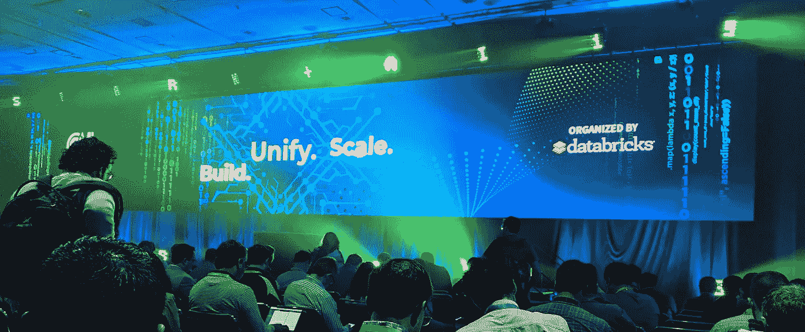
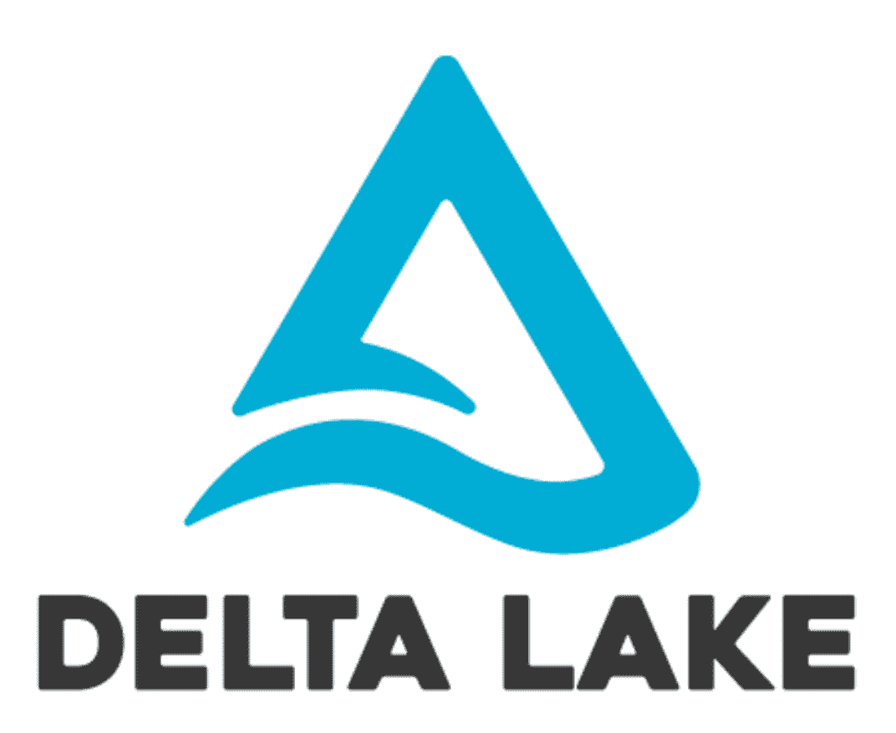
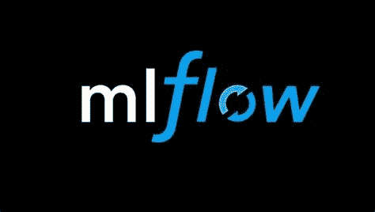

# 2019 年火花与人工智能峰会

> 原文：<https://towardsdatascience.com/spark-ai-summit-2019-5428f44b2586?source=collection_archive---------19----------------------->

Picture from Spark and AI Summit 2019

我对 2019 年 4 月 24 日和 25 日在旧金山举办的最新一届 Spark 和 AI 峰会的回顾。

上周举办了最新一期的星火会议。这是我第一次参加会议。以下是会议不同方面的分析。

# 大新闻

会议的组织者和 Spark 的主要贡献者 Databricks 宣布了几个项目:

# 树袋熊

他们宣布了一个名为考拉的新项目，考拉是 Spark 的本地“熊猫”翻译。你现在可以自动将你的熊猫代码移植到 Spark 的分布式世界。这将是人们适应熊猫环境的一座奇妙的桥梁。许多在线课程/大学使用熊猫教授数据科学。现在，新的数据科学家将填补一点损失。

我不认为这只会对新的数据科学家有用。正如您可能知道的，数据科学是一个充斥着您公司周围的脚本的世界。人们使用各种框架在各种环境下创建脚本来完成各种任务。如果你的主环境是 Spark，你将会调整你的熊猫的执行环境，少一个要关心的。

考拉是一个免费的开源项目[在这里](https://github.com/databricks/koalas)。该项目仍处于预发布版本(0.1)

# 三角洲湖

data bricks(Spark 的付费版本)的主要组件之一 Delta 刚刚获得开源。对于使用标准版 Spark 的人来说，这是一个非常好的消息。

产品的所有细节都可以在 https://delta.io/的[找到](https://delta.io/)

# MLFlow

from Databricks 的端到端生命周期模型管理将于 5 月升级到 1.0 版本。

以下组件将添加到现有产品中:

*   MLFlow 工作流，允许在一个管道中打包多个步骤项目
*   MLFlow Model Registery，Registery 发布模型、版本，查看谁在使用它

对于任何商业生产模型的人来说，这似乎是一个有趣的过程。

有趣的是，两年前，[的一个同事](https://www.linkedin.com/in/pascalpotvin/)也在做一个类似的内部项目>。所以我可以说，它确实符合行业的实际需求。

# 最佳谈话

以下是我个人参加过的最喜欢的演讲列表:

# 智能连接算法，用于应对大规模倾斜

作者:安德鲁·克莱格

[这个关于如何处理大型数据集中的不对称的演讲](https://databricks.com/sparkaisummit/north-america/sessions-single-2019?id=30)是我最期待的演讲，实际上也是我想参加会议的原因之一…我没有失望。

Andrew 提出了一个非常简单但效率惊人的方法来处理偏斜。我已经可以看到在我的工作中应用这些知识的地方。TLDR:他建议通过在 ID 末尾添加一个随机整数，将你真正频繁的数据细分成更小的块，并在更小的表中创建所有可能的 newID。

更多详情，你可以查看他们的 his 幻灯片[这里](https://docs.google.com/presentation/d/1AC6yqKjj-hfMYZxGb6mnJ4gn6tv_KscSHG_W7y1Py3A/edit?usp=sharing)。

# Apache Spark 数据验证

作者:Patrick Pisciuneri 和 Doug Balog(目标)

[他们共享 Target](https://databricks.com/sparkaisummit/north-america/sessions-single-2019?id=100) 数据验证框架，该框架应该很快就会开源。该框架允许在生成后进行数据验证。

如果代码有单元测试，数据需要类似这样的东西。我们都知道，当您处理数据集时，您有一组假设，当您创建管道时，这些假设可能是正确的，但几个月后，数据“真相”可能会略有不同，然后您的管道可能会在数据上失败。更糟糕的是，它可能在你没有意识到的情况下处理它而没有失败。这样的框架将有助于保持数据的完整性。

框架在 [Github](https://github.com/target/data-validator) 上可用。

# 美妙的触感

我真的很喜欢他们给 ML/AI 伦理学的聚光灯。他们在周四的主题演讲中安排了一个黄金时段来谈论道德问题。我觉得这个话题讨论的不够多，或者至少不够优先。

这一点值得称赞。

# 无形的

众所周知，会议有两件事，谈话和社交。本次大会似乎已经理解了这一点，并为实现联网做出了很多努力。他们基本上从早上 8 点到晚上 11 点全天都有内容/活动，让人们呆在现场。

我与来自不同行业的其他数据科学家进行了许多有趣的讨论。对我来说，这是会议的关键点。

# 结论

我真的很喜欢这次会议，推销很平衡。大多数技术会谈都是纯粹的行业火花，没有销售意图。人际关系网太棒了。技术含量高。祝贺组织者。

据我所知，他们会在自己的网站上发布一些演讲的视频:[https://databricks.com/sparkaisummit/north-america](https://databricks.com/sparkaisummit/north-america)

*最初发布于 2019 年 4 月 29 日*[*http://coffeeanddata . ca*](http://coffeeanddata.ca/spark-ai-summit-2019/)*。*