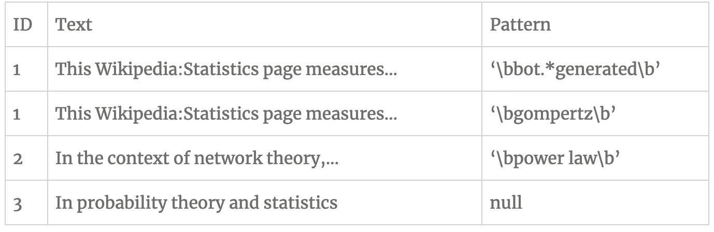

# 使用正则表达式的火花连接

> 原文：<https://towardsdatascience.com/spark-join-using-regex-40a8589c0354?source=collection_archive---------11----------------------->

这是一篇关于我如何在 SPARK 中使用自定义 UDF 将 2 个数据集与正则表达式有效连接的技术性更强的文章

# 语境

在过去的几个月里，我一直在努力解决这个小问题。我有一个正则表达式模式的列表，我想知道哪篇维基百科文章包含它们。

我想以一个包含以下各列的表格作为结束:

*   维基百科文章 ID
*   维基百科文章文本
*   匹配模式(如果没有触发模式，则为空)

我正则表达式列表大约有 500 个模式长。有些是简单的单词搜索，但有些是更复杂的正则表达式。我需要一种好的方法来搜索这些模式，并找到一种方法将它们转换成上述格式。某种类型的**左外连接。**

# 设置

因为维基上有很多文章。很显然，[580 万其中](https://en.wikipedia.org/wiki/Wikipedia:Size_of_Wikipedia)。我决定使用一个能够并行研究的工具，我已经决定使用来自阿帕奇基金会的 [Spark](https://spark.apache.org/) 。现在，你可以选择你最喜欢的云提供商，很有可能你只需点击一下就能得到一个集群，我就是这样做的。

现在我有了自己的工作设置，我开始在网上寻找如何做到这一点。

我在网上发现的第一件事是用 **rlike** 做一个左外连接。

这看起来很有希望，在一个小场景中，它做的正是我想要的。

在我天真地启动了所有数据集的连接之后…我等了很长时间。实际上，只要我意识到我的集群内存不足。从那时起，我在网上找了好几个小时，尝试了很多解决方案，但我找不到任何关于如何解决这个问题的相关信息。

由于这不是什么真正重要的事情，我有几个月没有碰它，有一天在工作中，我和我的一个同事谈论它，他发现了这个问题。

# 问题

他是这样说的:

> “首先，也是最重要的，非等价连接在 Spark 中性能很差，因为它们只能使用**广播嵌套循环连接**或**交叉连接**进行评估。
> 
> 让我们假设**文章**包含 1，000，000 行，而**模式**包含 500 行。较小的数据集(本例中为**粒子**)将被广播。为了评估这个连接，**粒子**将被有效地扫描 1，000，000 次，连接谓词将被评估 500，000，000 次。更糟糕的是，该模式将被编译 5 亿次。
> 
> 这基本上意味着灾难。”—迈克尔

# 解决方案

然后，在发现问题后，几天后他带着一件定制的 UDF 回来找我

要使用它，只需像这样查询它:

# 结果

我试了一下，几个小时后我就有了我想要的东西。

我决定做一个小的基准。在 Spark 中加载和缓存了这两个数据集之后，我只选择了 20 000 篇文章来尝试这两种方法。通过使用完全相同的样本，结果如下:

*   第一种技术， *rlike* :每秒 3 篇文章
*   第二种技术， *UDF* :每秒大约 5 000 篇文章

我知道这种延迟主要是由于缓存、读取和其他内存管理造成的，但这仍然是一个很大的区别。

# 结论

我通常不写这种类型的博客帖子，但因为我寻找解决方案，但找不到任何东西，我认为它值得分享回来。

我要感谢[迈克尔·斯泰尔斯](https://www.linkedin.com/in/mstyles/)对这个项目的帮助。

这篇博客是我自己的博客[咖啡和数据](http://coffeeanddata.ca/spark-join-using-regex/)的转贴