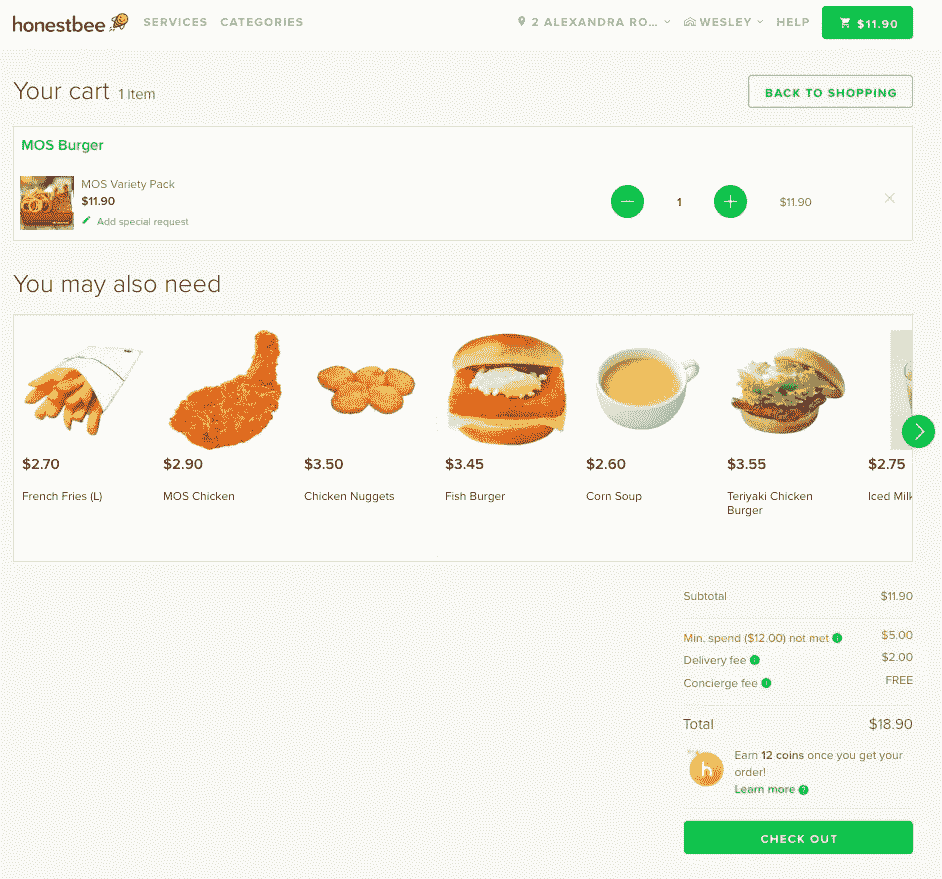
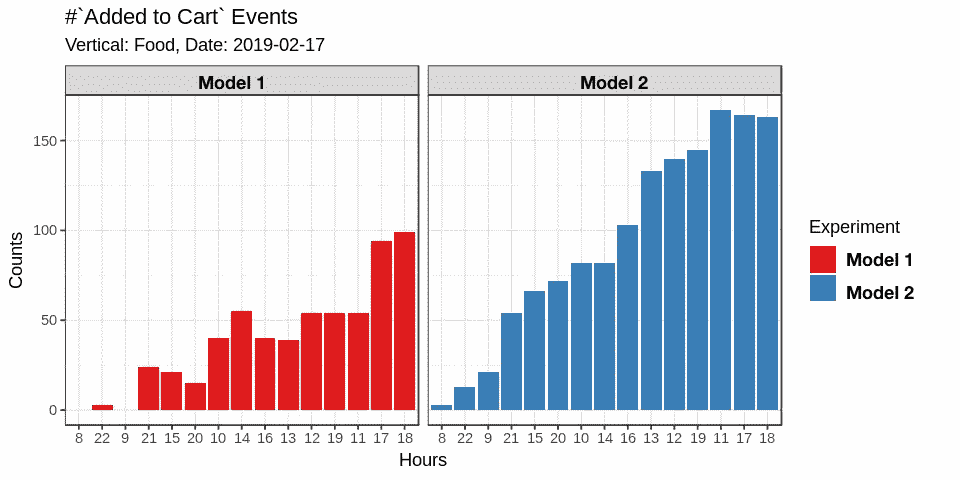

# spark Joy——用数据操作语法对您的事件日志说 Konmari

> 原文：<https://towardsdatascience.com/spark-joy-saying-konmari-to-your-event-logs-with-grammar-of-data-manipulation-7de2d2c6bd29?source=collection_archive---------27----------------------->


当你有一大堆事件日志要解析时，首选的*武器*应该是什么？在本文中，我将分享我尝试 spark/spark ryr 解决这个问题的经验。

在 [Honestbee](http://honestbee.com/) 捕获用户数据的事件日志🐝作为数据湖的一部分存储在 S3 自动气象站，每隔 40 分钟从[段](https://segment.com/blog/exactly-once-delivery/)发送给我们。学习如何检索这些数据非常重要，数据(科学)团队使用这些日志来评估我们的机器学习模型(又名 *canonical* A B testing)的性能。

此外，我们还使用相同的日志来跟踪业务 KPI，如***C****lick****T****through****R****ate、****C****on version****R****ate 和*

在本文中，我将分享我们如何利用运行 Spark 的高内存集群来解析食物推荐系统生成的日志。

# 案例研究:食物推荐系统

每当一位诚实的顾客开始结账时，我们的 ML 模型都会尽力对你最有可能加入购物车的商品进行个性化预测，尤其是你错过的商品。



> *一个*事后分析*，将要求我们查看日志，根据加权分布，查看用户被分配到哪个治疗组。*

现在，让我们开始吧。

首先，我们导入必要的库:

# 连接高记忆火花簇

接下来，我们需要连接主节点 Spark。我建议在转移到本地集群和远程集群之前，先从本地机器开始。

# 安装 Spark

如果它还没有安装，幸运的是`sparklyr`有一个内置的功能来帮助安装

```
spark_install(
    version = "2.4.0", 
    hadoop_version = "2.7"
)
```

> *注意，我们在这里也将 Hadoop 和 spark 一起安装，因为从 S3 文件系统读取文件所需的 jar 是附带的。*

# 本地集群/单节点机箱

接下来，您将连接 spark cluster ie。建立一个**S**park**C**connection，通常缩写为 SC，会是你想要做的事情。

如果您连接到本地安装的 spark 集群/单节点箱，您将设置主参数为`local`。

> 你可能需要调整内存消耗，我把它设置为 150 Gb，你的里程可能会根据你的机器而有所不同。

在笔记本电脑上运行 spark，或者作为一个更大的云实例上的单个节点安装都非常好。数据科学团队不拥有或管理集群，而是在单节点*超大型* EC2 实例上运行 spark，主要用于原型开发和 EDA。然而，当任务变得太大时，您可能会考虑更繁重的任务，比如适当的集群。

# 远程集群

如果您正在运行 jupyterhub / Rstudio server，特别是如果您希望为每个数据科学家提供一个集群，那么与远程 spot 集群连接的选项可能会很有吸引力。

在这种情况下，python / R 进程不会在集群的同一个主节点上运行。像 Qubole 和 Databricks 这样的第三方 Spark 即服务提供商可以缓解这种情况。在 Honestbee，我们也选择了这个选项，集群由我们的 AWS 帐户下的 [Qubole](https://www.qubole.com/) 提供。

> PS。Qubole 是一个很好的抢断！

上面的要点建立了一个 spark 连接`sc`，你将需要在大多数函数中使用这个对象。

另外，因为我们从 S3 读取，所以我们必须设置 S3 访问密钥和密码。这必须在执行`spark_read_json`等功能之前进行设置

> *所以你会问各有什么利弊。本地集群通常适合 EDA，因为您将通过 REST API (LIVY)进行通信。*

# *读取 JSON 日志*

基本上有两种方法可以读取日志。第一种是把它们作为一个整体或者一个流来读——就像它们被倒进你的桶里一样。

有两个功能，`spark_read_json`和`stream_read_json`前者是批处理的，后者创建结构化的数据流。这也相当于读取您的拼花文件

# 成批的

应该用`s3a`协议设置路径。`s3a://segment_bucket/segment-logs/<source_id>/1550361600000.`

```
json_input = spark_read_json(
    sc = sc,
    name= "logs",
    path= s3,
    overwrite=TRUE
)
```

下面是魔法开始的地方:

如你所见，这是一个简单的查询…

1.  从`Food`垂直方向过滤所有`Added to Cart`事件
2.  选择以下列:

*   `CartID`
*   `experiment_id`
*   `variant`(治疗组)和
*   `timestamp`

3.删除未将用户分配给模型的事件

4.添加新列:1。`fulltime`可读时间，2。一天中的某个小时

5.按照服务`recommender`对日志进行分组，并计算行数

6.添加一个新列`event`，其值为`Added to Cart`

7.按时间排序



Here’s a plot of the output so we see Model 2 is really getting more clicks than Model 1.

# 火花流

或者，您也可以将上述操作的结果写入结构化的火花流。

您可以使用耦合到`glimpse`的`tbl`函数预览这些来自流的结果。

```
sc %>% 
  tbl("data_stream") %>% 
  glimpse
```

就这样，伙计们！

此外，我想对存储模型元数据的现有选项做一个评论，特别是当您使用多个模型进行 A|B 测试时，每个模型都有多个版本。

老实说，很难知道发生了什么。


对于我的博士学位，我个人致力于使用图形数据库来存储具有复杂关系的数据，我们目前正在努力开发这样一个系统来存储与我们的模型相关的元数据。

例如:

1.  它们与哪些 API 相关联
2.  哪些气流/ [Argo](https://www.altoros.com/blog/kubeflow-automating-deployment-of-tensorflow-models-on-kubernetes/) 作业与这些模型相关联
3.  部署配置(舵图和地形)和其他部署元数据在哪里
4.  当然还有元数据，比如成绩和分数。

来和我们谈谈吧，我们正在招人！[数据工程师](https://boards.greenhouse.io/honestbee/jobs/1426737)，[高级数据科学家](https://boards.greenhouse.io/honestbee/jobs/1427566)

*原载于 2019 年 2 月 20 日*[*ethe Leon . github . io*](https://etheleon.github.io/articles/spark-joy/)*。*