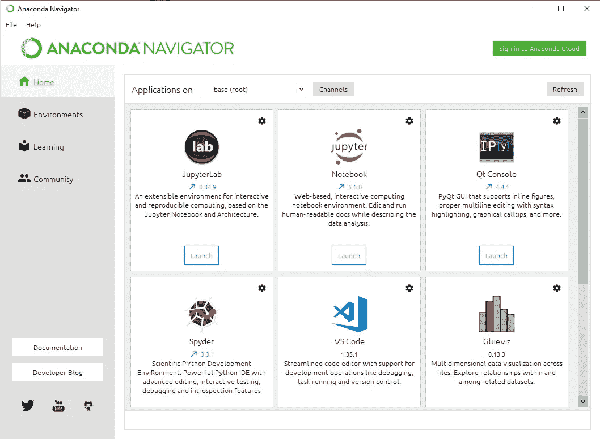

# 窗户上的火花？入门指南。

> 原文：<https://towardsdatascience.com/spark-on-windows-a-getting-started-guide-11dc44412164?source=collection_archive---------13----------------------->

Photo by [Swaraj Tiwari](https://unsplash.com/@swarajtiwari?utm_source=medium&utm_medium=referral) on [Unsplash](https://unsplash.com?utm_source=medium&utm_medium=referral)

我们都读过这些关于大数据如何接管世界的文章。广泛用于这种大规模数据处理的工具之一是 Spark。Spark 是一个大数据分析代理，是整个行业使用的许多机器学习和数据科学的基础框架。

用你的 Jupyter 笔记本和熊猫来做数据分析项目是很好的，但是如果你想让它扩展，你需要做一点不同的设计。不幸的是，很难知道如何在您自己的工作站或笔记本电脑上实际安装螺母和螺栓，以便当您想要扩展时，它是完全相同的代码。我一直在设置我的本地 Windows 10 工作站来进行真正的数据科学工作，所以我想分享一下我的配方。有一堆脚本和演练来为 Linux 设置这些东西，所以我将在您的家庭 Windows 10 机器上设置这些令人敬畏的工具。不需要虚拟机。

# 先决条件

## 饭桶

下载并安装 [Git for windows](https://git-scm.com/download/win) 。这将在你的开始菜单中给你 Git Bash。这将有助于拉下我为测试您的设置而创建的笔记本。除了“按原样检出，按原样提交”之外，使用安装的默认选项。这可能只是我，但我不喜欢 git 弄乱我的文件内容。

## Java 和 Scala

Spark 需要运行 [Java](https://www.java.com/en/download) 和 [Scala](https://www.scala-sbt.org/download.html) SBT(命令行版本)，所以你需要下载并安装 Java 8+。Java 经历了一些许可变更，但是因为这是为了开发目的，所以你可以下载和使用。Scala 是一种运行在 Java 机器上的脚本语言，Spark 使用它来编写脚本。

## 7-Zip

如果你还没有安装 [7-Zip](https://www.7-zip.org/download.html) ，它是处理各种压缩文件格式的优秀工具。

## 蟒蛇

Anaconda 是一个科学计算资源的包管理器，允许您轻松安装 Python、R 和 Jupyter 笔记本。在这里下载[并选择 Python 3.7 64 位图形安装程序。下载并运行后，您应该会看到如下内容。如果尚未安装，请单击 Jupyter 笔记本的安装按钮。](https://www.anaconda.com/distribution/#download-section)

## 火花

Spark 是计算集群框架。您可以下载一个. tgz 文件，并使用 7-zip 解压到一个临时位置。在 7-zip 中可能需要两个回合才能解开它，一个回合才能解开它。它应该给你留下一个 spark-2.4.3-bin-hadoop2.7，里面有一堆东西。将 spark-2.4.3-bin-hadoop2.7 文件夹移动到一个容易找到的位置，如 C:\spark-2.4.3-bin-hadoop2.7。

# 让我们做一些测试

检查它是否一切正常。打开一个新的 Windows 命令提示符(Win，搜索 cmd)并检查 java 是否安装正确。否则，您可能需要注销或重新启动才能使路径更新生效。

## Java 语言(一种计算机语言，尤用于创建网站)

运行 java 命令，它应该会返回用法文本。

> C:\Users\simon>java

Java should be located by the windows command prompt

## 火花

在命令提示符下导航到“C:\spark-2.4.3-bin-hadoop2.7”并运行 bin\spark-shell。这将验证 Spark、Java 和 Scala 都可以正常工作。一些警告和错误是正常的。使用“:quit”退出并返回到命令提示符。

现在，您可以运行一个圆周率的示例计算来检查它是否正常工作。

> bin \ run-示例 SparkPi 10

## 饭桶

运行 git bash 应用程序来显示 bash 提示符。(赢，搜索 bash)

> $ cd
> $ mkdir 文档/开发
> $ cd 文档/开发
> $ git 克隆[https://github.com/simonh10/SparkML.git](https://github.com/simonh10/SparkML.git)

## 朱皮特

运行 Jupyter 笔记本应用程序(Win，搜索 Jupyter)，这将启动 Jupyter 笔记本服务器并打开 web 浏览器。如果浏览器没有打开，请转到 [http://localhost:8888](http://localhost:8888/tree/Documents/Development/SparkML) 并导航到 Documents/Development/SparkML。你应该看看下面。

选择火花测试，它将打开笔记本。要运行测试，请单击“重启内核并运行全部> >”按钮(确认对话框)。这将安装 pyspark 和 findspark 模块(可能需要几分钟)，并为运行集群作业创建 spark 上下文。Spark UI 链接将带您进入 Spark 管理 UI。

Click restart kernel and run all, after a few minutes the Spark UI will be available.

Spark Management UI

> 您现在可以在本地机器上对 Spark 集群运行 Python Jupyter 笔记本了！

# 接下来去哪里？

 [## PySpark 简介

### PySpark 是一种很棒的语言，可以进行大规模的探索性数据分析，构建机器学习管道，以及…

towardsdatascience.com](/a-brief-introduction-to-pyspark-ff4284701873)  [## 基于 PySpark 的多类文本分类

### Apache Spark 在头条新闻和现实世界中的采用率都在迅速上升，这主要是因为它能够…

towardsdatascience.com](/multi-class-text-classification-with-pyspark-7d78d022ed35)  [## PySpark 备忘单:Python 中的 Spark

### Apache Spark 通常被认为是一个快速、通用和开源的大数据处理引擎，内置了…

www.datacamp.com](https://www.datacamp.com/community/blog/pyspark-cheat-sheet-python)