# Sparkify 流失预测，或时间序列数据的力量

> 原文：<https://towardsdatascience.com/sparkify-churn-prediction-or-the-power-of-time-series-data-7b2e8f49a30e?source=collection_archive---------9----------------------->

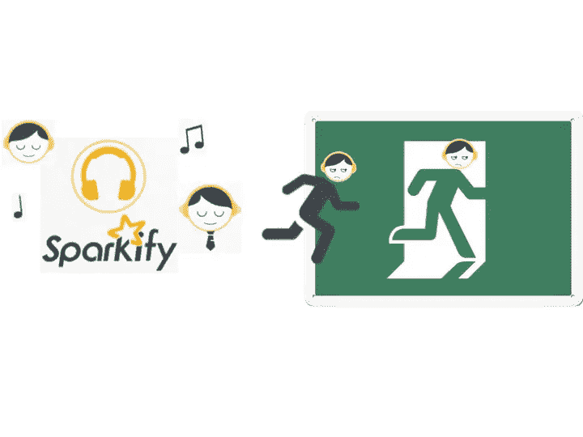

在与客户打交道时，能够**预测客户流失**既是改善客户服务的机会，也是业务表现好坏的指标。
作为 Udacity 数据科学纳米学位顶点项目的焦点，我选择为一家名为 Sparkify 的**音乐流媒体服务从事流失预测工作。我在这里提出了对我使用的数据和我得出的结论以及我选择实施的方法的见解。**

## 项目背景

这项研究的目的是建立一个模型，能够**预测**音乐流媒体服务 Sparkify 的用户是否有可能**流失**。
一旦我们能够定义流失，我们就可以标记我们的数据，我们将要实现的机器学习模型是用于分类的**监督模型**。

我们有两个数据集可供使用:主数据集，大小约为 12GB，小型数据集，大小约为 128MB。
由于主数据集的大小，我们需要能够将我们的数据划分到几个集群中，我们将使用 **Spark framework** 而不是传统的 Pandas/Scikit-Learn Python 库来实现一切。

我们处理的数据是时间序列数据集。基本上，数据集的每一行都是用户的一个带有时间戳的操作。这使得我们试图解决的问题变得非常丰富:我们可以了解用户的行为如何随着时间的推移而变化，并且我们不仅仅将我们的预测建立在一个综合的观察上，比如平均值，或者最近发生的事件。
因此，我们模型的输入数据将包含提供用户行为变化相关信息的特征。

为了能够评估我们的预测有多准确，我们将看看 **F1 的分数**。事实上，这个分数提供了足够的关于预测有多好的信息，而不会对类别不平衡太敏感。

在本文的其余部分，我们将使用来自微型数据集的数据来说明我们的方法。完整数据集的研究将在另一篇独立的博客文章中进行探讨和展示。

## 数据清理和流失定义

我们分析的第一步当然是清理数据集。让我们快速看一下数据是什么样的。

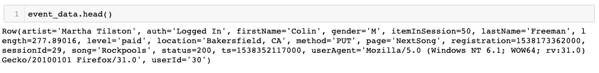

Head of the mini-dataset

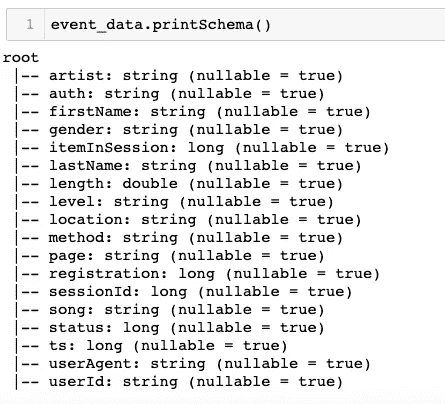

Mini-dataset schema

我们注意到一些重要的事情:

*   有两种类型的列:数值型和分类型
*   性别有空值->我们应该去掉相应的行，因为这些行很可能与任何用户都没有关联(我们希望基于用户的行为建立预测！)
*   userId 有一个空字符串作为值->我们应该去掉相应的行
*   用户代理和方法似乎不是需要考虑的相关特性
*   auth 有一个取消状态，这在以后查看流失率时会很有用
*   唯一用户的**数量(226)和唯一位置的【115】倾向于表明人口广泛分布在多个城市**,并且该特征对于预测流失可能没有很大的价值(我们将在更深入地探索数据集时确认这一点)
*   看起来**数据集的绝大部分是由动作“NextSong”(大约 80%)** 组成的。并且仅当页面列中的值是“NextSong”时，才填充艺术家和歌曲列。然而在剩下的 20%的行中(升级，首页，…)我们不期望找到艺术家或歌曲—这代表大约 57000 行。

现在让我们关注缺失或无效的数据。

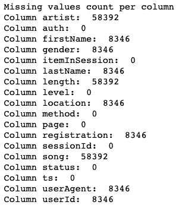

Count of missing values per column of the mini-dataset

大约 8346 行不包含 userId 或 sessionID，因此对我们的预测目标没有用处。这个数量的行**表示不到数据集的 3%** ，所以我们可以简单地**删除**它们。
请注意，艺术家和歌曲这两列缺少更多的值。这是因为记录的性质不仅仅是播放一首歌曲，还包括登录服务、转到主页……正如我们看到的，大约 20%的行没有艺术家或歌曲值。

这个清洁步骤相当简单:

*   我们希望预测用户是否会流失，所以我们需要只保留与用户相关联的行>,我们删除 UserId 列中具有空值的行
*   我们希望能够观察用户行为的演变，因此时间信息是强制性的>我们将时间戳列转换为几个时间列(年、月、日、星期几、小时、周数)

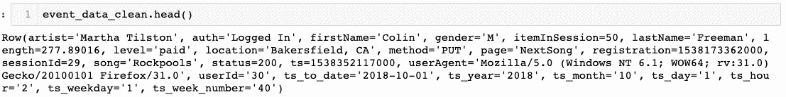

Head of the cleaned mini-dataset

最后，我们必须定义**流失意味着什么**。这里有两种方法:

*   预测用户何时离开服务——使用给定用户的“取消确认”操作来定义
*   预测付费用户何时降级到免费服务——由“提交降级”定义

在本文的剩余部分，我们将同时研究这两种方法。因此，我们构建了一个包含两个新标签列的中间数据集，每个标签列对应一种流失类型。

## 数据探索

一旦我们有了一个干净的数据集，我们就可以开始熟悉数据所讲述的故事。
为了能够绘制这些图表，我们需要对数据进行一些转换。对于几乎每个绘图，我们都定义了几个熊猫数据帧(我们使用 Plotly 来呈现图形，并且我们需要一个熊猫数据帧作为输入)。

另请注意，当我们谈论平均值时，除非明确指定，否则它是在整个迷你数据集上计算的，因此对于该数据集中可用的两个月的数据。

以下是一些最相关的情节和我们从中得出的结论。

**性别的影响**

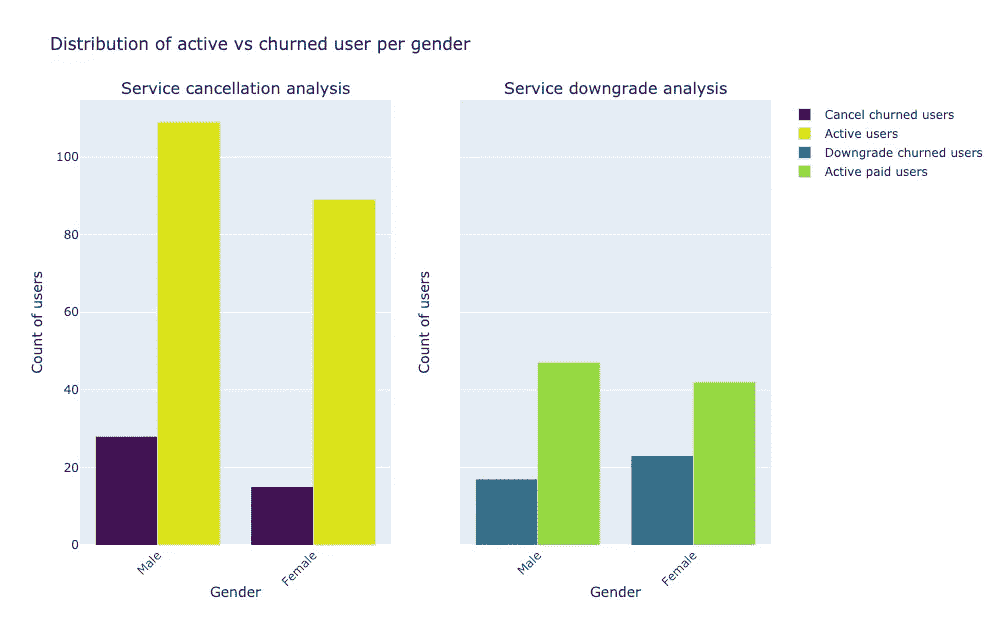

Impact of the gender on the churn probability of a user

乍一看，似乎男性取消服务的比例高于女性，并且性别对预测用户降级没有相关影响。总的来说，这个特性似乎没有带来太多的预测流失，我们将在以后决定我们是否要保留它或不训练我们的模型。

**用户级别(付费/免费)的影响**

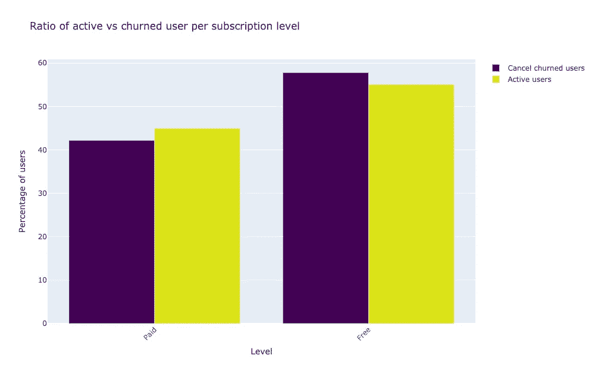

Impact of the subscription level on the churn probability of a user

乍一看，付费用户取消服务的可能性略低。

**用户位置的影响**

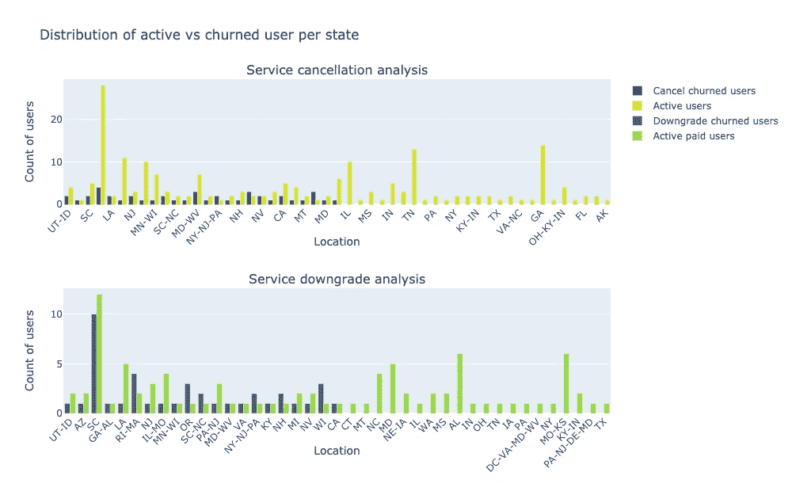

Impact of the location (state) on the churn probability of a user

我们可以在这两个图中清楚地看到一个模式，其中一些州只有活跃用户，没有不稳定的用户。

**每周日均收听歌曲数量的影响**

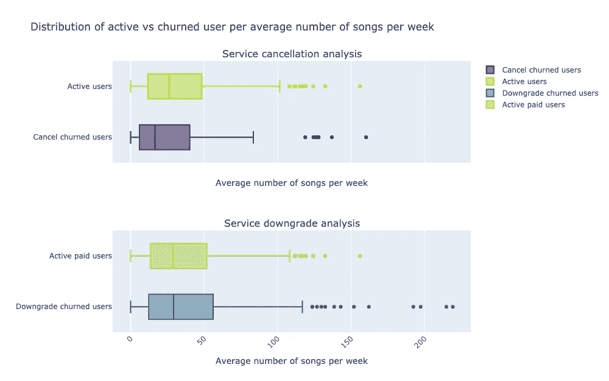

Impact of the daily average number of songs per week on the churn probability of a user

看看每天平均的歌曲数量，看起来是这样的:

*   取消搅动用户的平均值低于活跃用户
*   降级搅动用户的平均值略高于活跃(付费)用户

这种趋势也可以通过每周拇指上下的次数来观察。

**不同艺术家平均收听人数的影响**

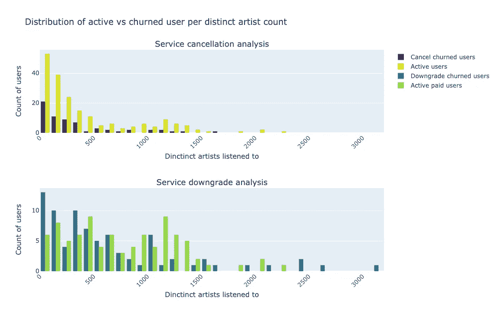

Impact of the number of distinct artists on the churn probability of a user

在这两种情况下，活跃用户似乎比不活跃的用户听更多种类的艺术家的音乐。

**平均重复收听次数的影响**

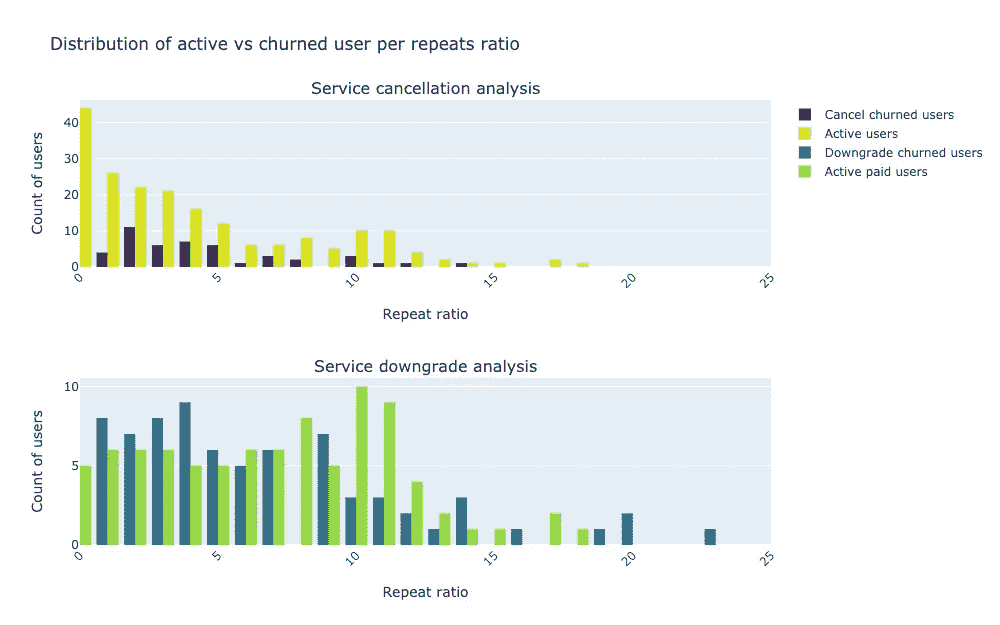

Impact of the repeat ratio on the churn probability of a user

在服务取消方面，活跃用户的歌曲重复率似乎高于不活跃用户。但是，看看服务降级，趋势就不那么明显了！

**平均收听广告数量的影响**

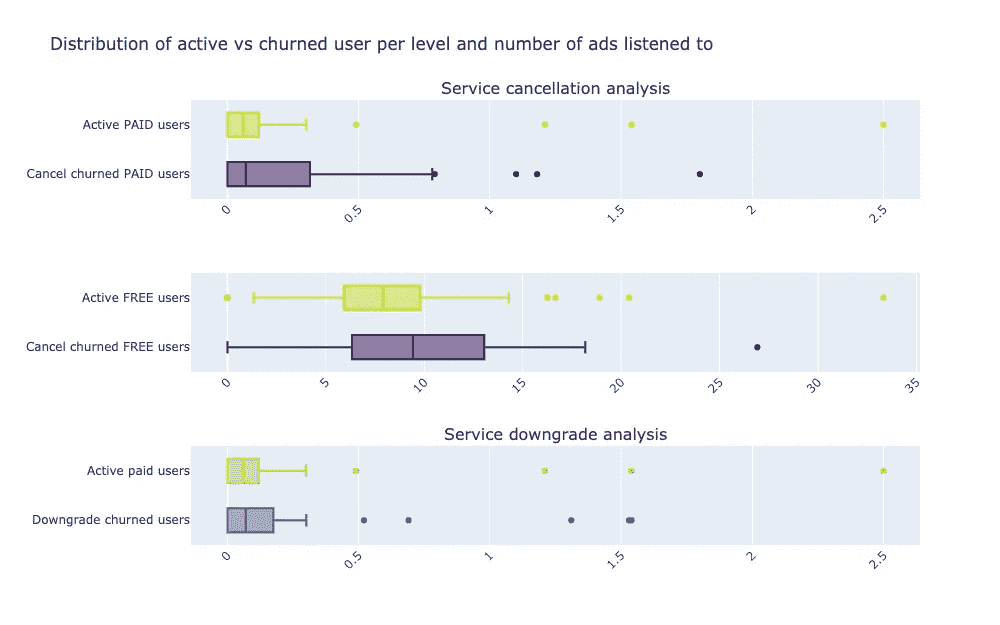

Impact of the number of ads on the churn probability of a user

我们可以观察到两种趋势:

*   与活跃用户相比，经常翻唱歌曲的用户平均会听更多的广告
*   免费用户听的广告比付费用户多 10 倍以上

**登录次数和两次登录之间时间的影响**

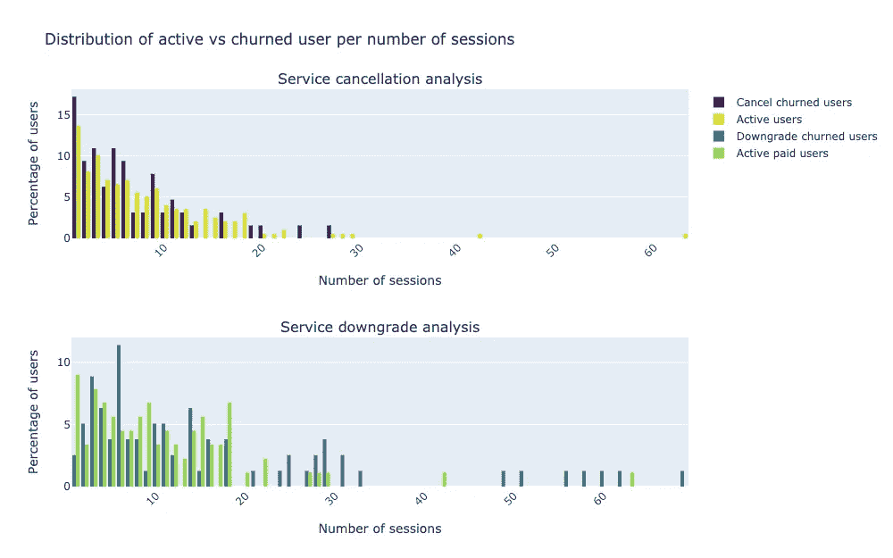

Impact of the number of logins per week on the churn probability of a user

看起来取消搅动的用户比活跃用户连接得少，尽管这种区别并不明显(趋势是大多数取消搅动的用户连接 1 到 13 次，而大多数活跃用户登录 1 到 22 次)。关于降级搅动用户，趋势相当不同——一些搅动用户实际上比活跃付费用户登录次数更多！

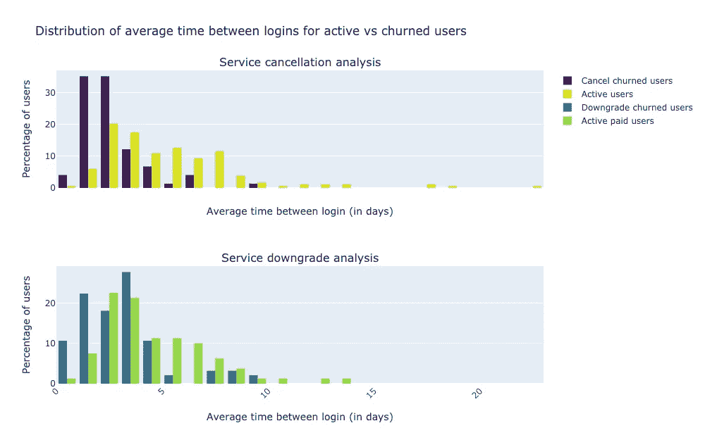

Impact of the time between two sessions on the churn probability of a user

从这张图表中可以看出，搅动的用户实际上比活跃的用户更经常地联系。

**每次会话收听时间的影响**

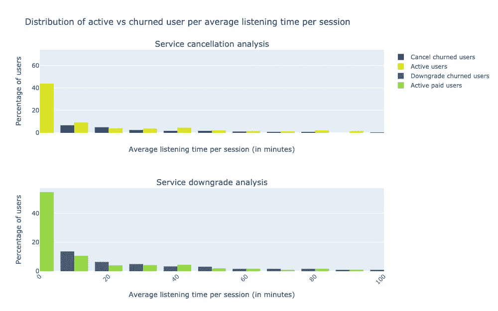

Impact of the listening time per session on the churn probability of a user

请注意，我们从这些图表中删除了异常值(时间戳记录中可能存在异常，因为我们让人们听一首歌超过 52 天！).

我们在这里观察到的是，大多数人每次听音乐的时间不到 20 分钟，而活跃用户往往听得更多。

**活动时间的影响(动作计数)**

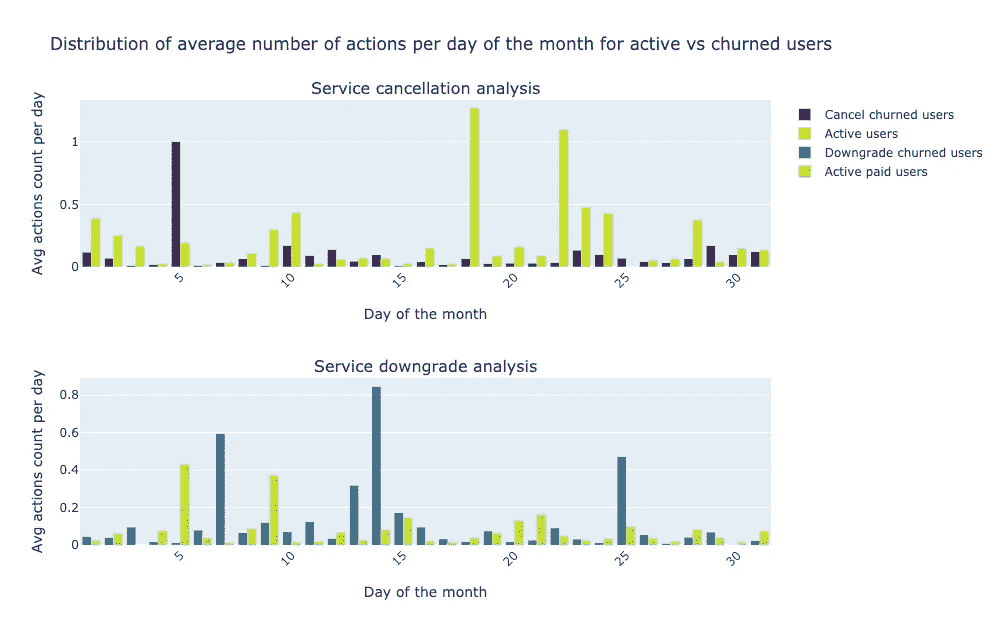

Impact of the activity day of the month on the churn probability of a user

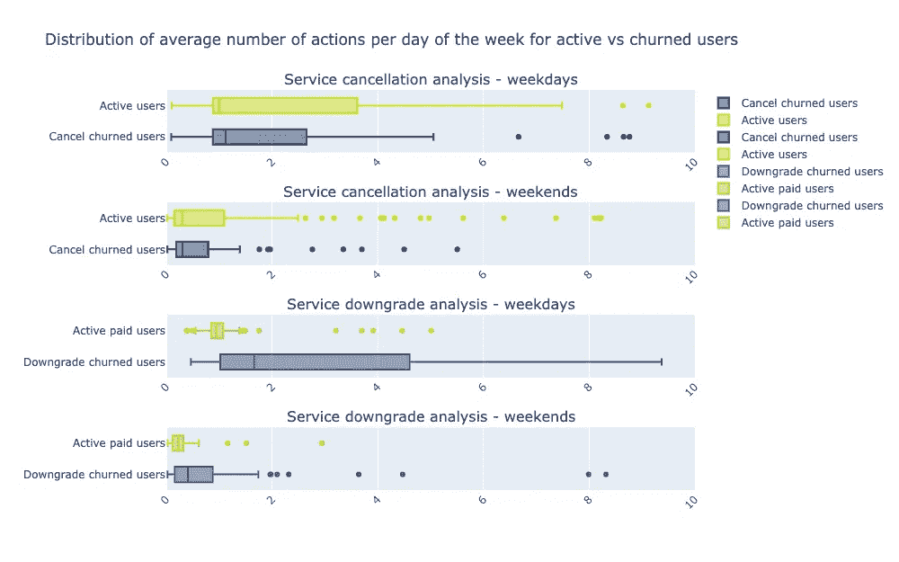

Impact of the activity day of the week on the churn probability of a user

看起来用户在工作日期间明显更活跃，并且平均而言，易激动用户的平均动作数量略高于活跃用户。

**注册、升级和降级事件之间的时间影响**

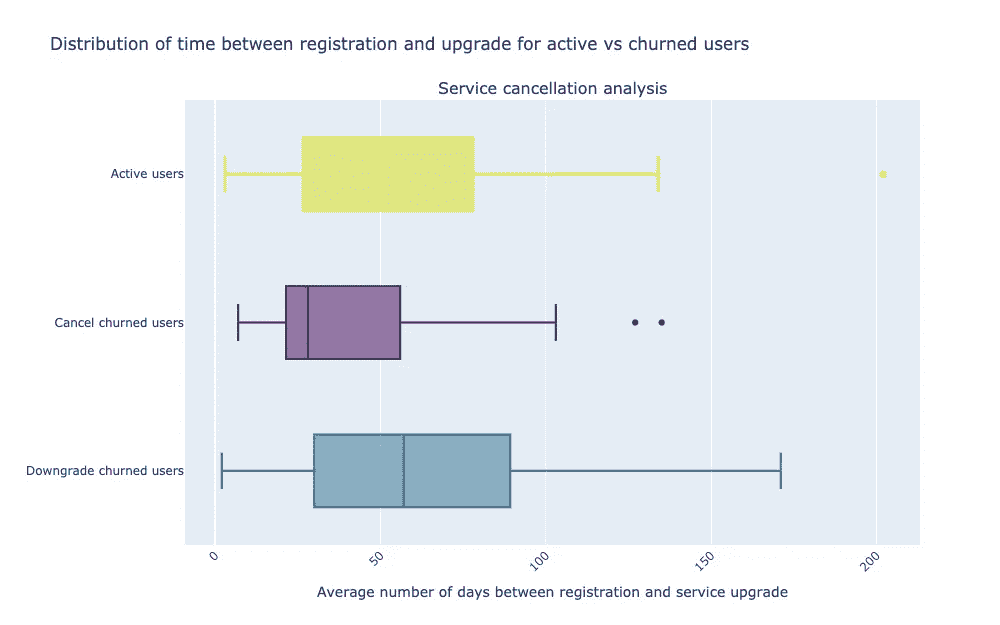

Impact of the time between registration and upgrade on the churn probability of a user

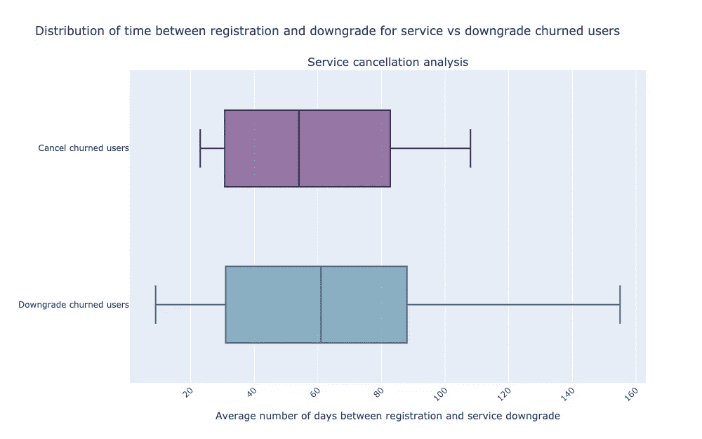

Impact of the time between registration and downgrade on the churn probability of a user

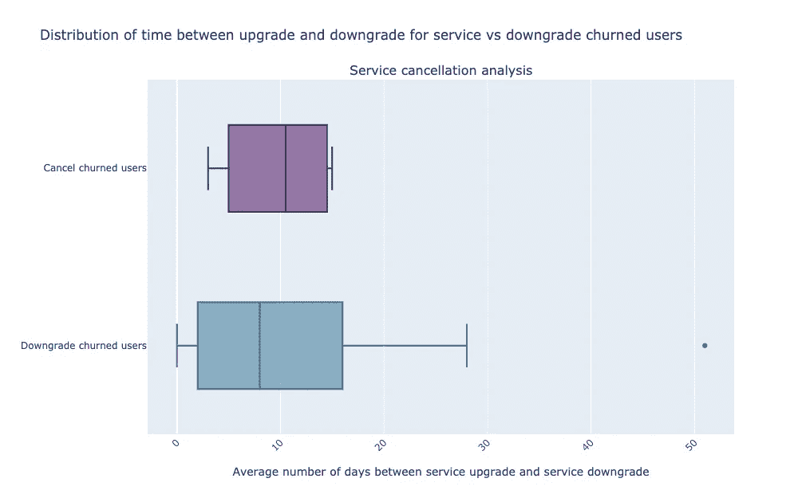

Impact of the time between upgrade and downgrade on the churn probability of a user

我们可以观察比平均水平:

*   服务流失的用户倾向于比活跃或服务降级流失的用户更早升级，这往往表明他们可能对平台有更多的期望
*   服务搅动用户倾向于在注册后比服务降级用户用更少的时间降级，但是在升级他们的服务后用更多的时间

这可以用这样一个事实来解释，即被搅动的用户可能对平台要求更高，尝试付费订阅，但不够满意并离开。而降级用户可能会对该平台如此热情，以至于他们在升级前会等待更长时间，甚至愿意在降级到免费订阅后继续使用它。

## 特征工程

数据探索让我们意识到了一些事情:

*   **活跃用户比不活跃用户更倾向于出现在音乐服务上**(更多的歌曲、重复、歌手……)
*   对于一些指标，降级和取消搅动的用户的行为并不严格相同。碰巧的是**降级的用户似乎比活跃的付费用户更关注这项服务**——他们如此喜欢这项服务，以至于他们实际上会继续使用它，不管作为免费用户的额外限制，比如听更多的广告(他们降级，属于免费活跃用户类别)。
*   注册的**时间可以是用户类型的指标**，也可以是人们活跃的时间(主要是在工作日)——因此用户的概况是不同的，可能是在工作时听音乐的用户，而喝醉的用户是更多休闲时间的用户，可能也更苛刻，因此更容易流失？
*   地点或性别似乎不是相关的标准

现在是时候利用这个探索阶段给出的灵感来设计特性了，来训练一个预测模型。在研究数据时，我们试图记住，每个用户的活动都应该单独考虑，并考虑时间间隔。在设计特征时，我们实际上要更进一步，查看指标随时间变化的**方差**，与较近期的事件(较高)相比，给予较旧事件(较低)不同的权重。

正如我们之前所讨论的，**时间序列数据**极其丰富，因为它允许我们评估**随时间的变化**，并给予较旧事件与最近事件不同的权重。
流程中这一步的重点是构建一个数据框架，我们可以将它作为输入传递给我们的分类模型。该输入数据帧将包含一组功能，这些功能是根据一段时间内的用户行为摘要构建的，具有一周聚合逻辑。基本上，每行将描述一个用户一周的行为，包括计算一周与下一周之间的偏差。因此，如果用户交互了 4 周，我们将在工程数据集中有 4 行，每个较新周的偏差特征都考虑了前几周的值。

这些偏差计算旨在观察用户行为的变化，**与最近的事件相比，给予较旧的事件不同的权重**。然而，由于我们最初不能说哪个权重更好，我们将考虑多种情况，将逻辑定义为能够调整这些权重(例如，我们可以尝试为最近/较旧的权重设置 0.8/0.2、0.5/0.5、0.6/0.4，这意味着最近的事件占值的 80%，较旧的事件占 20%)。

我们将关注的不同特性包括自注册以来的时间、歌曲数量、不同艺术家、重复次数、广告、登录次数、登录间隔时间、每次会话的收听时间，以及与前一周相比所有这些计数的变化。

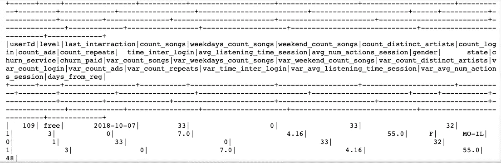

Head of a summary using the 80/20 deviation ratio

为了处理这个逻辑，我们定义了:

*   一个类负责为特定的一周建立每个用户的**摘要**
*   一个类负责把新一周的总结与之前已经建立的总结整合在一起——每周一次添加一个，使用不同的偏差比率
*   函数**编码**分类特征和**缩放**数字特征，因为我们有非常不同比例的特征

请注意，每次更新摘要时，我们都会保存它。为了用新的一周更新它，我们加载已保存的摘要，计算偏差，并在再次保存它之前为每个用户向已加载的摘要添加一个新行。
我们不保存缩放后的模型，因为每次追加新行时，缩放步骤都需要对整个摘要进行重新计算。该步骤仅在需要时执行，在给模型供料之前。

在此过程的最后，我们保存了每个偏差比率的摘要(因此在微型数据集数据上总共保存了 3 个摘要)。

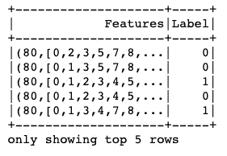

Dataframe that can be used to train a machine learning model

## 建模

我们正在处理一个分类问题。为此，我们将比较三种不同的模型:逻辑回归、随机森林和梯度提升树。

此分析阶段的目的是:

*   用偏离比来定义更有意义
*   超参数调整后选择性能最佳的模型

如果您还记得上面的内容，我们构建了两个数据框架:一个包含服务流失标签，另一个包含降级流失标签。让我们对这两种情况进行分析和预测。

**服务流失预测**

如果我们首先看一下偏差率的影响，这是我们在没有任何超参数调整的情况下得到的 F1 分数。

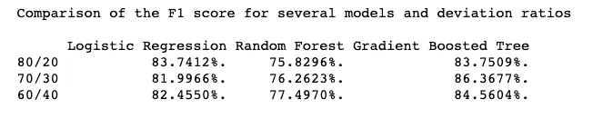

F1 score of three models trained with their default hyperparameters on three datasets with different deviation ratios

我们可以注意到:

*   一般来说，60/40 的比例没有其他两个比例的效果好
*   总的来说，80/20 的比率对于表现更好的两个模型(逻辑回归和梯度提升树)来说获得了最好的结果

在用 ParamGrid 运行 CrossValidator 之后，我们发现最佳组合是**梯度提升树**，带有{'maxDepth': 3，' maxBins': 50，' maxIter': 250，' stepSize': 0.1}，在 **70/30 偏差比率**上，F1 得分为 87%。在验证集上运行后，我们得到了 83%的最终分数。

让我们在这里注意，在如此小的数据集上进行训练会对我们观察到的整体准确性产生影响！

**降级流失预测**

我们执行了完全相同的步骤，以下是我们得出的结论:

*   逻辑回归和梯度增强树的表现优于随机森林
*   两个偏差比率 80/20 和 70/30 也比 60/40 表现得更好
*   使用 CrossValidator 和 ParamGrid，我们得出结论，最佳组合是**梯度提升树**，具有{'maxDepth': 3，' maxBins': 50，' maxIter': 250，' stepSize': 0.1}，在 **70/30 偏差比率**上，F1 得分为 87%。在验证集上运行后，我们得到了 83%的最终分数。

## 结论

该分析的目的是预测流媒体音乐服务的用户流失，我们有一个时间序列数据集，其中包括该服务用户的时间戳操作。

我们选择了两种不同的客户流失定义:服务客户流失，也就是用户离开服务；降级客户流失，也就是用户降级到免费订阅。

在数据清理的初始阶段之后，接着是探索性分析，我们设计了能够训练分类器的特征。利用时间序列数据的全部潜力，我们选择包括携带用户行为随时间变化的信息的特征。我们每周为每个用户构建一个摘要，一些特性是基于用户与服务交互的前一周的值来计算的。
使用一种简单的方法来衡量旧事件和新事件，我们尝试了几种偏差率(80/20、70/30、60/40)。

建模阶段的重点是测试模型的几种组合(逻辑回归、梯度推进树和随机森林)、偏差率和每个模型的超参数。为了评估我们的模型的性能，我们决定查看 F1 分数，因为这一指标对我们面临的阶级不平衡不太敏感(在我们处理的数据集中，有 20%以上的用户实际上发生了变化)。

我们的结论如下:
-对于服务流失，最佳组合似乎是梯度提升树，具有{'maxDepth': 3，' maxBins': 50，' maxIter': 250，' stepSize': 0.1}，偏差比率为 70/30，F1 得分为 83%，最高为 87%。
-对于降级流失，最佳组合似乎是梯度提升树，具有{'maxDepth': 3，' maxBins': 50，' maxIter': 250，' stepSize': 0.1}，偏差比率为 80/20，F1 得分为 81–82%。

从那时起，我们已经可以预见进一步的工作和改进:

*   改进我们衡量旧事件和新事件的方式
*   在更大的数据集(完整数据集)上测试模型，并观察性能和结果的变化
*   扩展工作以预测用户何时会流失(例如使用卡尔曼滤波器)
*   将代码转换成可以部署到任何 spark 环境的脚本
*   实施一个管道，利用新的每周数据自动重新计算预测，每周任务是重新计算摘要，重新训练模型，并根据最新日志报告潜在的变动
*   在 AWS 集群上部署这段代码

所有这些都是潜在的方向，将在其他帖子中进行描述！敬请期待！

*下面的* [*Github 资源库*](https://github.com/acoullandreau/capstone_sparkify) *中有我所有的代码，跟着 Jupyter 笔记本中的方法走吧！*