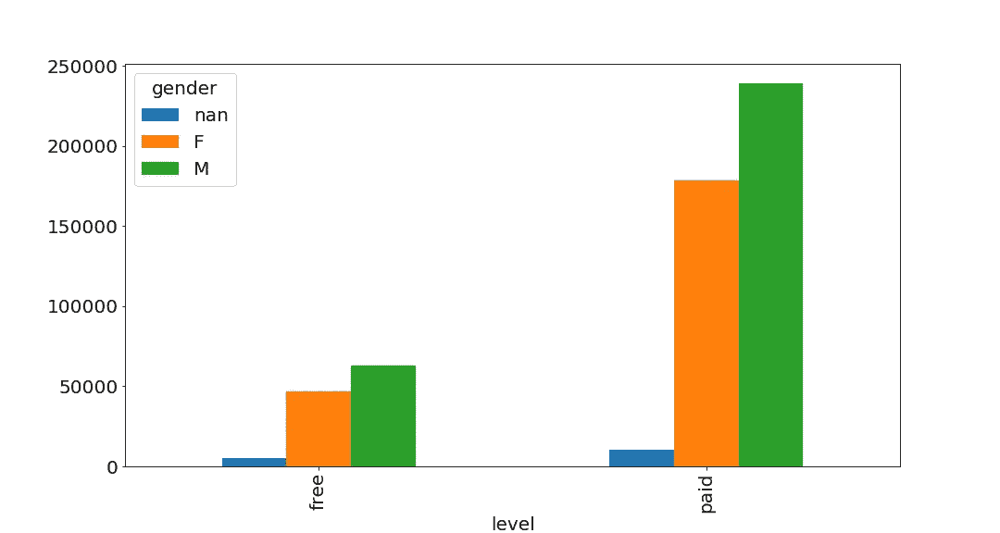
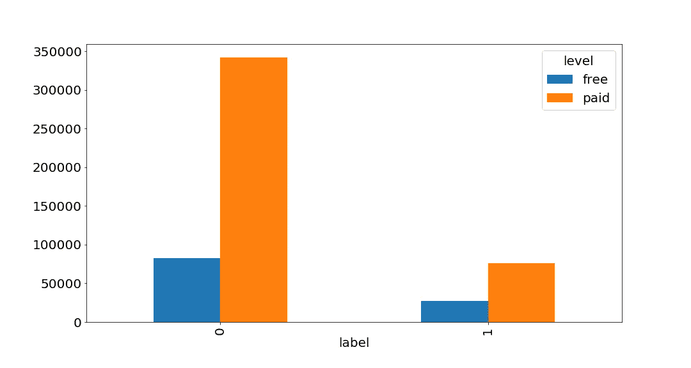
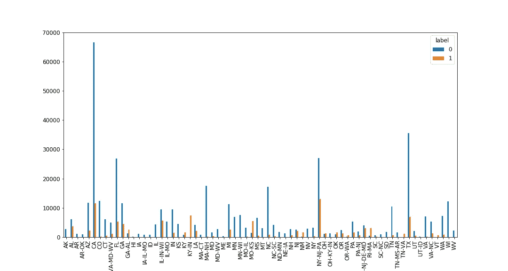
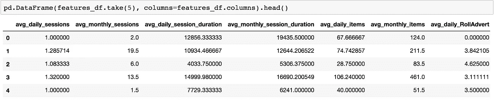

# Sparkify 用户流失预测

> 原文：<https://towardsdatascience.com/sparkify-user-churn-prediction-eff0868c5554?source=collection_archive---------35----------------------->

音乐是我们生活中重要的一部分。众所周知的事实是，如果你在免费层，你将无法逃脱广告打断你的会话。这难道不令人沮丧吗？:)是...


[https://imgflip.com/i/3bx9on](https://imgflip.com/i/3bx9on)

客户参与、保持和流失一直是企业的重要课题。预测分析有助于企业采取主动行动，如提供优惠和折扣，以留住客户，并在某些情况下提高忠诚度。如今，我们产生了大量可用于此类分析的数据，数据科学对公司来说变得非常重要。

Sparkify 是由 Udacity 创建的虚拟音乐流媒体应用程序。对于这个项目，我们给出了小型、中型和大型的应用数据。我在 AWS EMR 上使用 Spark 处理过中等规模的数据。

github:[https://github . com/elifinspace/spark ify/blob/master/readme . MD](https://github.com/elifinspace/sparkify)

## 探测

考虑到 ML，数据集相对较小，它有 543705 行和 18 列，包含客户信息(性别、姓名等。)和 API 事件(登录、播放下一首歌等。).

数据集从 2018 年 10 月 1 日到 2018 年 12 月 1 日。在这个数据集中，流失的客户数量是 99，客户总数是 449。相对于顾客总数来说，翻炒者的数量可能看起来很少，但当你想到这一点时，它就很大了。Sparkify 流失了 22%的客户！

以下是一些从初步调查中挑选出来的图片:



All customers event count free/paid distribution by gender

我们可以看到男性客户使用 Sparkify 活跃，付费客户比免费用户活跃。



从上面的图表我们可以得出结论，付费用户比免费用户流失更多。(标签=1 次流失)

有趣的是，状态也显示出对搅动的影响:



Churn count by States

## 特征工程

数据集包含了相当多的信息，我可以想到许多组合和计算来提取有用的信息。因此，我选择使用页面事件的每日和每月平均值(下一首歌，广告，..)、不同的会话、会话持续时间、项目以及项目的长度。我还添加了一些数字特征，比如注册后的时间。



A screenshot of features data frame

生成特征后，还要进行后处理，以便为建模准备数据。分类列需要编码，数字列必须在管道中组装。pyspark.ml 为我们提供了这些功能，您不需要自己进行热编码。

我使用 stringIndexer 为每个分类列创建索引(将标签的**字符串**列编码为标签索引列)，VectorAssembler 是一个特征转换器，它将多个列组装(合并)为一个(特征)向量/列。[1]这些是作为阶段添加到管道中的，我们将对其进行数据拟合。代码和细节可以在开头提到的 Github 资源库中找到。

## 培训、指标和调整

我们的问题是预测哪些用户可能流失，哪些不会，所以本质上这是二元分类。

用正确的度量标准评估模型是很重要的。对于这项工作，当我选择正确的模型时，我选择以下指标:
# f1 得分:解释模型的稳健性和精确性。

# AUC:表示模型能够区分类别的程度，以及分类器将随机选择的正例排序高于随机选择的负例的概率。

对我们来说，对没有流失的客户进行正确分类很重要，否则我们可能会采取错误的行动，或者我们可能会采取不应该采取的行动，这可能会让客户感到困惑。

从简单到复杂的模型开始，对逻辑回归、随机森林分类和梯度推进分类器的 f1 得分和 AUC(ROC 曲线下面积)进行了比较:

```
logistic_regression
The F1 score on the test set is 79.83%
The areaUnderROC on the test set is 67.17%random_forest_classifier
The F1 score on the test set is 87.81%
The areaUnderROC on the test set is 95.08%gradient_boosting_classifier
The F1 score on the test set is 85.68%
The areaUnderROC on the test set is 88.83%
```

我选择了随机森林模型，并应用了基于 f1 分数的超参数调整:

网格搜索方式:

```
paramGrid = ParamGridBuilder() \
    .addGrid(clf.numTrees, [20,75]) \
    .addGrid(clf.maxDepth, [10,20]) \
    .build()
```

结果:

```
The F1 score on the test set is 91.03%
The areaUnderROC on the test set is 93.25%
```

最佳参数:

```
maxDepth:10numTrees:75
```

因此，我们可以通过选择这些参数来改善我们的管道。

准确率和 f1 成绩都相当惊人。然而，我们不应该忘记，我们的数据集可能无法代表所有的客户群，我已经使用了中等规模的数据集。此外，在实际应用中，70%以上的精度被认为是良好的和可接受的。

最后，当我们检查功能的重要性，级别(免费/付费)，注册以来的时间，每月平均滚动广告似乎是最重要的 3 个功能，这并没有让我感到惊讶。总是这些广告！… :)

```
avg_daily_sessions : 0.04236219536508317 

avg_monthly_sessions : 0.03951447819898451 

avg_daily_session_duration : 0.02073779077811611 

avg_monthly_session_duration : 0.016396278628309786 

avg_daily_items : 0.020040353630460424 

avg_monthly_items : 0.022926933384472603 

avg_daily_RollAdvert : 0.019136923054740844
....
```

## 结论

Spark 的机器学习使我们能够处理大量数据，获得洞察力，并以可扩展的方式从结果中制定行动。使用大型数据集时，配置环境参数也非常重要，还应考虑模型的准确性、运行时内存使用和资源优化。在实际应用中，可行性和成本变得非常重要。这种模式可以每周或每月运行一次，具体取决于数据延迟和业务需求。应监控运营成本，并通过测试(A/B 测试)验证模型结果。应该跟踪实验结果(评估指标、KPI ),以便我们的模型和后续行动能够为业务带来价值。

【1】:[https://spark.apache.org/docs/2.2.0/ml-features.html](https://spark.apache.org/docs/2.2.0/ml-features.html)