# 使用 Pyspark 进行用户流失预测

> 原文：<https://towardsdatascience.com/sparkify-user-churn-prediction-using-pyspark-32be364e8296?source=collection_archive---------13----------------------->

## 预测本地机器和 AWS EMR 上的音乐流服务用户流失。


[Designed by Freepik](http://www.freepik.com)

# 概观

用户流失(取消)预测是一个必要的预测工具。这个项目旨在为音乐流媒体服务 Sparkify 解决这个问题。通过探索 Sparkify 使用数据，该项目确定了模型学习的功能。出于计算效率的原因，一个极小的数据集(240Mb)，即完整数据集(12Gb)的样本，用于在本地机器上进行初始数据探索、特征工程和建模实验。

对微小数据集的初始工作将为完整数据集确定最合适的模型和超参数，以训练最终模型。一旦确定了特征和模型，它们将用于在 AWS EMR 上建立完整数据集的模型。假设样本数据集代表总体数据集，则由样本数据集调整的超参数将很好地一般化，并且也适用于在完整数据集上建模。我们将会看到这种假设是否有助于节省一些计算资源，而不必在大数据上进行网格搜索。

从流失预测中获得的可操作的洞察力将识别可能流失的用户，并向他们发送优惠，希望阻止他们点击取消确认。

# 探索性数据分析

下面的数据集模式显示了可用于要素工程的数据集结构和列。从 EDA 中，我们将确定需要设计哪些特性。

```
root
 |-- artist: string (nullable = true)
 |-- auth: string (nullable = true)
 |-- firstName: string (nullable = true)
 |-- gender: string (nullable = true)
 |-- itemInSession: long (nullable = true)
 |-- lastName: string (nullable = true)
 |-- length: double (nullable = true)
 |-- level: string (nullable = true)
 |-- location: string (nullable = true)
 |-- method: string (nullable = true)
 |-- page: string (nullable = true)
 |-- registration: long (nullable = true)
 |-- sessionId: long (nullable = true)
 |-- song: string (nullable = true)
 |-- status: long (nullable = true)
 |-- ts: long (nullable = true)
 |-- userAgent: string (nullable = true)
 |-- userId: string (nullable = true)
```

“流失”标签是通过识别确认其订阅取消的用户从数据集生成的。一旦识别出被搅动的用户，我们就可以看到它如何与数据集中的其他列一起工作:

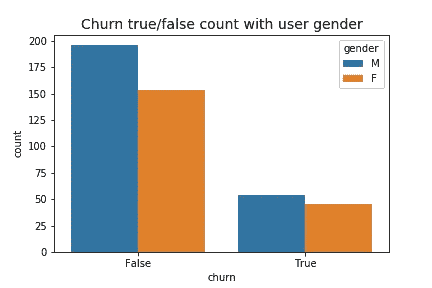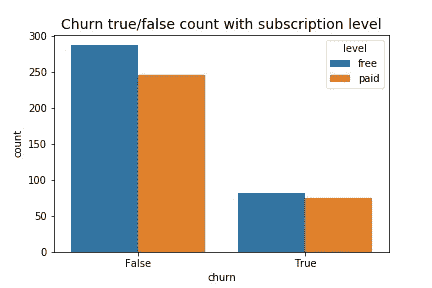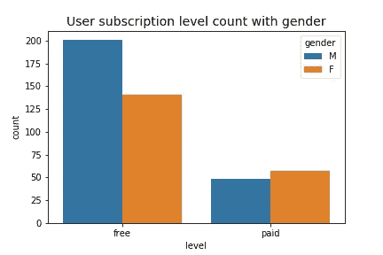

Figure 1a, 1b and 1c

从上面的柱状图中，3 个主要数据列(客户流失状态、订阅水平和性别)进行了不同的排序，我们可以看到数据向一端倾斜，因此分布相当不均匀。非流失用户比流失用户多得多，性别和订阅水平也是如此。这是模型学习和度量选择需要注意的重要一点。

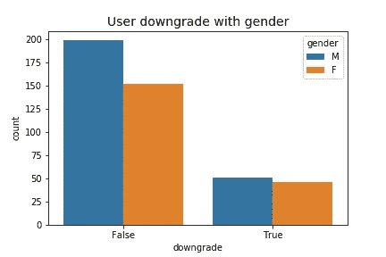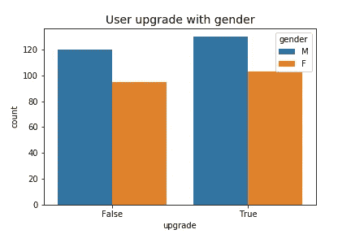

Figure 2a and 2c

图 2a 和 2c 显示用户升级比用户降级分布更均匀。


Figure 3

用户位置分布很广，几乎在所有位置都很稀疏。除非位置可以被分组到地理位置的类别中，否则这可能对建模没有帮助。直观地说，我们可以从位置的最后两个字符中提取州代码来创建州的分类特征。

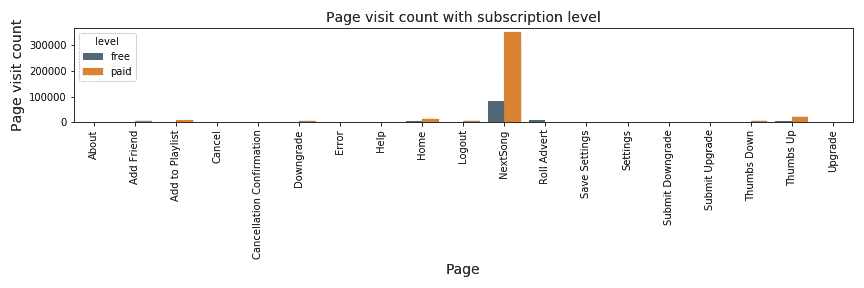

Figure 4a

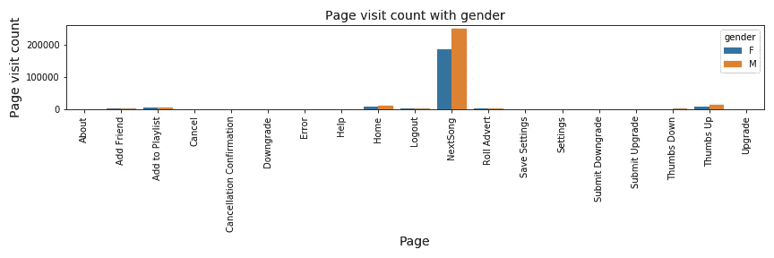

Figure 4b

页面访问也严重偏离了大多数互动集中的“NextSong”。去掉这个，用户页面交互分布本来可以更明显。捕捉用户行为的页面可能是“添加朋友”、“添加到播放列表”、“取消确认”(用于“流失”标签生成)、“降级”、“滚动广告”(有助于广告显示洞察)、“提交降级”、“提交升级”、“拇指向下”和“拇指向上”。其中，“添加朋友”和“添加到播放列表”将被用于功能工程。其他列可能有助于预测，而不是流失。


Figure 5

按照一天中的小时来累计用户数量，流媒体服务看起来会在深夜到午夜之后有更多的用户。然而，用户流失在一天中的不同时段看起来没有明显的趋势。

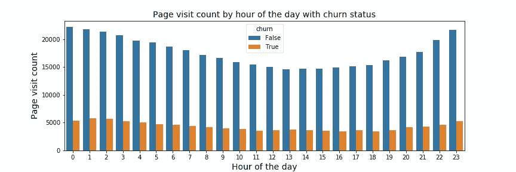

Figure 6

按一天中的小时排列的页面访问与其用户计数相似，具有更显著的趋势。

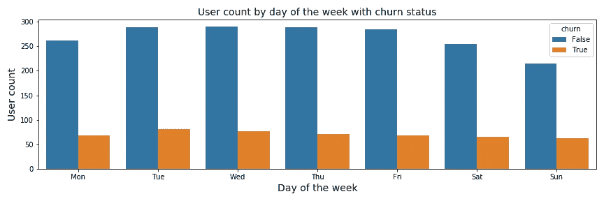

Figure 7

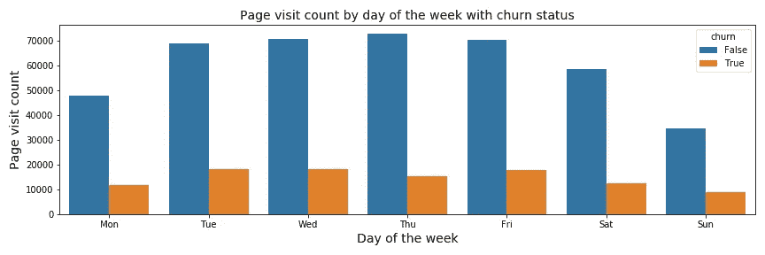

Figure 8

一周中的一天图显示了工作日期间更多的用户参与。

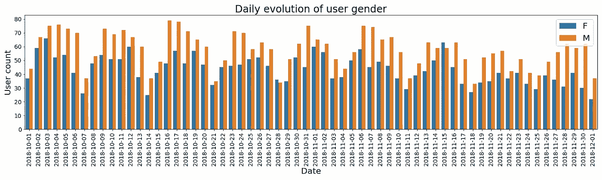

Figure 9

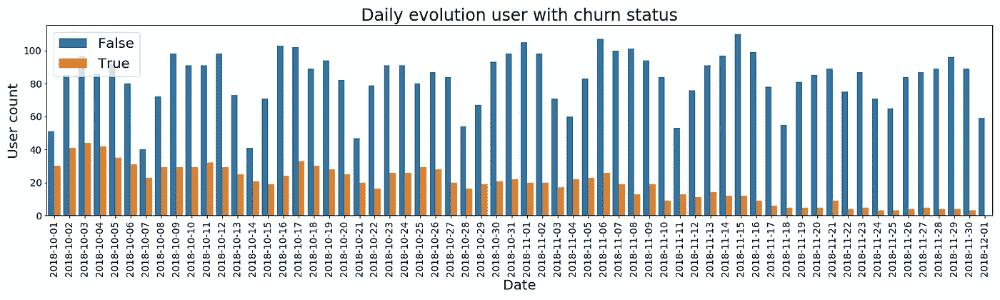

Figure 10

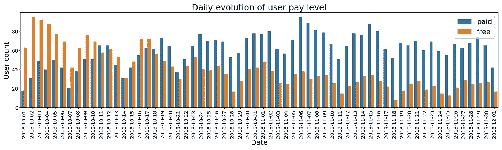

Figure 11

除了按天或小时汇总数据，我们还可以查看趋势如何在数据集期间演变。虽然这个微小的数据集只有两个月的数据可供探索，但这里揭示的见解相当有趣。它的周期性趋势与用户在周中更多参与的工作日图一致。它还显示了用户行为在两个月内的变化:更少的流失和更多的升级。我们需要更多的信息来了解现有用户和新用户的升级数量及其原因。

如果计算资源允许，在整个数据集中观察这种趋势如何演变将会更加有趣。

# 特征工程

经过探索性的数据分析，10 个假设在决定用户流失中发挥作用的特征被设计出来。接下来，作为模型训练结果的特征重要性将决定全数据集建模采用什么模型和特征。

因此，Spark 数据帧由 10 个特征和 1 个标签组成:

1.  性别(二元)
2.  付费或免费(二进制)
3.  收听的歌曲总数(数字)
4.  收听的艺术家总数(数字)
5.  用户添加的播放列表中的歌曲数量(数字)
6.  用户添加的好友数量(数字)
7.  收听时间的总长度(数字)
8.  每次播放的平均歌曲数量(数字)
9.  每次会话的平均时间(数字)
10.  每个用户的会话数(数字)
11.  标签:每个用户的会话数(二进制)

数据帧被分成 80%用于训练，20%用于测试。

# 建模

通过对训练集的三重交叉验证和对四个分类器的最佳超参数的网格搜索来完成建模。通过评估结果和每个分类器的特征重要性来识别最佳模型:

1.  逻辑回归

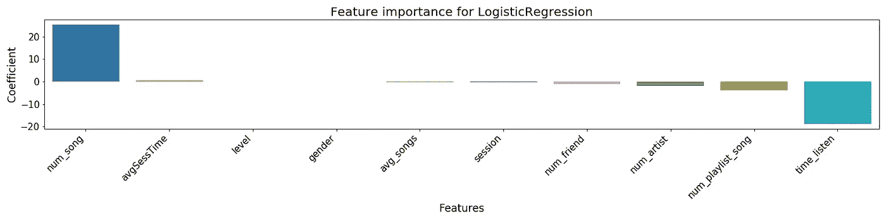

Figure 12

```
Evaluation result (With GridSearch):
+---------+------+------+--------+
|precision|recall|    f1|accuracy|
+---------+------+------+--------+
|   0.6684|0.7606|0.6753|  0.7606|
+---------+------+------+--------+
Training time 19.93 minutesEvaluation result (Without GridSearch):
+---------+------+------+--------+
|precision|recall|    f1|accuracy|
+---------+------+------+--------+
|   0.6684|0.7606|0.6753|  0.7606|
+---------+------+------+--------+
Training time 10.31 minutes
```

2.决策图表

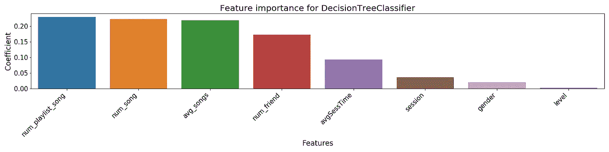

Figure 13

```
Evaluation result (With GridSearch):
+---------+------+------+--------+
|precision|recall|    f1|accuracy|
+---------+------+------+--------+
|    0.738|0.7746|0.7351|  0.7746|
+---------+------+------+--------+
Training time 11.05 minutesEvaluation result (Without GridSearch):
+---------+------+------+--------+
|precision|recall|    f1|accuracy|
+---------+------+------+--------+
|   0.7355|0.7746|0.7134|  0.7746|
+---------+------+------+--------+
Training time 8.49 minutes
```

3.梯度增强树

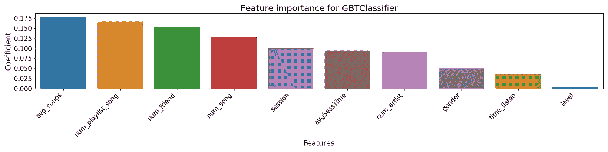

Figure 14

```
Evaluation result: (With GridSearch)
+---------+------+------+--------+
|precision|recall|    f1|accuracy|
+---------+------+------+--------+
|   0.8611|0.8662|0.8622|  0.8662|
+---------+------+------+--------+
Training time 187.47 minutesEvaluation result (Without GridSearch):
+---------+------+------+--------+
|precision|recall|    f1|accuracy|
+---------+------+------+--------+
|   0.8346| 0.838|0.8158|   0.838|
+---------+------+------+--------+
Training time 11.74 minutes
```

4.随机森林

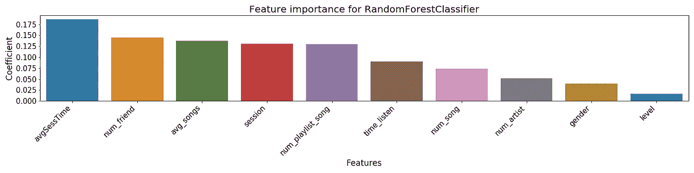

Figure 15

```
Evaluation result: (With GridSearch)
+---------+------+------+--------+
|precision|recall|    f1|accuracy|
+---------+------+------+--------+
|   0.8387|0.7958|0.7277|  0.7958|
+---------+------+------+--------+
Training time 11.36 minutesEvaluation result (Without GridSearch):
+---------+------+-----+--------+
|precision|recall|   f1|accuracy|
+---------+------+-----+--------+
|   0.8258|0.7746|0.683|  0.7746|
+---------+------+-----+--------+
Training time 9.23 minutes
```

采用 F1 分数作为模型选择的标准，因为它同时考虑了召回率和精确度。数据集具有不成比例的标注和二进制要素分布。F1 分数将确保我们的模型不会被错误分类的[混淆矩阵](/understanding-confusion-matrix-a9ad42dcfd62)混淆:对具有 95%真标签的数据集进行 100 %真分类以实现 95%的准确率，这与 5%的假阳性无关。

F1 得分为 0.8622，梯度推进树被选择用于使用以下超参数对大型数据集进行建模:

> 最佳 _ 模型。_java_obj.getMaxDepth() = 8
> 
> 最佳 _ 模型。_java_obj.getMaxIter() =30
> 
> 最佳 _ 模型。_java_obj.getMaxBins() = 40

通过 3 个 AWS EMR m3.xlarge 实例训练大型数据集花费了大约 160 分钟，并在其测试集上产生了以下评估结果:

```
Evaluation result:
+------+------+---------+--------+
|    f1|recall|precision|accuracy|
+------+------+---------+--------+
|0.7254|0.7868|   0.7444|  0.7908|
+------+------+---------+--------+
```

# 微小数据与大数据

## 计算复杂度

由于不同学习、优化甚至数据争论算法的[计算复杂性](https://en.wikipedia.org/wiki/Computational_complexity)的差异，在小数据集和大数据集上执行任务会在时间和资源上造成显著差异。因此，有必要对各种算法的计算复杂性有一个很好的认识，以便在任务分配中有一个好的判断(本地与分布式计算)。

在云中执行探索性数据分析(EDA)的成本很高。像这样的大型数据集上的综合 EDA 将很容易花费每回合 25 美元的 EC2 和 EMR 费用。因此，在使用云服务进行建模之前，通过执行本地 EDA，决定大型数据集的哪些内容应该假设，哪些内容不应该假设，从而很好地理解数据集是非常重要的。

## 超参数调谐

在大型数据集上执行网格搜索是一项计算量很大的任务。要在一个大数据集上调优正确的超参数，如果不是 *O* (n 次方)[时间复杂度](https://en.wikipedia.org/wiki/Time_complexity)的问题，很容易就是一个 *O(* n 次方)的问题。对于某些性能权衡，随机搜索可能是更快、更便宜的替代方案。超参数调整的一个更聪明的实现是结合随机搜索和网格搜索:

*   使用大型超参数网格进行随机搜索
*   使用随机搜索的结果，围绕最佳性能超参数值构建一个集中的超参数网格。
*   在缩减的超参数网格上运行网格搜索。
*   在更集中的网格上重复网格搜索，直到超过最大计算/时间预算。

具有和不具有网格搜索比较的超参数调整的比较，上述建模评估结果表明，对于实验的四个分类器，模型性能和计算资源之间的折衷是混合的。在没有网格搜索的情况下，我们节省了几乎一半的逻辑回归训练时间，因为在模型性能改进方面没有差异。对于梯度推进树(GBT ),网格搜索的性能改善是显著的:F1 值为 0.8622(使用网格搜索)对 0.8158(不使用网格搜索)。然而它的计算用网格搜索多花了将近 3 个小时。GBT 无疑是一种高计算复杂度算法，随着数据集大小的增加而呈指数增长。网格搜索是在 240Mb 的数据集上进行的，想象一下如果在 12Gb 的数据集上进行！

相比之下，决策树和随机森林的折衷更加线性，这是在计算需求略有增加的情况下的一个微小的性能改进。因此，通过了解学习算法的计算复杂性，我们可以做出更明智的决定，以实现最佳性能与计算的权衡。

## 特征和标签的统计比较

微小数据集和大数据集生成的特征之间肯定存在一些统计差异(统计比较见下文),因此评估结果也有很大不同:0.862(微小数据集)对 0.725(完整数据集)。下面提供了可能解释模型性能差异的两个数据集:

1.  性别(二元)

```
Tiny dataset >
+-------+-----------------+------------------+
|summary|           userId|            gender|
+-------+-----------------+------------------+
|  count|              448|               448|
|   mean|67520.34821428571|0.4419642857142857|
| stddev|105964.5842848519|0.4971756279079038|
|    min|               10|                 0|
|    max|               99|                 1|
+-------+-----------------+------------------+
+-------------------+-------------------+
|   skewness(gender)|   kurtosis(gender)|
+-------------------+-------------------+
|0.23372261898725685|-1.9453737373737383|
+-------------------+-------------------+Full dataset >
+-------+------------------+-------------------+
|summary|            userId|             gender|
+-------+------------------+-------------------+
|  count|             22278|              22278|
|   mean|1498782.9615764432|0.47697279827632644|
| stddev| 288851.8472659188| 0.4994806768184825|
|    min|           1000025|                  0|
|    max|           1999996|                  1|
+-------+------------------+-------------------+
+-------------------+-------------------+
|   skewness(gender)|   kurtosis(gender)|
+-------------------+-------------------+
|0.09220664431939639|-1.9914979347433575|
+-------------------+-------------------+
```

2.付费或免费(二进制)

```
Tiny dataset >
+-------+------------------+------------------+
|summary|            userId|             level|
+-------+------------------+------------------+
|  count|               691|               691|
|   mean| 67259.47033285093|0.4645441389290883|
| stddev|106161.02506630082|0.4991025734716588|
|    min|                10|                 0|
|    max|                99|                 1|
+-------+------------------+------------------+
+-------------------+-------------------+
|    skewness(level)|    kurtosis(level)|
+-------------------+-------------------+
|0.14218137235745473|-1.9797844573545489|
+-------------------+-------------------+Full dataset >
+-------+------------------+-------------------+
|summary|            userId|              level|
+-------+------------------+-------------------+
|  count|             22278|              22278|
|   mean|1498782.9615764432| 0.5992010054762547|
| stddev| 288851.8472659188|0.49007136327332323|
|    min|           1000025|                  0|
|    max|           1999996|                  1|
+-------+------------------+-------------------+
+-------------------+-------------------+
|    skewness(level)|    kurtosis(level)|
+-------------------+-------------------+
|-0.4025645802550173|-1.8379417587241018|
+-------------------+-------------------+
```

3.收听的歌曲总数

```
Tiny dataset >
+-------+-----------------+------------------+
|summary|           userID|          num_song|
+-------+-----------------+------------------+
|  count|              448|               448|
|   mean|67520.34821428571|1178.5825892857142|
| stddev|105964.5842848519|1380.6279647524054|
|    min|               10|                 3|
|    max|               99|              9767|
+-------+-----------------+------------------+
+------------------+------------------+
|skewness(num_song)|kurtosis(num_song)|
+------------------+------------------+
|2.2993135439060457| 6.814549363048505|
+------------------+------------------+Full dataset >
+-------+------------------+------------------+
|summary|            userID|          num_song|
+-------+------------------+------------------+
|  count|             22278|             22278|
|   mean|1498782.9615764432|1178.7054044348686|
| stddev|288851.84726591856|  5372.95993988227|
|    min|           1000025|                 1|
|    max|           1999996|            778479|
+-------+------------------+------------------+
+------------------+------------------+
|skewness(num_song)|kurtosis(num_song)|
+------------------+------------------+
|135.95349045633083|19660.671563405533|
+------------------+------------------+
```

4.收听的艺术家总数

```
Tiny dataset >
+-------+-----------------+-----------------+
|summary|           userId|       num_artist|
+-------+-----------------+-----------------+
|  count|              448|              448|
|   mean|67520.34821428571|658.9799107142857|
| stddev|105964.5842848519| 625.882698051957|
|    min|               10|                1|
|    max|               99|             3507|
+-------+-----------------+-----------------+
+--------------------+--------------------+
|skewness(num_artist)|kurtosis(num_artist)|
+--------------------+--------------------+
|  1.4675037203781365|  2.2190317071776393|
+--------------------+--------------------+Full dataset >
+-------+------------------+-----------------+
|summary|            userId|       num_artist|
+-------+------------------+-----------------+
|  count|             22261|            22261|
|   mean|1498833.2082116706|645.0307263824626|
| stddev| 288882.1163228876|602.2479741901458|
|    min|           1000025|                1|
|    max|           1999996|             4368|
+-------+------------------+-----------------+
+--------------------+--------------------+
|skewness(num_artist)|kurtosis(num_artist)|
+--------------------+--------------------+
|  1.5260667285754526|   2.656182841474317|
+--------------------+--------------------+
```

5.用户添加的播放列表中的歌曲数量

```
Tiny dataset >
+-------+------------------+------------------+
|summary|            userID| num_playlist_song|
+-------+------------------+------------------+
|  count|               428|               428|
|   mean| 65764.93457943926|28.852803738317757|
| stddev|105363.38578382804|33.913090694566286|
|    min|                10|                 1|
|    max|                99|               248|
+-------+------------------+------------------+
+---------------------------+---------------------------+
|skewness(num_playlist_song)|kurtosis(num_playlist_song)|
+---------------------------+---------------------------+
|         2.4048605508981393|          7.736784413479519|
+---------------------------+---------------------------+Full dataset >
+-------+------------------+-----------------+
|summary|            userID|num_playlist_song|
+-------+------------------+-----------------+
|  count|             21260|            21260|
|   mean|1498898.9698494826|28.12422389463782|
| stddev|289180.40429718536|32.27499039023108|
|    min|           1000025|                1|
|    max|           1999996|              340|
+-------+------------------+-----------------+
+---------------------------+---------------------------+
|skewness(num_playlist_song)|kurtosis(num_playlist_song)|
+---------------------------+---------------------------+
|         2.3914875986095625|          8.073009618134558|
+---------------------------+---------------------------+
```

6.用户添加的好友数量

```
Tiny dataset >
+-------+------------------+------------------+
|summary|            userID|        num_friend|
+-------+------------------+------------------+
|  count|               409|               409|
|   mean|  66368.3716381418|19.772616136919314|
| stddev|106064.01609030597| 22.49443576627283|
|    min|                10|                 1|
|    max|                99|               158|
+-------+------------------+------------------+
+--------------------+--------------------+
|skewness(num_friend)|kurtosis(num_friend)|
+--------------------+--------------------+
|  2.4002649609428586|   7.678714779071942|
+--------------------+--------------------+Full dataset >
+-------+------------------+------------------+
|summary|            userID|        num_friend|
+-------+------------------+------------------+
|  count|             20305|             20305|
|   mean| 1499371.503718296| 18.79655257325782|
| stddev|288830.59626148926|20.747704116295065|
|    min|           1000025|                 1|
|    max|           1999996|               222|
+-------+------------------+------------------+
+--------------------+--------------------+
|skewness(num_friend)|kurtosis(num_friend)|
+--------------------+--------------------+
|  2.3834675795984976|   8.182711524378096|
+--------------------+--------------------+
```

7.收听时间的总长度

```
Tiny dataset >
+-------+-----------------+------------------+
|summary|           userID|       time_listen|
+-------+-----------------+------------------+
|  count|              448|               448|
|   mean|67520.34821428571|240270.49760906256|
| stddev|105964.5842848519|  286257.952604531|
|    min|               10|         131.00363|
|    max|               99|     2019435.10394|
+-------+-----------------+------------------+
+---------------------+---------------------+
|skewness(time_listen)|kurtosis(time_listen)|
+---------------------+---------------------+
|    2.303088337172893|    6.791766280616427|
+---------------------+---------------------+Full dataset >
+-------+------------------+------------------+
|summary|            userID|       time_listen|
+-------+------------------+------------------+
|  count|             22278|             22261|
|   mean|1498782.9615764432|232963.16116480672|
| stddev| 288851.8472659186|273559.41985437507|
|    min|           1000025|          78.49751|
|    max|           1999996|     2807182.33115|
+-------+------------------+------------------+
+---------------------+---------------------+
|skewness(time_listen)|kurtosis(time_listen)|
+---------------------+---------------------+
|    2.439989611449916|    8.466901311178267|
+---------------------+---------------------+
```

8.每次会话的平均歌曲数量

```
Tiny dataset >
+-------+-----------------+-----------------+
|summary|           userId|        avg_songs|
+-------+-----------------+-----------------+
|  count|              448|              448|
|   mean|67520.34821428571|65.61168409976814|
| stddev|105964.5842848519|39.49496566617267|
|    min|               10|              1.0|
|    max|               99|            360.0|
+-------+-----------------+-----------------+
+-------------------+-------------------+
|skewness(avg_songs)|kurtosis(avg_songs)|
+-------------------+-------------------+
| 1.5731533253340253|  6.713093146603137|
+-------------------+-------------------+Full dataset >
+-------+------------------+-----------------+
|summary|            userId|        avg_songs|
+-------+------------------+-----------------+
|  count|             22261|            22261|
|   mean|1498833.2082116706|67.28930119633611|
| stddev| 288882.1163228875|42.00146132153544|
|    min|           1000025|              1.0|
|    max|           1999996|            579.0|
+-------+------------------+-----------------+
+-------------------+-------------------+
|skewness(avg_songs)|kurtosis(avg_songs)|
+-------------------+-------------------+
|  1.736381217684329|  8.096277081017185|
+-------------------+-------------------+
```

9.每次会话的平均时间

```
Tiny dataset >
+-------+-----------------+------------------+
|summary|           userId|       avgSessTime|
+-------+-----------------+------------------+
|  count|              448|               448|
|   mean|67520.34821428571|   267.78884543676|
| stddev|105964.5842848519| 164.3624010530248|
|    min|               10|13.166666666666666|
|    max|               99|            1502.4|
+-------+-----------------+------------------+
+---------------------+---------------------+
|skewness(avgSessTime)|kurtosis(avgSessTime)|
+---------------------+---------------------+
|   1.6431669833905285|    7.153986718436954|
+---------------------+---------------------+Full dataset >
+-------+------------------+------------------+
|summary|            userId|       avgSessTime|
+-------+------------------+------------------+
|  count|             22278|             22278|
|   mean|1498782.9615764432| 276.5377760334103|
| stddev| 288851.8472659185|180.68117321920786|
|    min|           1000025|               0.0|
|    max|           1999996| 5453.363730301772|
+-------+------------------+------------------+
+---------------------+---------------------+
|skewness(avgSessTime)|kurtosis(avgSessTime)|
+---------------------+---------------------+
|   2.8166509927927756|   38.509616923162206|
+---------------------+---------------------+
```

10.每个用户的会话数

```
Tiny dataset >
+-------+-----------------+------------------+
|summary|           userId|           session|
+-------+-----------------+------------------+
|  count|              448|               448|
|   mean|67520.34821428571|13.571428571428571|
| stddev|105964.5842848519| 13.17102391180226|
|    min|               10|                 1|
|    max|               99|                92|
+-------+-----------------+------------------+
+------------------+-----------------+
| skewness(session)|kurtosis(session)|
+------------------+-----------------+
|2.3492597105561734|7.726622405284306|
+------------------+-----------------+Full dataset >
+-------+------------------+------------------+
|summary|            userId|           session|
+-------+------------------+------------------+
|  count|             22278|             22278|
|   mean|1498782.9615764432|20.431726366819284|
| stddev|288851.84726591856|1059.3297847404108|
|    min|           1000025|                 1|
|    max|           1999996|            158115|
+-------+------------------+------------------+
+------------------+-----------------+
| skewness(session)|kurtosis(session)|
+------------------+-----------------+
|149.21426452603328|22266.26341038374|
+------------------+-----------------+
```

11.标签(流失)

```
Tiny dataset >
+-------+-----------------+-------------------+
|summary|           userId|              label|
+-------+-----------------+-------------------+
|  count|              448|                448|
|   mean|67520.34821428571|0.22098214285714285|
| stddev|105964.5842848519| 0.4153723104396363|
|    min|               10|                  0|
|    max|               99|                  1|
+-------+-----------------+-------------------+
+------------------+--------------------+
|   skewness(label)|     kurtosis(label)|
+------------------+--------------------+
|1.3449610206355533|-0.19107985297097096|
+------------------+--------------------+Full dataset >
+-------+------------------+-------------------+
|summary|            userId|              label|
+-------+------------------+-------------------+
|  count|             22278|              22278|
|   mean|1498782.9615764432|0.22457132597181076|
| stddev| 288851.8472659188| 0.4173090731235619|
|    min|           1000025|                  0|
|    max|           1999996|                  1|
+-------+------------------+-------------------+
+------------------+--------------------+
|   skewness(label)|     kurtosis(label)|
+------------------+--------------------+
|1.3200520841972045|-0.25746249500661467|
+------------------+--------------------+
```

# 结论

事后看来，当谈到对大型数据集做出的假设时，我可能会做出正确和错误的混合决定:设计什么功能，在训练中调整什么模型和超参数。回顾过去，对于训练更好的大数据预测模型应该有改进的空间，该模型可以用最少的计算时间和资源产生更有希望的评估结果。其中包括:

1.  在本地机器上进行更多的数据探索和实验，以在整个数据集上获得更精确的建模方法。
2.  在大型数据集中有相当大的统计差异，对整个数据集的超参数调整仍然是必要的。通过平衡网格和随机搜索进行更智能的调优。
3.  测试工程要素之间的共线性，移除共线要素以节省计算资源

对于本项目之外的研究，除了流失预测之外，数据集还可用于识别更多导致(如果不能改善的话)图 9 和图 10 所示的有希望趋势的因素。

这个项目的源代码可以从我的 Github 库中获得。

## 关于客户流失的更多信息:

1.  [使用机器学习预测客户流失:主要方法和模型](https://www.kdnuggets.com/2019/05/churn-prediction-machine-learning.html)altex soft。
2.  [消除流失是增长黑客 2.0](https://blog.markgrowth.com/eliminating-churn-is-growth-hacking-2-0-47a380194a06)
3.  [如何通过预测客户流失来改善基于订阅的业务](https://neilpatel.com/blog/improve-by-predicting-churn/)Neil Patel