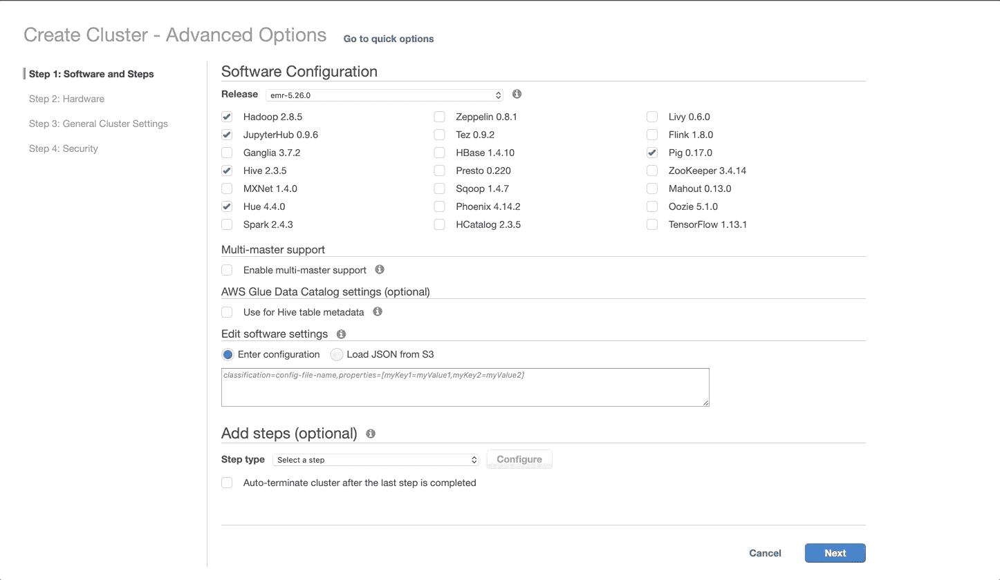

# AWS 上的 SparkML，6 个简单步骤

> 原文：<https://towardsdatascience.com/sparkml-on-aws-in-6-easy-steps-129103a21fb5?source=collection_archive---------40----------------------->

我最近完成了一个机器学习项目，由于数据集的大小和分析的计算复杂性，需要使用 Spark 和分布式计算环境。为了完成这个项目，我选择使用 Amazon Web Services(AWS)Elastic MapReduce(EMR)。因为这是我第一次尝试使用 AWS 和 EMR，所以学习曲线很陡。此外，我发现网上提供的说明和指导只有一点点帮助。为了解决 AWS EMR 实施缺乏清晰、简明和有用的说明的问题，我提供了以下六个简单的步骤来启动和运行 AWS EMR。

通过遵循以下说明，您将能够:

*   设置一个运行 SparkML 的 EMR 集群，以及
*   创建一个 EMR 笔记本(Jupyter)来执行代码

请注意，您需要一个 AWS 帐户才能使用 AWS EMR。设置 AWS 账户的说明可以在[这里](https://aws.amazon.com/premiumsupport/knowledge-center/create-and-activate-aws-account/)找到。此外，请注意，使用 EMR 和其他 AWS 服务(例如，S3 存储和数据传输)需要付费。亚马逊的收费结构可以在[这里](https://aws.amazon.com/pricing/)找到。

# 步骤 1:创建集群

首先登录 [AWS 控制台](https://console.aws.amazon.com/)。登录后，搜索 EMR。

GIF demonstrating how to search for EMR on AWS Management Console

在 EMR 主页上，单击“创建集群”按钮，然后单击“转到高级选项”

GIF showing the Create Cluster button and Go To Advanced Options link

# 步骤 2:选择软件配置

在软件配置页面上，您需要调整默认设置。通过仅选择 Hadoop、JupyterHub、Spark 和 Livy 来调整设置，然后单击屏幕底部的“下一步”按钮。

GIF demonstrating how to change the default software configuration

# 步骤 3:选择硬件配置

现在是时候为您的集群选择硬件配置了。您可以选择主实例的类型以及核心和任务实例的类型和数量。集群的每个组件都是一个弹性计算云(EC2)实例。您可以在[这里](https://aws.amazon.com/ec2/instance-types/)找到 EC2 实例类型的详细信息。除了选择实例类型，您还可以指定分配给集群中每个实例的弹性块存储(EBS)存储量。选择所需设置后，单击页面底部的“下一步”按钮。

Screenshot of AWS EMR hardware configuration

# 步骤 4:选择常规选项

在“常规选项”设置中，为集群指定一个名称，并选择要记录日志的简单存储服务(S3)存储桶。如果你不熟悉 S3， [Amazon](https://aws.amazon.com/s3/getting-started/) 提供了创建存储桶的说明。或者，您可以使用默认设置，这将为您创建一个新的存储桶。准备好后，单击“下一步”按钮。

Screenshot of AWS EMR general options set-up page

# 步骤 5:设置安全选项并创建集群

创建集群的最后一步是设置安全选项。对于个人使用，默认设置应该可以。如果您计划使用 SSH 来访问集群，那么您需要分配一个 EC2 密钥对。使用页面右下方蓝色框中的链接，可以获得创建密钥对的说明。创建后，可以使用页面顶部的下拉菜单将密钥对分配给集群。准备就绪后，单击“创建集群”

群集启动需要几分钟时间。在您等待的时候，继续执行步骤 6 以创建一个笔记本实例。

Screenshot of AWS EMR security options set-up page

# 步骤 6:创建笔记本

在步骤 5 中单击“创建集群”后，您将进入如下所示的屏幕。点击屏幕左侧菜单中的“笔记本”。在下一个屏幕上，单击“创建笔记本”按钮。

GIF demonstrating notebook creation steps

为您的笔记本命名，并选择您希望用来运行笔记本的群集。完成后，单击“创建笔记本”按钮。

GIF demonstrating final notebook creation steps

就是这样！一旦集群启动并运行，您就可以打开笔记本了。在第一个单元格中键入“spark ”,然后运行该单元格以启动 Spark 会话。现在，您可以使用 SparkML 在 AWS EMR 集群上运行机器学习算法了。完成后，记得终止集群以避免产生额外费用。