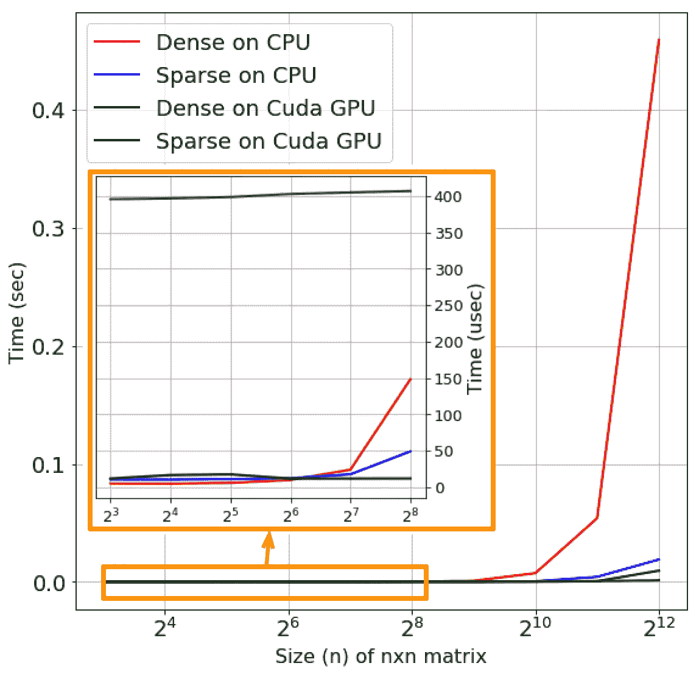
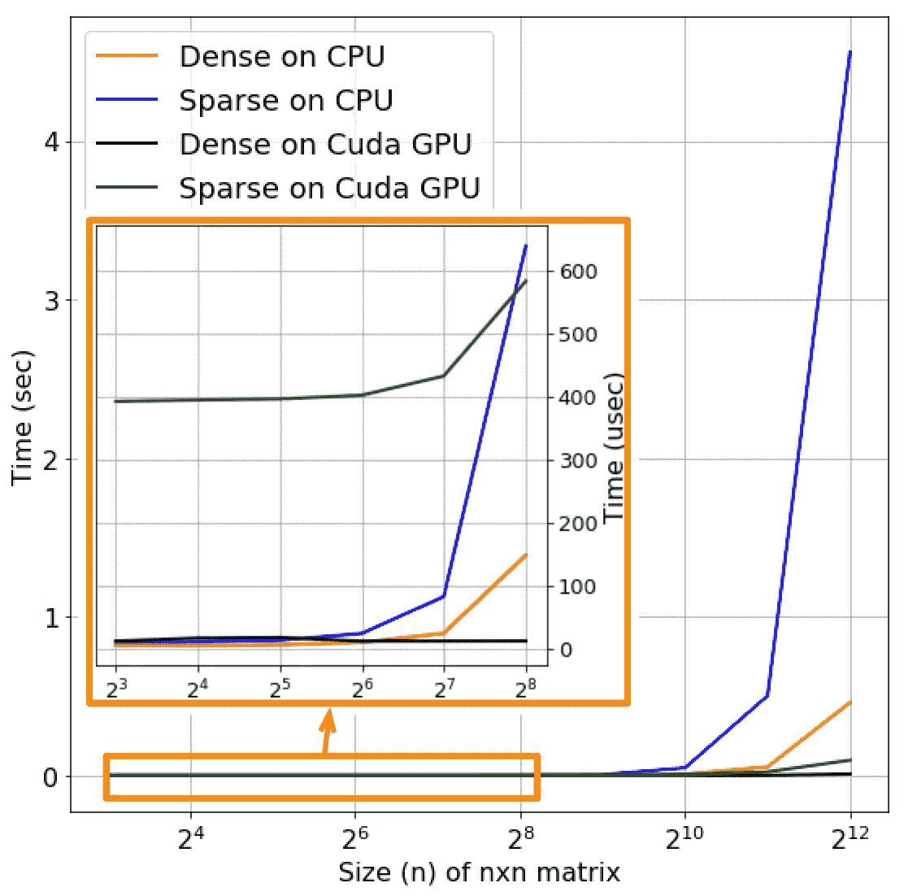
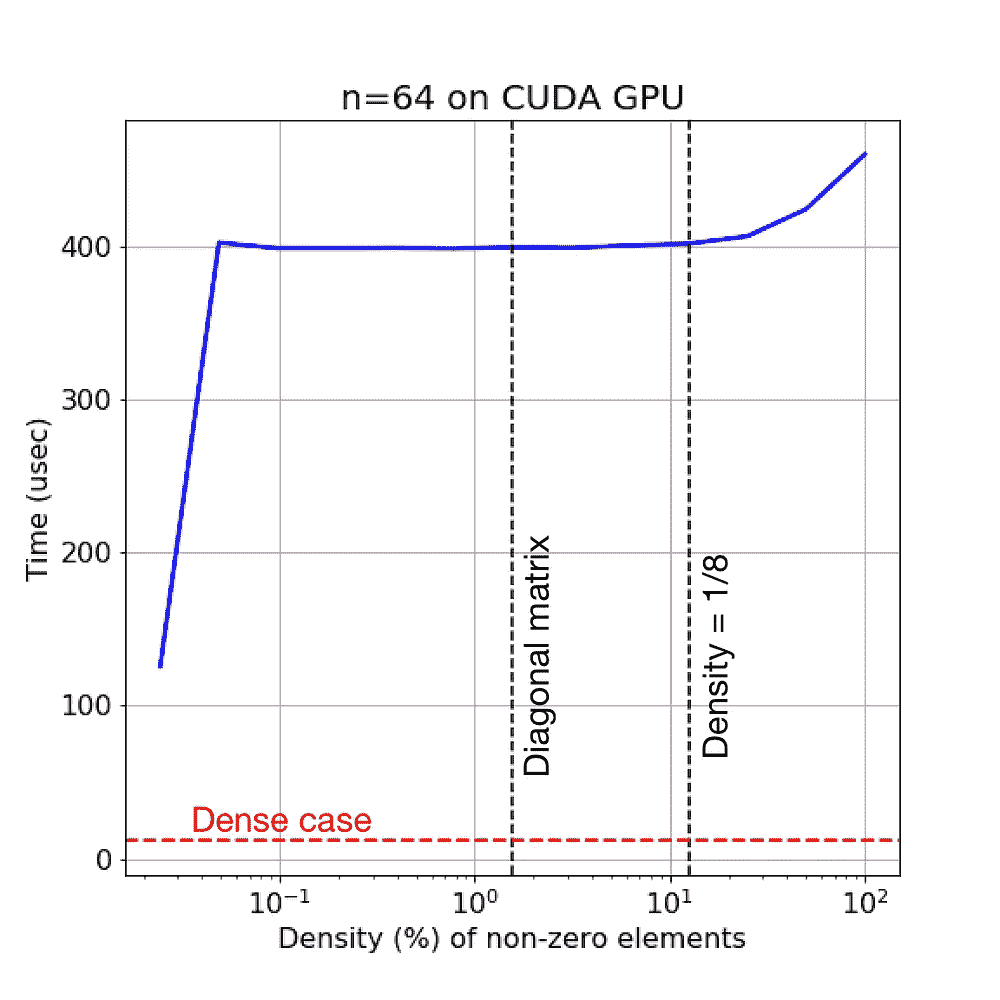
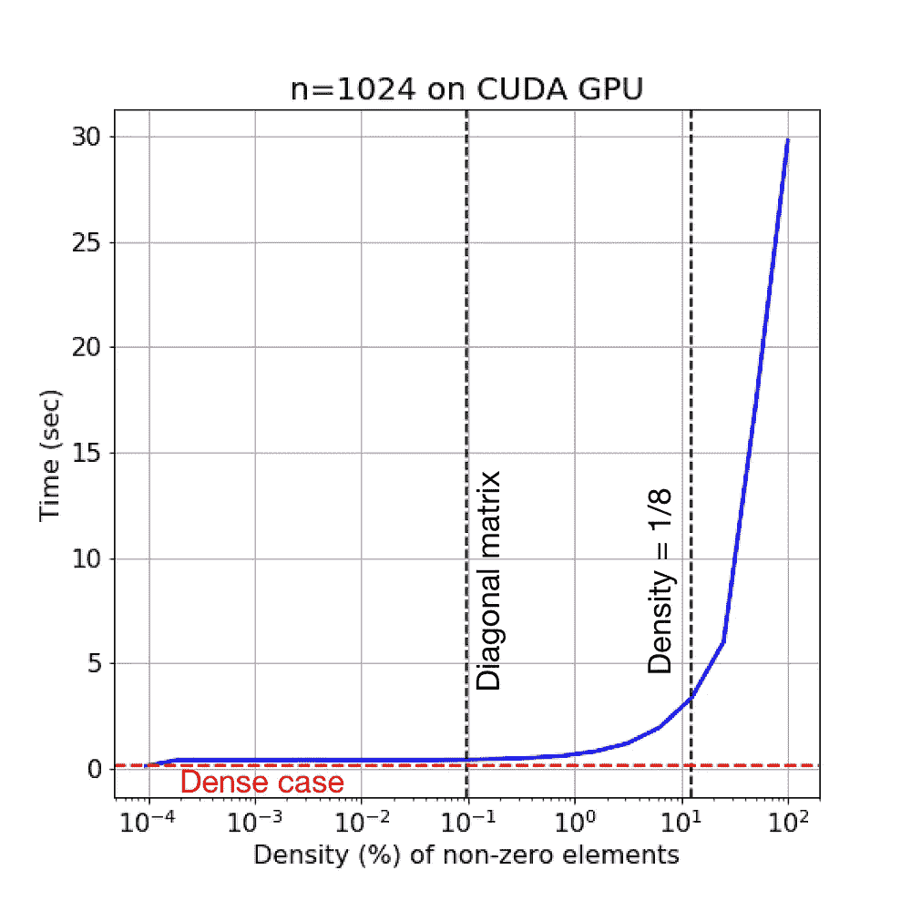
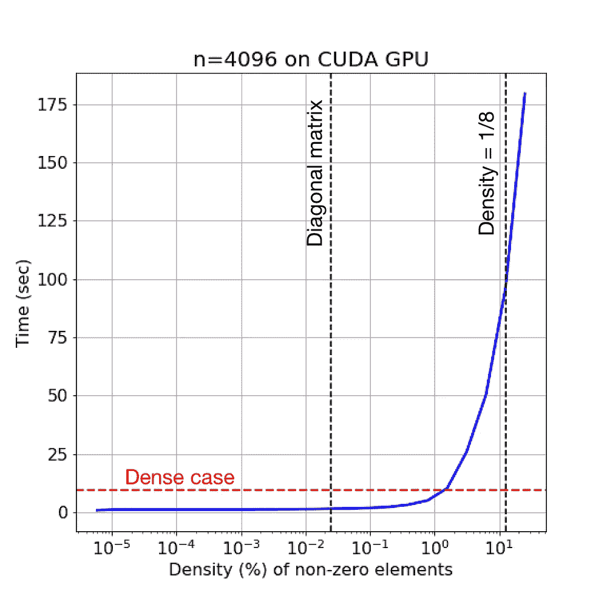

# Pytorch 中的稀疏矩阵

> 原文：<https://towardsdatascience.com/sparse-matrices-in-pytorch-part-2-gpus-fd9cc0725b71?source=collection_archive---------16----------------------->

## [预定义稀疏度](https://towardsdatascience.com/tagged/predefined-sparsity)

## 第 2 部分:GPU 运行时

在第 1 部分的[中，我分析了 Pytorch 中稀疏矩阵乘法在 CPU 上的执行时间。这里有一个快速回顾:](/sparse-matrices-in-pytorch-be8ecaccae6)

*   稀疏矩阵中有很多零，所以可以用不同于常规(密集)矩阵的方式存储和操作
*   Pytorch 是一个用于深度学习的 Python 库，相当容易使用，但给了用户很多控制权。Pytorch 以坐标格式存储稀疏矩阵，并有一个名为`torch.sparse`的独立 API 来处理它们。
*   我使用的 **CPU** 是我自己的 Macbook Pro——2014 年年中，配有 2.2 GHz 英特尔酷睿 i7 处理器和 16 GB 内存。
*   第 1 部分的主要发现是: *2 密集矩阵总是比稀疏矩阵和密集矩阵增长得更快，除非稀疏矩阵的密度非常低。‘很低’好像是 1.5%及以下*。

Pytorch 和 Keras 等深度学习框架的一个关键卖点是它们在**GPU**上的可部署性，这大大加快了计算速度。不过这也有它的局限性， *Pytorch 只支持兼容 CUDA 的 GPU*。CUDA 是由 Nvidia 创建的计算框架，它利用兼容 GPU 上的并行处理。并非所有的图形处理器都是如此，例如，我的 Macbook 配备了英特尔 Iris Pro 显卡，不幸的是，它与 CUDA 不兼容。所以我经常使用亚马逊网络服务(AWS)——它提供云计算资源。对于本文中的实验，我使用了一个 AWS[**p 3.2x large**](https://aws.amazon.com/ec2/instance-types/p3/)实例，它有 1 个 Nvidia V100 GPU，非常强大(例如，在 CIFAR-100 上训练 11 层深度 CNN 在 p3 上比我的 Macbook 快 100 倍)。

我在 p3 实例上重复了第 1 部分中相同的 3 个实验，做了一些小的改动，并将这些结果与 CPU 结果进行了比较。让我们开始吧！

# 大小和密度都不同

和第 1 部分一样，所有矩阵都是正方形的。稀疏情况是对角矩阵乘以密集矩阵。这意味着稀疏矩阵的密度是 1/*n*(*n*= #行)。密集的情况是两个密集矩阵相乘，但是，两个密集矩阵都是随机生成的，不像第 1 部分，其中一个密集矩阵只是稀疏矩阵的“密集”版本。这不会在质量上影响结果；我这样做只是因为它使计时的代码更容易设置(稍后会详细介绍)。结果如下:

访问开销在插图中占主导地位，插图在放大的 y 轴上显示了较低的 *n* 值。除此之外，趋势很明显——a)GPU 比 CPU 快得多，b)稀疏矩阵的执行速度比密集矩阵快，因为对角矩阵的密度极低。

# 密度固定，尺寸变化

稀疏矩阵现在具有 12.5%的固定密度，而密集情况与之前相同。结果如下:

虽然 GPU 的整体性能再次提高，但这一次稀疏情况比密集情况需要更多的时间。这将我们带到最后一个实验——密度对稀疏矩阵计算时间的影响。作为一个旁注，注意 GPU 上的稀疏矩阵似乎有非常大的开销，这在低 *n* 值时完全占主导地位。我不知道这是 GPU 的限制还是首席运营官格式造成的。

# 尺寸固定，密度变化

虽然低密度稀疏对角矩阵的运算速度比密集矩阵快，但对于更高密度的稀疏矩阵，这一结果是相反的。该实验改变给定大小的稀疏矩阵的密度水平，并测量执行时间。我使用的尺寸(T4 n T5 的值)和第一部分有点不同。这里是 64，256，1024 和 4096。密度是 2 的幂。与第 1 部分一样，红色虚线显示了密集情况下的计算时间，而黑色虚线显示了前两个实验的密度——对角矩阵和 12.5%。

在接近开始时， *n* = 64 和 256 的曲线表现有点奇怪，显示出非常低的密度值的线性增长。我能想到的唯一解释就是，当非零元素的个数非常低时，存储稀疏矩阵的内存的访问方式是不同的。似乎访问开销直到达到一个可观的密度才开始出现，然后它们在一段时间内占主导地位(平坦部分)，然后让位于计算时间(指数部分)。

然而，我们再次注意到使用稀疏矩阵代替密集矩阵并没有实际的好处。对于 *n* = 64、256 和 1024，稀疏乘法总是比密集耗时，而对于 n = 4096，稀疏乘法比密集耗时只需要 1.5%左右的密度。

总之，这篇文章有两个主要的收获。首先，**GPU**(至少是现代的强大的)**明显比 CPU**快，如果可能的话应该一直用于线性代数。我说“如果可能”是因为 AWS 实例不是免费的。然而，如果你是一名受资助的研究人员，如果你要做线性代数密集型任务，如深度学习，说服你的主管为 AWS GPU 实例付费是非常值得的。其次，**第 1 部分的主要发现也在 GPU 上得以恢复，即 2 个密集矩阵总是比稀疏和密集矩阵的乘法速度更快，除非稀疏矩阵的密度非常低(< 1.5%)** 。

因此，在 Pytorch 中使用稀疏矩阵似乎没有太多好处。就我对[预定义稀疏度](https://ieeexplore.ieee.org/document/8689061)的研究而言，1.5%及以下的密度太低，没有任何用处。其他 Pytorch 用户已经表达了稀疏矩阵的这些问题，所以这里希望开发人员能想出更有效的方法来处理稀疏矩阵。

## 测量执行时间

本文的代码和图片可以在 Github [这里](https://github.com/souryadey/speed-tests/tree/master/pytorch_sparse/part2_gpu_awsp3_2xlarge)找到。如果您浏览代码，您会发现我使用了 Python 提供的`timeit`模块来测量代码片段的执行时间。为了获得最精确的时间测量，最好将`setup`参数中的所有变量都设置为`timeit.Timer()`。这与预先定义变量，然后让`timeit.Timer()`访问全局名称空间相反，这很浪费时间。

作为`timeit`模块的替代，Jupyter 笔记本提供了`%timeit`魔法命令，这是我在第 1 部分中使用的。这两种方法的结果是一样的(最好是这样！)，但是`%timeit`更容易使用，因为它会自动计算多次运行的平均值。然而，在 AWS 上运行 Jupyter 笔记本，虽然[可能](https://docs.aws.amazon.com/dlami/latest/devguide/setup-jupyter.html)，却很麻烦，而且很大程度上取决于服务器速度。因此，在第 2 部分中，我坚持使用传统的 Python 脚本。

暂时就这样吧！

> Sourya Dey 正在南加州大学攻读博士学位。他的研究涉及探索深度学习中的复杂性降低。你可以在他的网站上了解更多关于他的信息。