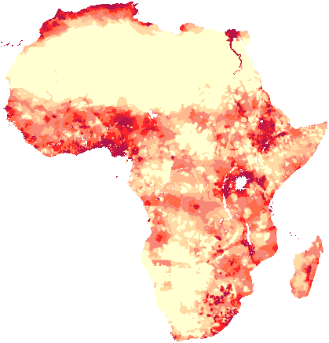

# 面向外行的空间数据科学

> 原文：<https://towardsdatascience.com/spatial-data-science-for-the-uninitiated-9a78804d4efa?source=collection_archive---------13----------------------->

## 从位置信息中提取洞察力的艺术和科学

一位老朋友上周发来一个很棒的问题:“对于我们这些门外汉来说，什么是空间数据科学(相对于常规数据科学)？为什么它意义重大？”

# 什么是空间数据科学？

空间数据科学是使用算法和分析技术从*空间*数据中提取洞察力的实践。

空间数据是由数据描述的观测值的相对位置的任何数据，并且可以在分析中用作维度。换句话说，空间数据有关于*的信息，其中每个单独的数据是*——因此，在那里观察是相互关联的。


A raster “hillshade” image of Colorado. Here think of each pixel as the observation — a recording of that point on Earth.

最直观的例子就是地理空间数据，它承载着地球上哪里发生事情的信息。地理空间数据可以描述自然或人类主题，如地形、政治边界、城市系统、天气和气候模式、道路网络、物种分布、消费习惯、航运和物流系统、人口统计等。

空间维度通常是对*纬度*(y 坐标)和*经度*(x 坐标)的测量，有时还有*高度*(z 坐标)，这可以将一个点精确地放置在地球表面上、上方或下方。空间数据科学家经常使用 GIS 技能和工具(地理信息系统/科学)来操纵、分析和可视化地理空间数据。

值得注意的是，许多空间分析技术实际上与比例无关，因此我们可以将相同的算法应用于地球地图，就像我们可以应用于细胞地图或宇宙地图一样。空间数据科学技术可以应用于具有空间元素的更抽象的问题——例如，通过计算它们在一起出现的频率来分析单词的关联程度。

# 栅格和矢量

空间数据通常分为两类:栅格数据和矢量数据。两者都是描述空间和表现特征的方式，但是它们的工作方式完全不同。

## 栅格数据

光栅是一个由规则大小的像素组成的网格。通过给网格中的每个单元格分配一个值(或几个值)，图像可以用数字描述为多维数组。

例如，以如下所示的 3x3 网格为例:


A 3x3 raster grid.

如果 1 表示黑色，0 表示白色，我们可以用数字表示如下:

```
img = [[ 1, 0, 1 ],
       [ 0, 1, 0 ], 
       [ 1, 0, 1 ]]
```

栅格像元中的数字可能意味着很多事情-特定点的陆地高度或海洋深度、该点的冰或雪量、该像素内的居住人数等等。此外，可见光谱中的几乎任何颜色都可以通过代表红、绿、蓝(RGB)强度的三个数字的组合来描述——卫星图像是栅格数据结构。GeoTiff、jpg、png 和位图文件包含栅格数据。



A raster image of population in Africa, from [http://www.ncgia.ucsb.edu/pubs/gdp/pop.html](http://www.ncgia.ucsb.edu/pubs/gdp/pop.html).

## 矢量数据

向量数据更抽象一些。在矢量数据集中，**特征**是数据集中的独立单元，每个特征通常代表一个*点*、*线*或*多边形。*这些特征用数学方法表示，通常用数字表示点的坐标或几何图形的顶点(角)。


Vector features from [Saylor Academy](https://saylordotorg.github.io/text_essentials-of-geographic-information-systems/s11-geospatial-analysis-i-vector-o.html).

## 点、线、多边形

举个简单的例子，下面是每种类型特征的简单数字表示:

```
point =   [ 45.841616, 6.212074 ]line =    [[ -0.131838, 51.52241 ],
           [ -3.142085, 51.50190 ],
           [ -3.175046, 55.96150 ]]polygon = [[ -43.06640, 17.47643 ],
           [ -46.40625, 10.83330 ],
           [ -37.26562, 11.52308 ],
           [ -43.06640, 17.47643 ]]
           // ^^ The first and last coordinate are the same
```

矢量要素通常包含一些描述要素的元数据，例如道路名称或一个州的人口数量。要素的这些额外的非空间元数据通常被称为“属性”，通常在“属性表”中表示。空间数据科学家通常会在分析中将空间维度(点的坐标或线和面的坐标数组)与非空间维度结合起来。乔森和。shp 文件通常包含矢量数据。

## 为什么这与常规的数据科学不同？

简短的回答是，它不是:空间数据科学是数据科学中的一个学科。但是，空间数据有一些特点，需要特殊处理。从编程/数据库的角度来看，数据的存储和处理方式是如此，从算法的角度来看，数据的分析方式也是如此。这意味着空间数据科学家必须学习一些概念-主要来自几何学，如在平面上表示 3D 形状-其他数据科学家可能永远不会处理这些概念。

# 空间数据科学工具

空间数据科学家试图理解这些空间数据集，以更好地理解他们正在研究的系统或现象。一些不可思议的(通常是免费的)软件工具使这成为可能。大多数编程语言，如 [Python](https://www.python.org/) 、 [R](https://www.r-project.org/) 和 [Javascript](https://developer.mozilla.org/en-US/docs/Web/JavaScript) 都有令人惊叹的空间分析库，如 [geopandas](http://geopandas.org/) 和 [turf.js](http://turfjs.org/) ，桌面程序如 [QGIS](https://qgis.org/en/site/) 让不太懂技术的人也能访问可视化和分析空间数据。还有强大的在线工具，如 [Mapbox](https://www.mapbox.com/) 、 [Carto](https://carto.com/) 和 Google [BigQuery](https://cloud.google.com/bigquery/) 来帮助应对这些分析和可视化挑战。像 Leaflet 和 Mapbox GL JS 这样的 JavaScript 库使 web 开发人员能够在浏览器中创建交互式地图。

## 几个例子

空间数据科学家的任务可能是分析空间分布-查看点是聚集在一起、分散还是随机放置-例如，计算出建造新机场或零售中心的最佳位置，或者了解暴力或犯罪的模式。


Clustering [ACLED](https://www.acleddata.com/) conflict events in Yemen from a project [I did at UCL](https://github.com/johnx25bd/conflict-kmeans/blob/master/yemen-kmeans-paper.pdf).

这可能需要分析一段时间内的趋势——通过观察某个地区的投票结果如何演变，或者一个国家不同地区对某个问题的看法如何变化。

也许分析师正在分析卫星图像来绘制地图，以帮助更有效地提供紧急服务，或者计算出一个新的潜在建筑工地或自行车道有多阴暗。这可能意味着在给定当前交通状况的情况下，计算从 A 到 B 的最有效路线。尽管这个领域很小，但空间数据科学在几乎每个部门和领域都有广泛的应用。

通过使用这种专门的统计工具包来分析空间数据，空间数据科学家能够更好地理解空间关系，并可能找出为什么事情会在哪里发生，以及预测事情接下来会在哪里发生。