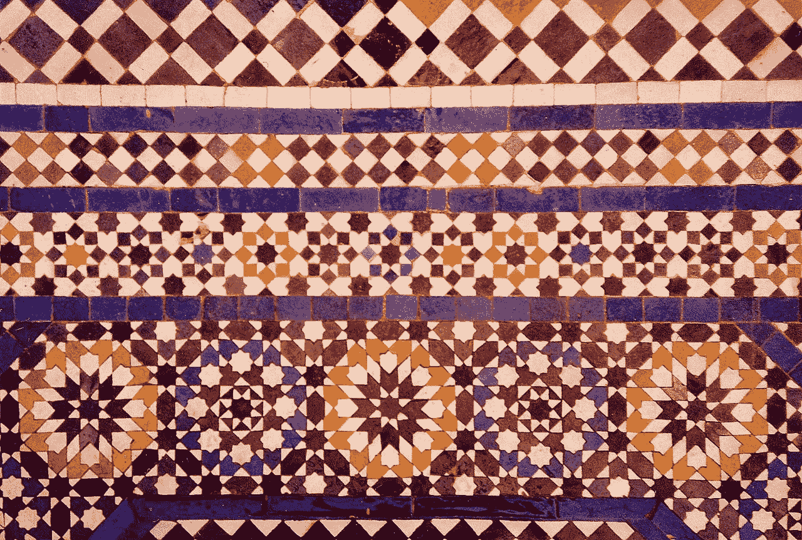
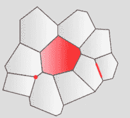
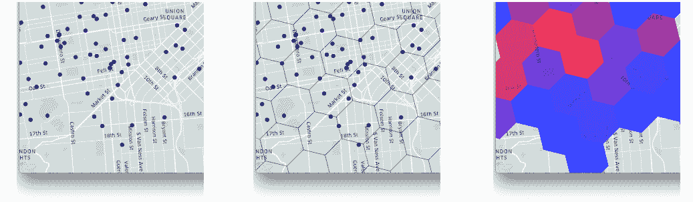
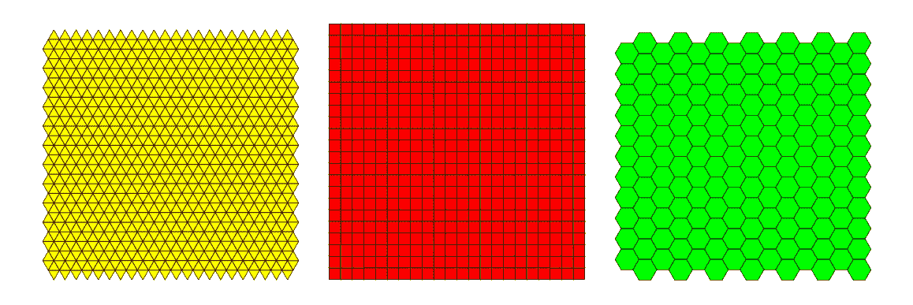
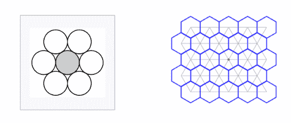
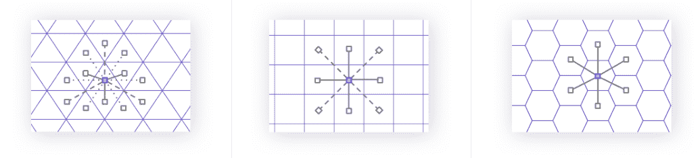
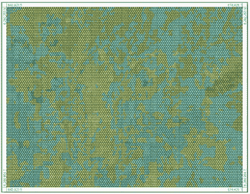
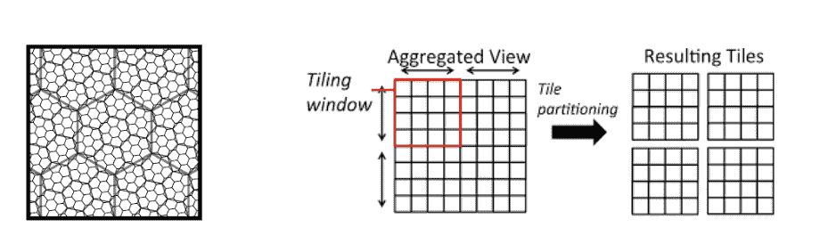

# 空间建模花絮:蜂巢还是渔网？

> 原文：<https://towardsdatascience.com/spatial-modelling-tidbits-honeycomb-or-fishnets-7f0b19273aab?source=collection_archive---------11----------------------->

## 为什么我们在 [**场所**](http://locale.ai) 都喜欢六边形网格！

Source: Wikipedia

# 介绍

如果你是一个像优步一样的两度市场，你要迎合数百万请求搭车的用户，通过你的司机伙伴接受并满足这些请求。对于像 Swiggy 这样的三级市场，还添加了另一个静态组件(如餐馆或商店)，交付合作伙伴在那里收取订单。

> 借用一句名言，“任何事情都发生在某个地方”——所有这些描述的事件和行为都发生在一个特定的地点！

通常，公司最终没有利用数据中的**纬度/经度部分**，而是在城市层面进行分析。但是，城市太大，地理位置多样，参数变化太大！

区域级别的多边形更加实用，但仍然很宽泛。它们没有统一的形状或大小，而且经常变化。即使是由运营团队的本地知识绘制的区域或集群也需要更新，并且具有任意的边。

Source: Standford Gaming Principles

理解您的空间数据并获得精确的见解需要这些分析变得更加精细和统一。

网格系统将这种细粒度带到了桌面上。它能出色地将你所有的纬度放进“细胞”里。这些像元还可以进行聚类以表示特定的邻域或区域，并且可以在不同的级别进行聚合。

Source: Uber

因此，该系统对于处理大型空间数据集以匹配城市中分散的供需变得至关重要。

# 网格是什么意思？

在空间数据科学中，我们使用规则多边形网格在表面上重复，边对边地覆盖任何空间，没有重叠和间隙——这种现象称为 [**镶嵌**](https://www.mathsisfun.com/geometry/tessellation.html) **。**每个单元可分配一个唯一的 id 用于空间索引(聚合该单元内的点)。

已经提出了各种不同形状的网格，包括正方形、矩形、三角形、六边形或菱形。[全球网格系统](https://en.wikipedia.org/wiki/Discrete_global_grid)覆盖整个地球表面。

如果你是一家超本地化、随需应变的公司，网格可以小到 1 平方英尺。km 对于运行与位置相关的模型和在**实时运行的模型非常有用。** [示例](https://medium.com/@localeai/how-analyzing-supply-demand-gaps-can-optimize-your-unit-economics-1da3ecd340c6)包括高需求地区的激增定价、低需求地区的促销&地面送货人员的配送模式。

# 有哪些不同的网格类型？

只有三种类型的网格可以镶嵌:正方形、等边三角形和六边形。

Source: Wikipedia

## 1.方形网格:

方形格网最常见的应用出现在栅格数据集和地理哈希中。就本文而言，我们将重点关注 geohashes。

[**Geohash**](https://www.factual.com/blog/how-geohashes-work/) 是一种分层数据结构，用于将 2D 空间点(lat & long)转换为字母和数字的短字符串。他们将世界划分为 4 行 8 列 32 个单元的网格。

你可以把每个单元格分成 32 个单元格。因此，geohash 的字符串越长，精确度就越高！如果 geohashes 有一个共同的前缀，您也可以轻松识别它们是否靠得很近。所以，共同前缀越长，它们越接近。

例如，丹麦日德兰半岛顶端附近的坐标对 *(57.64911，10.40744)* 产生了略短的哈希*u 4 prudqqvj。[1]*

## 2.三角形网格:

三角形网格不是很常用。此外，他们不熟悉，其中一个原因是他们周长很大，面积很小，这意味着很难在地图上把他们拼凑在一起。

另一个原因是，每个三角形只连接到三个相邻的三角形，这限制了移动和建立连接的选项数量。(查看下图)

此外，对于六边形和正方形来说，总是有两个面相互平行，而对于三角形来说，有两个方向的直线平行于运动轴的中心。因此，在某种程度上，不存在完全对称。*【2】*

## 3.六边形网格:

除了看起来吸引人之外，六边形比 geohashes 更对称。它们在形状上非常接近圆形，以提供更精确的采样。*【3】*

因此，这个系统越来越多地被像优步这样的公司所采用。

Source: Wikipedia

**有趣的事实:**一个六边形网格和三角形网格是彼此的对偶——在每个六边形的中心放一个点&将它们连接到所有相邻的六边形，你得到一个三角形网格，反之亦然！*【4】*

在六边形网格的顶点上移动相当于在三角形网格的空间中玩耍。另一方面，正方形网格本身就是一个对偶。

# 为什么是六边形？

在[场所](http://locale.ai)，我们从客户那里得到很多的一个问题是，“为什么我们使用 hexbins 而不是 geohashes？”

嗯，选择取决于您的具体用例，无论您使用什么，您都必须做出一些权衡。所以，我们来取一些参数，深潜一下。

## 与最近像元的距离:

Source: Uber

此图显示了三角形、正方形和六边形的中心到其邻居的距离。

三角形有三种距离(穿过边、顶点和穿过边的中心)，正方形有两种距离(穿过边和对角线)，六边形只有一种距离——这是三角形不受欢迎的另一个原因。

六边形的这一属性使得执行分析变得非常容易，并且当您的分析包括**连通性或运动方面时，这是首选。***【4】*

六边形中的所有邻居围绕它形成一个半径相等的环。 [kRing](https://uber.github.io/h3/#/documentation/api-reference/neighbors) 函数提供原点索引“k”距离内的格网单元。在下图中，这是阴影六边形和正方形的第**次克里金**。

Source: ESRI

## 在曲面上安装:

六边形是镶嵌中填充圆形并减少**边缘效应**的最密集方式。(圆的周长与面积之比最小，但不能形成连续的网格)。

多边形与圆越相似，靠近边界区域的点就越靠近中心。因此，与等面积的正方形或三角形相比，六边形内的任何一点都更靠近其中心。

现在，当大面积开始起作用并且地球的曲率是重要的考虑因素时，六边形因此更适合曲率并且遭受较少的扭曲。*【5】*

## 数据中的显式模式:

六边形允许数据中图案的任何**曲率容易且明确地显示，因为它们分解了线条。**

对于像正方形和长方形这样的线性图形，这就变得棘手了。这些形状将我们的注意力吸引到阻碍数据中存在的模式的直的、连续的和平行的线上。请参考下图。*【6】*

Source: GIS Exchange

# 为什么是 geohashes？

这让我想到了我的下一个问题，**“什么时候人们会使用渔网或方形网格？”**

## 细胞的聚集/分裂:

不同类型的模型需要不同的粒度，这就是聚合和划分变得重要的地方。

如果需要增加一个正方形网格的空间分辨率，只需要把它分成 4 份就可以了。类似地，要聚合，您需要将四个网格合并为一个。

对于六边形，聚合和分割在不同的比例下是不一致的，如下图所示。更精细的单元仅大致包含在父单元中。*【7】*

Source: Wikipedia

对于等级分析，正方形优于六边形。组合方形网格相当简单。合并构建在同一模板上的多个格网不需要任何空间操作，您可以使用矩阵代数。

## 非常直观和熟悉:

我们也用“**方格**来思考。上、下、左、右简单易懂。我们在正方形和长方形上建造了城市和文明。由于我们的主坐标系是平方的，人们发现很难在其他系统上工作。

它们有时也用于连通性分析，因为它们有八个邻居(包括对角线)。

# 一些现实生活中的例子

六边形在自然界中广泛存在。例如蜂窝、石墨、苯、硅烯等。中国跳棋是在一个六边形的格子上玩的，国际象棋的几个变种也被发明在一个六边形的棋盘上。

六边形网格是许多战争游戏发行商和一些其他游戏(如卡坦的定居者)的一个显著特征！*【8】*

*附:如果你对此感兴趣，请查看我们的* [*博客*](https://medium.com/@localeai) *获取更多与地图、位置智能和空间建模相关的文章。
P.P.S .我们在*[*locale . ai*](http://locale.ai)*招聘！联系我*[*aditi @ locale . ai*](mailto:aditi@locale.ai)*！*

# 参考资料:

如果您希望阅读更多内容，请查看链接进行深入研究:

* **【2】*[*https://board games . stack exchange . com/questions/633/why-are-there-less-board-games-with-a-a-triangular-grid*](https://boardgames.stackexchange.com/questions/633/why-are-there-fewer-board-games-with-a-triangular-grid) *【3】*[*https://www.redblobgames.com/grids/hexagons/*](https://www.redblobgames.com/grids/hexagons/) **【4】****