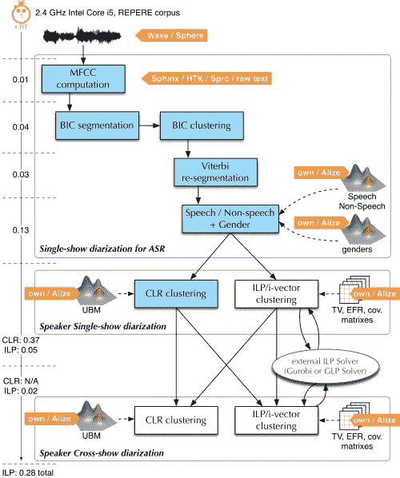
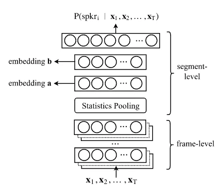
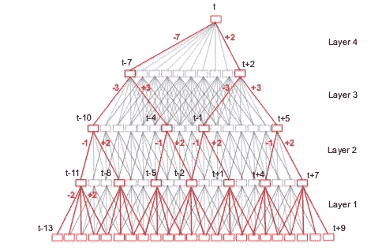
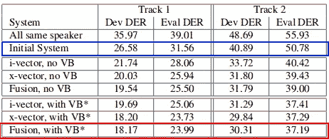

# 带 Kaldi 的扬声器二进制化

> 原文：<https://towardsdatascience.com/speaker-diarization-with-kaldi-e30301b05cc8?source=collection_archive---------3----------------------->

## 随着语音生物识别和语音识别系统的兴起，处理多个说话者的音频的能力变得至关重要。本文是使用 Kaldi X-Vectors(一种最先进的技术)完成这一过程的基础教程。

在大多数真实世界的场景中，语音不会出现在只有一个说话者的明确定义的音频片段中。在我们的算法需要处理的大多数对话中，人们会相互打断，而切断句子之间的音频将不是一项简单的任务。

除此之外，在许多应用中，我们希望在一次对话中识别多个发言者，例如在编写会议协议时。对于这样的场合，识别不同的说话者并连接同一说话者下的不同句子是一项关键任务。

[*说话人二进制化*](https://en.wikipedia.org/wiki/Speaker_diarisation) 就是针对这些问题的解决方案。通过这一过程，我们可以根据说话者的身份将输入音频分割成片段。**这个问题可谓是谁在什么时候讲的？**"在一段音频中。


**Attributing different sentences to different people is a crucial part of understanding a conversation.** Photo by [rawpixel](https://unsplash.com/@rawpixel?utm_source=medium&utm_medium=referral) on [Unsplash](https://unsplash.com?utm_source=medium&utm_medium=referral)

# 历史

第一个基于 ML 的扬声器二进制化工作开始于 2006 年左右，但直到 2012 年左右才开始有重大改进( [Xavier，2012](http://www.eurecom.fr/en/publication/3152/download/mm-publi-3152.pdf) )，当时这被认为是一项极其困难的任务。那时的大多数方法都是基于 [GMM](https://scikit-learn.org/stable/modules/mixture.html) 或[嗯](https://en.wikipedia.org/wiki/Hidden_Markov_model)的(比如 [JFA](https://www.crim.ca/perso/patrick.kenny/FAtheory.pdf) )，不涉及任何神经网络。

一个真正的重大突破发生在 LIUM 的发布上，这是一个用 Java 编写的致力于说话者二进制化的开源软件。第一次有了一种自由分布的算法，它可以以合理的精度执行这项任务。LIUM 核心中的算法是一种复杂的机制，它将 GMM 和 I-Vectors 结合在一起，这种方法曾经在说话人识别任务中取得了最先进的结果。



The entire process in the LIUM toolkit. An repetitive multi-part process with a lot of combined models.

今天，这种复杂的多部分算法系统正在被许多不同领域的神经网络所取代，如[图像分割](https://medium.com/@jonathan_hui/image-segmentation-with-mask-r-cnn-ebe6d793272)甚至[语音识别](http://proceedings.mlr.press/v48/amodei16.pdf)。

# x 向量

最近的一项突破是由 *D. Snyder，D. Garcia-Romero，D. Povey 和 S. Khudanpur* 在一篇名为“ [*用于文本无关说话人验证的深度神经网络嵌入*](http://danielpovey.com/files/2017_interspeech_embeddings.pdf) ”的文章中发表的，该文章提出了一个模型，该模型后来被命名为“X-Vectors”。



A diagram of the proposed neural network, The different parts of the networks are highlighted on the right. From [The original article](http://danielpovey.com/files/2017_interspeech_embeddings.pdf).

在该方法中，网络的输入是以 [MFCC](http://www.practicalcryptography.com/miscellaneous/machine-learning/guide-mel-frequency-cepstral-coefficients-mfccs/) 形式的原始音频。这些特征被输入到一个神经网络中，该网络可以分为四个部分:

1.  **帧级层**——这些层本质上是一个 [TDNN](https://en.wikipedia.org/wiki/Time_delay_neural_network) (时间延迟神经网络)。TDNN 是在神经网络日益普及之前的 90 年代发明的一种架构，然后在 2015 年被[“重新发现”为语音识别系统的一个关键部分。这个网络本质上是一个全连接的神经网络，它考虑了样本的时间滑动窗口。它被认为比 LSTM 快得多。](https://www.danielpovey.com/files/2015_interspeech_multisplice.pdf)
2.  **统计池** -因为每一帧给我们一个向量，我们需要以某种方式对这些向量求和。在这个实现中，我们取所有向量的平均值和标准偏差，并将它们连接成一个代表整个片段的**向量。**
3.  **全连接层**——向量被送入两个全连接层(分别有 512 和 300 个神经元)，我们稍后会用到。第二层将具有 ReLU 非线性。
4.  **Softmax 分类器** -一个简单的 Softmax 分类器，它在 ReLU 之后获取输出，并将片段分类到不同的说话者之一。



A visualization of a TDNN, The first part of the X-Vectors System.

X-Vectors 的真正力量不在于(仅仅)对不同的说话者进行分类，还在于它使用两个完全连接的层作为整个片段的嵌入式表示。在文章中，他们使用这些表示对一个完全不同于他们训练数据集的数据集进行分类。他们首先为每个新的音频样本创建嵌入，然后用 [PLDA 后端相似性度量](http://www.odyssey2016.org/papers/pdfs_stamped/12.pdf)对它们进行分类。

## X 向量二分化

在我们理解了我们可以使用这些嵌入作为每个音频样本中的说话者的表示之后，我们可以看到该表示可以如何用于分割音频样本的子部分。那种方法在“ [*二进制化很难:首届迪哈德挑战赛*](http://www.danielpovey.com/files/2018_interspeech_dihard.pdf) 中的一些经验教训”一文中有所描述。DIHARD 挑战特别困难，因为它包含了从电视节目到电话到儿童对话的 10 个不同的音频域，此外还有 2 个域只出现在验证集中。

在文章中，他们描述了许多实践，这些实践将他们的二进制化算法带到了当前的艺术水平。虽然使用不同的技术(如[变分贝叶斯](https://speech.fit.vutbr.cz/software/vb-diarization-eigenvoice-and-hmm-priors))极大地提高了模型的准确性，但它本质上是基于相同的 X 向量嵌入和 PLDA 后端。



From the DIHARD Callenge article. You can see the major improvements of using X-Vectors. Previous works are in blue and the state of the art results are in red.

# 如何与卡尔迪合作

首先，如果你之前没有用过 Kaldi，我强烈推荐你阅读我的第一篇关于使用 Kaldi 的文章[](/how-to-start-with-kaldi-and-speech-recognition-a9b7670ffff6)****。没有语音识别系统的经验，很难开始使用该系统。****

**其次，你不需要重新训练 X-Vectors 网络或 PLDA 后端，你可以直接从[官方网站](http://kaldi-asr.org/models/m3)下载。如果你仍然想从头开始进行完整的训练，你可以遵循卡尔迪项目中的 [call_home_v2 recipe](https://github.com/kaldi-asr/kaldi/blob/master/egs/callhome_diarization/v2/run.sh) 。**

**现在你有了一个模型，不管你是创建了这个模型还是对它进行了预训练，我都将经历二进制化过程的不同部分。本演练改编自 GitHub 上的不同评论，主要是大卫的评论和文档。**

## **准备数据**

**你首先需要有一个普通的 *wav.scp* 和 *segments* 文件，方式[与 ASR 项目中的](http://kaldi-asr.org/doc/data_prep.html)相同。如果您想要一种简单的方法来创建这样的文件，您可以始终使用[*compute _ VAD _ decision . sh*](https://github.com/kaldi-asr/kaldi/blob/master/egs/wsj/s5/steps/compute_vad_decision.sh)*脚本，然后在输出中使用[*VAD _ to _ segments . sh*](https://github.com/kaldi-asr/kaldi/blob/master/egs/callhome_diarization/v1/diarization/vad_to_segments.sh)*脚本。如果您不想分割音频，只需从头到尾将片段映射到话语。****

****接下来，您需要创建一个 *utt2spk* 文件，该文件将片段映射到话语。您可以在 Linux 中通过运行命令`awk ‘{$1, $2}’ segments > utt2spk`简单地做到这一点。接下来，要创建其他必要的文件，只需将所有文件放在一个文件夹中，然后运行 [fix_data_dir.sh](https://github.com/kaldi-asr/kaldi/blob/master/egs/wsj/s5/utils/fix_data_dir.sh) 脚本。****

## ****创建特征****

****现在，您需要为音频创建一些特征，这些特征稍后将成为 X 向量提取器的输入。****

****我们将以与 ASR 项目中相同的方式开始创建 MFCC&CMVN。请注意，您需要有一个与您接受的培训相匹配的 mfcc.conf 文件。如果您使用预训练模型，请使用[这些文件](https://github.com/kaldi-asr/kaldi/tree/master/egs/callhome_diarization/v2/conf)。****

****对于 MFCC 创建，运行以下命令:****

```
**steps/make_mfcc.sh --mfcc-config conf/mfcc.conf --nj 60 \
--cmd "$train_cmd_intel" --write-utt2num-frames true \
**$data_dir** exp/make_mfcc **$mfccdir****
```

****然后对 [CMVN](https://en.wikipedia.org/wiki/Cepstral_mean_and_variance_normalization) 运行这个命令:****

```
**local/nnet3/xvector/prepare_feats.sh — nj 60 — cmd \ "$train_cmd_intel" **$data_dir** **$cmn_dir** **$cmn_dir****
```

****完成数据后，使用`utils/fix_data_dir.sh **$data_dir**` 修复数据目录，然后使用`cp **$data_dir**/segments **$cmn_dir**/` 将段文件移动到 CMVN 目录，之后使用`utils/fix_data_dir.sh **$cmn_dir**` 再次修复 CMVN 目录。****

## ****创建 X 向量****

****下一步是为你的数据创建 X 向量。我这里指的是导出文件夹，其中有 X-Vectors 作为`**$nnet_dir**`，如果你是从 Kaldi 网站下载的，使用路径"*exp/X Vectors _ sre _ combined*"然后运行该命令:****

```
**diarization/nnet3/xvector/extract_xvectors.sh --cmd \ "$train_cmd_intel --mem 5G" \
--nj 60 --window 1.5 --period 0.75 --apply-cmn false \
--min-segment 0.5 **$nnet_dir** \
**$cmn_dir** **$nnet_dir**/exp/xvectors**
```

****注意，在这个例子中，我们使用 1.5 秒的窗口，每个窗口有 0.75 秒的偏移。降低偏移可能有助于捕捉更多细节。****

## ****用 PLDA 评分 X 向量****

****现在你需要对 X 向量和 PLDA 后端之间的成对相似性进行评分。使用以下命令执行此操作:****

```
**diarization/nnet3/xvector/score_plda.sh \
--cmd "$train_cmd_intel --mem 4G" \
--target-energy 0.9 --nj 20 **$nnet_dir**/xvectors_sre_combined/ \
**$nnet_dir**/xvectors **$nnet_dir**/xvectors/plda_scores**
```

## ****二化****

****最后一部分是对你创造的 PLDA 分数进行聚类。幸运的是，这也有一个脚本。但是，你可以通过两种方式做到这一点，有监督的方式和无监督的方式。****

****在监督的方式下，你需要说出每句话中有多少人说话。当你在打一个只有两个发言人的电话时，或者在开一个有已知数量发言人的会议时，这尤其容易。要以监督的方式对分数进行聚类，您首先需要创建一个文件，将来自 *wav.scp* 文件的话语映射到该话语中的发言者数量。该文件应该被命名为 *reco2num_spk* ，看起来应该像这样:****

```
**rec1 2
rec2 2
rec3 3
rec4 1**
```

****一个重要的注意事项是，您需要根据说话者的数量来映射每个话语，而不是每个片段。创建了 *reco2num_spk* 文件后，您可以运行以下命令:****

```
**diarization/cluster.sh --cmd "$train_cmd_intel --mem 4G" --nj 20 \
--reco2num-spk **$data_dir**/reco2num_spk \
**$nnet_dir**/xvectors/plda_scores \
**$nnet_dir**/xvectors/plda_scores_speakers**
```

****如果你不知道每句话有多少个说话者，你总是可以以一种无人监督的方式运行聚类，并尝试在脚本中调整阈值。一个好的起始值是 0.5。要以无人监督的方式进行聚类，请使用相同的脚本，但使用以下方式:****

```
**diarization/cluster.sh --cmd "$train_cmd_intel --mem 4G" --nj 40 \
--threshold **$threshold** \
**$nnet_dir**/xvectors/plda_scores \
**$nnet_dir**/xvectors/plda_scores_speakers**
```

## ****结果****

****在集群化之后，您将在`**$nnet_dir**/xvectors/plda_scores_speakers`目录中拥有一个名为 *rttm* 的输出文件。该文件将类似于以下内容:****

```
**SPEAKER rec1 0 86.200 16.400 <NA> <NA> 1 <NA> <NA>`
SPEAKER rec1 0 103.050 5.830 <NA> <NA> 1 <NA> <NA>`
SPEAKER rec1 0 109.230 4.270 <NA> <NA> 1 <NA> <NA>`
SPEAKER rec1 0 113.760 8.625 <NA> <NA> 1 <NA> <NA>`
SPEAKER rec2 0 122.385 4.525 <NA> <NA> 2 <NA> <NA>`
SPEAKER rec2 0 127.230 6.230 <NA> <NA> 2 <NA> <NA>`
SPEAKER rec2 0 133.820 0.850 <NA> <NA> 2 <NA> <NA>`**
```

****在该文件中，第 2 列是来自 *wav.scp* 文件的记录 id，第 4 列是当前片段的开始时间，第 5 列是当前片段的大小，第 8 列是该片段中发言者的 ID。****

****至此，**我们完成了二化过程**！我们现在可以尝试使用语音识别技术来确定每个说话者说了什么，或者使用说话者验证技术来验证我们是否知道任何不同的说话者。****

****如果你喜欢你读到的内容，你可以随时**关注我的** [**推特**](https://twitter.com/YoavR7) 或者在这里给我留言。我还写了另一篇关于 [Kaldi 的文章](/how-to-start-with-kaldi-and-speech-recognition-a9b7670ffff6)并且我还有一个 [GitHub repo](https://github.com/YoavRamon/awesome-kaldi) 充满了关于 Kaldi 的有用链接，请随意投稿！****