# 谱聚类

> 原文：<https://towardsdatascience.com/spectral-clustering-82d3cff3d3b7?source=collection_archive---------5----------------------->

## 其工作原理背后的直觉和数学！

Photo by [Alexandre Chambon](https://unsplash.com/photos/UVzcwmngd2s?utm_source=unsplash&utm_medium=referral&utm_content=creditCopyText) on [Unsplash](https://unsplash.com/search/photos/semi-circles?utm_source=unsplash&utm_medium=referral&utm_content=creditCopyText)

# 什么是集群？

聚类是一种广泛使用的无监督学习方法。分组是这样的，一个聚类中的点彼此相似，而与其他聚类中的点不太相似。因此，找到数据中的模式并为我们分组是由算法决定的，根据所使用的算法，我们可能会得到不同的聚类。

**聚类有两种大致的方法:**
**1 .紧密度**-彼此靠近的点落在同一个聚类中，并且围绕聚类中心紧密。密切程度可以通过观察之间的距离来衡量。**例如:K-Means 聚类**
**2。连通性** —相互连接或紧邻的点被放在同一个群集中。即使 2 个点之间的距离更小，如果它们不相连，它们也不会聚集在一起。**谱聚类**是一种遵循这种方法的技术。

这两者之间的差异可以通过下图很容易地显示出来:

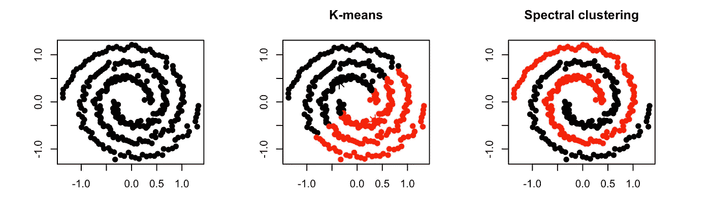

Figure 1

# **谱聚类是如何工作的？**

在谱聚类中，数据点被视为图的节点。因此，聚类被视为一个图划分问题。然后，节点被映射到一个低维空间，该空间可以很容易地被分离以形成集群。需要注意的重要一点是，没有对集群的形状/形式进行假设。

# 谱聚类的步骤是什么？

> 谱聚类包括 3 个步骤:
> 1 .计算相似度图
> 2。将数据投影到低维空间
> 3。创建集群

## **步骤 1——计算相似度图:**

我们先创建一个无向图 G = (V，E)，顶点集 V = { *v1，v2，…，vn* } = 1，2，…，n 个数据中的观测值。这可以由邻接矩阵来表示，该矩阵以每个顶点之间的相似性作为其元素。为此，我们可以计算:

**1)ε-邻域图:**这里我们连接所有成对距离小于ε的点。由于所有连接点之间的距离大致相同(最多为ε),对边进行加权不会将更多的数据信息合并到图表中。因此，ε-邻域图通常被认为是一个不加权的图。

**2) KNN 图:**这里我们用 K 个最近邻连接顶点 *vi* 和顶点 *vj* 如果 *vj* 在 *vi* 的 K 个最近邻中。
但是如果最近的邻居不是对称的，我们可能会有一个问题，即如果有一个顶点 *vi* 以 *vj* 作为最近的邻居，那么 *vi* 不一定是 *vj* 的最近邻居。因此，我们最终得到一个有向图，这是一个问题，因为我们不知道在这种情况下两点之间的相似性意味着什么。有两种方法可以使这个图没有方向。
第一种方法是简单地忽略边的方向，即如果 *vi* 是 *vj* 的 k 个最近邻居之一，或者如果 *vj* 是 *vi* 的 k 个最近邻居之一，我们用一条无向边连接 *vi* 和 *vj* 。得到的图就是通常所说的 k 近邻图。
第二个选择是连接顶点 *vi* 和 *vj* ，如果 *vi* 都是 *vj* 的 k 个最近邻，并且 *vj* 是 *vi* 的 k 个最近邻。得到的图称为互 k 近邻图。
在这两种情况下，在连接适当的顶点后，我们通过相邻点的相似性对边进行加权。

**3)全连通图**:为了构建这个图，我们简单地将所有的点相互连接起来，我们通过相似度 *sij* 对所有的边进行加权。该图应该模拟局部邻域关系，因此使用相似性函数，例如高斯相似性函数。

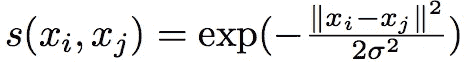

这里，参数σ控制邻域的宽度，类似于ε-邻域图中的参数ε。

因此，当我们为这些图中的任何一个创建邻接矩阵时，当这些点靠近时， *Aij* ~ 1，如果这些点远离，则 *Aij* → 0。
考虑以下具有节点 1 至 4、权重(或相似度) *wij* 及其邻接矩阵的图:

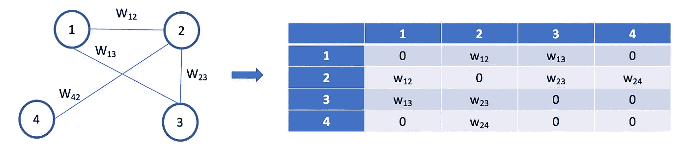

L: Graph, R: n x n symmetric adjacency matrix

## 步骤 2 —将数据投影到低维空间:

**正如我们在图 1 中看到的，同一聚类中的数据点也可能相距很远——甚至比不同聚类中的点更远** *。*我们的目标是转换空间，这样当两个点靠近时，它们总是在同一个簇中，当它们远离时，它们在不同的簇中。我们需要把我们的观察投射到一个低维空间。为此，我们计算了[图拉普拉斯](https://en.wikipedia.org/wiki/Laplacian_matrix)，这只是图的另一种矩阵表示，可以用于发现图的有趣属性。这可以计算为:

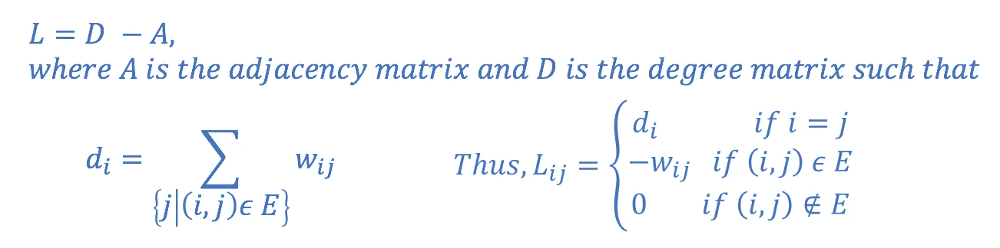

Computing Graph Laplacian

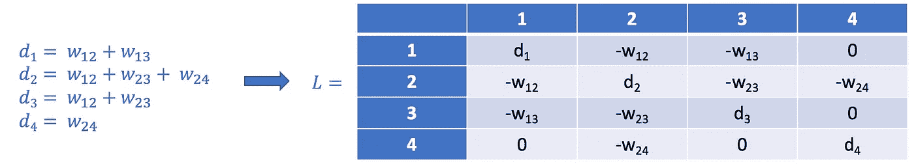

Graph Laplacian for our example above

计算图拉普拉斯 L 的全部目的是找到它的特征值和特征向量，以便将数据点嵌入到低维空间中。所以现在，我们可以继续寻找[特征值](https://en.wikipedia.org/wiki/Eigenvalues_and_eigenvectors)。我们知道:

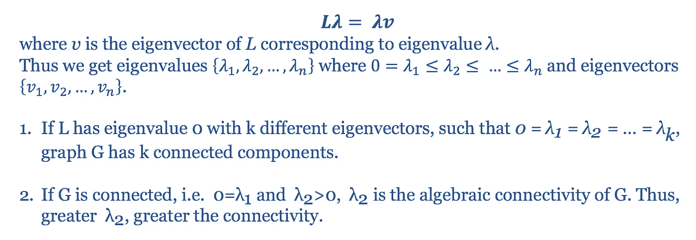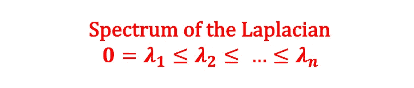

让我们考虑一个数字的例子:

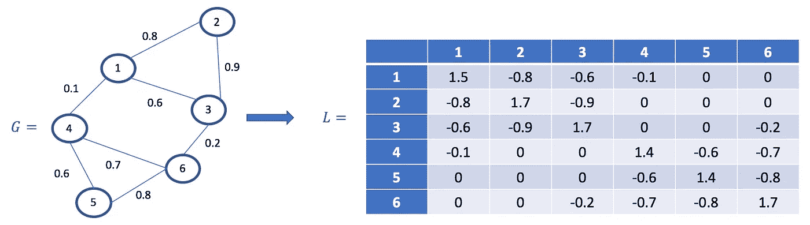

然后我们计算 l 的特征值和特征向量。

## 步骤 3 —创建集群:

对于这一步，我们使用对应于第二特征值的特征向量来给每个节点赋值。经计算，第二特征值为 0.189，相应的特征向量 v2 = [0.41，0.44，0.37，-0.4，-0.45，-0.37]。
为了获得二分聚类(两个不同的聚类)，我们首先将 v2 的每个元素分配给节点，使得 *{node1:0.41，node2:0.44，… node6: -0.37}* 。然后，我们分割节点，使得值为> 0 的所有节点都在一个集群中，而所有其他节点都在另一个集群中。因此，在这种情况下，我们在一个集群中得到节点 1，2 & 3，在第二个集群中得到 4，5 & 6。

> 值得注意的是，第二个特征值表示图中节点的连接紧密程度。对于好的、干净的划分，第二特征值越低，聚类越好。

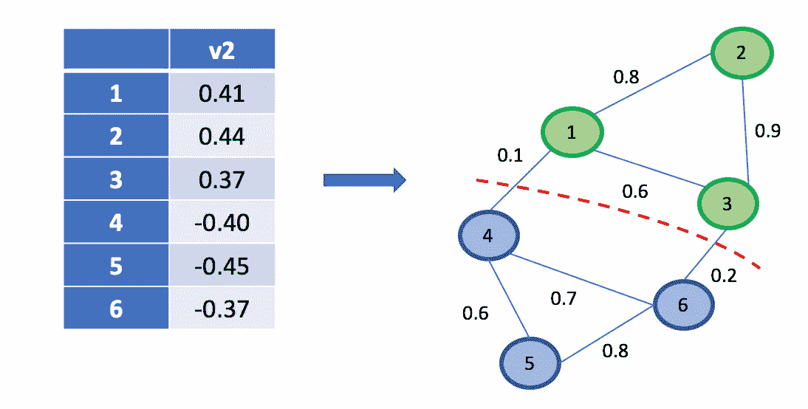

Eigenvector v2 gives us bipartite clustering.

## 对于 *k* 簇，我们必须修改我们的拉普拉斯算子以使其规范化。

因此我们得到:

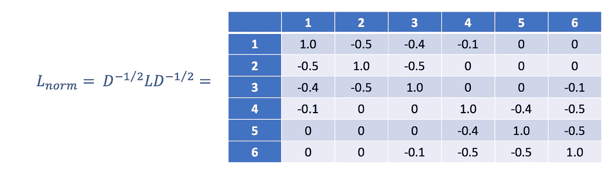

Normalized Laplacian — Ng, Jordan, Weiss

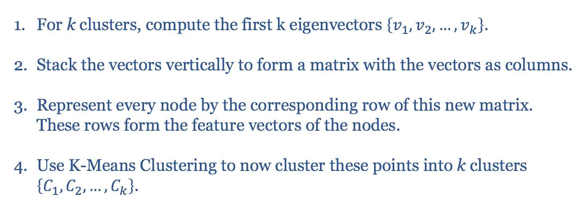

# 谱聚类的优缺点

## 优势:

1.  不对聚类的统计数据做出强有力的假设-聚类技术(如 K-Means 聚类)假设分配给聚类的点是关于聚类中心的球形。这是一个很强的假设，并不总是相关的。在这种情况下，谱聚类有助于创建更准确的聚类。
2.  易于实现并给出良好的聚类结果。它可以正确地对实际上属于同一类但由于维数减少而比其他类中的观测值更远的观测值进行聚类。
3.  对于几千个元素的稀疏数据集来说相当快。

## 缺点:

1.  在最后一步中使用 K-Means 聚类意味着聚类不总是相同的。它们可以根据初始质心的选择而变化。
2.  对于大型数据集，计算成本很高—这是因为需要计算特征值和特征向量，然后我们必须对这些向量进行聚类。对于大型密集数据集，这可能会大大增加时间复杂度。

在这篇博客中，我解释了谱聚类背后的数学原理。欢迎任何反馈或建议！同时，一定要看看我的其他博客。

# 参考

1.  [https://calculated content . com/2012/10/09/spectral-clustering/](https://calculatedcontent.com/2012/10/09/spectral-clustering/)
2.  【http://ai.stanford.edu/~ang/papers/nips01-spectral.pdf 
3.  [https://www.youtube.com/watch?v=zkgm0i77jQ8](https://www.youtube.com/watch?v=zkgm0i77jQ8)

# **关于我**

一名数据科学家，目前正在保护 AWS 客户免受欺诈。以前的工作是为金融领域的企业构建预测和推荐算法。
**领英:**[**https://www.linkedin.com/in/neerja-doshi/**](https://www.linkedin.com/in/neerja-doshi/)