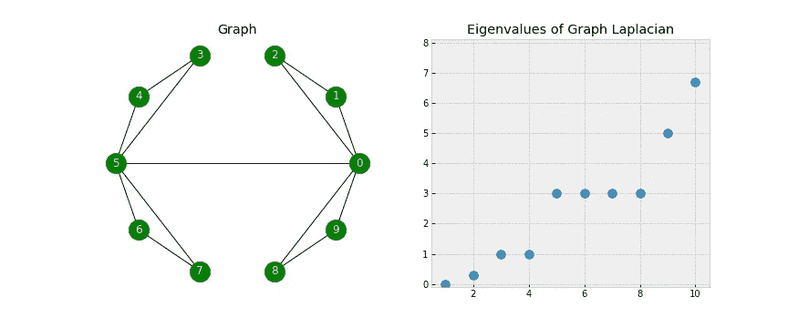
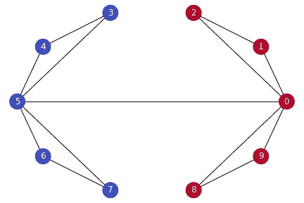
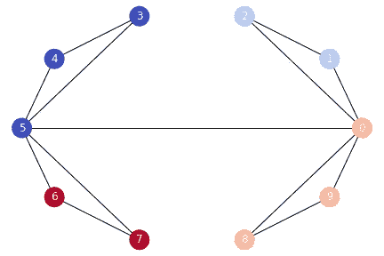
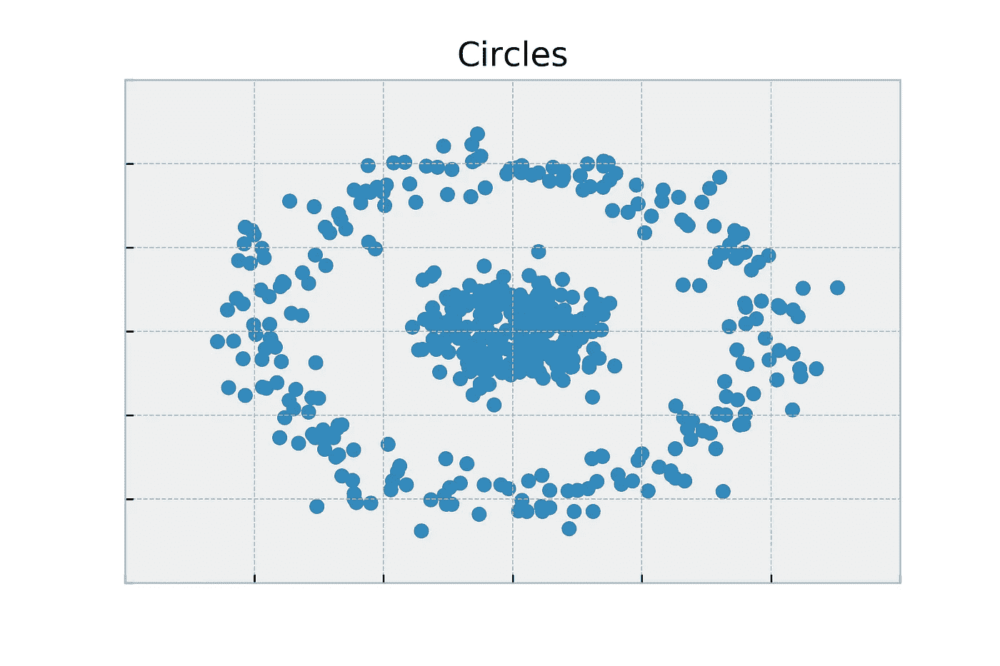
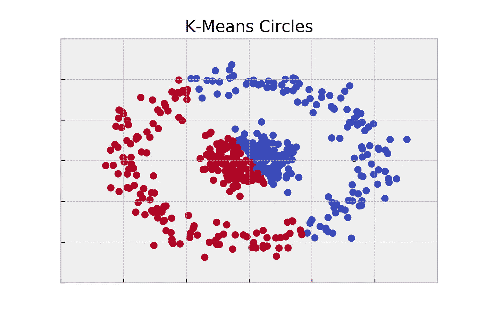
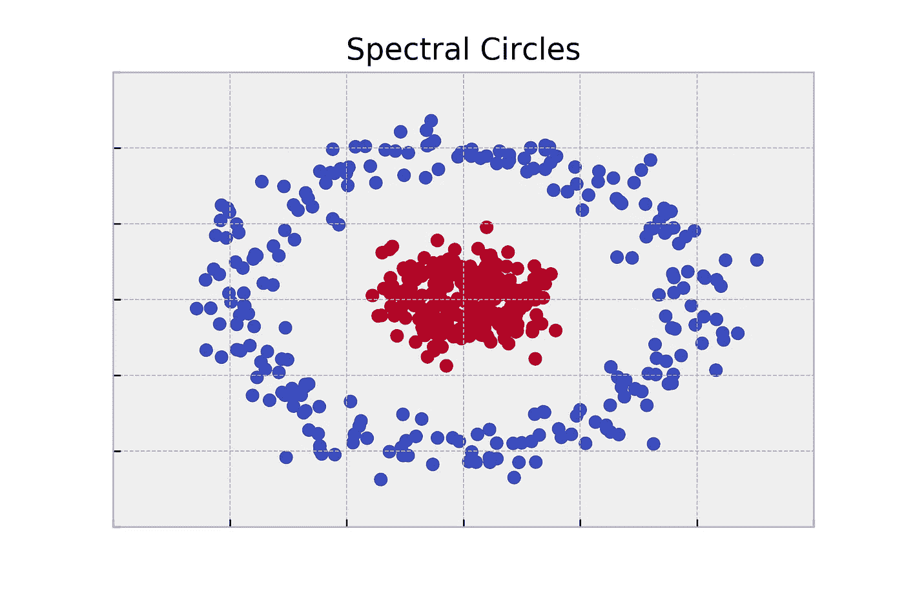

# 谱聚类

> 原文：<https://towardsdatascience.com/spectral-clustering-aba2640c0d5b?source=collection_archive---------0----------------------->

## 基础与应用

# 介绍

在这篇文章中，我们将讨论图表和其他数据的谱聚类的来龙去脉。聚类是无监督机器学习的主要任务之一。目标是将未标记的数据分配到组中，其中相似的数据点有希望被分配到同一个组中。

谱聚类是一种源于图论的技术，该方法用于根据连接节点的边来识别图中的节点社区。该方法是灵活的，并且允许我们对非图形数据进行聚类。

谱聚类使用从图或数据集构建的特殊矩阵的特征值(谱)的信息。我们将学习如何构建这些矩阵，解释它们的光谱，并使用特征向量将我们的数据分配给聚类。

# 特征向量和特征值

这个讨论的关键是特征值和特征向量的概念。对于矩阵 A，如果存在一个不全是 0 的向量 x 和一个标量λ，使得 Ax = λx，则称 x 是 A 的一个具有相应特征值λ的特征向量。

我们可以认为矩阵 A 是一个将向量映射到新向量的函数。当 A 作用于大多数向量时，它们最终会到达完全不同的地方，但是本征向量只改变了大小。如果你画一条穿过原点和特征向量的线，那么在映射之后，特征向量仍然会落在这条线上。向量沿直线缩放的量取决于λ。

使用 Python 中的 numpy，我们可以很容易地找到矩阵的特征值和特征向量:

Finding eigenvectors in Python.

特征向量是线性代数的重要组成部分，因为它们有助于描述由矩阵表示的系统的动力学。有许多应用利用特征向量，我们将在这里直接使用它们来执行谱聚类。

# 图表

图表是表示多种类型数据的自然方式。图是一组节点和连接这些节点的一组相应的边。这些边可以是有向的或无向的，甚至可以具有与其相关联的权重。

互联网上的路由器网络可以很容易地用图来表示。路由器是节点，边是路由器对之间的连接。有些路由器可能只允许一个方向的流量，因此可以通过定向边来表示流量可以流向哪个方向。边上的权重可以表示沿该边可用的带宽。有了这种设置，我们就可以查询该图，找到通过网络将数据从一台路由器传输到另一台路由器的有效路径。

让我们使用下面的无向图作为运行示例:

Graph with two disconnected components.

这个图有 10 个节点和 12 条边。它还有两个相连的分量{0，1，2，8，9}和{3，4，5，6，7}。连通分量是节点的最大子图，所有节点都有到子图中其余节点的路径。

如果我们的任务是将这些节点分配给社区或集群，那么连接的组件似乎很重要。一个简单的想法是让每个连接的组件成为自己的集群。对于我们的示例图来说，这似乎是合理的，但是整个图可能是连通的，或者连通的组件非常大。在一个连接的组件中也可能有更小的结构，它们是社区的良好候选。我们将很快看到这种连通分量思想对于谱聚类的重要性。

## 邻接矩阵

我们可以将示例图表示为邻接矩阵，其中行和列索引表示节点，条目表示节点之间边的存在与否。我们的示例图的邻接矩阵如下所示:

在矩阵中，我们看到第 0 行第 1 列的值为 1。这意味着存在连接节点 0 和节点 1 的边。如果边是加权的，那么边的权重将出现在这个矩阵中，而不是只有 1 和 0。因为我们的图是无向的，所以第 I 行第 j 列的条目将等于第 j 行第 I 列的条目。最后要注意的是，这个矩阵的对角线都是 0，因为我们的节点都没有自己的边。

## 次数矩阵

一个节点的度就是有多少条边连接到它。在有向图中，我们可以谈论入度和出度，但是在这个例子中，我们只有度，因为边是双向的。查看我们的图，我们看到节点 0 的度为 4，因为它有 4 条边。我们也可以通过对邻接矩阵中的节点行求和来得到度。

度矩阵是对角矩阵，其中条目(I，I)处的值是节点 I 的度。让我们为我们的示例找到度矩阵:

首先，我们对邻接矩阵的轴 1(行)求和，然后将这些值放入对角矩阵中。从度矩阵中我们不难看出，节点 0 和 5 有 4 条边，而其余节点只有 2 条。

## 图拉普拉斯算子

现在我们要计算拉普拉斯图。拉普拉斯算子只是图的另一种矩阵表示。它有几个漂亮的属性，我们将利用这些属性进行谱聚类。为了计算正常的拉普拉斯算子(有几种变体)，我们只需从我们的度矩阵中减去邻接矩阵:

拉普拉斯的对角线是我们的节点的度，而非对角线是负的边权重。这是我们在执行谱聚类时所追求的表示。

## 图拉普拉斯的特征值

如前所述，拉普拉斯有一些美丽的属性。为了对此有所了解，让我们在向我们的图添加边时，检查与拉普拉斯相关联的特征值:

Eigenvalues of Graph Laplacian.

我们看到，当图完全不连通时，我们的十个特征值都是 0。当我们添加边时，我们的一些特征值增加。其实 0 特征值的个数对应的是我们图中连通分支的个数！

仔细观察添加的最终边，将两个组件连接成一个。当这种情况发生时，除了一个特征值之外，所有的特征值都被提升:

Number of 0-eigenvalues is number of connected components.

第一个特征值是 0，因为我们只有一个连通分量(整个图是连通的)。相应的特征向量将总是具有恒定值(在这个例子中，所有的值都接近 0.32)。

第一个非零特征值称为谱隙。光谱间隙给了我们一些图形密度的概念。如果这个图是密集连接的(10 个节点的所有对都有一条边)，那么谱间隙将是 10。

第二个特征值叫做菲德勒值，对应的向量就是菲德勒向量。Fiedler 值近似于将图分成两个相连部分所需的最小图割。回想一下，如果我们的图已经是两个连通的部分，那么 Fiedler 值将是 0。Fiedler 向量中的每个值都为我们提供了关于该节点属于切割哪一侧的信息。让我们根据字段向量中的条目是否为正来给节点着色:

Nodes colored based on whether their entry in the Fiedler Vector is >0.

这个简单的技巧将我们的图形分成了两个集群！为什么会这样？记住零特征值代表连通分量。接近零的特征值告诉我们，两个分量几乎是分开的。这里我们有一条边，如果它不存在，我们会有两个独立的部分。所以第二特征值很小。

总结一下我们目前所知道的:第一个特征值是 0，因为我们有一个连通分支。第二个特征值接近于 0，因为我们离有两个连通分量还差一条边。我们还看到，与该值相关联的向量告诉我们如何将节点分成那些近似连接的组件。

你可能已经注意到接下来的两个特征值也很小。这告诉我们，我们“接近”拥有四个独立的连接组件。一般来说，我们经常寻找特征值之间的第一个大间隙，以便找到我们的数据中表示的聚类数。看到特征值四和特征值五的差距了吗？

在间隙之前具有四个特征值表明可能有四个集群。与前三个正特征值相关联的向量应该给我们关于在图中需要进行哪三个切割以将每个节点分配给四个近似分量之一的信息。让我们从这三个向量构建一个矩阵，并执行 K 均值聚类来确定分配:

Spectral Clustering for 4 clusters.

该图被分割成四个象限，节点 0 和 5 被任意分配给它们相连的象限之一。这真的很酷，这就是谱聚类！

总而言之，我们首先用我们的图建立一个邻接矩阵。然后，我们通过从度矩阵中减去邻接矩阵来创建图拉普拉斯算子。拉普拉斯算子的特征值表明有四个聚类。与这些特征值相关联的向量包含关于如何分割节点的信息。最后，我们对这些向量进行 K-Means 运算，以获得节点的标签。接下来，我们将看到如何对任意数据执行此操作。

# 任意数据的谱聚类

看下面的数据。这些点是从添加了一些噪声的两个同心圆中画出的。我们希望有一种算法能够将这些点聚集成产生它们的两个圆。

Circles Data.

这些数据不是以图表的形式出现的。所以首先，让我们尝试一个类似 K-Means 的切饼算法。K-Means 将找到两个质心，并根据它们最接近的质心来标记这些点。结果如下:

K-Means Clustering of the Circles Data.

很明显，K-Means 没用。它基于欧几里得距离进行操作，并假设聚类大致是球形的。这些数据(通常是真实世界的数据)打破了这些假设。让我们尝试用谱聚类来解决这个问题。

## 最近邻图

有几种方法可以把我们的数据当作图表。最简单的方法是构造一个 k 近邻图。k-最近邻图将每个数据点视为图中的一个节点。然后，从每个节点到其在原始空间中的 k 个最近邻居画一条边。通常，该算法对 k 的选择不太敏感。较小的数字，如 5 或 10，通常工作得很好。

再次查看数据的图片，想象每个点都与其最近的 5 个邻居相连。外环中的任何一点都应该能够沿着环的路径前进，但是不会有任何路径进入内环。很容易看出这个图有两个相连的部分:外环和内环。

由于我们只将这些数据分成两个部分，我们应该能够使用之前的 Fiedler 向量技巧。下面是我用来对这些数据进行谱聚类的代码:

结果如下:

Spectral Clustering of the Circles Data.

## 其他方法

最近邻图是一种很好的方法，但是它依赖于“接近的”点应该属于同一个聚类的事实。根据你的数据，这可能不是真的。更一般的方法是构造一个亲和矩阵。相似矩阵就像邻接矩阵，除了一对点的值表示这些点彼此有多相似。如果成对的点非常不相似，那么相似度应该是 0。如果这些点是相同的，那么相似性可能是 1。通过这种方式，亲和度的作用就像是我们图中边的权重。

如何判断两个数据点相似意味着什么是机器学习中最重要的问题之一。通常领域知识是构建相似性度量的最佳方式。如果你能接触到领域专家，问他们这个问题。

还有专门学习如何直接从数据构建相似性度量的整个领域。例如，如果您有一些带标签的数据，您可以训练分类器根据两个输入是否具有相同的标签来预测它们是否相似。然后，该分类器可用于为成对的未标记点分配相似性。

# 结论

我们已经讨论了图和任意数据的谱聚类的理论和应用。当您的数据不满足其他常用算法的要求时，谱聚类是一种灵活的查找聚类的方法。

首先，我们在数据点之间形成了一个图表。图表的边捕捉了点之间的相似性。然后，可以使用图拉普拉斯的特征值来寻找最佳数量的聚类，并且可以使用特征向量来寻找实际的聚类标签。

我希望你喜欢这篇文章，并发现谱聚类在你的工作或探索中有用。

下次见！