# 分类特征的光谱编码

> 原文：<https://towardsdatascience.com/spectral-encoding-of-categorical-features-b4faebdf4a?source=collection_archive---------19----------------------->

## 另一种实现实体嵌入的方法


Photo by [Kelly Sikkema](https://unsplash.com/@kellysikkema?utm_source=unsplash&utm_medium=referral&utm_content=creditCopyText) on [Unsplash](https://unsplash.com/search/photos/list?utm_source=unsplash&utm_medium=referral&utm_content=creditCopyText)

大约一年前，我在做一个回归模型，它有超过一百万个特征。不用说，训练超级慢，模型过度拟合了很多。在调查了这个问题之后，我意识到大多数特征是使用分类特征的 1-hot 编码创建的，其中一些具有数万个唯一值。

将分类特征映射到低维空间的问题并不新鲜。最近流行的处理方法之一是使用神经网络的实体嵌入层。然而，该方法假设使用神经网络。如果我们决定使用基于树的算法呢？在这种情况下，我们可以使用谱图理论方法来创建分类特征的低维嵌入。

这个想法来自于谱词嵌入、谱聚类和谱降维算法。如果您可以定义分类特征的不同值之间的相似性度量，我们可以使用谱分析方法来找到分类特征的低维表示。

根据相似性函数(或核函数),我们可以构建邻接矩阵，它是对称矩阵，其中 ij 元素是类别值 I 和 j 之间的核函数的值:

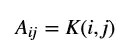

很重要的一点，我只需要一个核函数，不需要高维表示。这意味着 1-hot 编码步骤在这里是不必要的。同样，对于基于核的机器学习方法，分类变量编码步骤也不是必需的，因为重要的是两点之间的核函数，其可以使用单独的核函数来构建。

一旦邻接矩阵被构建，我们可以构建度矩阵:

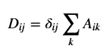

这里 *δ* 是克罗内克δ符号。拉普拉斯矩阵是两者之差:

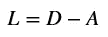

并且归一化拉普拉斯矩阵被定义为:

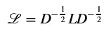

根据谱图理论，我们继续进行归一化拉普拉斯矩阵的特征分解。零特征值的数量对应于连通分量的数量。在我们的例子中，假设我们的分类特征有两组完全不同的值。这意味着，如果 I 和 j 属于不同的组，则核函数 K(i，j)为零。在这种情况下，我们将有两个归一化拉普拉斯矩阵的零特征值。

如果只有一个连通分量，我们将只有一个零特征值。通常情况下，它不提供信息，为了防止要素的多重共线性而被删除。然而，如果我们计划使用基于树的模型，我们可以保留它。

较低的特征值对应于“平滑的”特征向量(或模式)，其更紧密地遵循相似性函数。我们希望只保留这些特征向量，丢弃具有较高特征值的特征向量，因为它们更可能代表噪声。在矩阵谱中寻找一个缺口并挑选缺口以下的特征值是非常常见的。所得的截短的特征向量可以被归一化，并表示分类特征值的嵌入。

作为一个例子，让我们考虑星期几。1-热编码假设每天都与其他任何一天相似(K(i，j)=1)。这不是一个可能的假设，因为我们知道一周中的日子是不同的。例如，酒吧的上座率在星期五和星期六达到高峰(至少在美国)，因为第二天是周末。标签编码也是不正确的，因为它会使周一和周三之间的“距离”比周一和周二之间的距离高两倍。而且周日和周一的“距离”会高 6 倍，即使这几天是挨着的。顺便说一下，标签编码对应于核 K(i，j)= exp(γ| ij |)

我们将考虑一个例子，其中工作日彼此相似，但与周末有很大不同。

```
array([[ 0, 10,  9,  8,  5,  2,  1],
       [10,  0, 10,  9,  5,  2,  1],
       [ 9, 10,  0, 10,  8,  2,  1],
       [ 8,  9, 10,  0, 10,  2,  1],
       [ 5,  5,  8, 10,  0,  5,  3],
       [ 2,  2,  2,  2,  5,  0, 10],
       [ 1,  1,  1,  1,  3, 10,  0]])
```

```
array([[ 1\.        , -0.27788501, -0.24053512, -0.21380899, -0.14085904, -0.07049074, -0.040996  ],
       [-0.27788501,  1\.        , -0.25993762, -0.23394386, -0.13699916, -0.06855912, -0.03987261],
       [-0.24053512, -0.25993762,  1\.        , -0.25      , -0.21081851, -0.06593805, -0.03834825],
       [-0.21380899, -0.23394386, -0.25      ,  1\.        , -0.26352314, -0.06593805, -0.03834825],
       [-0.14085904, -0.13699916, -0.21081851, -0.26352314,  1\.        , -0.17376201, -0.12126781],
       [-0.07049074, -0.06855912, -0.06593805, -0.06593805, -0.17376201,  1\.        , -0.50572174],
       [-0.040996  , -0.03987261, -0.03834825, -0.03834825, -0.12126781, -0.50572174,  1\.        ]])
```

```
array([0\.        , 0.56794799, 1.50908645, 1.08959831, 1.3053149 , 1.25586378, 1.27218858])
```

注意，这里的特征值没有排序。让我们画出特征值，忽略无信息的零。

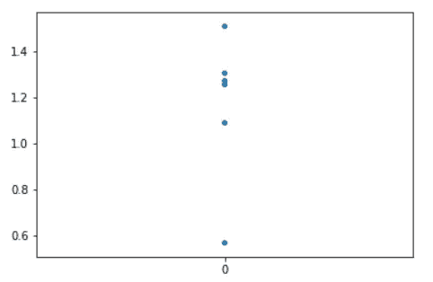

我们可以看到第一个特征值和其他特征值之间有一个相当大的差距。如果这不能给出足够的模型性能，您可以包括第二个特征值，因为它和更高的特征值之间的差距也相当大。

让我们打印所有的特征向量:

```
array([[ 0.39180195,  0.22866879,  0.01917247, -0.45504284,  0.12372711, -0.41844908, -0.62957304],
       [ 0.40284079,  0.24416078,  0.01947223, -0.4281388 , -0.53910465, -0.01139734,  0.55105271],
       [ 0.41885391,  0.23795901, -0.0032909 , -0.00102155,  0.24759021,  0.82656956, -0.15299308],
       [ 0.41885391,  0.21778112, -0.01536901,  0.36430356,  0.56996731, -0.36551902,  0.43094387],
       [ 0.39735971, -0.02474713,  0.07869969,  0.66992782, -0.54148697, -0.08518483, -0.29331097],
       [ 0.3176117 , -0.61238751, -0.71702346, -0.09280736,  0.02933834,  0.00752668,  0.02123917],
       [ 0.27305934, -0.63907128,  0.69187421, -0.13963728,  0.11758088,  0.02521838,  0.06615712]])
```

看第二个特征向量。周末值的大小与工作日不同，星期五接近于零。这证明了星期五的过渡作用，因为它是一周中的一天，也是周末的开始。

如果我们要挑选两个最低的非零特征值，我们的分类特征编码将产生这些类别向量:

```
array([[ 0.22866879, -0.45504284],
       [ 0.24416078, -0.4281388 ],
       [ 0.23795901, -0.00102155],
       [ 0.21778112,  0.36430356],
       [-0.02474713,  0.66992782],
       [-0.61238751, -0.09280736],
       [-0.63907128, -0.13963728]])
```

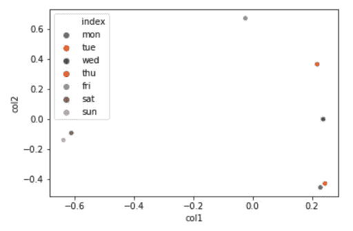

在上面的图中，我们看到星期一和星期二，以及星期六和星期天聚集在一起，而星期三，星期四和星期五相距很远。

# 学习核函数

在前面的例子中，我们假设相似性函数是给定的。有时就是这种情况，可以根据业务规则来定义。然而，从数据中学习它是可能的。

计算内核的方法之一是使用 Kullback-Leibler 散度:

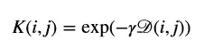

其中 D 是对称 KL 散度:

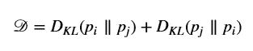

这里 pi 是给定类别值 I 的数据的概率:

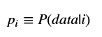

其思想是为分类变量的每个值估计数据分布(包括目标变量，但不包括分类变量)。如果两个值的分布相似，那么散度将很小，相似度值将很大。请注意，γ是一个超参数，必须进行调整

尝试这种方法将会使用[白酒销售数据集](https://www.kaggle.com/residentmario/iowa-liquor-sales/downloads/iowa-liquor-sales.zip/1)。为了保持文件小，我删除了一些列并聚合了数据。

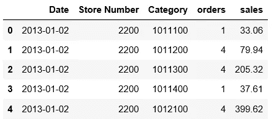

因为我们关心销售，所以让我们使用来自销售列的信息对星期几进行编码。让我们首先检查直方图:

```
sns.distplot(liq.sales, kde=False);
```

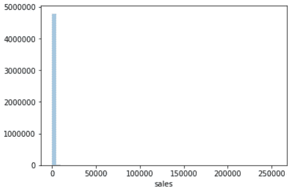

我们看到分布非常不均匀，所以让我们尝试使用销售记录列来代替

```
sns.distplot(np.log10(1+liq.sales), kde=False);
```

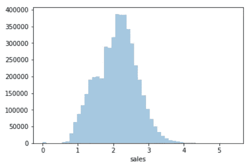

这样好多了。因此，我们将使用日志进行分发

```
liq["log_sales"] = np.log10(1+liq.sales)
```

这里我们将跟随[这篇博客](https://amethix.com/entropy-in-machine-learning/)来计算库尔巴克-莱布勒散度。还要注意，因为星期天没有酒类销售，我们认为一周只有六天

```
array([[0.00000000e+00, 8.77075038e-02, 4.67563784e-02, 4.73455185e-02, 4.36580887e-02, 1.10008520e-01],
       [8.77075038e-02, 0.00000000e+00, 6.33458241e-03, 6.12091647e-03, 7.54387432e-03, 1.24807509e-03],
       [4.67563784e-02, 6.33458241e-03, 0.00000000e+00, 1.83170834e-06, 5.27510292e-05, 1.32091396e-02],
       [4.73455185e-02, 6.12091647e-03, 1.83170834e-06, 0.00000000e+00, 7.42423681e-05, 1.28996949e-02],
       [4.36580887e-02, 7.54387432e-03, 5.27510292e-05, 7.42423681e-05, 0.00000000e+00, 1.49325072e-02],
       [1.10008520e-01, 1.24807509e-03, 1.32091396e-02, 1.28996949e-02, 1.49325072e-02, 0.00000000e+00]])
```

正如我们已经提到的，必须调整超参数γ。在这里，我们只选择能够给出合理结果的值

```
gamma = 20
kernel = np.exp(-gamma * kl_matrix)
np.fill_diagonal(kernel, 0)
kernelarray([[0\.        , 0.17305426, 0.39253579, 0.38793776, 0.41762901, 0.11078428],
       [0.17305426, 0\.        , 0.88100529, 0.88477816, 0.85995305, 0.97534746],
       [0.39253579, 0.88100529, 0\.        , 0.99996337, 0.99894554, 0.76783317],
       [0.38793776, 0.88477816, 0.99996337, 0\.        , 0.99851625, 0.77259995],
       [0.41762901, 0.85995305, 0.99894554, 0.99851625, 0\.        , 0.74181889],
       [0.11078428, 0.97534746, 0.76783317, 0.77259995, 0.74181889, 0\.        ]])norm_lap = normalized_laplacian(kernel)
sz, sv = np.linalg.eig(norm_lap)
szarray([1.11022302e-16, 9.99583797e-01, 1.22897829e+00, 1.27538999e+00, 1.24864532e+00, 1.24740260e+00])
```

在[18]中:

```
sns.stripplot(data=sz[1:], jitter=False, );
```

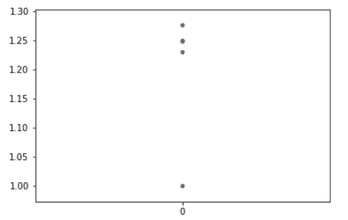

忽略零特征值，我们可以看到第一个特征值和其余特征值之间有更大的差距，尽管值都在 1 到 1.3 之间的范围内。

最终，要使用的特征向量的数量是另一个超参数，应该在监督学习任务中进行优化。Category 字段是进行光谱分析的另一个候选字段，并且可能是更好的选择，因为它有更多的唯一值

```
len(liq.Category.unique())107
```

```
array([[0.00000000e+00, 1.01321384e-02, 2.38664557e-01, ..., 5.83930416e-02, 2.05621708e+01, 4.44786939e-01],
       [1.01321384e-02, 0.00000000e+00, 1.50225839e-01, ..., 1.17178087e-01, 2.24843754e+01, 5.89215704e-01],
       [2.38664557e-01, 1.50225839e-01, 0.00000000e+00, ..., 5.33952956e-01, 2.95549456e+01, 1.33572924e+00],
       ...,
       [5.83930416e-02, 1.17178087e-01, 5.33952956e-01, ..., 0.00000000e+00, 1.59700549e+01, 1.80637715e-01],
       [2.05621708e+01, 2.24843754e+01, 2.95549456e+01, ..., 1.59700549e+01, 0.00000000e+00, 8.58405693e+00],
       [4.44786939e-01, 5.89215704e-01, 1.33572924e+00, ..., 1.80637715e-01, 8.58405693e+00, 0.00000000e+00]])
```

```
plot_eigenvalues(100);
```

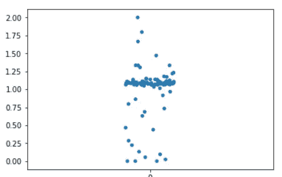

我们可以看到，许多特征值都集中在 1.1 标记附近。低于该聚类的特征值可以用于编码类别特征。请注意，该方法对超参数γ的选择非常敏感。为了说明，让我选择一个较高和较低的伽玛

```
plot_eigenvalues(7000);
```

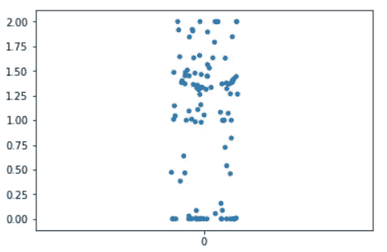

```
plot_eigenvalues(10)
```

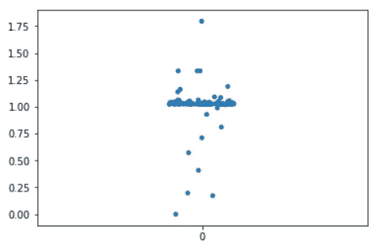

# 结论和下一步措施

我们提出了一种方法来编码的分类特征作为一个低维向量，保留了大部分的特征相似性信息。为此，我们对分类特征的值使用频谱分析的方法。为了找到核函数，我们可以使用试探法，或者使用各种方法来学习它，例如，使用以类别值为条件的数据分布的 kull back-lei bler 散度。为了选择特征向量的子集，我们使用了 gap 分析，但我们真正需要的是通过分析各种数据集以及分类和回归问题来验证这种方法。我们还需要将其与其他编码方法进行比较，例如，使用神经网络的实体嵌入。我们使用的核函数也可以包括关于类别频率的信息，这将帮助我们处理高信息，但低频率值。

**更新 07/04/2019:** 计算相似度函数更好的方法是使用 Wasserstein 距离，而不是对称的 kull back-lei bler 散度。更新后的代码可以在[我的 github 库](https://github.com/mlarionov/machine_learning_POC/blob/master/spectral-analysis/spectral-encoding-of-categorical-features.ipynb)中找到。