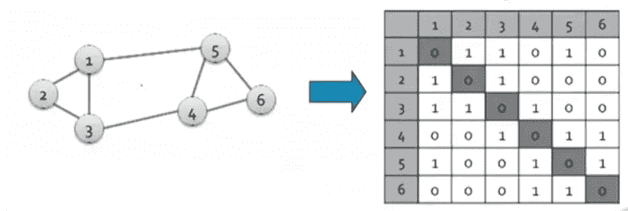
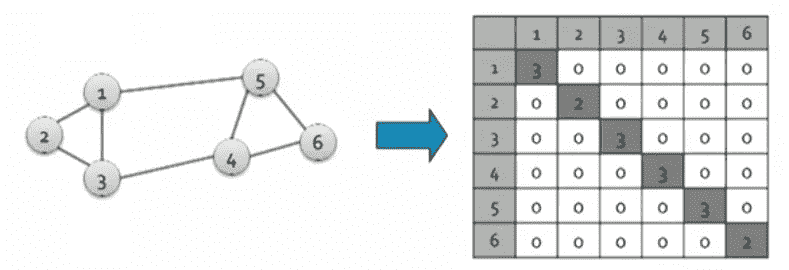
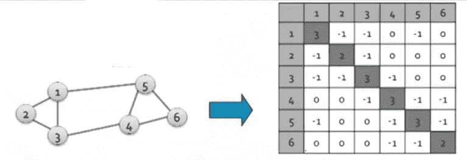
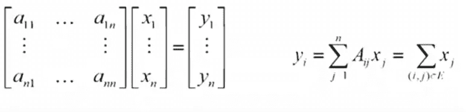
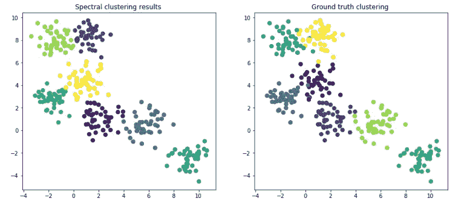
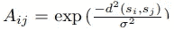
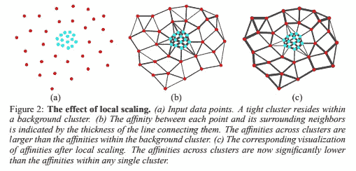
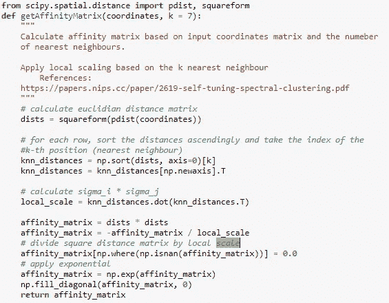
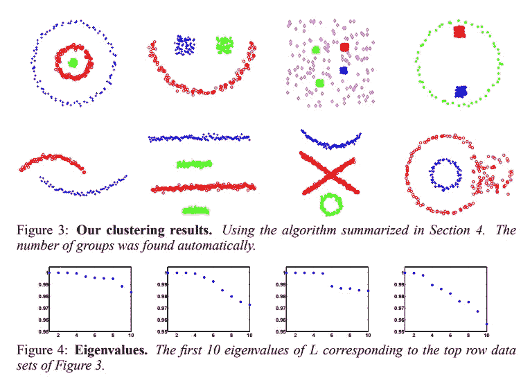
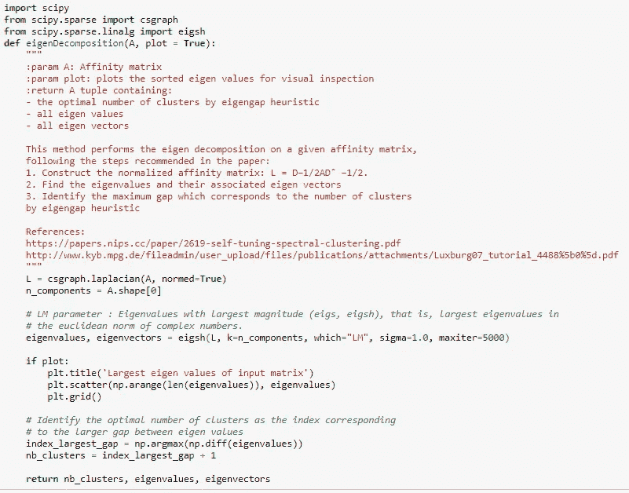

# 谱图聚类和最优聚类数估计

> 原文：<https://towardsdatascience.com/spectral-graph-clustering-and-optimal-number-of-clusters-estimation-32704189afbe?source=collection_archive---------1----------------------->

## 谱图聚类概述和特征间隙启发式算法的 python 实现


这篇文章解释了谱图聚类算法的功能，然后看了一个名为*自调优图聚类*的变体。这种调整的优点在于提供了对最佳聚类数的估计，以及对数据点之间的相似性度量的估计。接下来，我们将基于输入数据的拉普拉斯算子的连续特征值之间的最大距离，提供对数据集中最优聚类数的**特征间隙启发式**计算的实现。

现在让我们从介绍一些基本的图论概念开始。

# 邻接矩阵(A)

给定一个具有 *n* 个顶点和 *m* 个节点的图，邻接矩阵是一个 n*n 的方阵，其性质为:

如果节点 I 和节点 j 之间有边，则 A[i][j] = 1，否则为 0



因为 A 是对称的，所以它的本征向量是实数且正交的(点积为 0)。

# 度矩阵

度矩阵是具有属性的 n*n 对角矩阵

d[i][i] =节点 I 中相邻边的数目或节点 I 的度

**d[i][j] = 0**

****

# **拉普拉斯矩阵**

**拉普拉斯矩阵是 n*n 矩阵，定义为: **L = D -A****

**其**特征值是正实数**，而**特征向量是实数且正交的**(两个向量的点积为 0)**

****

# ****电导****

**相对于组的密度(指向簇外的边的数量除以簇中节点的度数之和)，衡量组与网络其余部分的连通性。电导越低，簇越好。**

**用 x 计算 A 的特征值和特征向量(用节点的值计算 n 维向量):**A * x =λ* x****

****

**表示图 G 的矩阵的谱是由相应特征值λI 排序的图的一组特征向量 xi**

**既然我们已经介绍了图论中最重要的构件，我们就可以总结谱聚类的步骤了:**

1.  **计算输入图 **G** 的拉普拉斯矩阵 **L****
2.  **计算特征值(λ)和特征向量(x ),使得**

****L * x =λ* x****

**3.选择对应于最大特征值的 n 个特征向量，并将输入空间重新定义为 n 维子空间**

**4.使用各种聚类算法，例如 k-means，在这个子空间中寻找聚类**

**也可以使用**相似矩阵**来代替上面定义的邻接矩阵，该矩阵确定我们的空间中的 2 个点有多接近或相似。按照 sklearn [实施](https://scikit-learn.org/dev/modules/clustering.html)中的定义:**

```
similarity = np.exp(-beta * distance / distance.std())
```

**演示亲和力矩阵创建的一个很好的资源是[这个](https://www.youtube.com/watch?v=P-LEH-AFovE) youtube 视频。**

**谱聚类和相似性传播都已经在 python 中实现。这个[木星笔记本](https://github.com/ciortanmadalina/high_noise_clustering/blob/master/spectral_clustering.ipynb)展示了它们的用法的快速演示。**

```
clustering = SpectralClustering(n_clusters=nb_clusters, assign_labels="discretize", random_state=0).fit(X)
y_pred = clustering.labels_
plt.title(f'Spectral clustering results ')
plt.scatter(X[:, 0], X[:, 1], s=50, c = y_pred);
```

****

**众所周知，谱聚类是一种性能良好的技术，特别是在非高斯聚类的情况下，在这种情况下，最常见的聚类算法(如 K-Means)不能给出良好的结果。然而，需要给定预期的聚类数和相似性阈值的参数。**

# ****自调谐光谱聚类****

**自调整谱聚类背后的思想是确定聚类的**最佳数量**以及在亲和矩阵的计算中使用的**相似性度量** **σi** 。**

**如本文[所述](https://papers.nips.cc/paper/2619-self-tuning-spectral-clustering.pdf)，亲和矩阵定义如下**

****

**其中 d(si，sj)是某个距离函数，通常只是向量 si 和 sj 之间的欧几里德距离。σ是比例参数，是点之间相似性的度量。通常是手动选择的。也可以通过使用不同的值多次运行聚类并选择产生最小失真聚类的值来自动设置。本文建议为每个数据点 si 计算局部缩放参数σi，而不是单个缩放参数。该论文提出分析每个点 si 的邻域，从而定义: **σi = d(si，sK)** 其中 sK 是点 si 的第 K 个邻域。下图说明了这一点，取自原始论文，K=7。**

****

**具有局部缩放的亲和度矩阵可以如下实现:**

****

**估计群集数量的第二种方法是分析特征值(L 的最大特征值将是数量为 1 的重复特征值，其重数等于组 C 的数量。这意味着可以通过计算等于 1 的特征值的数量来估计 C)。**

**如论文所示:**

****

**可以对特征向量进行另一种类型的分析，但这不在本文的讨论范围之内。**

# **寻找最佳聚类数的特征间隙启发式算法**

**本文[是一篇关于谱聚类的教程——Ulrike von lux burg](http://www.kyb.mpg.de/fileadmin/user_upload/files/publications/attachments/Luxburg07_tutorial_4488%5B0%5D.pdf)提出了一种基于**微扰理论**和**谱图论**的方法来计算最佳聚类数。特征间隙启发法表明，聚类数 k 通常由使特征间隙(连续特征值之间的差)最大化的 k 值给出。这个特征间隙越大，理想情况的特征向量越接近，因此谱聚类工作得越好。**

****

**这篇文章的代码库可以在 [Github](https://github.com/ciortanmadalina/high_noise_clustering/blob/master/spectral_clustering.ipynb) 上找到。**

****资源****

1.  **[https://www.youtube.com/watch?v=P-LEH-AFovE](https://www.youtube.com/watch?v=P-LEH-AFovE)**
2.  **[https://papers . nips . cc/paper/2619-self-tuning-spectral-clustering . pdf](https://papers.nips.cc/paper/2619-self-tuning-spectral-clustering.pdf)**
3.  **[http://www . kyb . mpg . de/file admin/user _ upload/files/publications/attachments/luxburg 07 _ tutorial _ 4488% 5b 0% 5d . pdf](http://www.kyb.mpg.de/fileadmin/user_upload/files/publications/attachments/Luxburg07_tutorial_4488%5b0%5d.pdf)**