# 逐步解释和实现光谱图卷积

> 原文：<https://towardsdatascience.com/spectral-graph-convolution-explained-and-implemented-step-by-step-2e495b57f801?source=collection_archive---------2----------------------->

## 作为“计算机视觉图形神经网络教程”的一部分

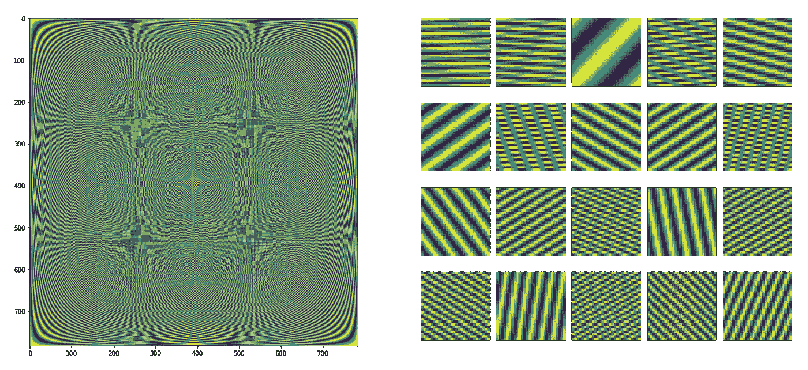

The Fourier basis (DFT matrix) on the left, in which each column or row is a basis vector, reshaped to 28×28 (on the right), i.e. 20 basis vectors are shown on the right. The Fourier basis is used to compute spectral convolution is signal processing. In graphs, the Laplacian basis is used described in this post.

首先，让我们回忆一下什么是图。图 *G* 是由有向/无向**边**连接的一组**节点**(顶点)。在这篇文章中，我将假设一个无向图 *G* 有 *N* 个节点。该图中的每个**节点**都有一个 *C* 维特征向量，所有节点的特征都表示为一个 *N* × *C* 维矩阵 *X⁽ˡ⁾.图的* **边**表示为一个 *N* × *N* 矩阵 a，其中条目 A *ᵢⱼ* 表示节点 *i* 是否连接(T30 邻接)到节点 *j* 。这个矩阵被称为*邻接矩阵*。

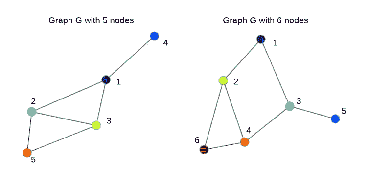

Two undirected graphs with N=5 and N=6 nodes. The order of nodes is arbitrary.

图的谱分析(参见课堂讲稿[这里](http://www.cs.yale.edu/homes/spielman/561/)和早期的工作[这里](https://papers.nips.cc/paper/1961-laplacian-eigenmaps-and-spectral-techniques-for-embedding-and-clustering))已经对图聚类、社区发现和其他*主要是无监督的*学习任务有用。在这篇文章中，我主要描述了[布鲁纳等人，2014，ICLR 2014](https://arxiv.org/abs/1312.6203) 的工作，他们将谱分析与卷积神经网络(ConvNets)相结合，产生了谱**图卷积网络**，它可以以*监督*的方式进行训练，例如用于图分类任务。

尽管*光谱*图形卷积目前与*空间*图形卷积方法相比使用较少，但了解光谱卷积的工作原理仍然有助于理解和避免其他方法的潜在问题。此外，在结论中，我提到了一些最近令人兴奋的工作，使谱图卷积更具竞争力。

# 1.拉普拉斯图和一点物理知识

虽然“频谱”听起来可能很复杂，但对于我们的目的来说，理解它仅仅意味着*将信号/音频/图像/图形分解为简单元素(小波、graphlets)的组合(通常是总和)就足够了。为了使这种*分解*具有一些好的特性，这些简单元素通常是*正交*，即相互线性独立，因此形成了*基*。*

当我们谈论信号/图像处理中的“频谱”时，我们指的是[傅立叶变换](https://en.wikipedia.org/wiki/Discrete_Fourier_transform)，它为我们提供了不同频率的基本正弦和余弦波的特定*基* ( [DFT 矩阵](https://en.wikipedia.org/wiki/DFT_matrix)，例如 Python 中的`scipy.linalg.dft`)，因此我们可以将信号/图像表示为这些波的总和。但是当我们谈论图和图神经网络(GNNs)时，“谱”意味着图拉普拉斯 [**的*本征分解***](https://en.wikipedia.org/wiki/Laplacian_matrix)***L .*你可以把图拉普拉斯 *L* 想象成一个以特殊方式归一化的邻接矩阵 *A* ，而*本征分解*是一种寻找那些基本正交分量的方法**

**直观地说，拉普拉斯图显示了如果我们在节点 *i* 中放置一些“势”,*如何平滑地*“能量”将在图中扩散。拉普拉斯在数学和物理中的一个典型用例是解决信号(波)如何在动态系统中传播。当邻居之间的值没有突然变化时，扩散是平滑的，如下图所示。**

****

**Diffusion of some signal (for example, it can be heat) in a regular grid graph computed based on the graph Laplacian ([source](https://en.wikipedia.org/wiki/Laplacian_matrix)). Basically, the only things required to compute these dynamics are the Laplacian and initial values in nodes (pixels), i.e. red and yellow pixels corresponding to high intensity (of heat).**

**在这篇文章的其余部分，我将假设“*对称归一化拉普拉斯算子*”，它经常用于图形神经网络，因为它是归一化的，以便当你堆叠许多图形层时，节点特征以更平滑的方式传播，而不会出现特征值或梯度的爆炸或消失。它仅基于图的邻接矩阵*和*的*进行计算，这可以用几行 Python 代码完成，如下所示:***

```
**# Computing the graph Laplacian
# A is an adjacency matrix of some graph *G*** import numpy as npN = A.shape[0] **# number of nodes in a graph**
D = np.sum(A, 0) **# node degrees**
D_hat = np.diag((D + 1e-5)**(-0.5)) **# normalized node degrees**
L = np.identity(N) — np.dot(D_hat, A).dot(D_hat) **# Laplacian**
```

**这里，我们假设 *A* 是对称的，即 *A* = *A* ᵀ，并且我们的图是无向图，否则节点度不是明确定义的，并且必须做出一些假设来计算拉普拉斯算子。邻接矩阵 *A* 的一个有趣的性质是 *Aⁿ* (矩阵乘积取 *n* 次)公开了节点之间的 *n* 跳连接(更多细节见[此处](https://en.wikipedia.org/wiki/Adjacency_matrix#Matrix_powers))。**

**让我们生成三个图，并可视化它们的邻接矩阵和拉普拉斯算子以及它们的能力。**

**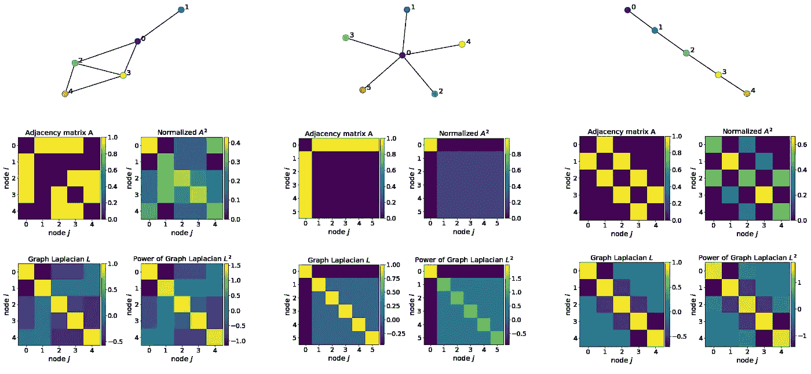**

**Adjacency matrices, Laplacians and their powers for a random graph (left), “star graph” (middle) and “path graph” (right). I normalize A² such that the sum in each row equals 1 to have a probabilistic interpretation of 2-hop connections. Notice that Laplacians and their powers are symmetric matrices, which makes eigen-decomposition easier as well as facilitates feature propagation in a deep graph network.**

**例如，想象中间上方的星图是由金属制成的，这样它可以很好地传热。然后，如果我们开始加热节点 0(深蓝色)，这种热量将以拉普拉斯定义的方式传播到其他节点。在所有边都相等的星形图的特殊情况下，热量将均匀地传播到所有其他节点，这对于其他图来说是不正确的，因为它们的结构。**

**在计算机视觉和机器学习的背景下，图形拉普拉斯定义了如果我们堆叠几个图形神经层，节点特征将如何更新。与我的教程 的第一部分 [*类似，为了从计算机视觉的角度理解光谱图卷积，我将使用 MNIST 数据集，它在 28×28 的规则网格图上定义图像。*](https://medium.com/p/3d9fada3b80d)**

**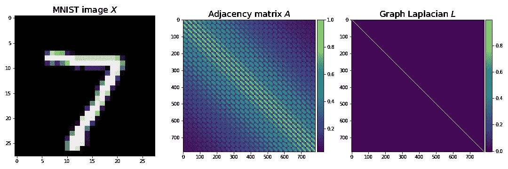**

**MNIST image defining features X (left), adjacency matrix A (middle) and the Laplacian (right) of a regular 28×28 grid. The reason that the graph Laplacian looks like an identity matrix is that the graph has a relatively large number of nodes (784), so that after normalization values outside the diagonal become much smaller than 1.**

# **2.盘旋**

**在信号处理中，可以证明空间域中的卷积是频域中的乘法(又称为[卷积定理](https://en.wikipedia.org/wiki/Convolution_theorem))。同样的定理也适用于图形。在信号处理中，为了将信号变换到频域，我们使用离散傅里叶变换，它基本上是信号与特殊矩阵(基，DFT 矩阵)的矩阵乘法。这个基础假设了一个*规则的*网格，所以我们不能把它用于*不规则的*图形，这是一个典型的情况。而是用一个更一般的基，就是图拉普拉斯 *L* 的特征向量 *V* ，可以通过特征分解找到:*l*=*vλvᵀ*，其中*λ*是 *L.* 的特征值**

****主成分分析 vs 拉普拉斯图的特征分解。**在实际计算谱图卷积时，只需使用与*最小*特征值对应的几个特征向量就足够了。乍一看，与计算机视觉中经常使用的[主成分分析(PCA)](https://en.wikipedia.org/wiki/Principal_component_analysis) 相比，这似乎是一种相反的策略，其中我们对*最大*特征值对应的特征向量更感兴趣。然而，这种差异仅仅是由于上面用于计算拉普拉斯算子的*否定*，因此使用 PCA 计算的特征值与图拉普拉斯算子的特征值*成反比*(形式分析见[本文](http://outobox.cs.umn.edu/PCA_on_a_Graph.pdf))。还要注意的是，PCA 应用于数据集的协方差矩阵，目的是提取最大的变化因素，即数据变化最大的维度，如[特征面](https://en.wikipedia.org/wiki/Eigenface)。这种变化通过特征值来测量，因此最小的特征值基本上对应于噪声或“伪”特征，这些特征在实践中被认为是无用的甚至是有害的。**

**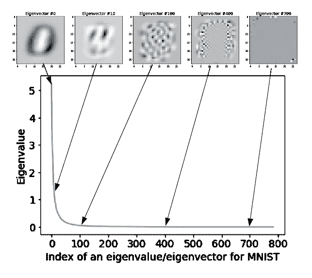**

**Eigenvalues (in a descending order) and corresponding eigenvectors for the MNIST dataset.**

**拉普拉斯图的特征分解应用于单个图，目的是提取节点的子图或集群(社区)，并且[特征值告诉我们许多关于图连通性的信息](http://blog.shriphani.com/2015/04/06/the-smallest-eigenvalues-of-a-graph-laplacian/)。我将在下面的例子中使用对应于 20 个最小特征值的特征向量，假设 20 远小于节点数 *N(在 MNIST *)* 的情况下 N* =784)。为了找到下面左边的特征值和特征向量，我使用了一个 28×28 的规则图，而在右边，我遵循[布鲁纳等人](https://arxiv.org/abs/1312.6203)的实验，通过在 28×28 的规则网格上采样 400 个随机位置来构建一个不规则图(有关该实验的更多细节，请参见他们的论文)。**

**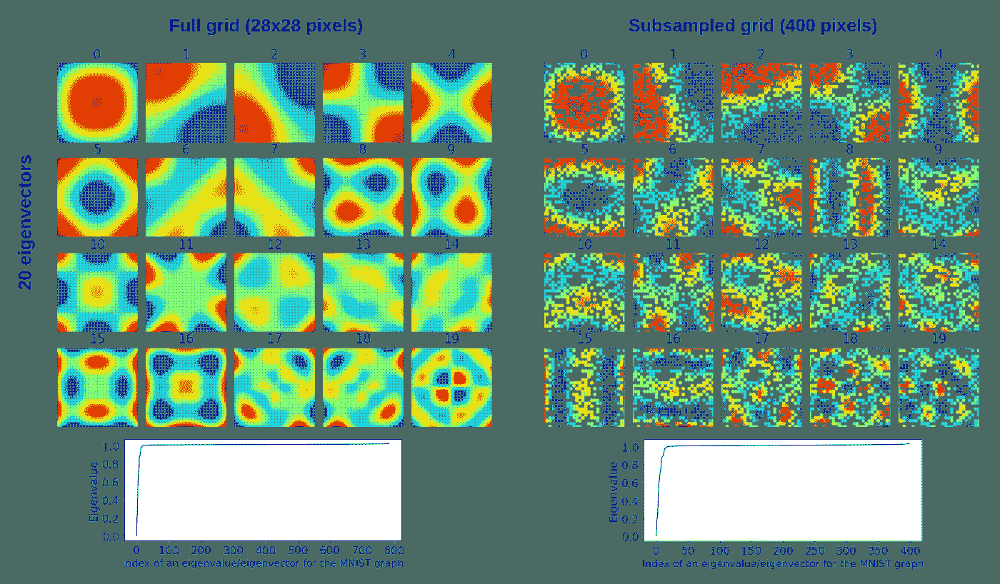**

**Eigenvalues *Λ (****bottom****) and e*igenvectors V (**top**) of the graph Laplacian L for a regular 28*×*28 grid (**left**) and non-uniformly subsampled grid with 400 points according to experiments in [Bruna et al., 2014, ICLR 2014](https://arxiv.org/abs/1312.6203) (**right**). Eigenvectors corresponding to the 20 **smallest** **eigenvalues** are shown. Eigenvectors are 784 dimensional on the left and 400 dimensional on the right, so V is 784*×20 and 400×20 respectively.* Each of the 20 eigenvectors on the left was reshaped to 28*×*28, whereas on the right to reshape a 400 dimensional eigenvector to 28*×28, white pixels for missing nodes were added. So, e*ach pixel in each eigenvector corresponds to a node or a missing node (in white on the right). These eigenvectors can be viewed as a basis in which we decompose our graph.**

**所以，给定图的拉普拉斯 *L* ，节点特征 *X* 和滤波器 *W* _spectral，在 Python **图上进行谱卷积**看起来非常简单:**

```
**# Spectral convolution on graphs
# X is an *N×1 matrix of 1-dimensional node features*** **# L** **is an** ***N******×N* graph Laplacian computed above
# W_spectral are** ***N******×******F weights (filters) that we want to train*** from scipy.sparse.linalg import eigsh **# assumes *L* to be symmetric***Λ**,V* = eigsh(L,k=20,which=’SM’) **#** **eigen-decomposition (i.e. find *Λ******,V)***
X_hat = V.T.dot(X) **# *20*****×*****1* node features in the "spectral" domain**
W_hat = V.T.dot(W_spectral)  **# 20×*F* filters in the** **"spectral" domain**
Y = V.dot(X_hat * W_hat)  **# *N******×******F* result of convolution**
```

**形式上:**

**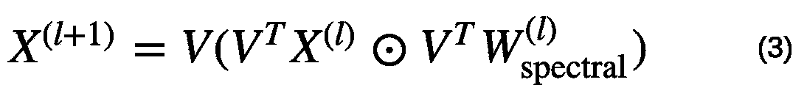**

**Spectral graph convolution, where ⊙ means element-wise multiplication.**

**其中，我们假设我们的节点特征 *X⁽ˡ⁾* 是一维的，例如 m 像素，但是它可以扩展到 *C* 维的情况:我们将只需要对每个*通道*重复这个卷积，然后像在信号/图像卷积中一样对 *C* 求和。**

**公式(3)本质上与使用傅立叶变换的规则网格上的[信号的频谱卷积](https://en.wikipedia.org/wiki/Convolution_theorem)相同，因此为机器学习产生了一些问题:**

*   **可训练权重(滤波器) *W_* 谱的维数取决于图中节点 *N* 的数量；**
*   ***W_* 谱也取决于图结构中编码的特征向量 *V.***

**这些问题阻碍了扩展到具有可变结构的大型图形的数据集。下文概述的进一步努力侧重于解决这些和其他问题。**

# ****3。谱域中的“平滑”****

****

**Strawberry and banana smoothie (source: [joyfoodsunshine.com](https://joyfoodsunshine.com/strawberry-banana-smoothie/)). Smoothing in the spectral domain is a little bit different 😃.**

**[布鲁纳等人](https://arxiv.org/abs/1312.6203)是最早将谱图分析应用到*学习卷积滤波器*来解决图分类问题的人之一。使用上述公式(3)学习的滤波器作用于*整个图*，即它们具有*全局支持*。在计算机视觉环境中，这将与在 MNIST 上训练 28×28 像素大小的卷积滤波器相同，即滤波器具有与输入相同的大小(注意，我们仍将滑动滤波器，但在零填充图像上)。虽然对于 MNIST，我们实际上可以训练这样的过滤器，但常识建议避免这样做，因为这会使训练变得更加困难，因为参数数量可能会激增，并且难以训练可以捕捉不同图像之间共享的有用特征的大型过滤器。**

**实际上，我使用 PyTorch 和来自 GitHub 的代码成功地训练了这样一个模型。您应该使用`mnist_fc.py --model conv`来运行它。经过 100 个时期的训练后，过滤器看起来像数字的混合物:**

**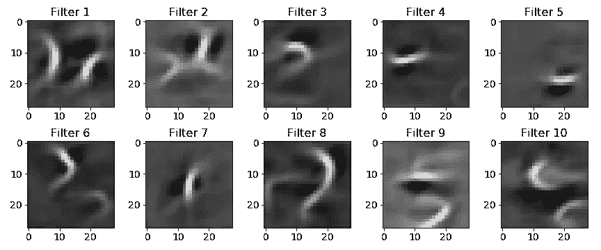**

**Examples of filters with **global support** typically used in spectral convolution. In this case, these are 28×28 filters learned using a ConvNet with a single convolutional layer followed by ReLU, 7×7 MaxPooling and a fully-connected classification layer. To make it clear, the output of the convolutional layer is still 28×28 due to zero-padding. Surprisingly, this net achieves 96.7% on MNIST. This can be explained by the simplicity of the dataset.**

**重申一下，我们通常希望让过滤器更小，更局部(这和我下面要提到的不完全一样)。**

**为了更好地实现这一点，他们建议在光谱域中平滑滤光器，根据光谱理论，这使得滤光器在空间域中更接近 T2。其思想是，您可以将公式(3)中的滤波器 *W_* 频谱表示为𝐾预定义函数(如样条函数)的和，并且我们学习这个和的 *K* 系数 *α* ，而不是学习 *W* 的 *N* 值:**

**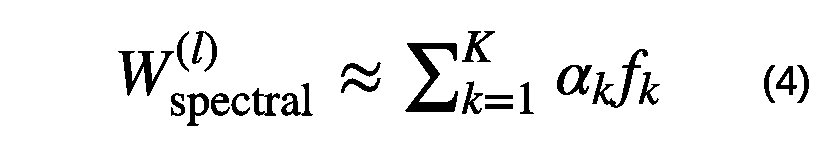**

**We can approximate our N dimensional filter*W_*spectral as a finite sum of *K* functions f, such as splines shown below. So, instead of learning N values of *W_*spectral, we can learn K coefficients (alpha) of those functions; it becomes efficient when K << N.**

**虽然 *fk* 的维数确实取决于节点 *N* 的数量，但是这些函数是固定的，所以我们不学习它们。我们唯一知道的是系数 *α* ，因此 *W_* 光谱不再依赖于 *N* 。整洁，对不对？**

**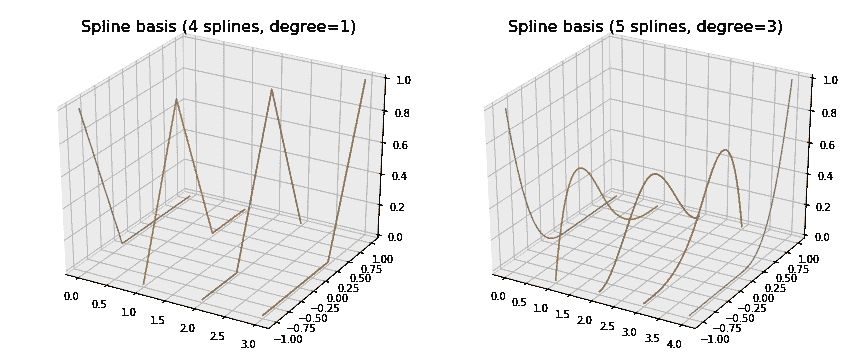**

**The spline basis used to smooth filters in the frequency domain, thereby making them more local. Splines and other polynomial functions are useful, because we can represent filters as their sums.**

**为了使我们在公式(4)中的近似合理，我们希望 *K* < < *N* 将可训练参数的数量从 *N* 减少到 *K* ，更重要的是，使其独立于 *N* ，这样我们的 GNN 可以消化任何大小的图。我们可以使用不同的碱基来进行这种“扩展”，这取决于我们需要哪些性质。例如，上面显示的三次样条函数被认为是非常平滑的函数(也就是说，你看不到节点，也就是分段样条多项式的各个部分相遇的地方)。我在[的另一篇文章](https://medium.com/@BorisAKnyazev/tutorial-on-graph-neural-networks-for-computer-vision-and-beyond-part-2-be6d71d70f49)中讨论的切比雪夫多项式具有逼近函数之间的最小𝑙∞距离。傅立叶基是在变换后保留大部分信号能量的基。大多数碱基是正交的，因为有可以相互表达的项是多余的。**

**注意，滤波器 *W_* 光谱仍然与输入一样大，但是它们的*有效宽度*很小。在 MNIST 图像的情况下，我们将有 28×28 个滤波器，其中只有一小部分值的绝对量值大于 0，并且所有这些值应该彼此靠近，即滤波器将是局部的并且实际上很小，如下所示(左起第二个):**

**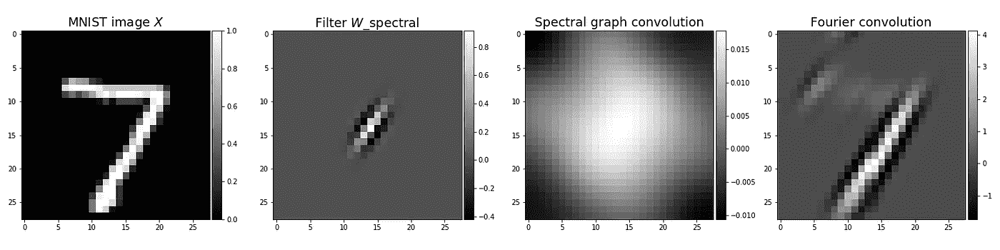**

**From left to right: (first) Input image. (second) Local filter with small effective width. Most values are very close to 0\. (third) The result of spectral graph convolution of the MNIST image of digit 7 and the filter. (fourth) The result of spectral convolution using the Fourier transform. These results indicate that spectral graph convolution is quite limited if applied to images, perhaps, due to the weak spatial structure of the Laplacian basis compared to the Fourier basis.**

**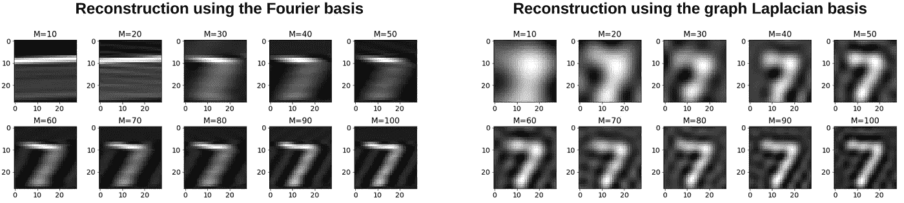**

**Reconstruction of the MNIST image using the Fourier and graph Laplacian bases using only M components of V: X’=V V*ᵀX*. We can see that the bases compress different patterns in images (orientated edges in the Fourier case and global patterns in the Laplacian case). This makes results of convolutions illustrated above very different.**

**总而言之，频谱域中的平滑允许[布鲁纳等人](https://arxiv.org/abs/1312.6203)学习更多的局部滤波器。具有这种过滤器的模型可以实现与没有平滑的模型(即，使用我们的公式(3))类似的结果，但是具有少得多的可训练参数，因为过滤器大小独立于输入图表大小，这对于将模型缩放到具有较大图表的数据集是重要的。然而，学习滤波器 *W* _spectral 仍然依赖于特征向量 *V* ，这使得将该模型应用于具有可变图结构的数据集具有挑战性。**

# **结论**

**尽管最初的光谱图卷积方法存在缺点，但它已经得到了很多发展，并在一些应用中保持了相当有竞争力的方法，因为光谱滤波器可以更好地捕捉图中的全局复杂模式，而像 GCN ( [Kipf & Welling，ICLR，2017](https://arxiv.org/abs/1609.02907) )这样的局部方法除非堆叠在深度网络中，否则无法实现。例如，2019 年的两篇论文，分别是[廖等人](https://arxiv.org/abs/1901.01484)关于“LanczosNet”和[徐等人](https://arxiv.org/abs/1904.07785)关于“图小波神经网络”，解决了谱图卷积的一些缺点，并在预测分子性质和节点分类方面显示出很好的结果。 [Levie 等人的另一项有趣的工作，2018](https://arxiv.org/abs/1705.07664) 关于“CayleyNets”在节点分类、矩阵完成(推荐系统)和社区检测方面表现强劲。因此，根据您的应用和基础设施，谱图卷积可能是一个不错的选择。**

**在我关于计算机视觉图形神经网络的[教程的另一部分](https://medium.com/@BorisAKnyazev/tutorial-on-graph-neural-networks-for-computer-vision-and-beyond-part-2-be6d71d70f49)中，我解释了由 [Defferrard 等人](https://arxiv.org/abs/1606.09375)在 2016 年引入的切比雪夫谱图卷积，它仍然是一个非常强大的基线，具有一些很好的属性，并且易于实现，正如我使用 PyTorch 演示的那样。**

***鸣谢:本教程的很大一部分是我在 SRI International 实习期间在* [*穆罕默德·阿梅尔*](https://medium.com/u/6cf41cb2c546?source=post_page-----2e495b57f801--------------------------------) *(* [*主页*](https://mohamedramer.com/) *)和我的博士导师格拉汉姆·泰勒(* [*主页*](https://www.gwtaylor.ca/) *)的指导下编写的。我也感谢* [*卡洛琳·奥古斯塔*](https://www.linkedin.com/in/carolynaugusta/) *的有用反馈。***

**在 [Github](https://github.com/bknyaz/) 、 [LinkedIn](https://www.linkedin.com/in/boris-knyazev-39690948/) 和 [Twitter](https://twitter.com/BorisAKnyazev) 上找我。[我的主页](https://bknyaz.github.io/)。**

**如果你想在你的论文中引用这篇博文，请使用:
[*@ misc*](http://twitter.com/misc)*{ Knyazev 2019 Tutorial，
title = {用于计算机视觉及超越的图形神经网络教程}，
author={Knyazev，Boris and Taylor，Graham W and Amer，Mohamed R}，
year={2019}
}***