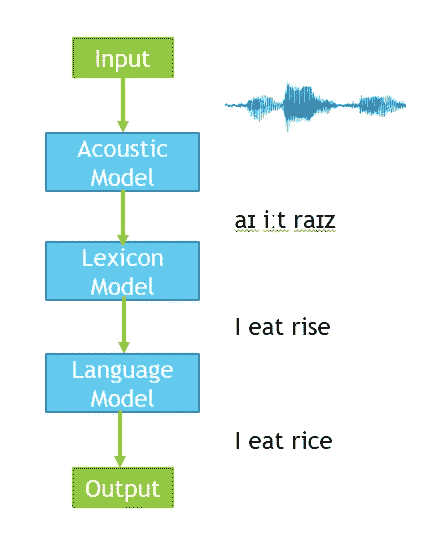
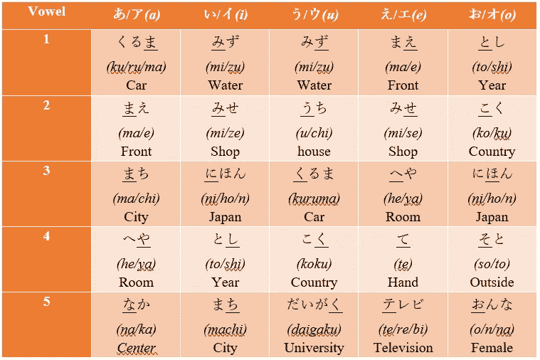
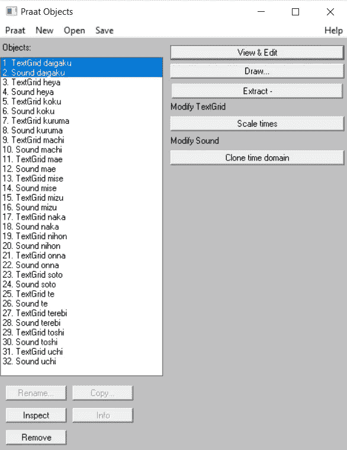
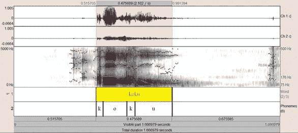
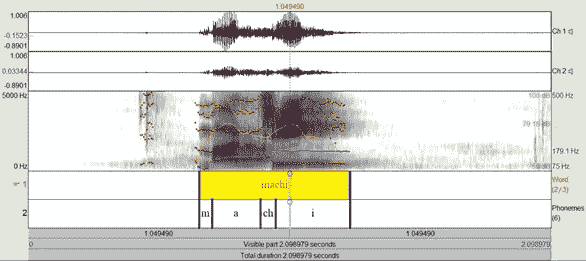
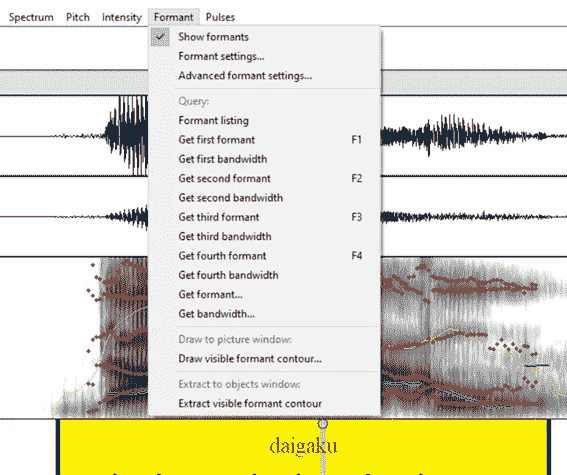
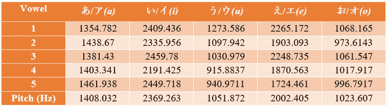
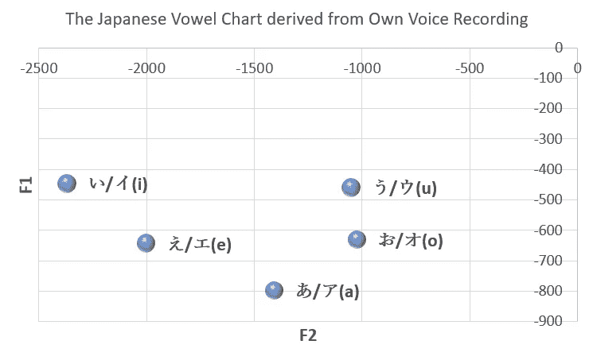
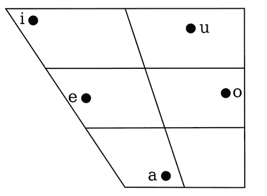

# 日语元音的声学和发音分析

> 原文：<https://towardsdatascience.com/speech-analysis-of-vowels-for-japanese-language-fdee6ec1a4ba?source=collection_archive---------26----------------------->

## 数据分析

## 你知道日语元音图是如何绘制的吗？

Photo by [Miguel Henriques](https://unsplash.com/@miguel_photo?utm_source=medium&utm_medium=referral) on [Unsplash](https://unsplash.com?utm_source=medium&utm_medium=referral)

为了为**英语**或**日语**构建一个**语音识别器**或**语音到文本转换器**，通常你需要三个组件，它们是**声学模型**、**词典模型**和**语言模型**以取得成功。

1.  **声学模型**将声音信号转换成音素。
2.  **词典模型**将音素映射成单词。
3.  一个**语言模型**限制了单词搜索。例如，通过使用前面的单词来预测后面的单词。

Figure: Overview of a speech recognizer.

为了保持声学模型的质量，大多数研究人员通常会从说本族语的人那里收集语音信号。

如果你真的想收集你自己的声音信号作为声学建模的数据集呢？或者你想知道作为一个非母语人士，你的发音与母语人士有多大差异？

在接下来的部分中，我将**向你展示如何通过使用你自己录制的声音作为输入来对日语元音进行声学和发音分析**。

# 步骤 1:数据集准备

首先，你需要准备数据集，用你自己的声音发一些单词的音，并用你的耳机录音。确保周围环境高度安静，以保持录音质量。

每个录音应该只包含一个词。对于每个元音，找出五个带有特定元音的单词，并用你自己的声音记录下来。

下表显示了选择用于演示的单词。带下划线的字符是将要进一步分析的元音。

Figure: The words that I chose for the demonstration.

目前，日语的元音和辅音数量分别为 5 和 14。日语元音包括あ/ア(a)、い/イ(i)、う/ウ(u)、え/エ(e)和お/オ(o).

# 步骤 2:语音注释

在所有的录音都准备好之后，下一步将是用音素来注释声音。我要介绍的工具是 **Praat** ，这是一个用于语音学语音分析的免费计算机软件包。你可以在这里下载[。](http://www.fon.hum.uva.nl/praat/download_win.html)

语音注释需要执行的步骤包括:

1.  下载并安装 **Praat** 。
2.  将您所有的录音导入到 **Praat** 中。
3.  为每个单词注释创建一个空白的**文本网格**文件。
4.  保存所有**文本网格**文件，永久记录注释。

Figure: The main user interface of Praat.

Figure: The annotation of the Japanese word “こく”.

Figure: The annotation of the Japanese word “まち”.

# 步骤 3:第一和第二共振峰搜索元音

人类语音产生包括两个阶段，分别是**源**和**滤波器**。

**源**，也就是声带，会振动产生复杂的周期性语音信号。复杂的周期性语音信号的频率被称为基频。

另一方面，作为声道的**滤波器**将借助于发音改变其形状，以修改复杂的周期性语音信号的谐波。修改后的语音信号的频率称为共振峰。

进入菜单栏，点击**共振峰**，根据需要选择**第一共振峰**或**第二共振峰**，可以很容易地计算出第一和第二共振峰的平均值。然后，获得每个元音的平均第一和第二共振峰，并如下表所示记录结果。

Figure: The procedure to get the first and second formant of vowels for each word.

Table: The average of the first formant for each vowel.

Table: The average of the second formant for each vowel.

# 第四步:绘制日语元音图

在收集了每个元音的第一和第二共振峰的平均读数后，绘制第一共振峰值对第二共振峰值的**图**。前者显示了从我的语音记录中得到的结果，而后者显示了从以日语为母语的人提供的语音记录中得到的结果。

Figure: The result derived from my voice recordings.

Figure: The result derived from Japanese native speakers [[Wikipedia](https://en.wikipedia.org/wiki/Japanese_phonology)].

# 步骤 5:声学和发音分析

通过比较上面绘制的两个图表:

*   它表明**从我自己的语音记录中得到的日语元音的位置与日语母语者相似**。元音“い/イ(i”和“う/ウ(u”位于最顶端。元音“あ/ア(a”位于最底部。最左边是“い/イ(i”)，最右边也是“お/オ(o”。
*   然而，用于自己录音的元音“お/オ(o”和“う/ウ(u”之间的**水平距离小于标准**。元音“い/イ(i”和“う/ウ(u”之间的垂直距离没有标准中显示的那么大。

# 结论

作为一个母语不是日语的人，我发现**我的元音“う/ウ(u”的发音与母语是日语的人**稍有不同。我的其他元音发音看起来很好，和日本母语者很相似。我可以用自己的声音记录来建立自己的声音模型，而不是使用日语母语者的声音记录来建立声音模型。

# 参考

1.  名词（noun 的缩写）Shmyrev，“[语音识别的基本概念](https://cmusphinx.github.io/wiki/tutorialconcepts/)，”CMUSphinx 开源语音识别。
2.  C.史密斯，“国际音标协会手册:国际音标使用指南”。17.291–295, 1999.