# 基于卷积神经网络的语音情感识别

> 原文：<https://towardsdatascience.com/speech-emotion-recognition-with-convolution-neural-network-1e6bb7130ce3?source=collection_archive---------4----------------------->

## 从录音中识别人类情感

对于数据科学家来说，识别人类情感一直是一项令人着迷的任务。最近，我正在进行一项实验性的语音情感识别(SER)项目，以探索它的潜力。我从 [**GitHub**](https://github.com/MITESHPUTHRANNEU/Speech-Emotion-Analyzer) 中选择了最受欢迎的 SER 库作为我项目的主干。

在我们完成这个项目之前，最好了解一下语音情感识别的主要瓶颈。

## **主要障碍:**

*   情绪是主观的，人们会有不同的理解。很难定义情绪的概念。
*   给录音添加注释是一项挑战。我们应该标记一个单词、句子还是整个对话？要定义多少种情绪才能识别？
*   收集数据很复杂。有许多音频数据可以从电影或新闻中获得。然而，他们都有偏见，因为新闻报道必须是中立的，演员的情绪是模仿的。很难找到不带任何偏见的中性录音。
*   标记数据需要很高的人力和时间成本。与在图像上绘制边界框不同，它需要训练有素的人员聆听整个音频记录，对其进行分析并给出注释。由于其主观性，注释结果必须由多个个人来评估。

## **项目描述:**

用卷积神经网络从录音中识别情感。并且存储库所有者不提供任何论文参考。

## **数据描述:**

这是两个最初在 RAVDESS 和 SAVEE 库中使用的数据集，我只在我的模型中采用了 RAVDESS。在 RAVDESS 中，有两种类型的数据:语音和歌曲。

数据集:[瑞尔森情感语音和歌曲视听数据库(RAVDESS)](https://zenodo.org/record/1188976#.XN0fwnUzZhE)

*   12 位男演员和 12 位女演员分别录制了演讲和歌曲版本。
*   18 号演员没有歌曲版本数据。
*   歌曲版本数据中不包含情感`Disgust`、`Neutral`、`Surprised`。

## 总类别:

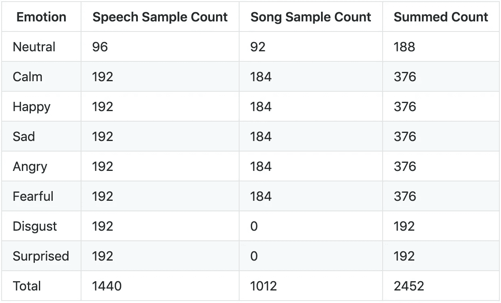

这是情绪等级分布条形图。

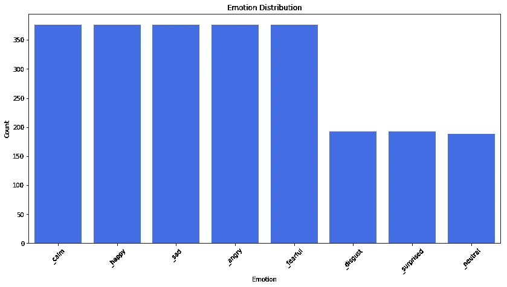

## **特征提取:**

当我们执行语音识别任务时，MFCCs 是自 20 世纪 80 年代发明以来最先进的功能。

> 这个形状决定了发出什么声音。如果我们能够精确地确定形状，这将会给我们一个产生的[音素](http://en.wikipedia.org/wiki/Phoneme)的精确表示。声道的形状在短时功率谱的包络中表现出来，而 MFCCs 的工作就是精确地表示这个包络。—摘自: [MFCC 教程](http://practicalcryptography.com/miscellaneous/machine-learning/guide-mel-frequency-cepstral-coefficients-mfccs/)

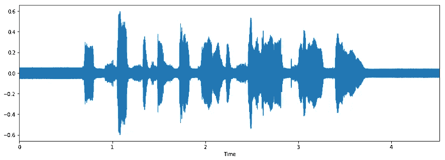

Waveform

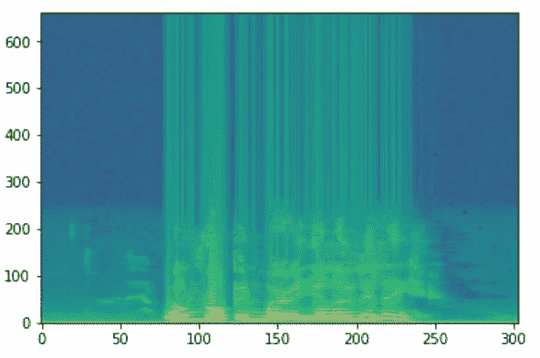

Spectrogram

我们将使用 MFCCs 作为我们的输入特性。如果你想彻底了解**MFCC***，这里有一个很棒的* [*教程*](http://practicalcryptography.com/miscellaneous/machine-learning/guide-mel-frequency-cepstral-coefficients-mfccs/) *给你。*加载音频数据并将其转换为 MFCCs 格式可以通过 Python 包`librosa`轻松完成。

## 默认模型架构:

作者用 Keras 开发了 CNN 模型，它由 7 层构成——6 个 Conv1D 层和一个密集层。

```
model = Sequential()
model.add(Conv1D(256, 5,padding='same', input_shape=(216,1))) #1
model.add(Activation('relu'))
model.add(Conv1D(128, 5,padding='same')) #2
model.add(Activation('relu'))
model.add(Dropout(0.1))
model.add(MaxPooling1D(pool_size=(8)))
model.add(Conv1D(128, 5,padding='same')) #3
model.add(Activation('relu'))
#model.add(Conv1D(128, 5,padding='same')) #4
#model.add(Activation('relu'))
#model.add(Conv1D(128, 5,padding='same')) #5
#model.add(Activation('relu'))
#model.add(Dropout(0.2))
model.add(Conv1D(128, 5,padding='same')) #6
model.add(Activation('relu'))
model.add(Flatten())
model.add(Dense(10)) #7
model.add(Activation('softmax'))
opt = keras.optimizers.rmsprop(lr=0.00001, decay=1e-6)
```

> 作者在最新笔记本(2018 年 9 月 18 日更新)中对第 4 层和第 5 层进行了评论，模型重量文件不适合所提供的网络，因此，我无法加载重量提供并复制其结果 **72%的测试准确度。**

该模型只是简单地用`batch_size=16`和 700 个历元进行训练，没有任何学习速率表等。

```
# Compile Model
model.compile(loss='categorical_crossentropy', optimizer=opt,metrics=['accuracy'])# Fit Model
cnnhistory=model.fit(x_traincnn, y_train, batch_size=16, epochs=700, validation_data=(x_testcnn, y_test))
```

其损失函数为`categorical_crossentropy`，评价指标为准确度。

# ***我的实验***

## 探索性数据分析:

在 RADVESS 数据集中，每个演员必须通过说和唱两句话来表现 8 种情绪，每种情绪两次。结果，除了中性、厌恶和惊讶之外，每个演员将为每种情绪归纳 4 个样本，因为没有这些情绪的歌唱数据。每个音频波大约 4 秒，第一秒和最后一秒很可能是无声的。

**标准句子有:**

> 1.孩子们在门边说话。
> 2。狗坐在门边。

**观察:**

在我选择了一个男演员和一个女演员的数据集并听了他们所有人的歌之后。我发现男性和女性表达情感的方式不同。以下是一些发现:

*   男的 ***生气*** 就是单纯的加大音量。​
*   男性的 ***快乐的*** 和 ***悲伤的*** 显著特征是在音频中的静音期有笑有哭的语气。
*   女性的 ***快乐的*** ， ***愤怒的*** 和 ***悲伤的*** 都是音量增大。​
*   女性的 ***厌恶*** 里面会加上呕吐的声音。

**复制结果:**

作者排除了类别`neutral`、`disgust`和`surprised`来对 RAVDESS 数据集进行 10 个类别的识别。

我试图用提供的模型复制他的结果，我可以达到的结果是

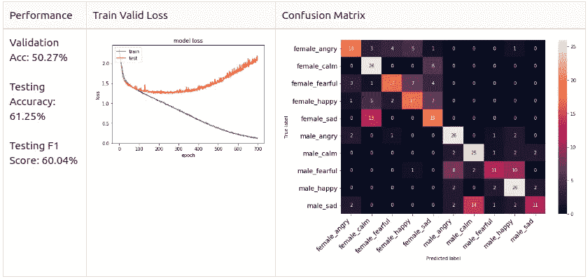

然而，我发现在训练阶段使用的验证集与测试集相同的地方存在数据泄漏问题。因此，我重新做了数据分割部分，将两个男演员和两个女演员的数据隔离到测试集中，以确保它在训练阶段是不可见的。

*   1-20 号演员用于分割比为 8:2 的`Train / Valid`场景。
*   演员 21-24 被隔离以测试使用。
*   列车集合形状:(1248，216，1)
*   有效的集合形状:(312，216，1)
*   测试集形状:(320，216，1)——(隔离)

我用新的数据分割设置重新训练了模型，结果如下:

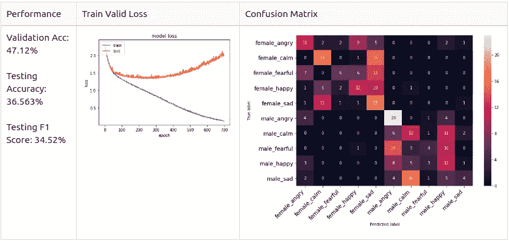

## **基准:**

从列车有效损失图可以看出，该模型甚至不能很好地收敛于 10 个目标类别。因此，我决定通过只识别男性情感来降低模型的复杂性。我将这两个角色分离为`test set`，其余的将是具有 8:2 ***分层混洗分割*** 的`train/valid set`，这确保了数据集中没有类别不平衡。之后，我分别训练了男性和女性数据，以探索基准。

**男性数据集**

*   训练集=来自演员 1- 10 的 640 个样本。
*   有效集=来自演员 1- 10 的 160 个样本。
*   测试集=来自演员 11- 12 的 160 个样本。

**男性基线**

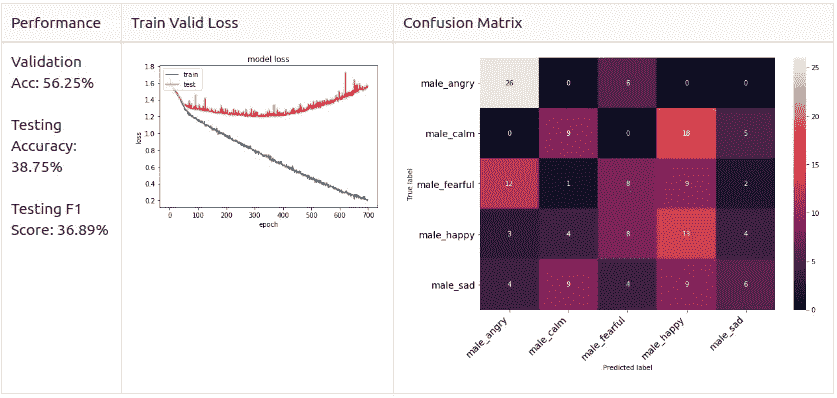

**女性数据集**

*   训练集=来自女演员 1- 10 的 608 个样本。
*   有效集=来自女演员 1- 10 的 152 个样本。
*   测试集=来自女演员 11- 12 的 160 个样本。

**女性基线**

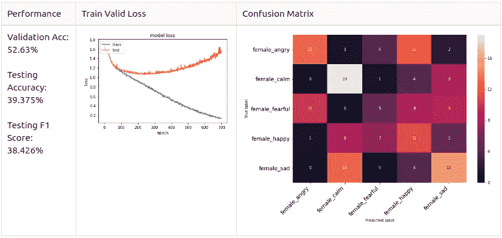

如你所见，男性和女性模型的混淆矩阵是不同的。

- ***男性*** : `Angry`和`Happy`是男性模型中占主导地位的预测类，但它们不太可能混淆。​

- ***女*** : `Sad`和`Happy`是女模型中占优势的预测类，`Angry`和`Happy`很有可能混淆。

参照 **EDA** 部分的观察，我怀疑女性`Angry`和`Happy`很可能混淆的原因是因为她们的表达方式只是简单地增加了说话的音量。

除此之外，我想知道如果我进一步简化模型，将目标类减少到`Positive`、`Neutral`和`Negative`或者甚至仅仅是`Positive`和`Negative`会怎么样。所以，我把情绪分为 2 类和 3 类。

**2 类:**

*   正:`happy`，`calm`。
*   负面:`angry`、`fearful`、`sad`。

**3 类:**

*   阳性:`happy`。
*   中性:`calm`，`neutral`。
*   负面:`angry`、`fearful`、`sad`。

(在 3 类中添加了中性来探索结果。)

在我做训练实验之前，我通过做 5 类识别用男性数据调整模型架构。

```
# Set the target class number
target_class = 5# Model 
model = Sequential()
model.add(Conv1D(256, 8, padding='same',input_shape=(X_train.shape[1],1))) #1
model.add(Activation('relu'))
model.add(Conv1D(256, 8, padding='same')) #2
model.add(BatchNormalization())
model.add(Activation('relu'))
model.add(Dropout(0.25))
model.add(MaxPooling1D(pool_size=(8)))
model.add(Conv1D(128, 8, padding='same')) #3
model.add(Activation('relu')) 
model.add(Conv1D(128, 8, padding='same')) #4
model.add(Activation('relu'))
model.add(Conv1D(128, 8, padding='same')) #5
model.add(Activation('relu'))
model.add(Conv1D(128, 8, padding='same')) #6
model.add(BatchNormalization())
model.add(Activation('relu'))
model.add(Dropout(0.25))
model.add(MaxPooling1D(pool_size=(8)))
model.add(Conv1D(64, 8, padding='same')) #7
model.add(Activation('relu'))
model.add(Conv1D(64, 8, padding='same')) #8
model.add(Activation('relu'))
model.add(Flatten())
model.add(Dense(target_class)) #9
model.add(Activation('softmax'))
opt = keras.optimizers.SGD(lr=0.0001, momentum=0.0, decay=0.0, nesterov=False)
```

我添加了 2 个 Conv1D 层，1 个 MaxPooling1D 层和 2 个 BarchNormalization 层，此外，我还将 dropout 值更改为 0.25。最后，我将优化器改为 SGD，学习率为 0.0001。

```
lr_reduce = ReduceLROnPlateau(monitor=’val_loss’, factor=0.9, patience=20, min_lr=0.000001)mcp_save = ModelCheckpoint(‘model/baseline_2class_np.h5’, save_best_only=True, monitor=’val_loss’, mode=’min’)cnnhistory=model.fit(x_traincnn, y_train, batch_size=16, epochs=700, validation_data=(x_testcnn, y_test), callbacks=[mcp_save, lr_reduce])
```

对于模型训练，我采用`Reduce Learning On Plateau`并只保存最小`val_loss`的最佳模型。这里是不同目标类设置的模型性能。

## 新型号性能

**男 5 班**

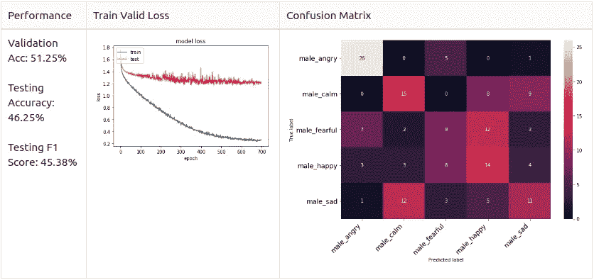

**女 5 班**

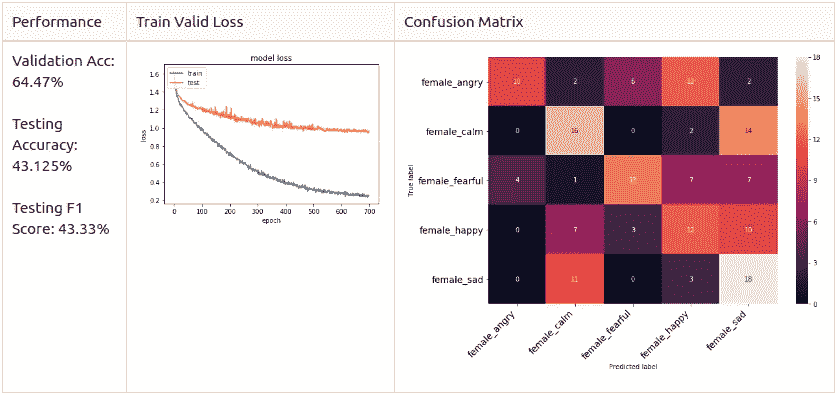

**男二班**

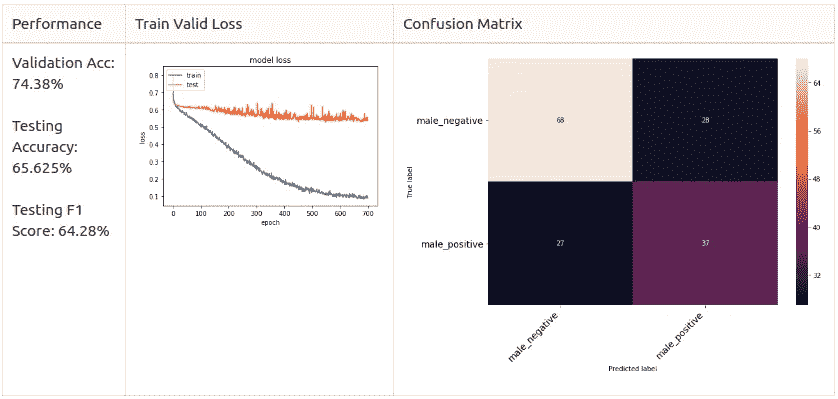

**男 3 班**

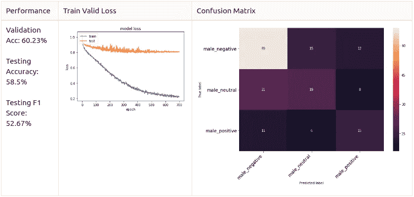

# 增大

在我调整了模型架构、优化器和学习率计划之后，我发现模型在训练期间仍然无法收敛。我认为这是数据大小的问题，因为我们只有 800 个样本用于训练有效集。因此，我决定探索音频增强方法。让我们来看看一些带有代码的增强方法。我简单地增加了所有数据集一次，使训练/有效集大小加倍。

## 男 5 级:

**动态值变化**

```
def dyn_change(data):
    """
    Random Value Change.
    """
    dyn_change = np.random.uniform(low=1.5,high=3)
    return (data * dyn_change)
```

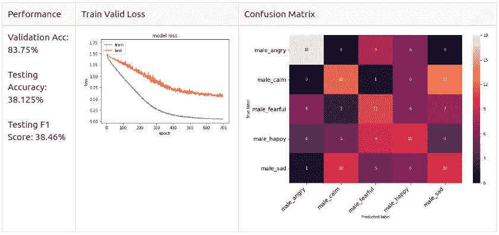

**音高调谐**

```
def pitch(data, sample_rate):
    """
    Pitch Tuning.
    """
    bins_per_octave = 12
    pitch_pm = 2
    pitch_change =  pitch_pm * 2*(np.random.uniform())   
    data = librosa.effects.pitch_shift(data.astype('float64'), 
                                      sample_rate, n_steps=pitch_change, 
                                      bins_per_octave=bins_per_octave)
```

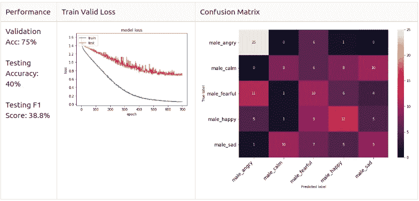

**换挡**

```
def shift(data):
    """
    Random Shifting.
    """
    s_range = int(np.random.uniform(low=-5, high = 5)*500)
    return np.roll(data, s_range)
```

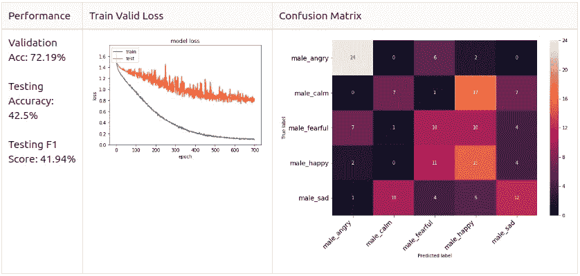

**白噪声添加**

```
def noise(data):
    """
    Adding White Noise.
    """
    # you can take any distribution from [https://docs.scipy.org/doc/numpy-1.13.0/reference/routines.random.html](https://docs.scipy.org/doc/numpy-1.13.0/reference/routines.random.html)
    noise_amp = 0.005*np.random.uniform()*np.amax(data)
    data = data.astype('float64') + noise_amp * np.random.normal(size=data.shape[0])
    return data
```

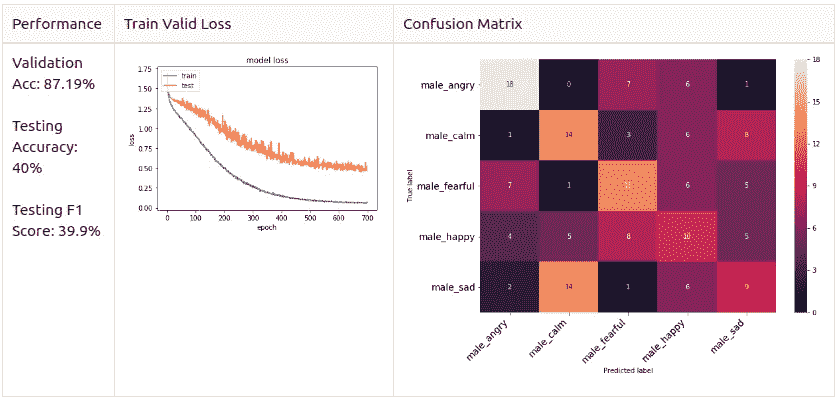

> 我们可以看到，这种增强可以大大提高**验证的准确性**，一般来说是 70+%。特别是加入白噪声可以达到 87.19%的**验证准确率**，然而**测试准确率**和**测试 F1-score** 分别下降超过 5%。然后，我想知道如果我混合不同的增强方法会带来一个好的结果。

## 混合多种方法

**加噪+移位**

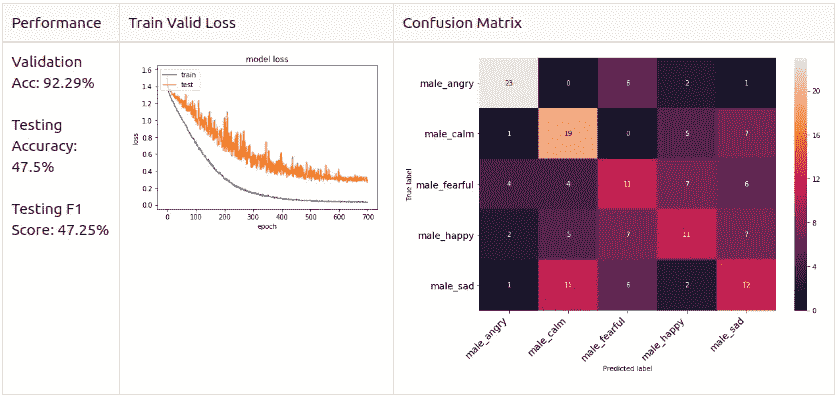

# 男性 2 类数据的扩充测试

## 男性 2 类:

**所有样本的加噪+移位** 

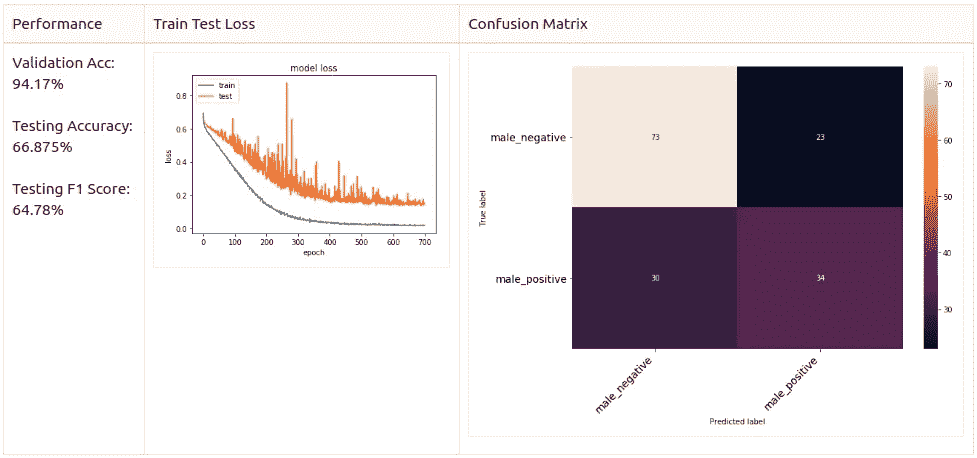

**噪声添加+移位**
仅针对正样本，因为 2 类集合不平衡(向负方向倾斜)。

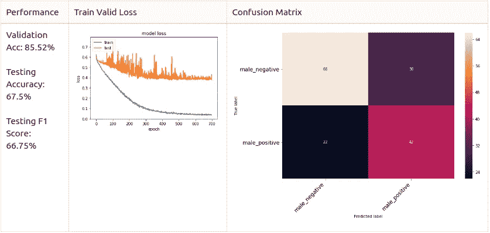

**音高调谐+噪声添加** 针对所有样本

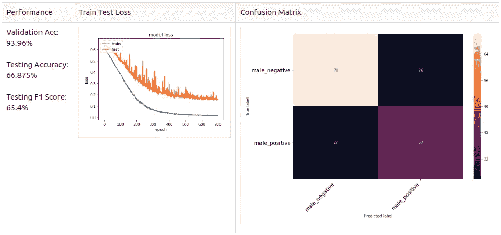

**音调调谐+噪声添加** 仅用于阳性样本

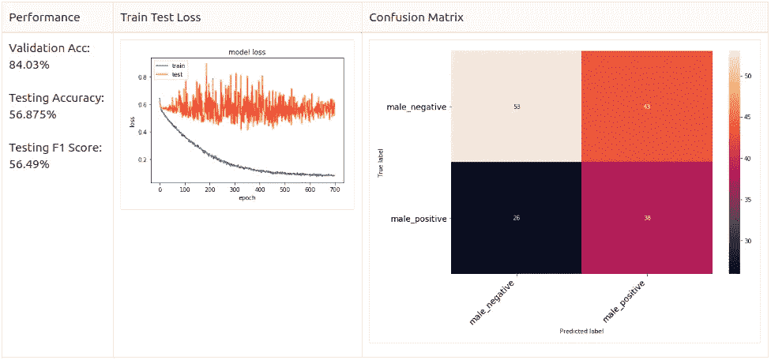

# 结论

最后我只有时间用男性数据集做实验。我用分层混洗分割法重新分割数据，以确保没有数据不平衡或数据泄漏问题。我通过试验男性数据集来调整模型，因为我想在开始时简化模型。我还用不同的目标标签设置和增强方法测试了 by。我发现为不平衡的数据添加**噪声**和**移位**可以帮助达到更好的结果。

# 钥匙拿走

*   情绪是主观的，很难用符号表示出来。
*   我们应该定义适合我们自己项目目标的情绪。
*   不要总是相信 GitHub 的内容，即使它有很多明星。
*   注意数据分割。
*   探索性数据分析总是给我们很好的洞察力，当你处理音频数据时，你必须有耐心！
*   决定模型的输入:一个句子，一段录音还是一段话语？
*   缺少数据是服务识别成功的关键因素，然而，建立一个好的语音情感数据集是复杂且昂贵的。
*   当你缺少数据时，简化你的模型。

# 进一步改进

*   我只选择了前 3 秒作为输入数据，因为这将减少维度，原来的笔记本只使用了 2.5 秒。我想用这段完整的音频来做实验。
*   对数据进行预处理，如裁剪无声语音、通过零填充归一化长度等。
*   在这个主题上试验递归神经网络方法。

# **关于我**

*   **GitHub**:[rezachu/emotion _ recognition _ CNN](https://github.com/rezachu/emotion_recognition_cnn)
*   **Linkedin**:[Kai Cheong，Reza Chu](https://www.linkedin.com/in/rezachukc/)

*备注:GitHub 中很快会注意到一些与该主题相关的论文。*