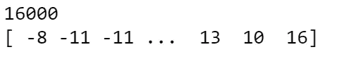
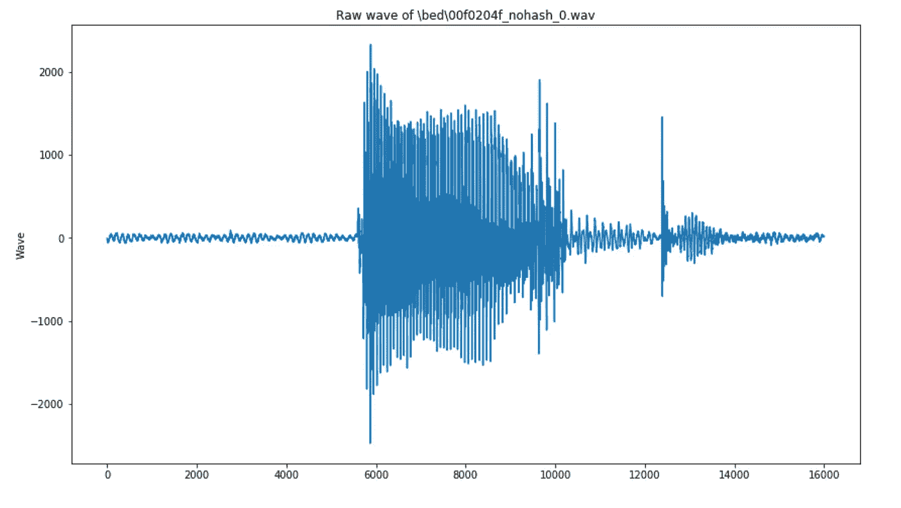
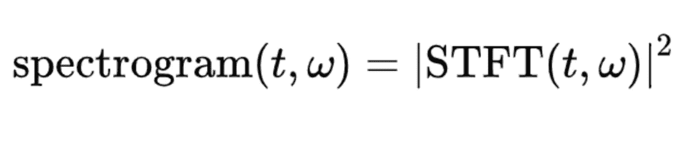
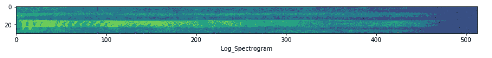
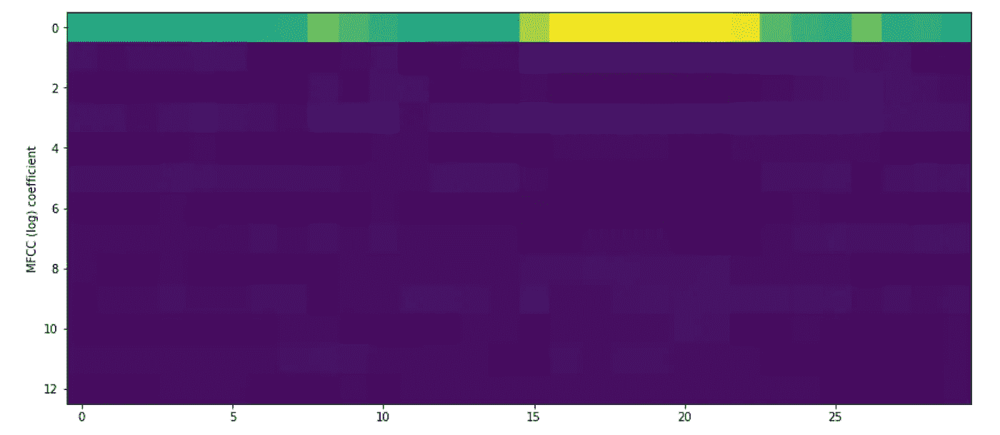
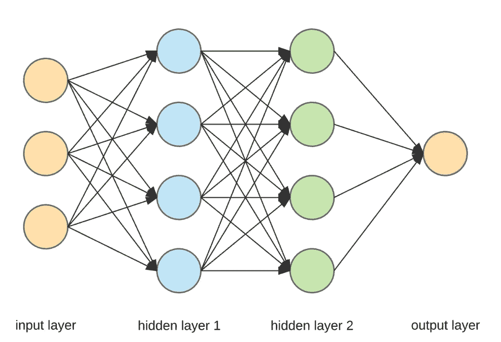
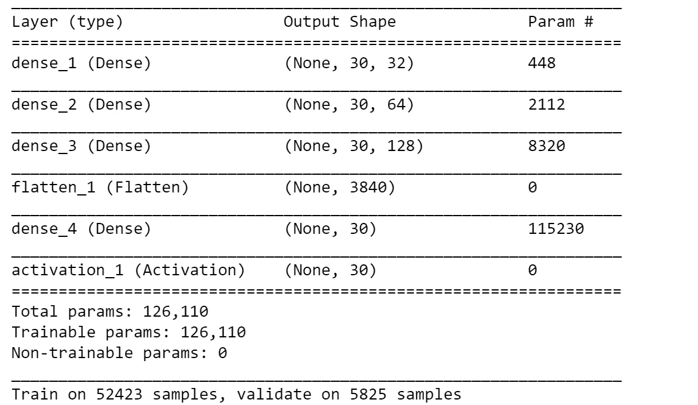
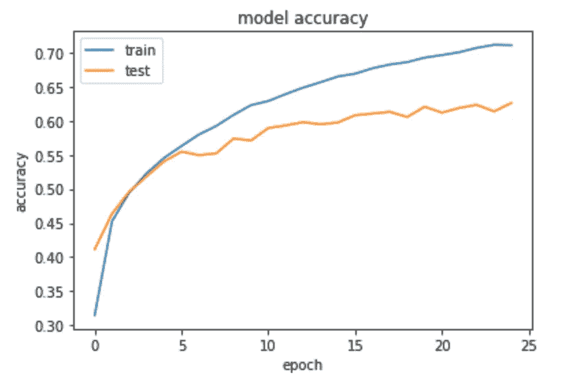
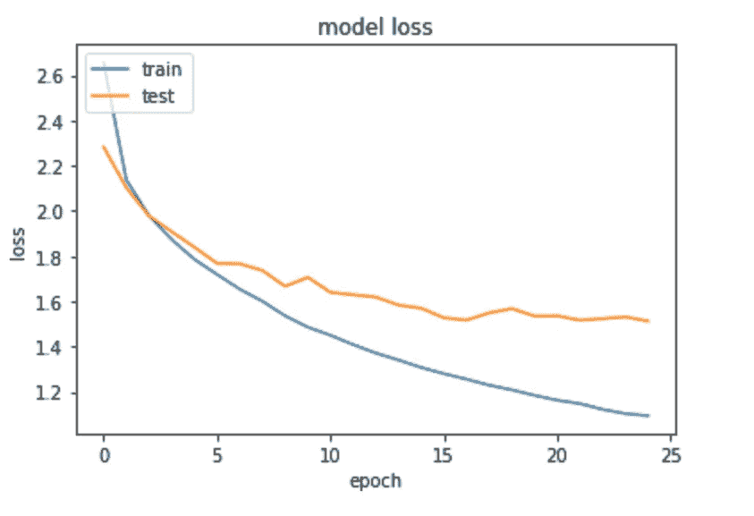

# 语音识别分析

> 原文：<https://towardsdatascience.com/speech-recognition-analysis-f03ff9ce78e9?source=collection_archive---------11----------------------->

## 使用 Keras 建立语音识别模型。

从 Siri 到智能家居设备，语音识别广泛应用于我们的生活中。这个语音识别项目是利用 Kaggle 语音识别挑战数据集在 Tensorflow 上创建 Keras 模型，并对语音文件进行预测。


Photo by [Adam Solomon](https://unsplash.com/@solomac?utm_source=medium&utm_medium=referral) on [Unsplash](https://unsplash.com?utm_source=medium&utm_medium=referral)

下面列出了 Kaggle 语音识别挑战数据集的链接:

[](https://www.kaggle.com/c/tensorflow-speech-recognition-challenge/data) [## TensorFlow 语音识别挑战

### 下载数千个项目的开放数据集+在一个平台上共享项目。探索热门话题，如政府…

www.kaggle.com](https://www.kaggle.com/c/tensorflow-speech-recognition-challenge/data) 

# 数据接收和处理:

与图像识别类似，语音识别最重要的部分是将音频文件转换成 2X2 数组。

## 音频文件的采样速率和原始波形:

音频文件的采样速率表示每秒传送的音频样本数，以 Hz 为单位。下图显示了音频原始波形和“bed”音频文件的采样速率之间的关系:

```
train_audio_path = 'C:**\\**Users**\\**...**\\**train**\\**audio'
filename = '**\\**bed**\\**00f0204f_nohash_0.wav'
sample_rate, samples = wavfile.read(str(train_audio_path) + filename)
ipd.Audio(samples, rate=sample_rate)
print(sample_rate)
print(samples)
```



`Sample rate is the number of samples of audio carried per second, measured in Hz.`

```
*# visualize this audio wave:*
fig = plt.figure(figsize=(14, 8))
plt.plot(samples)
plt.title('Raw wave of ' + filename)
plt.ylabel('Wave')
plt.show()
```



接下来，我将介绍音频文件的两个重要属性:

## **声谱图:**

声谱图是声音的频谱-时间表示。频谱图的水平方向代表时间，垂直方向代表频率。(1)频谱图可用作一种可视化非平稳信号频率含量随时间变化的方式。

谱图(2)的公式如下:



我利用以下网站的代码来计算和可视化 log_spectrogram:

【https://www.tensorflow.org/api_guides/python/contrib.signal[https://github . com/Tony 607/TF _ audio _ signal/blob/master/TF _ audio _ signal . ipynb](https://github.com/Tony607/tf_audio_signal/blob/master/tf_audio_signal.ipynb)

```
**def** log_spectrogram(file, label):
    sample_rate, samples = wavfile.read(str(train_audio_path) + '**\\**'+label+'**\\**' + file)
    signals = tf.cast(tf.reshape(samples, [1,-1 ]),tf.float32) 
    spectrogram = signal.stft(signals, frame_length=1024, frame_step= 512)
    magnitude_spectrograms = tf.abs(spectrogram)
    log_offset = 1e-6
    *#When compressing with a logarithm, it's a good idea to use a stabilizing offset* 
    *#to avoid high dynamic ranges caused by the singularity at zero.*
    log_magnitude_spectrograms = tf.log(magnitude_spectrograms + log_offset)
    **return** log_magnitude_spectrograms
```

然后绘制样本数据的 log _ spectrogram:bed。

```
log_spe_bed = log_spectrogram(train.file[0],train.label[0]).numpy()
array_bed = log_spe_bed.astype(np.float)[0]
fig = plt.figure(figsize=(14,8))
*#plt.ylabel("Freqs in Hz")*
plt.xlabel("Log_Spectrogram")
plt.imshow(np.swapaxes(array_bed,0,1).T)
```



## 梅尔频率倒谱系数(MFCC):

梅尔倒谱系数(MFCC)是自动语音和说话人识别中广泛使用的特征。Mel 标度将纯音的感知频率或音高与其实际测量频率相关联。人类在低频时比高频时更善于辨别音调的微小变化。引入这一尺度使我们的特征与人类听到的更接近。(3)

```
**def** mfcc(file=train['file'].tolist(), label=train['label'].tolist()):
    sample_rate, samples = wavfile.read(str(train_audio_path) + '**\\**'+label+'**\\**' + file)
    **if** len(samples) < 16000:
        samples = np.pad(samples, (0,16000-len(samples)), 'linear_ramp')
    **else**:
        samples = samples[:16000]
    signals = tf.cast(tf.reshape(samples, [1,-1 ]),tf.float32) 
    spectrogram = signal.stft(signals, frame_length=1024, frame_step= 512)
    magnitude_spectrograms = tf.abs(spectrogram)
    num_spectrogram_bins = magnitude_spectrograms.shape[-1].value
    lower_edge_hertz, upper_edge_hertz, num_mel_bins = 80.0, 7600.0, 64
    linear_to_mel_weight_matrix = tf.contrib.signal.linear_to_mel_weight_matrix(num_mel_bins, num_spectrogram_bins, sample_rate, lower_edge_hertz,upper_edge_hertz)
    mel_spectrograms = tf.tensordot(magnitude_spectrograms, linear_to_mel_weight_matrix, 1)
*# Note: Shape inference for <a href="../../api_docs/python/tf/tensordot"><code>tf.tensordot</code></a> does not currently handle this case.*mel_spectrograms.set_shape(magnitude_spectrograms.shape[:-1].concatenate(linear_to_mel_weight_matrix.shape[-1:]))
    log_offset = 1e-6
    log_mel_spectrograms = tf.log(mel_spectrograms + log_offset)
    num_mfccs = 13
*# Keep the first `num_mfccs` MFCCs.*
    mfccs = tf.contrib.signal.mfccs_from_log_mel_spectrograms(log_mel_spectrograms)[..., :num_mfccs]
    **return** mfccs.numpy()[0]
```

通过使用上面定义的“mfcc”函数，很容易计算“bed”的音频文件的 mfcc 并可视化其 MFCC。

```
mfcc_bed = mfcc(train.file[0],train.label[0])
fig = plt.figure(figsize=(14,8))
plt.ylabel("MFCC (log) coefficient")
plt.imshow(np.swapaxes(mfcc_bed,0,1))
```



# 数据建模:

我建立了一个顺序神经网络模型，这是在 keras 中建立模型的最简单的方法——它告诉 Keras 按顺序堆叠所有层。然后我添加了四个密集层，它们是模型中完全连接的层。



Reference: [https://towardsdatascience.com/applied-deep-learning-part-1-artificial-neural-networks-d7834f67a4f6](/applied-deep-learning-part-1-artificial-neural-networks-d7834f67a4f6)

在建立模型后，我使用自适应矩估计作为优化器，类别交叉熵作为损失，准确度作为度量来编译模型。

```
*# Dense(64) is a fully-connected layer with 64 hidden units.*
*# in the first layer, you must specify the expected input data shape:*
*# here, 20-dimensional vectors.*
**with** tf.Session() **as** sess0:
    **assert** **not** tf.executing_eagerly()
    model = Sequential()

    model.add(layers.Dense(32, input_shape=X_train_array.shape[1:], activation='tanh'))
    model.add(Dense(64, activation='tanh'))
    model.add(Dense(128, activation='tanh'))

    model.add(Flatten())
    *#model.add(Dense(256, activation='relu'))*

    model.add(Dense(30))
    model.add(Activation('sigmoid'))

    model.compile(loss='categorical_crossentropy', optimizer='adam', metrics=['accuracy'])
    *#Adam, an algorithm for first-order gradient-based optimization of stochastic objective functions, based on adaptive estimates of lower-order moments.*
    model.summary()

  *#  history = model.fit(x=X_train_array, y=y_train_array, epochs=5, verbose=1, validation_split = 0.33, shuffle=True, class_weight=get_class_weights(pd.Series((list(set(labels))),dtype='category').cat.codes.values),batch_size=batch_size)* 
    history = model.fit(x=X_train_array, y=y_train_array, epochs=25, verbose=1, validation_split = 0.1, shuffle=**True**, class_weight=get_class_weights(pd.Series(Y_train,dtype='category').cat.codes.values),batch_size=128) 

    model_evaluation = model.evaluate(x=X_test_array, y=y_test_array, batch_size=**None**, verbose=1)

    prediction = model.predict(X_test_array, batch_size = 128, verbose = 1)

    april_tst = model.predict(mfcc_april_test, batch_size = 128, verbose = 1)

    sess0.close()
```



Sequential Neural Network Model in Keras

我选择 25 作为历元数，这是模型在数据中循环的次数。经过约 20 个历元的运行，模型的验证准确率提高到 61% — 62%。



Model accuracy regarding the number of epochs



Model loss regarding the number of epochs

从上面两张图可以看出，测试和训练精度彼此不够接近，这意味着可以通过克服过拟合问题来改进这个模型。

# 结论:

1.  音频文件通常被转换成数组作为 Keras 模型的输入。
2.  声谱图和 MFCC 是要转换为数组的音频文件的两个特征。
3.  我们可以修改 Keras 模型的层次来提高模型的精度。
4.  通过比较训练和测试精度来了解过度拟合问题。
5.  与 Keras API 模型相比，顺序模型更容易修改。

# 结论:

1.  为了准确预测 Kaggle 数据集中“测试”音频文件中带有噪声的语音，我需要通过添加背景噪声来处理当前的训练数据。
2.  由于 Kaggle“测试”音频文件中存在未知声音，我还需要添加“未知”作为我的标签之一。
3.  我还可以归一化训练数据的 mfccs，看看是否可以提高模型精度。
4.  我也可以使用 CNN 和 RNN 的组合，看看我是否能提高模型的准确性。

# 参考:

1.  保罗·波尔斯马和大卫·韦宁克， [**简介 3.1。查看声谱图**](http://www.fon.hum.uva.nl/praat/manual/Intro_3_1__Viewing_a_spectrogram.html) ，阿姆斯特丹大学语音科学研究所
2.  维基百科:【https://en.wikipedia.org/wiki/Short-time_Fourier_transform 
3.  密码学:[http://practical cryptography . com/miscellaneous/machine-learning/guide-Mel-frequency-ceps tral-coefficients-mfccs/](http://practicalcryptography.com/miscellaneous/machine-learning/guide-mel-frequency-cepstral-coefficients-mfccs/)
4.  Chris Dinant， [Kaggle Tensorflow 语音识别挑战](https://github.com/chrisdinant/speech/blob/master/train.ipynb)

# 致谢:

1.  [https://www . ka ggle . com/Davids 1992/speech-presentation-and-data-exploration](https://www.kaggle.com/davids1992/speech-representation-and-data-exploration)
2.  [https://www . ka ggle . com/ol lmer/labels-spectro grams-exploration](https://www.kaggle.com/ollmer/labels-spectrograms-exploration)
3.  [https://github . com/Tony 607/TF _ audio _ signal/blob/master/TF _ audio _ signal . ipynb](https://github.com/Tony607/tf_audio_signal/blob/master/tf_audio_signal.ipynb)
4.  [https://towards data science . com/ka ggle-tensor flow-speech-recognition-challenge-b 46 a3 BCA 2501](/kaggle-tensorflow-speech-recognition-challenge-b46a3bca2501)
5.  [https://www . ka ggle . com/kcs 93023/keras-sequential-conv1d-model-class ification](https://www.kaggle.com/kcs93023/keras-sequential-conv1d-model-classification)