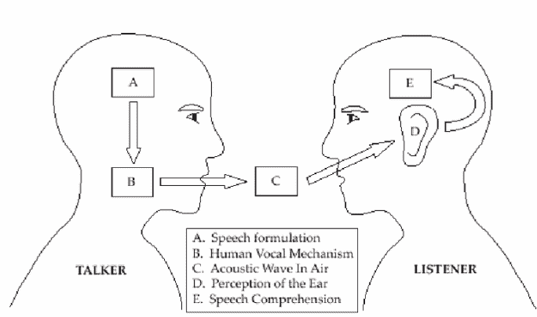
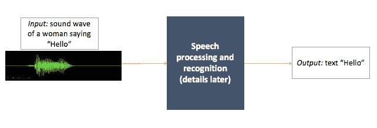
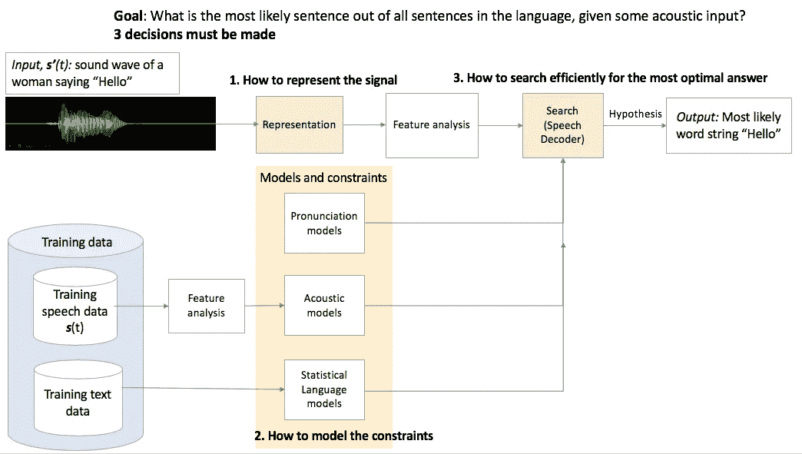

# 语音识别很难—第 1 部分

> 原文：<https://towardsdatascience.com/speech-recognition-is-hard-part-1-258e813b6eb7?source=collection_archive---------6----------------------->

说话是我们最自然的交流方式，是我们的第二天性。现在，我们的机器已经开始识别我们的语音，它们在与我们交流方面变得越来越好。

当前的语音助手和设备，如亚马逊 Alexa 和谷歌 Home，每个月都越来越受欢迎——它们正在改变我们购物的方式，我们搜索的方式，我们与设备甚至彼此互动的方式。

第一个语音识别软件是在 20 世纪 50 年代开发的，从那时起我们已经走过了漫长的道路。

# 我们是因为我们会说话

**_ _ _ _ _ _**

不清楚人类是从什么时候开始互相交谈的。估计差异很大，从晚至 5 万年前到早至 200 多万年前人类属的开始。我们可能不知道史前人类何时开始说话，但我们知道他们会说话，因为我们会。

一个普通人每分钟大约说 150 个单词，而一个普通人每分钟大约打 50 个单词——比起通过文本，我们可以用声音进行更多的交流*。*

但是我们没有那么简单——我们的交流不仅仅是我们每分钟说多少单词的问题。演讲不是任何一件事情。在演讲中，语境很重要，我们在哪里演讲，为什么演讲，我们的听众是谁，我们的目标是什么。简而言之，演讲很复杂*和*复杂。

# 言语是复杂的，错综复杂的

**___**

我们说话的方式差异很大:

*   有声读物推荐为每分钟 150-160 wpm 左右
*   建议幻灯片演示接近 100–125 wpm(以舒适的速度)
*   拍卖师可以以每分钟 250 英镑的速度发言
*   小约翰·莫斯奇塔是吉尼斯世界纪录的保持者，他是世界上说话最快的人，每分钟能说 586 个单词。他的记录在 1990 年被史蒂夫·伍德莫尔打破，他每分钟讲 637 个单词，然后在 1995 年 8 月 30 日被肖恩·香农打破，他每分钟讲 655 个单词。肖恩·香农用 23.8 秒背诵了哈姆雷特的独白《生存还是毁灭》(260 字)。

Sean Shannon reciting Hamlet’s soliloquy “To be or not to be” (260 words) in 23.8 seconds

没有语言，人类交流是不可想象的。说话时，我们进行语音合成、语音识别和语音理解。

# 两个人类如何交流？

**___**

在演讲中，我们试图把我们的想法和经历转换成声音和语言。

> ***印象和表达之间有多么大的鸿沟！这就是我们具有讽刺意味的命运——拥有莎士比亚式的情感，并且(除非我们碰巧是莎士比亚)像汽车销售员、青少年或大学教授那样谈论它们。我们以相反的方式实践炼金术——触摸金子，金子变成铅；触及经验的纯歌词，它们就变成了废话和猪食的口头等价物。”****――天才和女神阿尔多斯·赫胥黎*

*语音通信可以分解为[跟在](https://www.researchgate.net/publication/265168213_A_Speaker_Dependent_Large_Vocabulary_Isolated_Word_Speech_Recognition_System_for_Turkish)后面:*

1.  *演讲者用语言表达了他的想法。*
2.  *扬声器使用声带和语音系统发出声音。*
3.  *声音通过空气中的声波以振动的形式传到听者的耳朵里。*
4.  *声音通过听觉神经传递到听者的大脑。*
5.  *这些振动在他的大脑中被转换成某种“语言”。*
6.  *大脑从声音中提取意义。*

**

*[Schematic Diagram of the Speech Production / Perception Process](https://www.researchgate.net/figure/Schematic-Diagram-of-the-Speech-Production-Perception-Process-10_fig2_265168213)*

> ***自动语音识别系统(ASR)的主要目标是建立一个可以模拟人类听者的系统。***

*自动语音识别系统(ASR)的主要目标是建立一个可以模拟人类听者的系统，即它可以“理解”我们的口语并做出反应，这意味着系统可以对口语单词做出适当的反应，并将语音转换为另一种媒体，如文本。*

*自 20 世纪 30 年代以来，研究人员一直试图建造一台能够像人一样(或比人更好)产生、识别和理解人类语言的机器。[我将在以后的博客中讲述语音识别的历史——人物、故事、成功和失败。]*

*在过去的几年中，研究人员在这个问题上取得了重大进展，但通用语音识别仍然没有解决任何语言。这是因为语音识别很难。*

# *为什么机器很难做语音识别？*

***_ _ _ _ _ _***

*自动语音识别(ASR)系统是一个硬件和软件系统，其中输入是话音(语音)的声音，输出是那些口语单词的标识。*

**

*Very simple block diagram (What exactly does the box do? — details later)*

*中间的盒子是一个完整的系统，可以分析通常由麦克风采集的语音，然后将其转录为机器可用的文本形式。*

*为什么语音识别这么难？我们几乎毫不费力地做到了。语音识别很难，因为听力比我们天真地认为的更难、更复杂。让我们看看我们在做什么，机器需要做什么:*

1.  *我们有生理学和解剖学来接受声波。(机器必须将模拟信号(声波)转换成数字信号)。*
2.  *当有人对我们说话时，比如说在餐馆里，那么我们必须将他们的话(这被称为**信号**)与所有背景**噪音**——注意，噪音可能会有所不同——电话、房间音响、其他人的谈话、交通(如果窗户是开着的)等。(机器必须把语音和噪音分开)。*
3.  *有时人们说得太快(或太慢)——他们不会在一个句子结束时停下来或放慢速度，然后再开始一个新的句子。这些句子听起来像一个连续的长单词流(很难从声音中“听到”句子结构)，并且不清楚一个单词何时结束，另一个单词何时开始。(机器需要处理语音中的这些**端点**)。*
4.  *每个人听起来都不一样——年龄、性别、口音、风格、个性、背景、意图等等。—都影响声音和言语。见鬼，即使只有一个人也不会说“你好吗？”每次都是一样的——声音有规律地变化。(机器必须考虑语音的可变性(年龄、性别、口音等)。)).*
5.  *更进一步，假设我们在*与一个 9 岁、90 岁和其他几个人进行对话，他们都讲不同的方言或有不同的口音，那么我们必须理解*的核心*对话线索和每个人在说什么(至少大部分时间)。我们必须弄清楚，不管谁说“猫”这个词，它的意思都是一样的。(机器必须识别声音，即使它们是由完全不同的人说的——一个 9 岁的美国男孩和一个 60 岁的西班牙女人说的——“猫”和“caaattt”。**
6.  *有很多单词听起来很相似或相同(像“to”、“too”、“two”)，但意思却很不一样(它们是**同音**)。我们需要知道说话者想要哪个词(和意思)。(机器必须消除同音词的歧义)。*
7.  *我们在言语中使用的填充词有很多，比如“嗯”、“呃”、“嗯”等。，我们本能地知道如何过滤它们。这些不会让我们偏离轨道，也不会让我们错误地理解说话者的话。(机器也必须过滤这些填料)。*
8.  *还有误解——我们听错了句子。我最近有过这样的经历:我的一个朋友告诉我一个街道名称，我猜了大约 5 种不同的东西——全部都不正确*——从名称到食物！(机器也必须管理这样的误解，在这项任务中，它们需要比我们强得多——因为我们发现机器中的这种错误令人讨厌)。**
9.  *最后，如果所有这些听起来不多，我们必须知道我们使用的语言的语法和语义以及上下文。*

*令人惊讶的是，我们在一次简单的对话中就做到了这一切(或许还有更多)。从这个意义上说，我们的大脑是不可思议的。因此，机器努力做到这一切就不足为奇了。尽管如此，语音识别已经走过了漫长的道路，这可能只是一个开始。*

# *机器如何进行语音识别？*

***___***

> *你只是一波一波地过来。你的嘴唇在动，但我听不到你在说什么。 *—平克·弗洛伊德，舒舒服服地麻木了**

*机器在理想条件下的语音识别系统要比现实生活中好得多。理想状态通常意味着 1)一个成年白人男性 2)在一个安静的房间里 3)说话(故意地、缓慢地)4)直接对着一个好的麦克风。但是现实世界很乱。*

*让我们来分解一下高级别的 ASR 流程:*

**

*我们看到了构建自动语音识别系统的一些概念问题。那么，中间的盒子里会放什么呢？建立一个好的系统？*

# *ASR 的组件*

***_ _ _ _ _ _***

*ASR 系统通常由以下部件组成:*

*   *输入的数字表示(以及提取它的方法)*
*   *特征提取组件:该组件识别包含语音的输入部分，然后将这些部分转换成称为**声学参数**的序列。*
*   *用于训练和测试的数据/语料库:这个数据库是一个记录语音的集合，增加了所需的注释和转录。这个语料库必须足够大，足够相关，以涵盖给定用例中语音的可变性。*
*   *声学模型:声学模型获取语音波形，将其分解成小片段，并预测语音中最可能的音素。*
*   *发音模型:发音模型获取声音并将它们联系在一起以构成单词，即，它将单词与其语音表示相关联。*
*   *语言模型:语言模型获取单词并将它们连接在一起组成句子，也就是说，它预测几个文本字符串中最可能的单词(或文本字符串)序列。*
*   *有效搜索假设空间的算法(称为**解码器**):这结合了声学和语言模型的预测，并输出给定语音文件输入的最可能的文本字符串。*

**

*Components of an ASR system*

*该系统的目标是将这些不同的模型结合起来，以获得对给定输入句子的已经观察到的声音序列(在语音数据库中)的概率的估计。然后，系统搜索所有句子的空间，并选择一个概率最高的句子作为输入源句子。*

*现在，考虑一下*所有*英语句子的集合——这个集合非常庞大，因此我们需要一个有效的算法，即*而不是*搜索*所有*可能的句子，但只搜索有足够好的机会匹配输入的句子，从而使**成为一个搜索问题**(或称为解码问题)。*

*ASR 系统有哪些特征？我们如何看待不同类型的 ASR 系统？这是第 2 部分——我将分解 ASR 系统的每个组件，以及在构建这样一个系统时我们必须做出的权衡。*

****第 2 部分 ASR 系统的特征(即将推出…)****

# *语言趣谈*【有何不可？]**

***___***

> *我毫不怀疑，语言的起源应归功于对各种自然声音、其他动物的声音以及人类自身本能的叫声的模仿和修改，并得到了手势和手势的帮助——*查尔斯·达尔文，1871 年。男人的血统，以及与性别相关的选择**
> 
> *“人类的语言就像一个有裂缝的水壶，我们敲着粗糙的节奏让熊跟着跳舞，而我们渴望创造出能融化星星的音乐。”——*居斯塔夫·福楼拜，包法利夫人**
> 
> *“如果你用一个人能理解的语言和他交谈，那会让他头脑发热。如果你用他的语言和他交谈，那会触及他的内心。”——*纳尔逊·曼德拉**
> 
> *“与此同时，可怜的巴别鱼，通过有效地消除不同种族和文化之间交流的所有障碍，引发了比创造历史上任何事情都更多、更血腥的战争。”——*道格拉斯·亚当斯，银河系漫游指南**

## *其他东西*

*我写的其他一些文章(如果你感兴趣的话):*

*[**生命延续革命—第一部**](https://hackernoon.com/the-life-extension-revolution-part-1-6b5642c8c125) **:我们这个时代真正严重的一个问题是死亡。**因为时间到了，时间*真的*到了。你已经不在了。你所有的学习、尝试、试验、错误、情感、想法、经历、愿望、渴望、梦想都不复存在。再大的活下去的欲望，也活不下去。 [*继续阅读*](https://hackernoon.com/the-life-extension-revolution-part-1-6b5642c8c125)*……**

*[**会玩的机器(概述)**](https://hackernoon.com/machines-that-play-overview-7f670681ef6a) **:** 这个系列涵盖了人工智能和游戏的历史(直到深蓝)，并专注于会下棋、跳棋和西洋双陆棋的机器。涵盖了以下主题:如何构建国际象棋机器、香农在国际象棋方面的工作、图灵在国际象棋方面的工作、土耳其人、El Ajedrecista、MANIAC、Bernstein 国际象棋程序、Samuel's checkers、Mac Hack VI、Cray Blitz、BKG、HiTech、Chinook、Deep think、TD-Gammon 和深蓝。 [*继续阅读*](https://hackernoon.com/machines-that-play-overview-7f670681ef6a)*……**