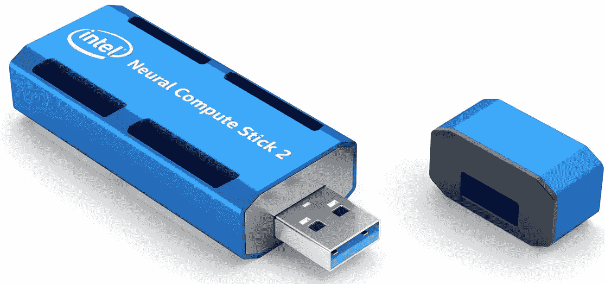
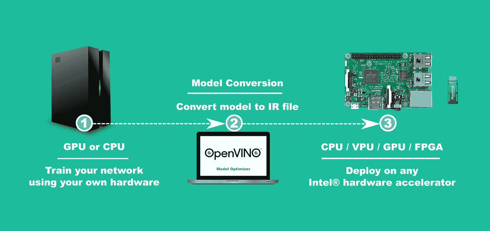
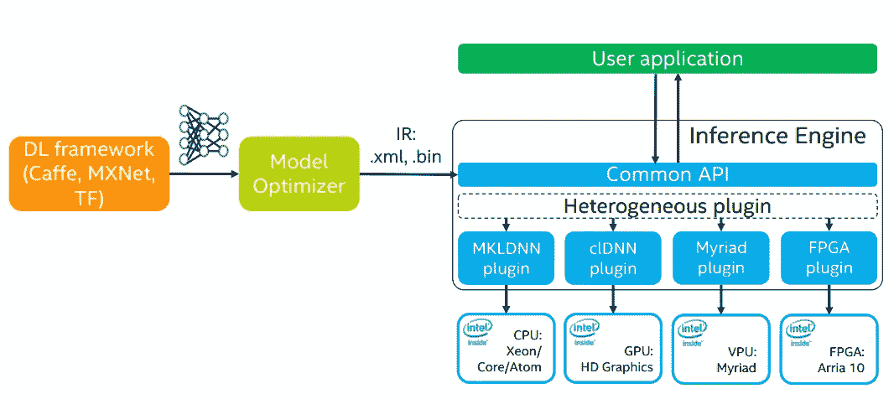
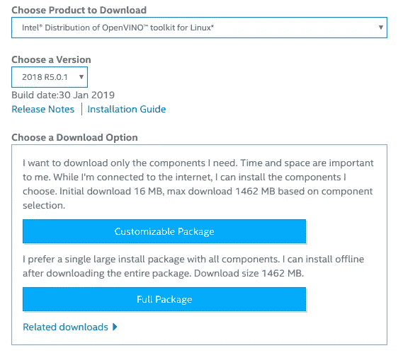
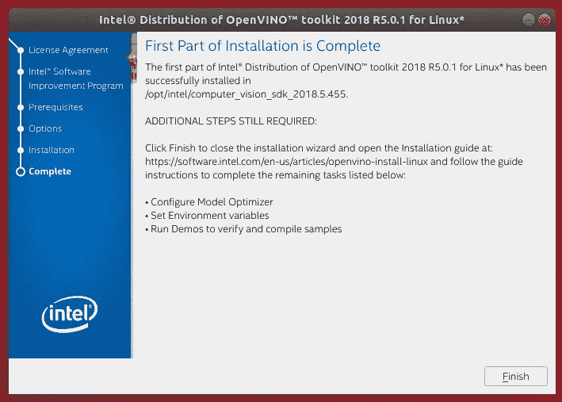
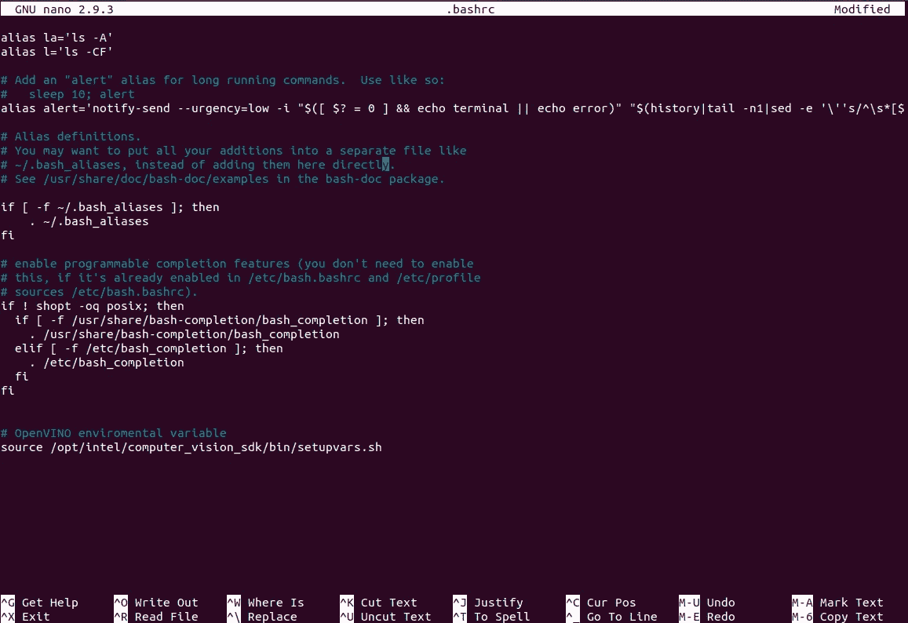
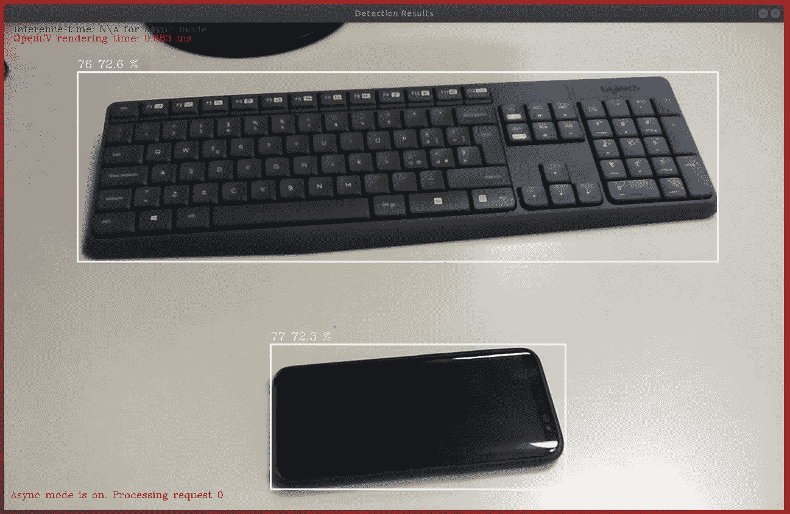
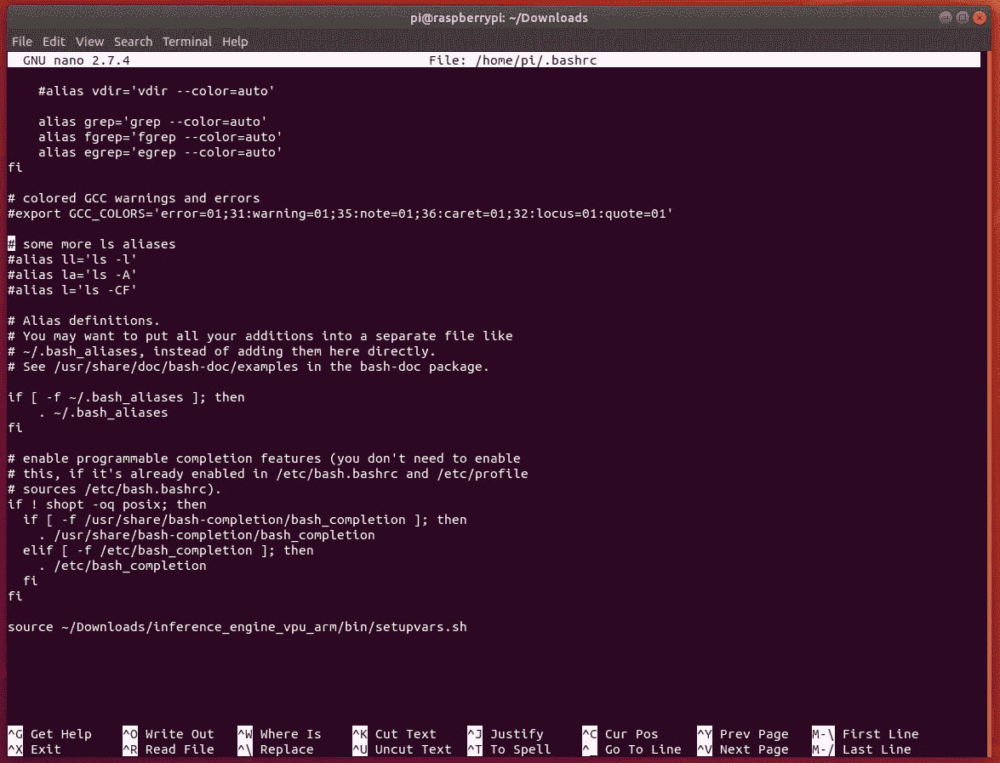
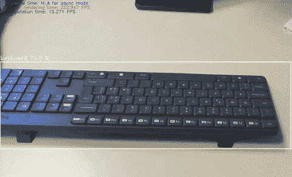

# 使用神经计算棒和 OpenVINO 加速对低功耗设备的预测

> 原文：<https://towardsdatascience.com/speed-up-predictions-on-low-power-devices-using-neural-compute-stick-and-openvino-98f3ae9dcf41?source=collection_archive---------7----------------------->

## 英特尔的神经计算棒能够在边缘加速 Tensorflow 神经网络推理，将性能提高 10 倍。



Neural Compute Stick — NCS

在本文中，我们将探索实现以下目标所需的步骤:

1.  使用英特尔的 OpenVINO Toolkit 将 Tensorflow 模型转换为 NCS 兼容模型
2.  在 Raspberry 上安装一个轻量级版本的 OpenVINO，在船上运行推理
3.  在 Raspberry 上测试和部署转换后的模型

# 要求

该程序需要:

*   一个基于 Ubuntu 的*主机*(建议:Ubuntu 18.04 LTS)。
*   一个英特尔 Movidius 神经计算棒(两个 [NCS1](https://software.intel.com/en-us/movidius-ncs) 和 [NCS2](https://software.intel.com/en-us/neural-compute-stick) 都与程序兼容)。
*   安装了 Raspian 操作系统的 Raspberry Pi 板(建议:Raspberry Pi 3)

# **定义程序**

首先，假设我们想要转换一个已经训练好的 Tensorflow 对象检测模型。出于本文的目的，我们将使用 Tensorflow 团队在 [COCO 对象数据集](http://cocodataset.org/#home)(此处[为模型的完整列表)上开发的一个已经训练好的模型。](https://github.com/tensorflow/models/blob/master/research/object_detection/g3doc/detection_model_zoo.md)

我们需要使用 [OpenVINO Toolkit](https://software.intel.com/en-us/openvino-toolkit) 将这个模型转换成 NCS 兼容版本，称为中间表示(或 IR)。



在转换之后，我们得到了两个文件，这两个文件可以部署在连接了 NCS 硬件的 Raspberry Pi 上。

更详细的工艺流程如下:



神经计算棒装有一个[万千芯片](https://www.movidius.com/solutions/vision-processing-unit)(也叫视觉处理器或 VPU)。

# 在主机上开始使用 OpenVINO

作为第一步，需要在*主机*上安装 OpenVINO Toolkit。

## 下载并安装 OpenVINO

首先连接到[下载页面](https://software.seek.intel.com/openvino-toolkit)。然后，自己注册，选择 Ubuntu 版本的 OpenVINO，选择*全包*按钮。之后，下载文件，将其放在`Downloads`中。



OpenVINO Download

一旦完成，就该安装软件包了。

让我们打开一个新的终端(`CTRL` + `ALT` + `T`)。导航到`Downloads`文件夹，解压缩文件，安装依赖项并执行 GUI 安装，如下所示:

```
cd ~/Downloads
tar xvf l_openvino_toolkit_<VERSION>.tgz
cd l_openvino_toolkit_<VERSION>
sudo ./install_cv_sdk_dependencies.sh
sudo ./install_GUI.sh
```

按照屏幕指示，继续进行**完全安装**


Proceed with full installation

等待几分钟，直到安装过程完成。



Installation completed

现在需要**设置环境变量**。运行以下脚本临时设置环境变量:

```
source /opt/intel/computer_vision_sdk/bin/setupvars.sh
```

当您关闭 shell 时，OpenVINO toolkit 环境变量将被删除。作为一个选项，可以永久设置如下环境变量(*强烈建议*):

让我们打开`.bashrc`文件，通过签发:

```
nano ~/.bashrc
```

将这一行附加到文件的末尾:

```
source /opt/intel/computer_vision_sdk/bin/setupvars.sh
```



Command at the end of the file

保存文件并关闭编辑器(`CTRL` + `X`)。

为了确保一切正常，让我们打开一个新的终端。打开后，您应该能够看到:

```
[setupvars.sh] OpenVINO environment initialized
```

## 配置神经计算棒通信

现在有必要更新 udev 规则以便让 OpenVINO 能够与神经计算棒通信。

为此，让我们打开一个新的终端(`CTRL` + `ALT` + `T`)并发出以下命令:

```
cd ~/Downloadcat <<EOF > 97-usbboot.rules
SUBSYSTEM=="usb", ATTRS{idProduct}=="2150", ATTRS{idVendor}=="03e7", GROUP="users", MODE="0666", ENV{ID_MM_DEVICE_IGNORE}="1"
SUBSYSTEM=="usb", ATTRS{idProduct}=="2485", ATTRS{idVendor}=="03e7", GROUP="users", MODE="0666", ENV{ID_MM_DEVICE_IGNORE}="1"
SUBSYSTEM=="usb", ATTRS{idProduct}=="f63b", ATTRS{idVendor}=="03e7", GROUP="users", MODE="0666", ENV{ID_MM_DEVICE_IGNORE}="1"
EOF
```

然后:

```
sudo cp 97-usbboot.rules /etc/udev/rules.d/
sudo udevadm control --reload-rules
sudo udevadm trigger
sudo ldconfig
rm 97-usbboot.rules
```

## 测试安装

我们现在可以通过对图像分类器进行预测来测试安装。让我们将记忆棒插入主机的 USB 端口(*建议使用 USB 3.0 端口*)。打开一个新终端，然后运行以下命令:

```
sudo ./opt/intel/computer_vision_sdk/deployment_tools/model_optimizer/install_prerequisites/install_prerequisites.sh
```

然后:

```
./opt/intel/computer_vision_sdk/deployment_tools/demo/demo_squeezenet_download_convert_run.sh -d MYRIAD
```

在执行结束时，您将能够看到以下输出:

```
Top 10 results:Image /opt/intel/computer_vision_sdk/deployment_tools/demo/car.png817 0.8422852 label sports car, sport car
511 0.0915527 label convertible
479 0.0393982 label car wheel
751 0.0093536 label racer, race car, racing car
436 0.0068550 label beach wagon, station wagon, wagon, estate car, beach waggon, station waggon, waggon
656 0.0036659 label minivan
586 0.0023270 label half track
717 0.0015497 label pickup, pickup truck
864 0.0010500 label tow truck, tow car, wrecker
581 0.0005631 label grille, radiator grilletotal inference time: 34.1828987
Average running time of one iteration: 34.1828987 msThroughput: 29.2543944 FPS[ INFO ] Execution successful###################################################Demo completed successfully.
```

这意味着你成功地使用加载在神经计算棒上的 SqueezeNet 网络进行了预测。

# 将张量流模型转换为 IR

如前所述，我们希望使用 Tensorflow 模型来使用 OpenVINO Toolkit 进行推理。

下面我们从 tensor flow ODAPI[Model Zoo](https://github.com/tensorflow/models/blob/master/research/object_detection/g3doc/detection_model_zoo.md)下载一个 SSD MobileNet v1 探测器模型。为此，让我们打开一个新的终端并发出命令:

```
cd ~/Downloads
wget http://download.tensorflow.org/models/object_detection/ssd_mobilenet_v1_coco_2018_01_28.tar.gztar -xvzf ssd_mobilenet_v1_coco_2018_01_28.tar.gz
```

让我们转换模型:

```
mo_tf.py \
    --input_model ~/Downloads/ssd_mobilenet_v1_coco_2018_01_28/frozen_inference_graph.pb \
    --tensorflow_use_custom_operations_config     /opt/intel/computer_vision_sdk/deployment_tools/model_optimizer/extensions/front/tf/ssd_support.json \
    --tensorflow_object_detection_api_pipeline_config ~/Downloads/ssd_mobilenet_v1_coco_2018_01_28/pipeline.config \
    --data_type FP16
```

我们使用半精度浮点格式(或 FP16)转换了 Tensorflow 模型，以便将模型大小减半，但以可忽略的较低精度为代价大幅提高性能。

输出应该类似于:

```
Model Optimizer arguments:
Common parameters:
 - Path to the Input Model:  /home/<username>/Downloads/ssd_mobilenet_v1_coco_2018_01_28/frozen_inference_graph.pb
 - Path for generated IR:  /home/<username>/Downloads/.
 - IR output name:  frozen_inference_graph
 - Log level:  ERROR
 - Batch:  Not specified, inherited from the model
 - Input layers:  Not specified, inherited from the model
 - Output layers:  Not specified, inherited from the model
 - Input shapes:  Not specified, inherited from the model
 - Mean values:  Not specified
 - Scale values:  Not specified
 - Scale factor:  Not specified
 - Precision of IR:  FP16
 - Enable fusing:  True
 - Enable grouped convolutions fusing:  True
 - Move mean values to preprocess section:  False
 - Reverse input channels:  False
TensorFlow specific parameters:
 - Input model in text protobuf format:  False
 - Offload unsupported operations:  False
 - Path to model dump for TensorBoard:  None
 - List of shared libraries with TensorFlow custom layers implementation:  None
 - Update the configuration file with input/output node names:  None
 - Use configuration file used to generate the model with Object Detection API:  /home/<username>/Downloads/ssd_mobilenet_v1_coco_2018_01_28/pipeline.config
 - Operations to offload:  None
 - Patterns to offload:  None
 - Use the config file:  /opt/intel/computer_vision_sdk/deployment_tools/model_optimizer/extensions/front/tf/ssd_support.json
Model Optimizer version:  1.5.12.49d067a0
The Preprocessor block has been removed. Only nodes performing mean value subtraction and scaling (if applicable) are kept.[ SUCCESS ] Generated IR model.
[ SUCCESS ] XML file: /home/<username>/Downloads/./frozen_inference_graph.xml
[ SUCCESS ] BIN file: /home/<username>/Downloads/./frozen_inference_graph.bin
[ SUCCESS ] Total execution time: 20.48 seconds.
```

在`Download`文件夹中，您现在应该可以看到新生成的文件，扩展名分别为:

*   `.xml`
*   `.bin`

这些文件将用于树莓板上的预测。

## 测试模型

在将前面的文件上传到 Raspberry 之前，我们先检查一下是否一切正常，推断生成的模型。

将摄像头和神经计算棒插在你的*主机*上。让我们打开一个新的终端并发出:

```
cp /opt/intel/computer_vision_sdk_2018.5.455/deployment_tools/inference_engine/samples/python_samples/object_detection_demo_ssd_async.py ~/Downloads/python3 object_detection_demo_ssd_async.py \
    -m ~/Downloads/frozen_inference_graph.xml \
    -i cam \
    -pt 0.6
```

您的*主机*现在应该会打开一个新窗口，显示您的相机检测！



Detections on the main machine using NCS2

# 在树莓 Pi 上运行神经网络

让我们来设置您的树莓 Pi 板。我们将首先为树莓安装一个轻量级版本的 OpenVINO。然后，我们将在板上设置运行 SSDMobileNet V1 所需的所有文件。

## 为树莓 Pi 安装 OpenVINO

需要安装并运行 Raspian OS(*建议从头安装 Raspian OS*)。

首先我们需要[下载](https://download.01.org/openvinotoolkit/2018_R5/packages/l_openvino_toolkit_ie_p_2018.5.445.tgz) OpenVINO。这个版本与上一个版本不同。在`Download`内保存文件。

让我们打开一个新的终端。发出以下命令:

*   导航至`Download`文件夹:

```
cd ~/Downloads/
```

*   解压缩先前下载的归档文件:

```
tar -xf l_openvino_toolkit_ie_p_<version>.tgz
```

这将创建`inference_engine_vpu_arm`文件夹。

*   修改`setupvars.sh`脚本，在`Downloads`文件夹中，将`<INSTALLDIR>`替换为安装文件夹的绝对路径，发出以下命令:

```
sudo sed -i "s|<INSTALLDIR>|$(pwd)/inference_engine_vpu_arm|" inference_engine_vpu_arm/bin/setupvars.sh
```

## 设置环境变量

在启动和运行 OpenVINO Toolkit 之前，需要更新几个环境变量。让我们运行下面的命令，在`Downloads`文件夹中临时设置环境变量:

```
source inference_engine_vpu_arm/bin/setupvars.sh
```

输出应该类似于:

```
[setupvars.sh] OpenVINO environment initialized
```

类似于主机上的程序，现在建议通过打开`.bashrc`文件 a 永久设置环境变量

```
nano ~/.bashrc
```

并在结尾处添加以下一行:

```
source ~/Downloads/inference_engine_vpu_arm/bin/setupvars.sh
```



保存文件并退出。

为了测试安装，让我们打开一个新的终端。您应该看到:

```
[setupvars.sh] OpenVINO environment initialized
```

**添加 USB 规则**

*   将当前 Linux 用户添加到`users`组:

```
sudo usermod -a -G users "$(whoami)"
```

注销然后再登录(或者关闭再打开 Raspberry)以使其生效。

*   安装 USB 规则，从`Downloads`文件夹内打开一个新的终端并发出:

```
sh inference_engine_vpu_arm/install_dependencies/install_NCS_udev_rules.sh
```

## 复制预测文件

现在是将模型文件复制到 Raspberry 的时候了。要运行演示应用程序，我们需要以下文件:

```
+ frozen_inference_graph.xml
+ frozen_inference_graph.bin
+ object_detection_demo_ssd_async.py
```

如果您正确遵循了前面的步骤，这些文件应该位于主机的`Download`文件夹中。

您可以将这些文件复制到 USB 驱动器，然后复制到 Raspberry，或者通过 SSH。

在树莓上，新建一个文件夹:`mkdir ~/NCS-demo`。把所有以前的文件放进去。

## 在树莓上运行演示应用程序

最后，我们可以在 Raspberry 上执行用于检测的演示应用程序。为了做到这一点:

1.  在树莓上连接神经计算棒
2.  将 USB 摄像头连接到 Raspberry
3.  执行以下命令:

```
cd ~/NCS-demopython3 object_detection_demo_ssd_async.py \
    -m frozen_inference_graph.xml \
    -i cam  \
    -d MYRIAD \
    -pt 0.6
```

***提示*** *:增减* `*-pt*` *标志值。会影响检测的信心。*

正如之前在主机上经历的那样，应该会弹出一个新窗口，以接近 10FPS 的速度显示该网络的推断！



Detections on Raspberry Pi @ ~10FPS

# 结论

神经计算棒是一种功能强大的硬件，可用于在低功率系统上执行卷积神经网络。我们的测试显示，与在香草树莓板上执行的推理相比，速度提高了近 10 倍。

这只是硬件方面的起点。我们将在未来看到越来越多的低功率设备上的专用硬件，如手机、平板电脑、个人电脑、汽车、无人机，甚至[卫星](https://www.aikospace.com/)。

毫无疑问，英特尔是这一环境中的主要参与者之一，它在收购 Movidius 公司的同时，也在与脸书一起探索其他解决方案，如[英特尔 Nervana](https://www.intel.ai/ai-at-ces/#gs.0zw5zg) 。

然而，竞争也在这一领域发挥着重要作用。

Xilinx 正在调整他的 ZINQ FPGAs，以便在硬件方面加速边缘神经网络的性能，同时还开发了一个名为 Deephi DNNDK 的软件工具，用于优化低功耗系统的神经网络。

谷歌也在这方面采取行动，开发了全新的 Edge TPU，专为运行能够在非常低的功率下提高预测速度的`.tflite`模型而设计*(敬请期待，我们将很快探索这一解决方案，与 NCS 进行性能比较)*。

对于人工智能驱动的嵌入式设备来说，这是一个令人兴奋的时代。

*文章由* [*马蒂亚·瓦里勒*](http://www.linkedin.com/in/mattia-varile)

请随意评论这篇文章，以提高他的质量和效果。

# 资源

*   [Linux 上的详细安装](https://software.intel.com/en-us/articles/OpenVINO-Install-Linux)
*   [Tensorflow ODAPI 转换指南](https://software.intel.com/en-us/articles/OpenVINO-Using-TensorFlow#converting-tf-object-detection-api-models)
*   [物体检测固态硬盘演示](https://software.intel.com/en-us/articles/OpenVINO-IE-Samples)
*   [在树莓 P 上安装 OpenVINO](https://software.intel.com/en-us/articles/OpenVINO-Install-RaspberryPI)I