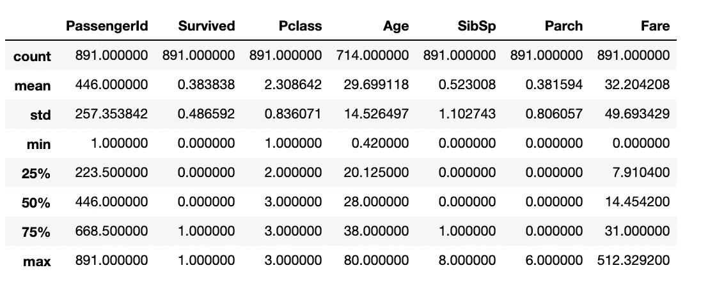
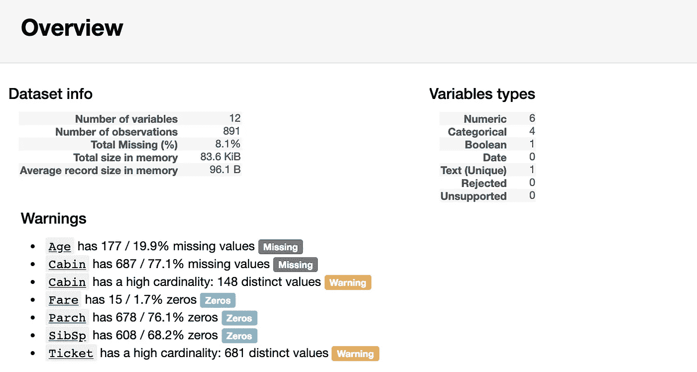
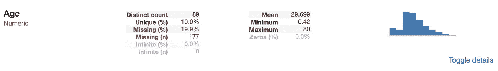
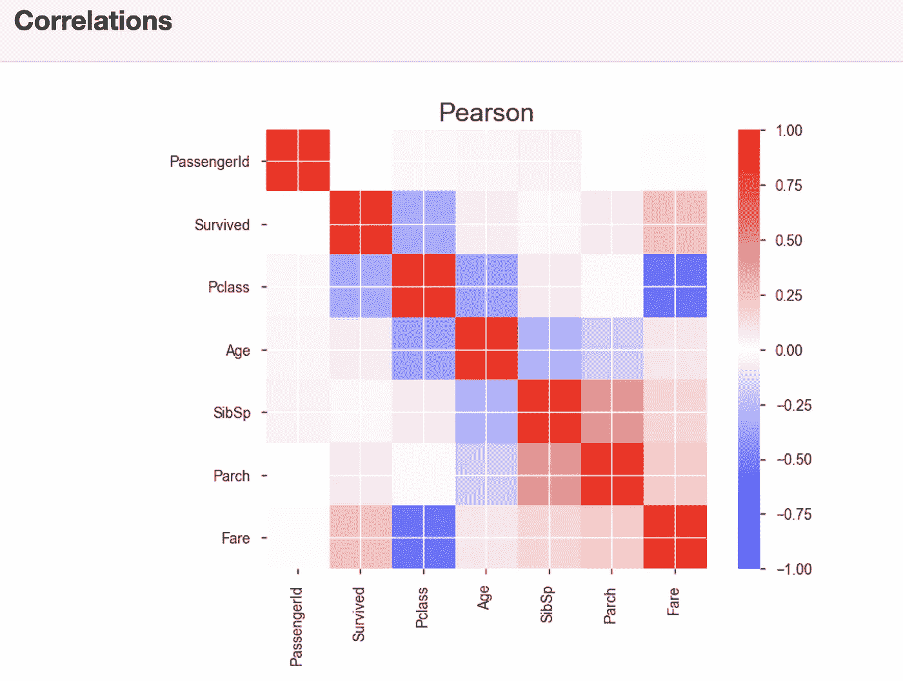
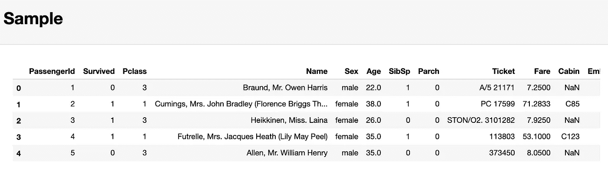

# 使用 Pandas-Profiling 加速您的探索性数据分析

> 原文：<https://towardsdatascience.com/speed-up-your-exploratory-data-analysis-with-pandas-profiling-88b33dc53625?source=collection_archive---------1----------------------->

## 只需一行代码就能直观地了解数据的结构

Source: [https://unsplash.com/photos/gts_Eh4g1lk](https://unsplash.com/photos/gts_Eh4g1lk)

# 介绍

第一次导入新的数据集时，首先要做的是理解数据。这包括确定特定预测值的范围、识别每个预测值的数据类型以及计算每个预测值缺失值的数量或百分比等步骤。

pandas 库为 EDA 提供了许多非常有用的功能。但是，在能够应用其中的大部分之前，一般要先从更通用的函数开始，比如 **df.describe()** 。然而，这些函数所提供的功能是有限的，而且通常情况下，您的初始 EDA 工作流对于每个新数据集都非常相似。作为一个不喜欢完成重复性任务的人，我最近在寻找替代方法，并发现了熊猫轮廓。pandas-profiling 不只是给出一个单一的输出，它使用户能够快速生成一个结构非常广泛的 HTML 文件，其中包含了您在深入研究更具体和更个性化的数据之前可能需要了解的大部分内容。在接下来的段落中，我将带你了解 pandas-profiling 在 Titanic 数据集上的应用。

# 更快的 EDA

我选择将 pandas-profiling 应用于 Titanic 数据集，因为数据类型多样，而且缺少值。在我看来，当数据还没有被清理并且仍然需要进一步的个性化调整时，pandas-profiling 特别有趣。为了在这些个性化的调整中更好地引导你的注意力，你需要知道从哪里开始，关注什么。这就是大熊猫特征分析的用武之地。

首先，让我们导入数据并使用 pandas 检索一些描述性统计数据:

上面的代码块将产生以下输出:

虽然上面的输出包含大量信息，但它并没有告诉您您可能感兴趣的所有内容。例如，您可以假设数据框有 891 行。如果您想要检查，您必须添加另一行代码来确定数据帧的长度。虽然这些计算并不十分昂贵，但一遍又一遍地重复它们确实会占用时间，在清理数据时，你或许可以更好地利用这些时间。

## 概观

现在，让我们对熊猫做同样的分析:

运行这一行代码将为您的数据创建一个 HTML EDA 报告。上面显示的代码将创建结果的内联输出；但是，您也可以选择将 EDA 报告保存为 HTML 文件，以便能够更轻松地共享它。

HTML EDA 报告的第一部分将包含一个概述部分，为您提供基本信息(观察次数、变量数量等)。).它还会输出一个警告列表，告诉您在哪里需要再次检查数据，并可能需要集中精力进行清理。

Overview Output

## 特定变量 EDA

在概述之后，EDA 报告为您提供了每个特定变量的有用见解。其中还包括一个描述每个变量分布的小型可视化工具:

Output for numeric variable ‘Age’

从上面可以看出，pandas-profiling 为您提供了一些有用的指标，例如缺失值的百分比和数量，以及我们前面看到的描述性统计数据。由于“年龄”是一个数字变量，使用直方图可视化它的分布告诉我们，这个变量似乎是右偏的。

对于分类变量，只做了微小的改变:

Output for categorical variable ‘Sex’

pandas-profiling 不是计算平均值、最小值和最大值，而是计算分类变量的类计数。由于“性别”是一个二元变量，我们只找到两个不同的计数。

如果你像我一样，你可能想知道 pandas-profiling 是如何计算其输出的。幸运的是，源代码可以在 [GitHub](https://github.com/pandas-profiling) 上找到。因为我不喜欢在代码中制造不必要的黑盒部分，所以我将快速进入一个数值变量的源代码:

虽然这看起来像是一大段代码，但实际上非常容易理解。Pandas-profiling 的源代码包括另一个确定每个变量类型的函数。如果变量被识别为数字变量，上面的函数将产生我前面展示的输出。该函数使用基本的 pandas 系列操作，例如 **series.mean()** ，并将结果存储在**统计字典**中。这些图是使用 matplotlib 的 **matplotlib.pyplot.hist** 函数的改编版本生成的，目的是能够处理不同类型的数据集。

## 相关性和样本

在每个特定变量的 EDA 下，pandas-profiling 将输出 Pearson 和 Spearman 相关矩阵。

Pearson correlation matrix output

如果您愿意，可以在生成报告的初始代码行中设置一些相关性阈值。这样，你就能够调整你认为对你的分析重要的相关性强度。

最后，pandas-profiling 将输出一个代码示例。严格地说，这不是一个代码样本，而只是数据的头部。当最初的几个观察值不能代表数据的总体特征时，这可能会导致问题。

因此，我建议不要将最后一个输出用于您的初始分析，而是运行 **df.sample(5)** ，它将从您的数据集中随机选择五个观察值。

# 结论

总之，pandas-profiling 提供了一些有用的特性，特别是如果您的主要目标是快速而粗略地理解您的数据，或者以可视格式与他人共享您的初始 EDA。然而，它并没有接近自动化 EDA。实际的个性化工作仍然需要手工完成。

如果你想在一个笔记本中看到整个 EDA，请查看我在 [nbviewer online](https://nbviewer.jupyter.org/github/lksfr/TowardsDataScience/blob/master/pandas-profiling.ipynb) 中使用的笔记本。你也可以在我的 [GitHub repo](https://github.com/lksfr/TowardsDataScience/blob/master/pandas-profiling.ipynb) 上找到中等物品的代码。