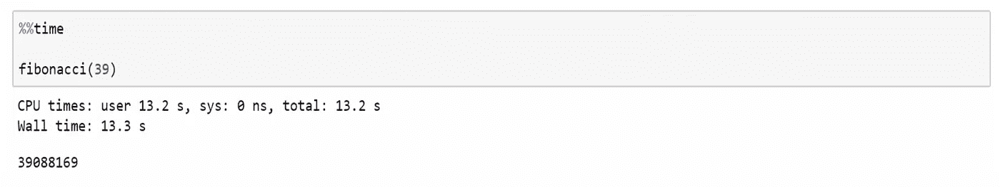
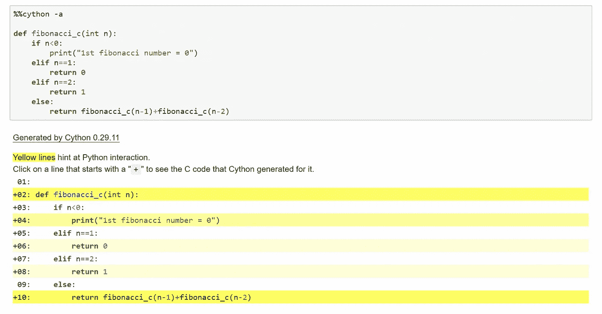
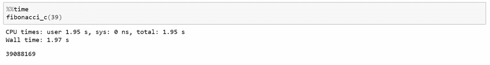

# 使用 Cython 加速您的 Python 代码

> 原文：<https://towardsdatascience.com/speed-up-your-python-code-with-cython-8879105f2b6f?source=collection_archive---------13----------------------->

## 花更少的时间在屏幕前等待


Picture from [Unsplash](https://unsplash.com/photos/fxAo3DiMICI)

# **简介**

如果你曾经用 Python 编写过代码，你可能会花更多的时间等待某些代码块执行，而这是你所不希望的。虽然有一些方法可以让你的代码更有效率，但很可能还是比 C 代码慢。这主要归结于一个事实，即 Python 是一种动态编程语言，它将 C 在编译过程中负责的许多事情移到了运行时。

然而，如果你和我一样，喜欢用 Python 编程，并且仍然想加速你的代码，你可以考虑使用 **Cython** 。虽然 Cython 本身是一种独立的编程语言，但它非常容易集成到您的 Jupyter 笔记本工作流程中。在执行时，Cython 会将您的 Python 代码翻译成 C 语言，通常会显著提高速度。

# **安装 Cython**

为了能够使用 Cython，你需要一个 C 编译器。因此，根据您当前的操作系统，安装过程会有所不同。对于 Linux，GNU C 编译器(gncc)通常是存在的。对于 Mac OS，你可以[下载 Xcode](https://developer.apple.com/) 来获得 gncc。如果您应该使用 Windows，安装过程会稍微复杂一些。关于 Cython 的 GitHub 的更多信息[请点击这里](https://github.com/cython/cython/wiki/InstallingOnWindows)。

一旦你有了 C 编译器，你需要在你的终端上运行的是:

```
pip install Cython
```

# **如何使用 Cython**

展示 Cython 功能的最简单方式是通过 Jupyter 笔记本电脑。为了在我们的笔记本中使用 Cython，我们将使用 IPython magic 命令。神奇的命令以百分号开始，并提供了一些额外的功能，旨在增强您的工作流程。一般来说，有两种类型的魔法命令:

1.  线魔法由单个“%”表示，并且只对一行输入进行操作
2.  单元格魔术由两个“%”表示，对多行输入进行操作。

让我们开始吧:

首先，为了能够使用 Cython，我们必须运行:

```
%load_ext Cython
```

现在，每当我们想在一个代码单元中运行 Cython 时，我们必须首先将以下神奇的命令放入该单元:

```
%%cython
```

一旦你这样做了，你就可以开始用 Cython 编码了。

# **cy thon 快了多少？**

与普通的 Python 代码相比，Cython 的速度快多少实际上取决于代码本身。例如，如果你要运行计算量很大的包含许多变量的循环，Cython 将会大大优于普通的 Python 代码。递归函数也将使 Cython 比 Python 快得多。

让我们用斐波那契数列来证明这一点。这个算法，简单来说，就是把前两个数加起来，找到下一个数。这在 Python 中可能是这样的:

```
def fibonacci(n): if n < 0:
        print("1st fibonacci number = 0") elif n == 1:
        return 0 elif n == 2:
        return 1 else:
        return fibonacci(n-1) + fibonacci(n-2)
```

让我们让 Python 发挥作用:



如您所见，找到序列中的第 39 个数字需要 13.3 秒的计算时间。这里的 Wall time 指的是从开始到结束调用函数所用的总时间。

让我们在 Cython 中定义相同的函数。



这是怎么回事？如你所见，我们在顶部使用了一些细胞魔法，允许我们在这个细胞中使用 Cython。我将很快解释“-a”选项的作用。然后，我们基本上采用与上面相同的代码，除了现在我们能够利用静态类型声明并将 n 定义为 integer 类型。

正如您所看到的，通过在 magic 命令后添加“-a”，我们收到了注释，向我们显示了您的代码中有多少 Python 交互。这里的目标是去掉所有的黄线，取而代之的是白色背景。在这种情况下，将没有 Python 交互，所有代码都将在 C 中运行。您还可以单击每行旁边的“+”号来查看 Python 代码的 C 翻译。

那段代码快了多少？让我们来看看:



在这种情况下，Cython 比 Python 快 6.75 倍左右。这清楚地展示了利用 Cython 节省时间的能力，与常规 Python 代码相比，它提供了最大的改进。

# **附加选项**

如果你已经知道 C，Cython 也允许访问 C 代码，而 Cython 的制造商还没有为这些代码添加现成的声明。例如，使用下面的代码，您可以为 C 函数生成一个 Python 包装器，并将其添加到模块 dict 中。

```
%%cythoncdef extern from "math.h":
    cpdef double sin(double x)
```

Cython 证明了许多额外的能力，例如并行性，这些都在它的文档中有非常清晰的描述，你可以在这里找到。

# **结论**

如果您有时会遇到 Python 代码执行时间过长的问题，Cython 提供了一种真正集成的高效方法来加速您的代码。最重要的是，如果你对 c 语言稍微熟悉一点，它提供了许多进一步优化你的代码的能力。如果你有任何建议或意见，请随时联系我。