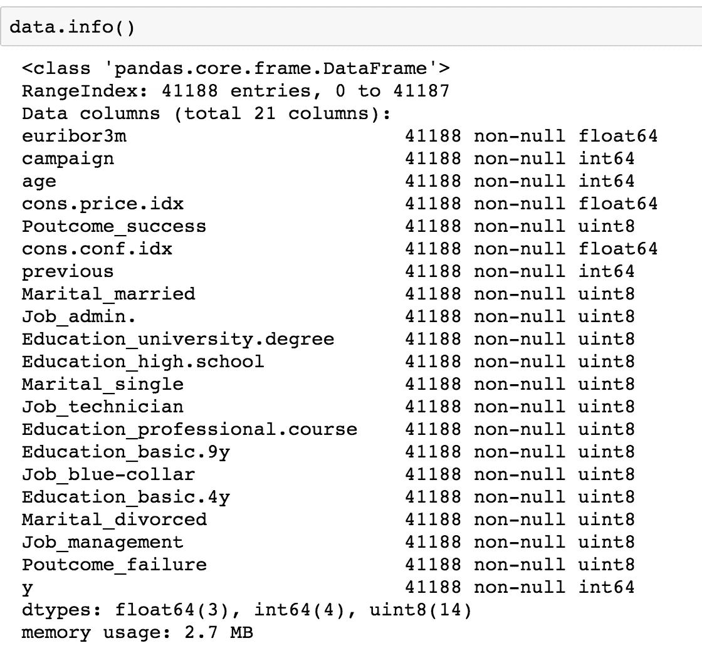
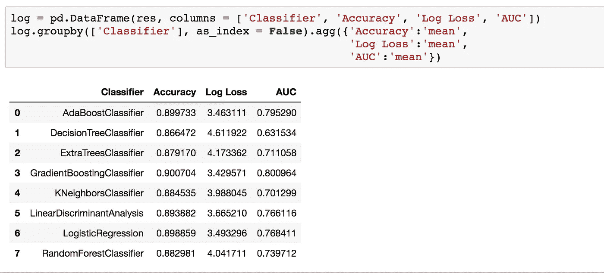

# 使用并行计算加速和完善您的工作

> 原文：<https://towardsdatascience.com/speeding-up-and-perfecting-your-work-using-parallel-computing-8bc2f0c073f8?source=collection_archive---------19----------------------->

## Python 多处理与 PySpark mapPartition 的详细指南

在科学上，每一项成就的背后都是磨砺、严谨的工作。成功不可能一蹴而就。作为一名数据科学家，您可能需要处理大量的数据和计算，在日常工作中进行重复的测试和实验。虽然你不想等待耗时的操作一次又一次地重复，一次又一次地观察，从而使你有回报的、刺激的工作变得乏味。


Photo from Unsplash

今天的计算机有多个处理器，允许同时运行多种功能。然而，如果程序员没有意识到这一点，或者不知道如何使用它，这将没有帮助，这导致我写这篇文章来演示如何使用 Python 多处理和 PySpark mapPartition 来并行化您的进程。

**机器学习模型**

数据科学是一个多样化的领域，包括广泛的工作。一个重要的应用是建立机器学习管道和个性化数据产品，以更好地瞄准客户，实现更准确的决策。在这篇文章中，我选择了在构建机器学习模型中使用分层采样进行交叉验证的步骤作为示例，以在 Python 和 Spark 环境中并行化它。我使用的数据是来自 UCI 机器学习库的[银行营销数据集，因为它相对干净。](https://archive.ics.uci.edu/ml/machine-learning-databases/00222/)



因为这篇文章关注的是并行性，所以我跳过了数据探索性分析、特性工程和特性选择的步骤。经过一些预处理后，我获得了左侧的数据，为建模做好了准备，y 列是我们的目标变量，即客户在活动期间是否订阅了定期存款。

现在让我们进入交叉验证的模型选择步骤的细节。作为一种常见的做法，我将 scikit-learn 中的大多数分类器包含到一个名为 classifiers 的列表中，并使用 sklearn.model_selection 中的 StratifiedShuffleSplit 方法来执行这一步。为了模型比较的目的，我计算了准确度分数、对数损失和 AUC。这一步花了 46s，下面是代码:

```
sss = StratifiedShuffleSplit(n_splits = 10, test_size = 0.1, random_state = 0)start = time.time()
res = []
for train_index, test_index in sss.split(X, y):
    X_train, X_test = X[train_index], X[test_index]
    y_train, y_test = y[train_index], y[test_index]
    for clf in classifiers:
        name = clf.__class__.__name__
        clf.fit(X_train, y_train)
        y_pred = clf.predict(X_test)
        y_pred_probas = clf.predict_proba(X_test)
        acc = accuracy_score(y_test, y_pred)
        loss = log_loss(y_test, y_pred)
        fpr, tpr, thresholds = roc_curve(y_test, y_pred_probas[:,1])
        auc_score = auc(fpr, tpr)
        res.append([name, acc, loss, auc_score])print('The cross-validation with stratified sampling took time (s): {}'.format(time.time() - start))
```

就像在许多 Kaggle 比赛中一样，获胜者再次是梯度推进:



**Python 多处理**

在 Python 中，多处理模块被设计成在多个进程之间分配工作以提高性能。在这里，我使用了带有 map 方法的 pool 类来将 iterable 拆分为单独的任务。下面的代码使用 4 个处理器运行相同的过程，它在 20 秒内完成。

```
import itertools
import multiprocessing
from multiprocessing import Poolcv_index = [(i, j) for i, j in sss.split(X, y)]
params = list(itertools.product(cv_index, classifiers))def cv_test(params):
    global X
    global y
    train_index = params[0][0]
    test_index = params[0][1]
    clf = params[1]
    X_train, X_test = X[train_index], X[test_index]
    y_train, y_test = y[train_index], y[test_index]
    name = clf.__class__.__name__
    clf.fit(X_train, y_train)
    y_pred = clf.predict(X_test)
    y_pred_probas = clf.predict_proba(X_test)
    acc = accuracy_score(y_test, y_pred)
    loss = log_loss(y_test, y_pred)
    fpr, tpr, thresholds = roc_curve(y_test, y_pred_probas[:,1])
    auc_score = auc(fpr, tpr)
    return [name, acc, loss, auc_score]p = Pool(processes = 4)
start = time.time()
res = p.map(cv_test, params)
p.close()
p.join()
print('The cross-validation with stratified sampling on 5 cores took time (s): {}'.format(time.time() - start))
```

**火花映射分区**

我总是对火花很感兴趣。Rdd 是 Spark 的基本数据结构。设想 rdd 是一组许多行，Spark 将这些行转换成多个分区。mapPartition 允许在每个分区上调用函数，分区的内容通过输入参数迭代器作为连续的值流提供。下面的代码显示了如何在 PySpark 环境中重写相同的过程。它也在 20 秒内完成。

```
import pyspark
from pyspark.sql import SparkSession
from pyspark import SparkContext, SparkConfspark = SparkSession.builder.appName("pyspark-test").getOrCreate()bc_X = spark.sparkContext.broadcast(X)
bc_y = spark.sparkContext.broadcast(y)def map_partitions_exec(X, y):
    def cv_test(iterator):
        for i in iterator:
            train_index = i[0][0]
            test_index = i[0][1]
            clf = i[1]
            X_train, X_test = X[train_index], X[test_index]
            y_train, y_test = y[train_index], y[test_index]
            name = clf.__class__.__name__
            clf.fit(X_train, y_train)
            y_pred = clf.predict(X_test)
            y_pred_probas = clf.predict_proba(X_test)
            acc = accuracy_score(y_test, y_pred)
            loss = log_loss(y_test, y_pred)
            fpr, tpr, thresholds = roc_curve(y_test, y_pred_probas[:,1])
            auc_score = auc(fpr, tpr)
            yield [name, acc, loss, auc_score]
    return cv_testparams_spark = spark.sparkContext.parallelize(params,4)
res = params_spark.mapPartitions(map_partitions_exec(bc_X.value, bc_y.value))
start = time.time()
res = res.collect()
print('The cross-validation with stratified sampling using spark took time (s): {}'.format(time.time() - start))
```

希望这些小小的编码技巧能帮助你在日常工作中更有效率。

参考资料:

1.  [https://www . dummies . com/programming/big-data/data-science/running-in-parallel-python-for-data-science/](https://www.dummies.com/programming/big-data/data-science/running-in-parallel-python-for-data-science/)
2.  [https://www . program creek . com/python/example/91149/sk learn . model _ selection。StratifiedShuffleSplit](https://www.programcreek.com/python/example/91149/sklearn.model_selection.StratifiedShuffleSplit)
3.  [https://stack overflow . com/questions/21185092/Apache-spark-map-vs-map partitions/21194559](https://stackoverflow.com/questions/21185092/apache-spark-map-vs-mappartitions/21194559)