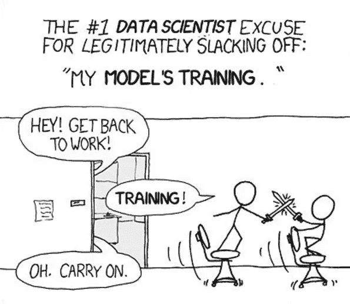
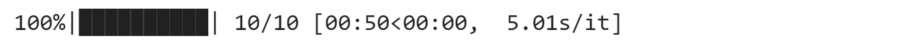

# 用多线程加速模型训练

> 原文：<https://towardsdatascience.com/speeding-up-model-training-with-multithreading-462df558d4f4?source=collection_archive---------20----------------------->



等待模特训练结束有时会让人感到沮丧。加速这一过程可能是每个数据科学家心中最优先考虑的事情之一。有几种方法可以尝试，仅举几个例子:硬件升级(更快的 CPU/GPU)和特定于模型的调整(例如，对于反向传播，可以尝试不同的优化器以实现更快的收敛)。但是，如果您的硬件升级预算申请一直悬而未决，或者现有的优化器都没有带来显著的改进，该怎么办呢？

并非所有的希望都破灭了。我们仍然可以使我们的计划更加有效。今天，我要谈谈多线程。具体来说，如何同时运行(1)从磁盘到 RAM 的数据加载(这是 CPU 密集型的)和(2)模型训练(这通常是 GPU 密集型的)。

## **一个虚拟的例子**

首先，让我们加载库依赖项。

```
import threading
import timefrom tqdm import tqdm
```

假设我们有两个功能:数据加载和模型训练。出于本教程的考虑，我将用一种延时方法来代替实函数。在这种情况下，数据加载需要 2 秒，而模型训练需要 3 秒。

```
# replace with train model - suppose it takes 3 seconds to train
def _trainModel():
  time.sleep(3)
  return# replace with load data function - suppose it takes 2 seconds to load
def _loadData():
  time.sleep(2)
  return
```

假设我们的模型训练是反向传播的形式，这需要运行许多纪元。我们选择了任意数量的历元进行循环:10 次

```
# assume we loop 10 times
epochs = 10
```

如果我们按照常规运行循环，即在数据加载和模型训练之间交替，我们可以看到完成 10 个时期总共需要 50 秒。从下面的图(由 [tqdm](https://tqdm.github.io/) 生成)中，我们看到每个历元大约需要 5 秒(2 秒加载数据，3 秒训练模型)。

> 原始时间=数据 _ 加载 _ 时间+训练 _ 模型 _ 时间

```
# without multithreading
# use with for tqdm to properly shut tqdm down if exception appears
with tqdm(range(epochs)) as epochLoop:
  for _ in epochLoop:
    # loadData
    _loadData()

    # trainModel
    _trainModel()
```



接下来，我们将尝试使用 python 的线程模块并行运行数据加载和模型训练。首先，我们必须为每个函数创建一个类，扩展线程。线程父类。

```
class TrainModel (threading.Thread):
    def __init__(self, data):
        threading.Thread.__init__(self)
        self.data = data
    def run(self):
        # return model loss
        self._return = _trainModel()    
    def join(self):
        threading.Thread.join(self)
        return self._returnclass LoadData (threading.Thread):
    def __init__(self, filenames):
        threading.Thread.__init__(self)
        self.filenames = filenames
    def run(self):        
        # return data
        self._return = _loadData()
    def join(self):
        threading.Thread.join(self)
        return self._return
```

然后，我们可以通过调用生成的线程类再次运行这些函数。在这里，我们可以观察到 10 个纪元所用的时间已经下降到 30 秒。这比之前的 50 秒提高了 40%！这里发生的情况是，我们并行运行数据加载和模型训练。每个历元所用的时间不再是这两个函数的总和。现在是两者中的最大值。

> 多线程时间= max(数据加载时间，训练模型时间)

```
# with multithreading
# use with for tqdm to properly shut tqdm down if exception appears
with tqdm(range(epochs)) as epochLoop:
  for _ in epochLoop:
    # loadData
    loadThread = LoadData(None)
    loadThread.start()

    # trainModel
    trainThread = TrainModel(None)
    trainThread.start()

    # only continue if both threads are done
    modelLoss = trainThread.join()
    data = loadThread.join()
```


## **结论**

我们刚刚看到多线程可以帮助减少模型训练中每个时期所花费的时间。请注意，如果出现以下情况，此方法不会有太大帮助:

1.  没有更多的 CPU 资源来产生另一个线程
2.  最初花费的时间是由一个过程决定的。如果模型训练需要 10 秒，数据加载需要 0.1 秒，那么通常总共需要 101 秒(10 个时期)的时间将变成 100 秒。这相当于只有大约 1%的改善。换句话说，为了使多线程有效，所有进程的最大时间应该比它们的总和小得多。