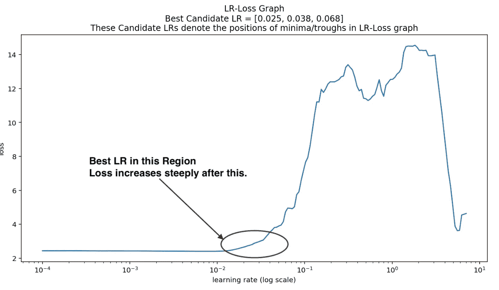
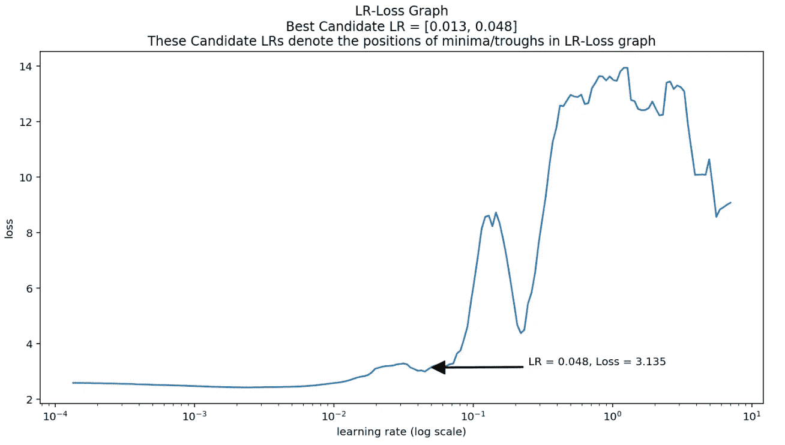
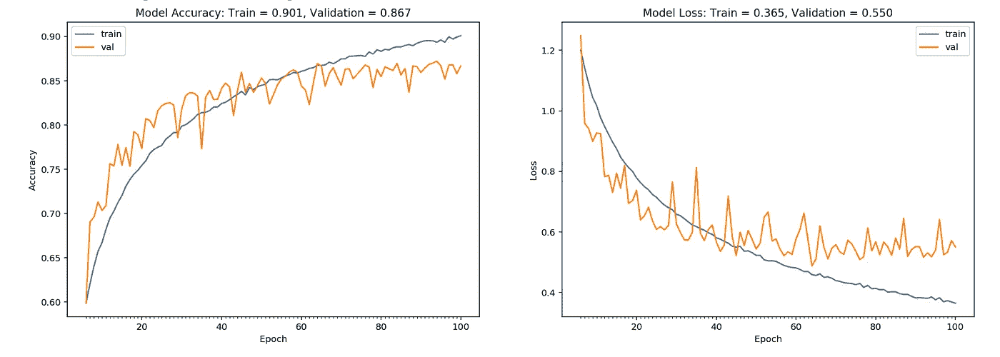
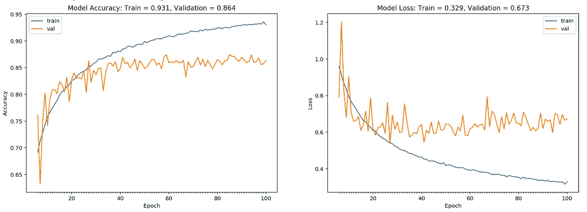
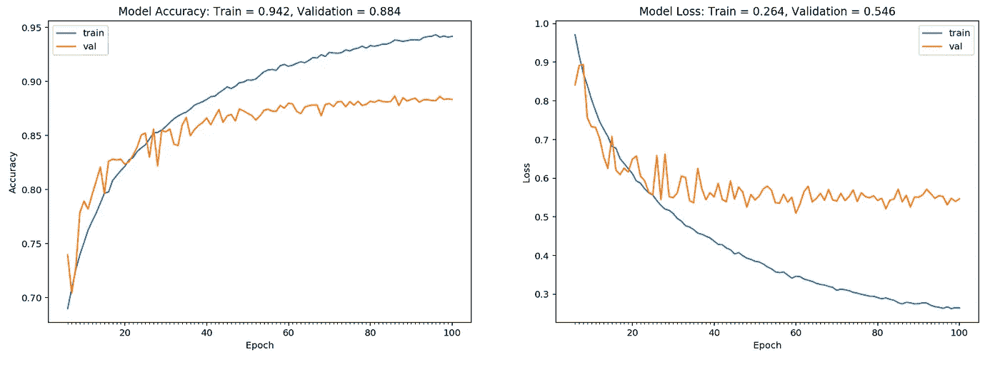

# 用 LR-Finder 加速神经网络训练

> 原文：<https://towardsdatascience.com/speeding-up-neural-net-training-with-lr-finder-c3b401a116d0?source=collection_archive---------11----------------------->

## 为你的网络找到良好的初始学习率

# 简介:优化器和 LR

当训练一个深度神经网络时，选择一个好的学习速率对于快速收敛和较低的误差都是至关重要的。我们还必须选择一个优化器，它决定如何在 DNN 中完成重量更新。

有各种各样的优化器可用，如 Adam、SGD+momentum、Adagrad、RMSprop、AdaDelta、AdaBound。其中亚当和新币+动量最受欢迎。在训练全连接 DNN 或卷积网络时，大多数现有技术的网络使用 SGD+momentum。这是因为它更好地概括了看不见的数据，并给出了更好的验证/测试分数。

# 为什么我们需要找一个好的 LR？

不过，SGD 有两个小问题，与 Adam 相比，SGD 收敛较慢，而且 SGD 需要调整学习速率。令人惊讶的是，解决这两个问题的方法是使用一个好的开始学习率。如果你的 LR 太高，你的误差永远不会减少，训练也不会收敛。太低的 LR 和你必须等待太长的训练收敛。因此，我们从 LR-Finder 给出的一个好的 LR 开始，然后在到达终点时稍微衰减它。

# 那么 LR finders 是如何工作的呢？

LR 探测器的基本目标是找到最高的 LR，该最高的 LR 仍然最小化损失并且不会使损失爆炸/发散。我们通过训练一个模型来做到这一点，同时在每批之后增加 LR，我们记录损失，最后我们在损失爆发之前使用 LR。我们这样做一个时期。

```
start_lr = 0.0001
end_lr = 1.0
num_batches = len(Data)/batch_size
cur_lr = start_lr
lr_multiplier = (end_lr / start_lr) ** (1.0 / num_batches)
losses = []
lrs = []for i in 1 to num_batches:
    loss = train_model_get_loss(batch=i)
    losses.append(loss)
    lrs.append(cur_lr)
    cur_lr = cur_lr*lr_multiplier # increase LRplot(lrs,losses)
```

你会得到一个如下图所示的图



Loss vs LR

我们用箭头标出这些点，以指示我们的实现中的[位置](https://github.com/faizanahemad/data-science-utils/blob/master/data_science_utils/vision/keras/lr_finder.py)



LR Finder with Annotation

从这个图中，我们找到了一个点，在这个点之后，损失开始增加太多。

## 使用

我写了一个包含 LR 查找器的小库。这是给 Keras 的。对于 pytorch fast.ai 实现有效。
安装:

```
pip install --upgrade --upgrade-strategy only-if-needed [https://github.com/faizanahemad/data-science-utils/tarball/master](https://github.com/faizanahemad/data-science-utils/tarball/master) > /dev/null
```

您笔记本中的下一项(针对 Cifar 10)

首先为我们的数据集定义导入和数据生成器。

```
from data_science_utils.vision.keras import *X_train, Y_train, X_test, Y_test = get_cifar10_data()cutout_fn = get_cutout_eraser(p=0.75, s_l=0.1, s_h=0.3, r_1=0.3, r_2=1 / 0.3, max_erasures_per_image=2, pixel_level=True)
datagen = ImageDataGenerator(featurewise_center=True,featurewise_std_normalization=True,
                           preprocessing_function=cutout_fn)datagen_validation = ImageDataGenerator(featurewise_center=True,featurewise_std_normalization=True,)
datagen_validation.fit(X_train)model = build_model()
```

接下来，我们建立我们的模型，并使用 LR 查找器。

```
model = build_model() # returns an instance of Keras Model
lrf = LRFinder(model)
generator = datagen.flow(X_train, Y_train, batch_size=256,shuffle=True)
test_generator = datagen_validation.flow(X_test, Y_test, batch_size=256, shuffle=True)
lrf.find_generator(generator, 0.0001, 10.0,test_generator, epochs=1, steps_per_epoch=None,)
lrf.plot_loss()
```

你看到的上面两张图就是用这个生成的。你可以在[这款谷歌 Colab 笔记本](https://colab.research.google.com/drive/1snEPXi418CrctkDP240KdEkff1z83buV)中看到例子。

## 使用 LR 取景器时的注意事项

*   我们使用最小值作为我们的候选 lr。您可以注意到，其中一些是局部最小值，总损耗相当高，对于候选 LRs，总损耗应该接近最小损耗。所以我们过滤这些局部最小值
*   我们需要使用验证集来寻找损失，使用训练集来寻找损失不会产生正确的结果，因为权重会超出训练集。
*   当我们生成候选 lr 时，我们需要确保它们足够清晰。例如，生成像 0.552 和 0.563 这样的候选值没有意义，因为这些 lr 太接近了。因此，我们应用了一个规则，即每个 LR 应该至少与之前较低的 LR 相差 20%。
*   注意 LR Finder 给你一个近似值，所以你取不取精确值并不重要。就像如果 LRF 给你 0.012，那么你也可以用 0.01。如果它给出 0.056，那么 0.05 和 0.06 都可以。

## 后期微调 LR

我们可以使用 LR 调度或 LR 衰减来降低后面时期的 LR，因为我们最初是从高 LR 开始的。

# 结果

## 在 LR 取景器之前

我们直接用了 SGD，learning_rate 为 0.01，nesterov 的动量。我们在 CIFAR-10 上训练了 100 个时期的网络。我们的网络有 45 万个参数。



Without LR Finder

正如你所注意到的，验证误差收敛需要大约 60 个历元，准确率为 86.7%。

## 后左后取景器

我们使用 LR finder 提供的 LR。其他一切都一样。



After LR Finder

你可以看到，这里我们得到了 86.4%的准确性，但训练收敛于 40 个时期，而不是 60 个。使用 LR finder 提供的 LR 和 EarlyStopping 可以大大减少计算时间。

## 在 LR 查找器和 LR 调度之后

我们使用 keras 的 LR 调度来减少每个时期的 LR。基本上，在每个时期之后，我们通过乘以 0.97 来减少 LR。您可以在示例笔记本中查看 [LR 调度部分](https://colab.research.google.com/drive/1snEPXi418CrctkDP240KdEkff1z83buV)



With LR scheduling

注意，在相同的网络和 LR 下，我们得到 88.4%。还要注意，到最后，损耗和精度图不再像以前那样波动。

因此，仅通过使用 LR 查找器和 LR 调度，我们就获得了超过 1%的准确性提高，使用了我们开始时使用的相同的 100 个时期。

# 结论和参考文献

使用 LR Finder 被证明有利于更快的训练和提高准确性。我们还用一个[笔记本](https://colab.research.google.com/drive/1snEPXi418CrctkDP240KdEkff1z83buV)例子展示了如何使用 LR finder。LR 寻像器的代码在这里是。

如果你觉得这很有用，请访问我的[笔记本/Github](https://github.com/faizanahemad/data-science-utils/blob/master/data_science_utils/vision/keras/GradCam_with_misclassified_LRFinder.ipynb) 获取完整代码。