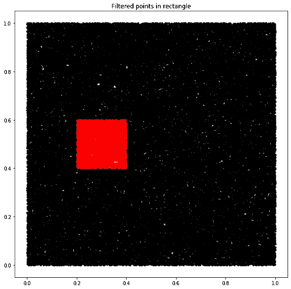
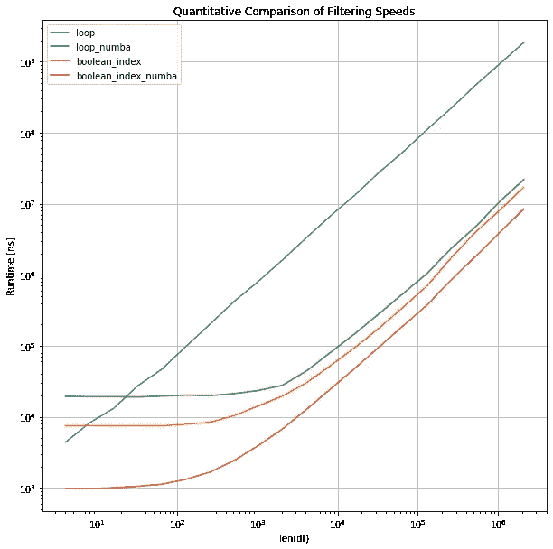
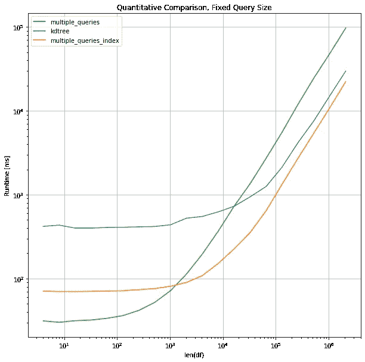

# 加速 Python 代码:快速过滤和慢速循环

> 原文：<https://towardsdatascience.com/speeding-up-python-code-fast-filtering-and-slow-loops-8e11a09a9c2f?source=collection_archive---------1----------------------->

## 列表理解、布尔索引和实时(JIT)编译的速度提高了 200 倍。


Photo by [James Donovan](https://unsplash.com/@jmsdono?utm_source=unsplash&utm_medium=referral&utm_content=creditCopyText) on [Unsplash](https://unsplash.com/s/photos/speed?utm_source=unsplash&utm_medium=referral&utm_content=creditCopyText)

当探索一个新的数据集并希望进行一些快速检查或计算时，人们倾向于懒洋洋地编写代码，而不太考虑优化。虽然这在开始时可能是有用的，但等待代码执行的时间很容易超过正确编写所有内容所需的时间。

本文展示了在 Python 中如何加快计算速度的一些基本方法。以过滤数据为例，我们将讨论几种使用纯 Python、numpy、numba、pandas 以及 k-d-tree 的方法。

## 数据集的快速过滤

作为一个示例任务，我们将解决有效过滤数据集的问题。为此，我们将使用二维空间中的点，但这可以是 n 维空间中的任何东西，无论这是客户数据还是实验的测量结果。

让我们假设我们想要提取在一个在[0.2，0.4]和[0.4，0.6]之间的矩形中的所有的点。最简单的方法是对每个点进行循环，并检查它是否满足这个标准。从代码上看，这可能如下所示:首先，我们创建一个函数，用 *numpy* 在 n 维空间中随机分布点，然后创建一个函数在条目上循环。为了测量计算时间，我们使用 *timeit* 并使用 *matplotlib* 可视化过滤结果。



```
Loop: 72 ms ± 2.11 ms per loop (mean ± std. dev. of 7 runs, 10 loops each)
```

正如我们所看到的，对于测试的机器，大约需要。70 ms 从 100，000 个点的数据集中提取矩形内的点。

> *注意，当组合表达式时，您要使用逻辑 and (and)而不是按位 and ( &)。当第一个条件为假时，它停止求值。*

虽然 numpy 很适合与大型 n 维数组交互，但是我们也应该考虑使用 numpy 对象所带来的额外开销。在这个特殊的例子中，我们没有使用任何数学运算来从 numpy 的矢量化中获益。

所以现在让我们用这个循环的纯 Python 实现来测试这个循环。这里的区别是使用元组列表而不是 numpy 数组。

```
Python loop: 27.9 ms ± 638 µs per loop (mean ± std. dev. of 7 runs, 10 loops each)
```

执行现在只需要大约。28 毫秒，所以不到以前执行时间的一半。这突出了当使用高度优化的包来执行相当简单的任务时可能出现的潜在性能下降。

## Python 函数:列表理解、映射和过滤

为了进行更广泛的比较，我们还将针对 Python 中的三个内置方法进行基准测试:List comprehensions、Map 和 Filter。

*   列表理解:一般来说，列表理解比循环执行得更好，因为它们不需要在每次[迭代](https://stackoverflow.com/questions/30245397/why-is-a-list-comprehension-so-much-faster-than-appending-to-a-list)时调用 append 函数。
*   Map:这将一个函数应用于一个输入[列表](https://book.pythontips.com/en/latest/map_filter.html)的所有元素。
*   Filter:这将返回一个元素列表，函数将为这些元素返回 [True](https://book.pythontips.com/en/latest/map_filter.html) 。

```
List comprehension: 21.3 ms ± 299 µs per loop (mean ± std. dev. of 7 runs, 10 loops each)
Filter:   26.8 ms ± 349 µs per loop (mean ± std. dev. of 7 runs, 10 loops each)
Map:   27 ms ± 265 µs per loop (mean ± std. dev. of 7 runs, 10 loops each)
```

列表理解法略快。正如我们所预料的，这是因为不调用 append 函数节省了时间。与纯 Python 循环相比，map 和 filter 函数的速度并没有显著提高。

思考一下 70 ms 以上的第一个实现，为什么首先要使用 numpy？我们可以做的一件事是使用布尔索引。在这里，我们按列的方式对每个标准进行检查。然后，我们可以将它们组合成一个布尔索引，并直接访问该范围内的值。

```
Boolean index: 639 µs ± 28.4 µs per loop (mean ± std. dev. of 7 runs, 1000 loops each)
```

使用布尔索引的解决方案只需要大约。640 秒，与我们目前测试的最快实现相比，速度提高了 50 倍。

## 走得更快:Numba

我们能更进一步吗？是的，我们可以。一种方法是使用 [Numba](https://numba.pydata.org/numba-doc/dev/reference/numpysupported.html) :

> Numba 使用行业标准的 LLVM 编译器库，在运行时将 Python 函数翻译成优化的机器代码。Python 中 Numba 编译的数值算法可以接近 C 或 FORTRAN 的速度。

如果使用 numpy，numba 的实现是非常容易的，如果代码有很多循环，那么 numba 的实现尤其高效。如果函数设置正确，即使用循环和基本的 numpy 函数，简单添加@njit decorator 将标记要在 numba 中编译的函数，并会提高速度。请随意查阅 numbas 文档，了解设置 numbas 兼容函数的细节。

请注意，我们使用的是引入了类型化列表的最新版本 Numba (0.45)。此外，请注意，我们在计时之前执行一次函数，不考虑编译时间。现在让我们看看这些函数在用 Numba 编译时是如何执行的:

```
Boolean index with numba: 341 µs ± 8.97 µs per loop (mean ± std. dev. of 7 runs, 1000 loops each)
Loop with numba:  970 µs ± 11.3 µs per loop (mean ± std. dev. of 7 runs, 1000 loops each)
```

用 LLVM 编译函数后，甚至快速布尔滤波器的执行时间也减少了一半，只需要大约。更有趣的是，即使是从一开始效率就不高的循环现在也从 72 ms 加速到不到 1 ms，这凸显了 numba 对于优化较差的代码的潜力。

## 表格中的数据:熊猫

之前，我们已经看到数据类型会影响数据类型。人们必须在代码性能、简单接口和可读代码之间做出谨慎的选择。例如，Pandas 在处理表格数据方面非常有用。但是，这种数据结构会降低性能。为了客观地看待这个问题，我们还将比较 pandas 板载的过滤功能，如查询和评估以及布尔索引。

```
Pandas Query:  8.77 ms ± 173 µs per loop (mean ± std. dev. of 7 runs, 100 loops each)
Pandas Eval:  8.23 ms ± 131 µs per loop (mean ± std. dev. of 7 runs, 100 loops each)
Pandas Boolean index: 7.73 ms ± 178 µs per loop (mean ± std. dev. of 7 runs, 100 loops each)
```

可以说，执行时间比我们未优化的初始循环快得多。但是，它明显比优化版本慢。因此，它适用于初步探索，但随后应进行优化。

## 定量比较 I

为了更定量地比较这些方法，我们可以对它们进行比较。为此，我们使用 perfplot 包，它提供了一种很好的方法。

> 请注意，执行时间和数据大小都是对数级别的



## 更多查询和更大的数据集

最后，我们将讨论可以用于更大数据集和使用更多查询的策略。到目前为止，我们总是在检查固定参考点时考虑计时。假设我们有一个点列表，而不是一个点，并且想要多次过滤数据。显然，如果我们可以在数据中使用某种顺序，例如当左上角有一个点时，只查询该特定角上的点，这将是有益的。

我们可以先对数据进行排序，然后使用索引选择一个子部分。这里的想法是，排序数组的时间应该由重复搜索较小的数组所节省的时间来补偿。

为了进一步增加复杂性，我们现在还在第三维空间中搜索，有效地在空间中切割出一个体素。因为我们只对计时感兴趣，所以现在我们只报告过滤后的数组的长度。

我们重写了 *boolean_index_numba* 函数，以接受形式为[xmin，xmax]，[ymin，ymax]和[zmin，zmax]的任意参考体积。我们定义了一个名为 *multiple_queries* 的包装器来重复执行这个函数。比较将针对函数 *multiple_queries_index* ，该函数首先对数据进行排序，并且只将一个子集传递给*boolean _ index _ numba _ multiple*。

```
Multiple queries:  433 ms ± 11.6 ms per loop (mean ± std. dev. of 7 runs, 1 loop each)
Multiple queries with subset: 110 ms ± 1.66 ms per loop (mean ± std. dev. of 7 runs, 10 loops each)
Count for multiple_queries: 687,369
Count for multiple_queries: 687,369
```

对于这个例子，执行时间现在减少到只有四分之一。速度增益与查询点的数量成比例。作为补充说明，最小和最大索引的提取相对较快。

## 更多结构:k-d-树

预先构造数据以增加访问次数的想法可以进一步扩展，例如，可以考虑对子集化的数据再次进行排序。人们可以考虑创建 n 维箱来有效地收集数据。

扩展这一思想并使用树结构来索引数据的一种方法是 k-d 树，它允许快速查找给定点的邻居。下面是来自维基百科的简短定义:

> 在计算机科学中，k-d 树是用于组织 k 维空间中的点的空间划分数据结构。k-d 树对于一些应用是有用的数据结构，例如涉及多维搜索关键字的搜索。

幸运的是，我们不需要自己实现 k-d 树，而是可以使用 scipy 中现有的实现。它不仅有一个纯 Python 实现，还有一个 C 优化版本，我们可以用它来实现这种方法。它带有一个名为 [query_ball_tree](https://docs.scipy.org/doc/scipy-0.15.1/reference/generated/scipy.spatial.KDTree.query_ball_tree.html) 的内置功能，允许搜索特定半径内的所有邻居。当我们在给定点周围的正方形内搜索点时，我们只需要将闵可夫斯基范数设置为*切比雪夫* (p='inf ')。

```
Tree construction: 37.7 ms ± 1.39 ms per loop (mean ± std. dev. of 7 runs, 10 loops each)
Query time:  86.4 µs ± 1.61 µs per loop (mean ± std. dev. of 7 runs, 10000 loops each)
Total time:  224 ms ± 11.4 ms per loop (mean ± std. dev. of 7 runs, 1 loop each)
Count for k-d-tree: 687,369
```

从时间上我们可以看到，构建树花费了大约 40 ms，但是查询步骤只需要 100 s，因此比 numba 优化的布尔索引还要快。

> 注意，k-d-tree 只使用单一的距离，所以如果对矩形而不是正方形感兴趣，就需要缩放轴。也有可能将闵可夫斯基范数改变为例如在圆内而不是正方形内搜索。因此，可以通过对数变换轴来实现相对窗口搜索。

# 定量比较 II

我们将再次使用 perfplot 来进行更定量的比较。为此，我们将针对越来越多的点查询一百万个点。

> 请注意，我们在大范围内测试数据，因此性能图的执行时间可能会非常慢



对于此数据范围，kdtree、multiple_queries 和多重查询的索引版本之间的比较显示了预期的行为:在搜索较大的数据集时，构建树的初始开销或数据排序过重。对于较大的数据集，kdtree 的性能有望超过多查询的索引版本。

需要强调的是，由于 scipy 实现很容易接受 n 维数据，因此扩展到更多维也非常简单。

## 摘要

测试不同方法的过滤速度突出了如何有效地优化代码。执行时间从缓慢实施的 70 ms 以上到大约。使用布尔索引的优化版本需要 300 秒，性能提升超过 200 倍。主要调查结果可归纳如下:

*   纯 Python 可以很快。
*   Numba 即使对于非优化的循环也非常有益。
*   Pandas onboard 函数可能比纯 Python 更快，但也有改进的潜力。
*   在大型数据集上执行大型查询时，对数据进行排序是有益的。
*   当有大型查询时，k-d-树提供了在 n 维空间中过滤的有效方式。

考虑到并行化，无论是在 CPU 还是 GPU 上，执行时间都可以进一步加快。注意，这些方法的内存占用在这些例子中没有考虑。当文件太大而无法在内存中加载时，将数据或生成器表达式分块会很方便。如果您发现有任何方法缺失或可能提供更好的结果，请告诉我。我很想知道还有什么其他方法可以实现快速过滤。