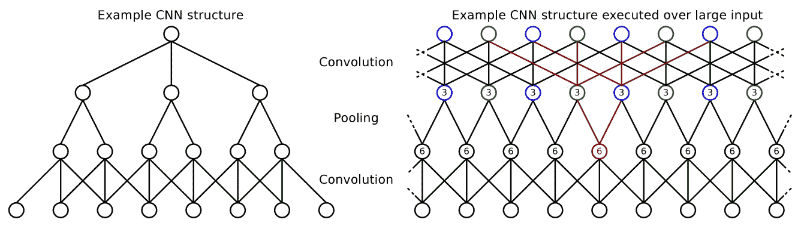
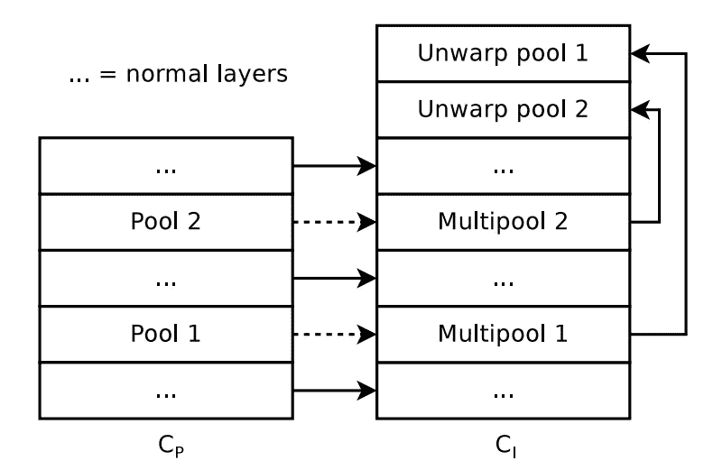
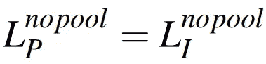
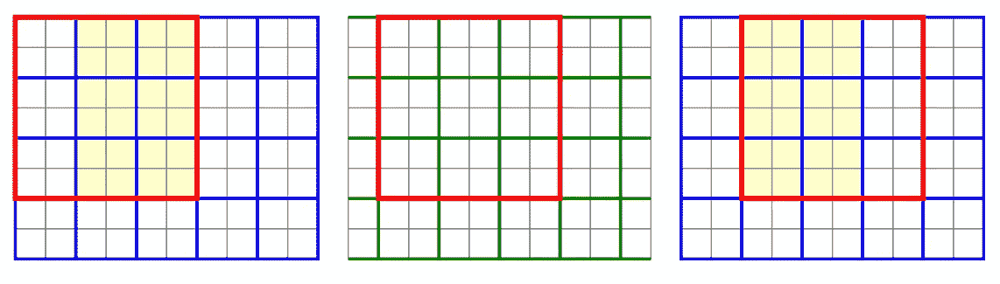
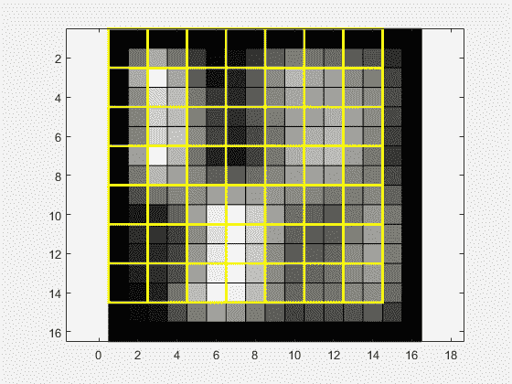
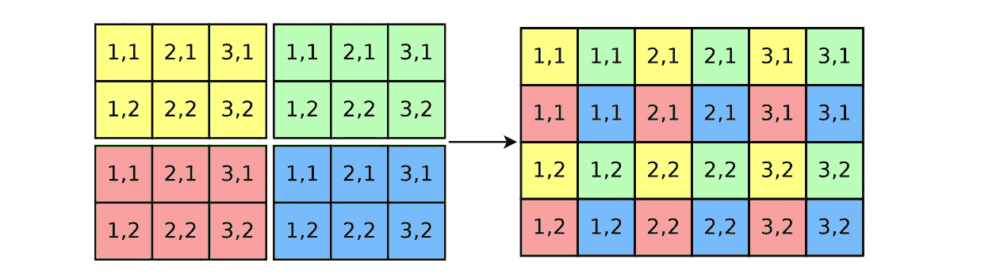
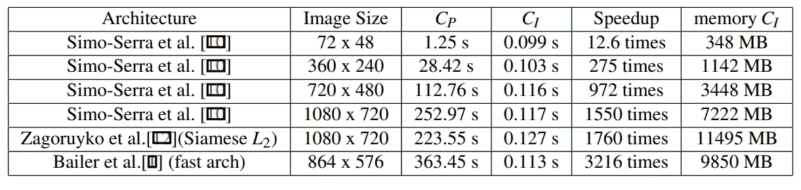

# 使用快速密集特征提取和 PyTorch 加速 CNN

> 原文：<https://towardsdatascience.com/speedup-your-cnn-using-fast-dense-feature-extraction-and-pytorch-dc32acbf12ef?source=collection_archive---------13----------------------->


早在 3 月份，我们开源了我们的“使用具有池化或跨越层的 CNN 的快速密集特征提取”的[实现，尽管并不广为人知，但 2017 年 BMVC 发表的论文提供了一种高效而优雅的解决方案，介绍了如何在使用基于面片的卷积神经网络时避免计算冗余。所以在这篇文章中，我将解释这个模型是如何工作的，并展示如何在实际应用中使用它。](https://github.com/erezposner/Fast_Dense_Feature_Extraction)

我将介绍两件事:首先，概述名为“使用具有池化或跨越层的 CNN 进行快速密集特征提取”的方法。第二，如何在现有的经过训练的补丁网络上使用这种方法来加快推理时间。

# 什么是基于补丁的方法？问题出在哪里？

基于小块的 CNN 通常应用于图像的单个小块，其中每个小块被单独分类。当试图在图像中相邻的重叠的小块上多次执行相同的 CNN 时，通常使用这种方法。这包括基于任务的特征提取，如相机校准、补丁匹配、光流估计和立体匹配。此外，还有不被视为特征提取的基于补丁的应用，如滑动窗口对象检测或识别。

在所有这种基于补丁的任务中，在相邻 CNN 的计算之间会有很多冗余。比如看下图。

在左边你可以看到一个简单的一维 CNN。从底部开始，每个像素在输出层中只贡献一个结果，没有任何冗余。在上相反，在右边，如果在一个图像的每个像素位置执行这个 CNN 来创建特征，许多中间层结果在网络之间被无缘无故地共享。



The numbers in nodes state how often a node is shared. The red connections show how the red node is shared. Pooling with stride 2 halves the output resolution. Thus, we need two pooling layers: the original one (blue) and one shifted by one pixel (green) to avoid halving the output resolution.

# 快速密集特征提取

这种方法的主要思想是，不是对图像中的每个小块分别执行我们的基于 CNN **Cp** (它是在训练小块 ***P*** 上训练的)，而是让我们一次对输入图像 ***I*** 中的所有小块 *P(x，y)* 高效地执行它。

为了一致起见，让我们将输入图像 ***I*** 定义为宽度 *Iw* 和高度 *Ih* ，我们可以将宽度 *Pw* 和高度 *Ph* 的面片*定义为以输入图像中的每个像素位置 *(x，y)，x∈0…Iw 1，y∈0…Ih 1*为中心*输出向量 *O(x，y) = CP(P(x，y))* 是一个 ***k*** 通道向量，属于 ***(Ih，Iw，k)*** 维输出矩阵 ***O*** 包含对所有图像面片 *P(x，y)执行 ***Cp*** 的结果*

为此，我们可以创建一个网络 ***CI*** ，直接从*计算*，同时避免在每个图像块上独立执行 ***Cp*** 时出现的冗余。 ***Cp*** 和 ***CI*** 的架构差异如下图所示。这里，特征提取器中的所有池层都被多池层替换**

****

**Architecture of ***Cp (Left)*** and ***CI (Right)*****

**值得一提的是， ***CI*** 将给出与独立地在图像 ***I*** 的每个补丁上执行网络 ***Cp*** 相同的结果。但是， ***CI*** 运行速度更快，因为它避免了重叠补丁之间的冗余。**

**当我们处理层的类型时，让我们检查从 ***Cp*** 到 ***CI*** 的必要步骤——主要是普通层(没有汇集或跨步)和异常层(包括汇集或跨步)。**

## **1.普通层**

**在没有跨越或合并的情况下， ***Cp*** 和 ***CI*** 的层是相同的，即**

****

**这是因为它们的输出不取决于输入的空间位置，而只取决于输入值本身。**

## **2.异常层(包括汇集或跨步)**

**与普通层不同，跨层和池层必须明确处理。下图显示了池的主要问题:第一个面片 *P(x，y)* 与第二个面片 *P(x+1，y)* (绿色)需要不同的 2 x 2 池，因此不能共享池输出。**

**但是，补丁 *P(x+2，y)* 可以再次与原始池一起工作(蓝色)。 *P(x，y)* 和 *P(x + 2，y)* 的重叠位置提供相同的结果，因此可以共享(亮黄色)。**

**对于该示例的概括将是， ***s*** 是汇集/步幅大小，并且 ***u*** 和 ***v*** 是整数，面片 *P(x，y)* 和 *P(x+su，y+sv)* 仍然共享由两个面片共享的像素的汇集输出。**

****

**Patches P at different image positions (in red). Sharing between patches that are using blue and the ones that are using green pooling is not possible**

**这一起创建了 *s × s* 不同的汇集情况，这些情况必须在我们的汇集层的输入**I’**上独立计算，其中**I’**是第 ***l-*** 层的输入图像。由于 **s×s** 池层将输出大小减小到 *Iw/s* **，** *Ih/s* (具有输入大小 *Iw* **，** *Ih* )很明显，要求 *s × s* 这样的输出仍然获得空间大小*的输出 ***O******

*不同的池输出堆叠在标记为 **M** 的额外输出维度中。所有标注为通道的不同汇集输出现在将被后续层视为独立样本(类似于批次维度)。*

**

*上面的动画更直观地展示了该过程是如何完成的，每个通道执行一次汇集，最终堆叠在 ***M.*** 中*

## *3.解除警戒*

*有了一个多池层，我们得到一个输出 ***W*** ，尺寸 *W = (M = s×s，Ih/s，Iw/s，k)* ，我们希望将它反卷积到最终输出*O = (Ih，Iw，k)* 。对于 *2×2* 合并，下面的图像直观地显示了取消撤销过程背后的直觉。这里，所有通道应该交错在一起，以生成最终输出 ***O*** *。**

**

*On the left, the2×2 = 4 output images from 2×2 multipooling and on the Right, the final unwarping output O.*

*直接取消 warping 是复杂的，尤其是对于几个池层。这可能是以前的工作避免合并层的原因。然而，如果我们观察维度空间中的问题，它可以很容易地通过单独的转置和整形操作来解决。这样的操作被大多数深度学习框架支持为层。*

*我不会详细讨论扭曲过程是如何完成的，因为这远远超出了本文的范围。[更多详情请参考论文](https://www.dfki.de/fileadmin/user_upload/import/9245_FastCNNFeature_BMVC.pdf)。*

# *实验*

*作者展示了比较改进的网络 ***CI*** 和基于块的 CNN ***Cp*** 在图像的所有块上运行的基准测试结果。实验是在 GeForce GTX 泰坦 x 上进行的*

*从下表可以看出， ***Cp*** 的执行时间大致与图像像素成线性比例(如预期)。 ***CI*** 另一方面，对于较大的图像几乎不需要更多的时间。另一方面， ***CI*** 的内存消耗几乎线性增加。如果没有足够的内存可用，可以将输入图像分割成多个部分，并且可以单独处理每个部分。*

*检查加速栏可以清楚地看到 ***CI*** 的执行速度要快得多，尤其是在较大的图像上。*

**

*Speed benchmark for ***CI*** *and* ***Cp****

# *让我们加速基于补丁的 CNN*

*在这里，我将解释如何使用我的[实现“使用具有池化或跨越层的 CNN 的快速密集特征提取](https://github.com/erezposner/Fast_Dense_Feature_Extraction)”来加速任何基于 CNN 的补丁。*

*项目结构很简单，您有两个实现:pytorch 和 tensforflow，每个都包含以下内容:*

*   *`FDFE.py` -实施文件中描述的所有方法层和预&后处理方法*
*   *`BaseNet.py` -这是指 ***你的*** 预训练 CNN **Cp** 在训练补丁 **P** 上的一个实现*
*   *`SlimNet.py`——这是指实施 ***CI****
*   *`sample_code.py` -试运行*

## *1.实施您改进的网络— ***CI****

*为了使用您自己的预训练网络来运行补丁程序，您需要:*

> *1.在`BaseNet.net`实施您的网络*
> 
> *2.相应修改`SlimNet.py`:*

*   *根据顺序复制`BsetNet.py`模型层，例如*

```
*self.conv1 = list(base_net.modules())[change_this_index]*
```

*   *对于每个`MaxPool2d`层，用决定的步幅值( *sLn* )代替`multiMaxPooling`*
*   *根据模型中`multiMaxPooling`的数量，去除缠绕层*
*   *不要移除以下图层 multiPoolPrepare，unwrapPrepare*

## *2.在改进后的网络上运行示例代码*

*现在你应该`sample_code.py`确保项目正常运行。该测试生成大小为`imH X imW`的随机输入图像 ***I*** ，并在 ***Cp*** 和 ***CI*** 上对其进行评估。*

*该脚本继续并评估两个 CNN 输出之间的差异，并执行速度基准标记。 ***Cp*** 有两种操作模式*

*   **singlePatch* mode-在将从输入图像 ***I*** 中裁剪的单个补丁`pH x pW`上运行 ***Cp****
*   *allPatches 模式——一次对多个补丁运行 ***Cp*** 。这里`batch_size`将决定一次评估多少补丁。*

> *可能的参数—在`sample_code.py`中，有可以调整的初始参数，如图像高度、图像宽度、补丁宽度、补丁高度等…*

## *3.我应该期待看到什么？*

*该脚本输出以下内容:*

*   *base_net ***Cp*** 输出和 slim_net 输出 ***CI —*** *之间的合计差异如上所述，这两个输出之间应该没有任何重大差异。**
*   *对于 ***Cp，*** 每个补丁的平均评估*
*   *对于 ***CI，*** 每帧总评价。即整个输入图像*

*预期的详细信息应如下所示:*

```
*Total time for C_P: 0.017114248275756836 sec
------------------------------------------------------------
Averaged time for C_I per Patch without warm up: 0.0010887398617342114 sec
------- Comparison between a base_net over all patches output and slim_net -------
aggregated difference percentage = 0.0000000000 %
maximal abs difference = 0.0000000000 at index i=0,j=0
------------------------------------------------------------*
```

*这就对了。你极大地提升了你的人际网络。就在这个例子中，我们将运行时间提高了大约 10 倍。*

# *感谢*

*非常感谢下面这个人帮助我们发现并实现了这个方法。*

*Arnon Kahani——一位好朋友和优秀的 ML 工程师*

# *结论*

*如果你对源代码感兴趣，可以在我的[CNN 快速密集特征提取](https://github.com/erezposner/Fast_Dense_Feature_Extraction) GitHub 知识库中找到。*

*一如既往，如果您有任何问题或意见，请随时在下面留下您的反馈，或者您可以随时通过 [LinkedIn](http://www.linkedin.com/in/erezposner) 联系我。*

*在那之前，下一篇文章再见！😄*