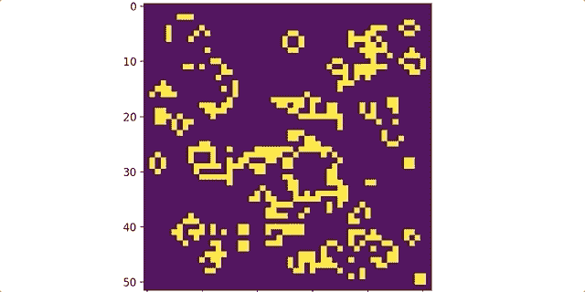
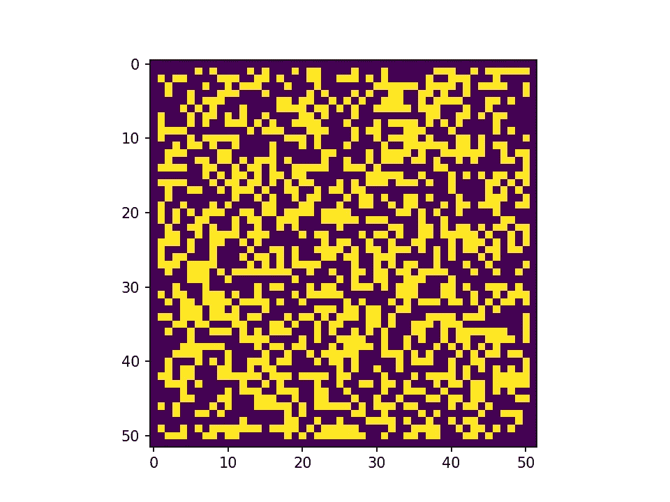
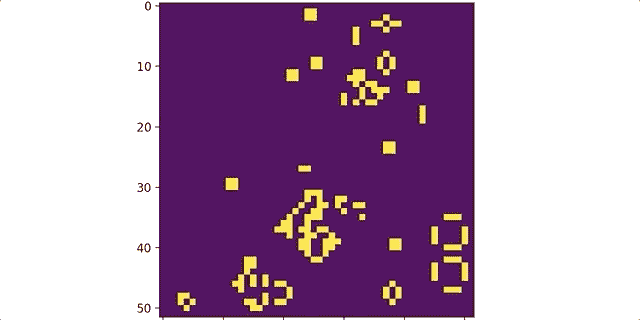

# 用 Matplotlib 动画增加 Python 可视化的趣味

> 原文：<https://towardsdatascience.com/spice-up-your-python-visualizations-with-matplotlib-animations-d437d7e98e67?source=collection_archive---------5----------------------->


Photo by [Egor Kamelev](https://www.pexels.com/@ekamelev?utm_content=attributionCopyText&utm_medium=referral&utm_source=pexels) from [Pexels](https://www.pexels.com/photo/jellyfish-digital-wallpaper-753267/?utm_content=attributionCopyText&utm_medium=referral&utm_source=pexels)

## 还有约翰·康威的《生命的游戏》的一些有趣的 gif

*如果你对我的代码感兴趣，可以在我的 GitHub* *这里找到* [*。第一次运行时，代码会抛出一个错误(这是我一辈子都无法摆脱的)。但是，如果您只是再次执行同一个单元，它将运行良好。*](https://github.com/yiuhyuk/game_of_life)

他的帖子显然不是数据科学帖子，但它确实有数据科学和商业智能应用。Python 的 Matplotlib 是绘制和可视化数据的首选库。我们都熟悉折线图、条形图和热图。但是你知道你也可以使用 Matplotlib 制作简单的动画吗？

下面是一个用 Matplotlib 创建的动画的例子。它展示了约翰·康威的[生命的游戏](https://bitstorm.org/gameoflife/)——Metis 的[编码挑战，这给了我创作第一个 Python 动画的借口。查看最终结果的 gif:](/how-i-feel-about-data-science-and-the-metis-bootcamp-experience-398b171289d0)



The Game of Life

如果你对我如何编写生命游戏感兴趣，请参考 GitHub 上的[我的代码(和评论】](https://github.com/yiuhyuk/game_of_life)。这篇博客将主要关注如何使用 Matplotlib 在 python 中添加动画。

但是对于那些不熟悉模拟的人来说(这更像是你观看的模拟，而不是你玩的游戏)，这里有一些规则:

*   我们从一块 N 乘 N 大小的板开始(在我的动画中是 50 乘 50)。
*   我们在板上随机填充了一些细胞(我开始模拟时，在板上 2500 个细胞中随机填充了 1500 个细胞)。
*   具有一个或更少邻居的每个被占用的单元死亡。
*   具有四个或更多邻居的每个被占用的单元死亡。
*   每一个有两三个邻居的被占据的细胞存活下来。
*   每个**空的**细胞与正好三个相邻的细胞发展出一个新的有机体。

# 设置董事会

我们从导入我们需要的库开始。

```
import time
from IPython import display
import matplotlib.pyplot as plt
import matplotlib.animation as animation
```

我们将利用 matplotlib 动画模块中的 **FuncAnimation()函数。FuncAnimation()通过反复调用函数来制作图像动画，每次调用时更新图像**。我们将一步一步地完成这个过程。

但是首先，我们需要初始化我们的板。下面几行代码收集了我们的输入:

*   我们想要一块 50 乘 50 大小的木板。
*   pad 变量使得计算邻居变得更加容易。通过用总是空着的额外单元填充边缘，我们就不需要编写额外的逻辑来处理电路板的边缘。因此，我们的 50 乘 50 板被空白单元的边界包围，使得实际的 numpy 数组具有 52 乘 52 的大小。
*   initial_cells 变量是我们希望棋盘从多少个有机体开始。它们将被随机放在黑板上。

```
# Input variables for the board
boardsize = 50        # board will be X by X where X = boardsize
pad = 2               # padded border, do not change this!
initial_cells = 1500  # this number of initial cells will be placed 
                      # in randomly generated positions
```

**接下来，我们随机生成一串坐标**(我们在上面选择了 1500)**，我们最初的生物体将生活在那里。**这些坐标存储在变量 pos_list 中。

```
# Get a list of random coordinates so that we can initialize 
# board with randomly placed organisms
pos_list = []
for i in range(initial_cells):
    pos_list.append([random.randint(1, boardsize), 
                     random.randint(1, boardsize)])
```

然后是**实例化电路板的时候了。我们将使用一个名为 my_board 的 numpy 数组来表示我们的棋盘** —我们从一个 52 乘 52 的零数组开始(由于填充，它比 50 乘 50 大)，然后调用函数 init_board()根据 pos_list 中的坐标用有机体填充它。我不会在这里详述助手函数，但是它们在我的 GitHub 上有[文档。](https://github.com/yiuhyuk/game_of_life)

```
# Initialize the board
my_board = np.zeros((boardsize+pad, boardsize+pad))
my_board = init_board(pos_list, my_board)
```

# 为棋盘制作动画

我们期待已久的部分——动画！首先，我们需要解决一些手续问题。下面几行代码创建的 matplotlib 图形将显示我们的动画。

```
# Required line for plotting the animation
%matplotlib notebook
# Initialize the plot of the board that will be used for animation
fig = plt.gcf()
```

是时候制作我们的第一个相框了。matplotlib 的函数 **imshow()接收一个 numpy 矩阵，并将其呈现为图像。相当酷！**

```
# Show first image - which is the initial board
im = plt.imshow(my_board)
plt.show()
```

我们传递给 imshow()的变量是我们的初始板，它存储在 my_board 中。创建的图像如下所示:



The Initial State of the Game Board (Yellow = Organism)

现在我们需要做一个 FuncAnimation()可以调用的 helper 函数。函数 **animate()** 取帧，它只是一个计数器。帧计数器是 FuncAnimation()与 **animate()** 函数通信的方式——对于每一步时间(也称为帧),它将调用 **animate()** 一次**。**和 **animate()** 会依次使用辅助函数 update_board()迭代棋盘一圈。最后，函数 set_data()用迭代板更新了我们的图像，我们可以开始了。

```
# Helper function that updates the board and returns a new image of
# the updated board animate is the function that FuncAnimation calls
def animate(frame):
    im.set_data(update_board(my_board))
    return im,
```

万岁！我们准备调用 **FuncAnimation()** 。注意输入:

*   fig 是我们之前为容纳动画而创建的绘图变量。
*   animate 是我们的函数， **FuncAnimation()** 使用帧计数器与之通信(它是自动传递的，不需要显式指定)。
*   帧是我们希望动画持续多少帧，在这种情况下，我们希望我们的动画是 200 帧长。
*   interval 是帧之间的延迟，以毫秒为单位。所以我们希望两帧之间有 50 毫秒。

```
# This line creates the animation
anim = animation.FuncAnimation(fig, animate, frames=200, 
                               interval=50)
```

就是这样！不算太糟吧？为了庆祝我们的成功动画，这里是另一个 gif:



The Game of Life: Endgame :)

# 结论

我希望你觉得这是有用的。在我离开之前，让我来为我们今天学到的动画功能的更多类似数据科学的应用集思广益:

*   一个接一个画出蒙特卡洛模拟，这样你可以观察结果分布是如何逐渐形成的。
*   向前遍历时间序列数据，以便描述模型或数据在新观测值到达时的反应。
*   突出显示当您更改输入(如分类数)时，算法所识别的分类是如何变化的。
*   一段时间内或跨数据的不同子样本的关联热图，以直观显示不同样本如何影响模型的估计参数。

干杯！

***更从我:***

[*关于数据科学的思考。*](/how-i-feel-about-data-science-and-the-metis-bootcamp-experience-398b171289d0)

[*随机森林算法。*](/understanding-random-forest-58381e0602d2)

[*神经网络如何工作。*](/understanding-neural-networks-19020b758230)

[*逻辑回归解释。*](/understanding-logistic-regression-using-a-simple-example-163de52ea900)