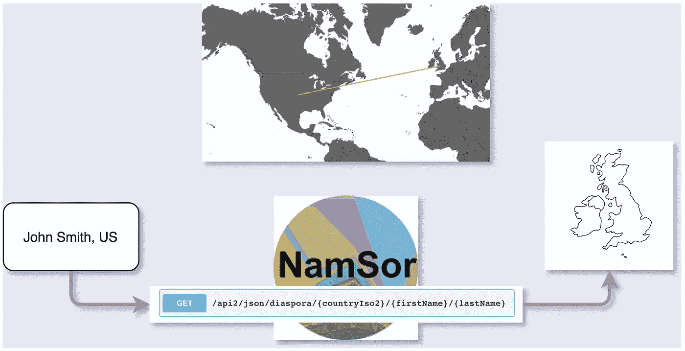

# 用分类为故事片增色不少——第二部分

> 原文：<https://towardsdatascience.com/spicing-up-feature-film-credits-with-classification-part-ii-c715d8375975?source=collection_archive---------15----------------------->

## 为什么我记不住名字，但结果却是最好的。

Nobody:
The credits: Tom Skerritt, Sigourney Weaver, Veronica Cartwright, Harry Dean Stanton, John Hurt, Ian Holm, Yaphet Kotto, Bolaji Badejo, Helen Horton, Eddie Powell, Gordon Carroll, David Giler, Walter Hill, Ivor…

## 背景

对于试图将“接触这部电影”的人与最终观看这部电影的人联系起来的努力来说，演职员表是一个可悲的借口。这是一种如此沉闷的形式，以至于影院通常会为电影观众照亮房间，让他们舒适地离开影院*。我想遏制这种习俗，让人们对滚动而过的无数名字产生兴趣。在我的[上一篇文章](/the-trouble-with-classification-312cc6fe8b79)中，我解释了为什么我用国籍来标记名字——简单地说，当陌生人发现他们有共同的起源故事时，他们会立即联系起来。*

*我想做一些像下面的样本信贷序列。让我们称这种格式为“标记标志”*

**

*The flag-tags are randomly assigned and do not accurately represent ethnonationality.*

*这篇文章是关于一个开发者的快速和肮脏的技术解决方案如何不能改变一种文化，而是作为一个强大的工具来揭露和纠正幼稚。谁的？首先是我的。*

**

*Situation ‘A’ — I am the go-to credits-processing guy.
Situation ‘B’ — Where I am now, developing a client-side post-production solution.*

*我将从解决我最初项目的绝望开始。理想情况下，我会将国籍信息整合到电影本身(国旗标记)中，以使片尾字幕比电影结尾的浴室更有吸引力。由于我没有运行一个已建立的编辑操作，也没有为快速演职员表处理提供素材，所以我更倾向于编写一个脚本，通过(1)以编程方式在流式视频中查找姓名，以及(2)插入动画图形以追溯分配国籍信息来自动标记标志。这超出了我的能力范围。*

**

*Over time, the credits grow [longer](https://www.nytimes.com/2017/05/26/movies/why-end-credits-in-movies-are-so-long.html) and list more distinct roles. [1]*

*但我艰难地前行，双手握着分类工具和公共数据库，希望揭示故事片漫长历史中的民族叙事。故事片的历史已经超过 100 年了，包括大约 30 万个名字。这是一个增加姓名数据的巨大过程，我遇到的挑战使我将范围缩小到一小群有趣的人。*

## *请负责任地命名*

*从马克·哈米尔这个名字，你不能确定地收集种族国籍，但是你可以分配一个概率，这个名字是由某个种族血统的父母起的。这种任务非常适合分类算法，该算法分析输入，并使用机器学习模型将它们分类到与其属性最接近的类别中。让我们看看 [NamSor](https://www.namsor.com/) 如何预测这位著名美国演员的名字的遗传，[我们知道](http://www.filmreference.com/film/26/Mark-Hamill.html)是英国、爱尔兰、苏格兰、威尔士(父系)和瑞典(母系)血统。*

*Baby Name Wizard and Ancestry serve as the base-truth origin for the first and last names. For “Mark Hamill, U.S.A.,” NamSor’s most confident predictions are “British” and then “(German).”*

*看到它正确地猜中了英国吗？那是 1 对 1！只差 299，999 就行了！*

**

*NamSor’s Diaspora endpoint drives the ethnonationality classification.*

*然而，我们不能指望 NamSor 是 100%准确的，即使它是一个神奇的 API。这是因为纳姆瑟认为传统是一种规则——父母给孩子取名以反映他们的传统。NamSor 不知道它被要求分类的名字可能不是出生时起的名字。*

## *叫我那个名字*

*历史上，好莱坞的犹太人、意大利人和波兰人将他们的名字改成了更容易发音的[艺名](https://www.nytimes.com/2010/08/26/nyregion/26names.html)，有时[会取一个没有任何血统痕迹的](https://en.wikipedia.org/wiki/Stage_name#Ethnicity)[名字，以此与容易受到歧视的种族群体](https://www.classic-rock-legends-start-here.com/aerosmith-3.html)划清界限。*

*I don’t care what anyone says, Herschlag has a nice ring to it!*

*我不能继续给人们贴上假定的民族标签，因为我知道我通过电影数据库获得的大部分名字并不是出生时就有的。幸运的是， [IMBb](http://imdb.com) 有我要找的每个人的出生和艺名，所以我只需要找出自 1900 年以来每年最受欢迎的 5-7 部电影中的每个人(n≈100，000)，他们为了在行业中更好的销售而改变了他们的名字，以便纠正“改名者”。在不知道任何个人改名的动机的情况下，为了消除误报，我假设他们换名字的原因**不是下面的**:*

1.  *他们因结婚而改名。(对于娱乐圈女性来说，婚后保留婚前姓氏实际上更加专业。这些女人违背了自己的意愿。)*
2.  *他们用名字的首字母或昵称来称呼。(想想作家兼演员 B·J·诺瓦克。)*
3.  *他们获得了荣誉。(想想帕特里克·斯图尔特爵士。)*

*过滤之后剩下的是大约 7000 个重要的名字变更，相当于样本的 7%,以及一个值得探索的有趣群体！在我深入研究之前，我对这些数据有一些疑问，包括:*

> *我们能观察到英语化是改名的一种趋势吗？*

## *不*

*假设:由于大部分人的名字都是英国名字，你可以观察到美国电影业名字变化的英国化模式。*

***解析:**用 NamSor 确定某人的*实际*民族志是哑巴。相反，我使用 NamSor 来完成它的构建目的；我获得了与某人以前和现在的*名字*相关的民族“印象”,以寻找民族文化对该行业的重要性。*

**

*Too much?*

*事实:事实证明，听起来像英国人的名字会流向听起来像其他地方的名字。我的假设是错误的。看看这个。*

*We’re only looking at the eastern hemisphere because ethnonationality, even in melting pots like the USA, is categorized primarily by geographical ties developed over the Modern Era, [when populations were concentrated outside of the Americas](https://worldpopulationhistory.org/map/1500/mercator/1/0/25/).*

*关于上面的可视化:
一条红线表示名字起源于英国，终止于别处。
蓝线表示该名称源自其他地方，终止于英国。
白线表示与英国无关。
线条的粗细表示一年内从一个“民族”到另一个“民族”的更名次数。*

*这里有很多可看的，但我想让你注意红色和蓝色的线，特别是在 1900-1970 年之间。在这段时间里，似乎有大量英国口音的名字流向了葡萄牙口音的名字。与假设相反，这表明存在巨大的去英语化效应。也许是因为人们想用听起来有民族特色的名字来区别于娱乐圈的人？*

## *总结要点*

*在我发现我的假设是错误的之后，我觉得我的项目走进了死胡同。我的目标是推出一款能改变人们观看演职员表方式的产品，但我觉得自己一无所获。即使我开发了后期制作软件来改变演职员表的视觉内容，也不能保证任何人都会注意到，更不用说关心他们的电影结束后还有什么可看的了。相反，我开发了一个独立的网站，作为一个平台来展示我在探索和理解数据集的过程中取得的进步。当然，这意味着我发表的任何东西都与我所涉足的行业无关。虽然这个****让我的影响可以忽略不计**，但它迫使我在暴露一些人们*会觉得有趣的东西之前，发现我手头的数据和工具的真正价值。当我发现我的假设是错误的时候，探索一个未被触及的数据集的乐趣很快就消失了，但我相信从这群改名者身上可能会发现比我最初想象的更多的东西。****

****会有第三部吗？只有时间会证明…同时，感谢您的阅读！如果我观察的人群或者我的分析过程对你有任何兴趣，请联系！****

****[1] *电影数据库(每年约 5 部最受欢迎的故事片)*****

****我和 [Jyotsna Pant](https://www.linkedin.com/in/jyotsna-pant/) 一起承担了这个项目，她是南加州大学[社会公益计算](https://raghavan.usc.edu/2019-spring-computing-for-social-good/)的研究生。****