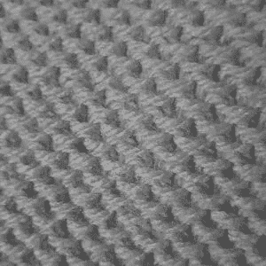
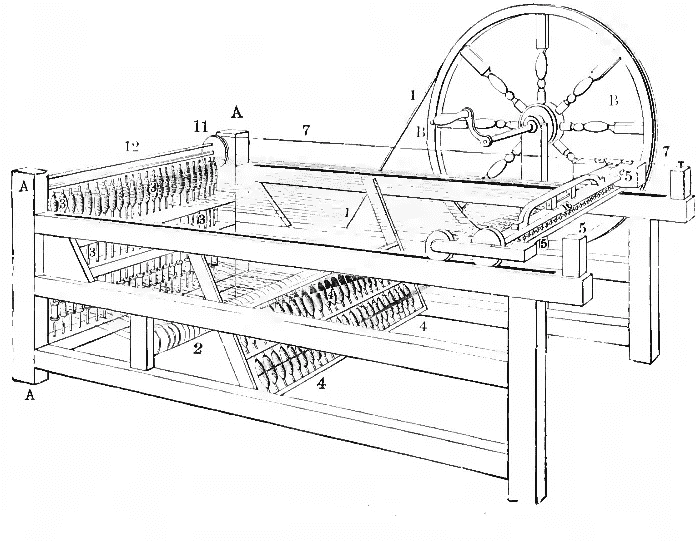

# 将数据转化为思想

> 原文：<https://towardsdatascience.com/spinning-data-into-thought-e8f89b417374?source=collection_archive---------24----------------------->

## 计算机如何思考:导论

任何一个见过一团羊毛、一段亚麻纤维或一捆原棉的人，理论上都能想象出如何将这些纤维捻成纱线，如何织一件羊毛套衫，或者如何织一条棉毯或帆布帆。纺织的艺术和科学没有利用线的任何隐藏的特性；要理解一种纤维如何被扭曲和打结以生产出一种柔韧、结实的织物，不需要发现晦涩的化学或古怪的物理现象。任何人都可以清楚地看到，正是物体的几何形状允许了这一点。

那是理论上的。但理论一如既往地超越实践。因为历史上没有一个人仅仅看着一段纤维就能完全理解。没有一个人能仅仅通过观察就能搞清楚所有的事情，或者如果有的话，他们有别的想法。纺织技术在历史上发展缓慢得令人难以置信，它是成千上万个人的聪明才智、辛勤劳动和辉煌时刻的产物。

考古记录告诉我们，第一批织物已有近三万年的历史，人们只知道它们留在小块粘土上的印记。从那时起，技术在世界各地被发明、遗忘和重新发现，并且随着简单线的几何性质的进一步回旋被解开，技术继续发展。

A complex pattern emerges from the repetition of simple steps

现在最复杂的针织图案就像计算机代码的线条，事实上，这种相似不仅仅是表面上的。针织图案是一系列简单步骤的指令，重复这些步骤会产生非常复杂的结果。针织图案和计算机程序都编码了逻辑操作，这些逻辑操作被(人或计算机)解释成一个过程，该过程将简单的输入转换成非常有用的输出。这就是“算法”这个词的定义。这个词让人想起一些留着胡子、穿着粗花呢的教授在黑板上潦草书写的希腊字母，或者一台不可言喻的机器神秘的内部运作。但现实要容易得多。“算法”简单地说就是“一系列可重复的逻辑步骤”。从字面上看，纺织品是数学运算的产物，人类大规模运算能力的进步对我们的生活产生了深远的影响。

## 工业革命

纺车是一种非常简单的装置。它允许工人将纤维喂入旋转的轮子，轮子巧妙地将纤维捻成线，并将线收集在锭子上。至少在过去的一千年里，人们已经知道了各种形式的纺车。1764 年，根据一个几乎肯定不真实的传说，来自英国兰开夏郡的纺织工兼木匠詹姆斯·哈格里夫斯看到了一个翻转的纺车，并注意到这个方向可以让多个锭子排成一行，允许单个轮子将纤维纺到每个锭子上。他随后的发明“珍妮纺纱机”允许一个纺纱机完成八个纺纱机的工作。大约在哈格里夫斯发明的时候，据估计英国只有不到 50，000 个纱锭生产纱线。到了 19 世纪 20 年代，人口超过了 700 万。这种观点的微小转变，这种简单几何学在大范围内的应用，是后来成为英国工业革命的第一步。

The Spinning Jenny

工业革命对我们社会的影响大得难以理解。起初是数量上的变化——一个工人做八个，然后十六个，然后几百个工人的工作——变成了社会结构的质变。全新的产业从旧产业的灰烬中诞生。曾经是富人专属的产品现在大众都可以买到了。随着交通网络的改善，世界实际上变得更小了——欧洲大陆上相距遥远的市场突然之间只有几天的路程。权力从根本上转移了，从拥有土地的贵族手中转移到拥有工厂的中产阶级手中。

并非所有这些变化都是积极的，也并非所有人都从技术发展的快速步伐引发的彻底社会变革中受益。虽然整个国家都渴望新的廉价织物，以及它们带来的可能性，但至少有一个群体中这些创新基本上不太受欢迎，他们开始了一场社会运动，其名称今天仍然流行，尽管不完全是他们希望的方式。他们自称为“勒德分子”。

当一个新的过程意味着一个人可以做八个人的工作时，结果不是八个人做八分之一的工作，而是一个人做同样多的工作，而另外七个人挨饿。为长袜和针织品生产精细针织面料的熟练工匠对这一数学结果并不感到兴奋。袜架发明于 1589 年，但在 18 世纪末得到改进和广泛采用，威胁到他们的生活方式。一个织袜机可以让相对不熟练的操作者更快、更可靠地完成织袜机的精细工作。为了保护他们的生计和生活方式，牧民们起义了。灵感来自(可能是虚构的)一个纺织工 Ned Ludd 的故事，他砸碎了他的织布机，库存商的抗议通常采取摧毁正在摧毁他们生计的机器的形式。卢德派诞生了。

From 1812, “Machine Breaking” was punishable by deportation or death

在流行的观念中，卢德分子已经成为对技术恐惧的一种隐喻，他们的名字与顽固抵制进步同义。但是他们的实际立场更接近于传统的劳工运动。他们关心的不是新技术本身的兴起，而是这些新机器对他们的生活、他们预期的工作环境以及他们将获得的报酬的影响。

历史的潮流对卢德分子并不友好。抗议者们还来不及砸碎袜子，袜子框架就被制造出来了，袜子商们所学的手艺已经过时了，取而代之的是在炎热危险的工厂里挥汗如雨的非熟练工人。或许这些放养者能够找到新工作，在工业革命后出现的许多新行业中的一个——比如司炉工、点灯工、灯笼裤等等——但对他们中的许多人来说，这肯定是一个改变生活、痛苦的转变。

## 人工智能

根据这篇文章的背景，你可能会猜到我在打什么比方。在二十一世纪的最初几十年，我们正处于一个类似的过渡阶段。大量任务的自动化，用人工智能取代熟练工人，用按键取代困难任务的新流程，都呼应了工业革命的变化。伴随这些技术发展的社会变革是否会像工业革命那样深刻还有待观察，但我认为这种比较是有启发性的。

就像针织和编织技术在工业化之前很多年就已经为人所知一样，支撑人工智能的数学在很大程度上并不特别新。与纺织工艺品一样，它们只是对原材料几何特性的简单处理。对于纺织品来说，这是线。对于人工智能来说，这就是数据。已经发生的决定性转变并不在于新技术的发展(尽管已经开发了许多新技术)。更确切地说，是执行这些操作的速度和可供他们使用的数据量从质的方面改变了他们能够实现的目标。

我所说的“人工智能”并不是指无所不知的电脑霸主或邪恶的机器人助手的流行文化形象。我指的是允许我们将数字信息转化为更有用产品的广泛技术。这些技术已经广泛应用于各类消费品中。我们可以将关于人们购物习惯的信息转化为对明年流行趋势的预测，或者转化为关于某人下一步可能想要购买什么的建议。根据事故和伤害数据，我们可以建立模型，将人们分为高或低保险风险。我们可以将数字化文档转化为搜索算法，识别相关立法或研究。我们甚至可以建立模仿人类语言并对其做出反应的程序。当我们将“智能”应用于人类思维时，这些工具中的许多并不完全符合“智能”的概念。但总的来说，它们产生了以前只有人类思维才能实现的结果。

本质上，我们正在经历的变化是量变。我们总是能够预测时尚趋势，搜索文档，说话和倾听。改变的是我们执行这些行动的速度和规模。从受到人类操作员的速度和注意力范围的限制，我们已经转移到(在某些方面)较少受限的计算机能力。就像工业革命一样，技术发展提高了单个工人的生产率，就像工业革命一样，这对哪些技能是需要的，哪些技能是过时的产生了越来越大的影响。

我们用计算机智能分享我们的世界。如果可以说这些智能是“思考”的话，那么它们的思考方式与你我截然不同。描述它们作为智能是如何工作的，将它们与思考、感知的生物联系起来，充其量是一种牵强的隐喻，一种通过将新事物与熟悉的事物联系起来帮助我们理解新事物的工具。但这是一个越来越贴切的比喻。

像人类智能一样，人工智能是其历史的产物。他们是他们父母的孩子，他们反映了他们的创造者的偏见、弱点以及优点和价值观。他们和建造他们的人一样无辜。

人类智能和人工智能之间最大的区别，也是我们认为它们“像我们一样”思考的最大障碍，是它们的过程在很大程度上可以完全暴露。人类思维的内部运作对我们来说可能永远是神秘的，只有不精确的心理学和人类学才能探索。人脑的软肉很少告诉我们它所包含的内在生命。但是一个机器智能，尽管它可能是复杂的，总是可以简化为它的组成部分。当人工智能是一个“黑匣子”，向我们隐藏了它是如何得出结论的，我们可以想象它是一些抽象人格的作品。但是暴露出机器上的齿轮，解开挂毯上的结，我们可以看到简单的规则，1 和 0，编织和反编织，这些构成了这个复杂的织物。

就像在巫师的窗帘后面瞥见一样，看到魔术是如何表演的就驱散了魔法。但这是一个应该被驱散的魔法。为了理解这些新的人工智能，以更接近他们自己的方式与他们联系，我们需要对他们能做什么和不能做什么形成更好的预期，我们需要说一点他们的语言。像储备者一样，我们面临一个选择:我们可以效仿路德，试图摧毁或阻碍这些新机器，并保留我们目前享受的生活方式。或者我们可以试着与他们协商一种新的关系，为他们在我们的生活中找到一个家。

在下面的文章中，我将深入浅出地解释人工智能算法将数据转化为思维拟态的过程。我将从这些算法中最简单的开始，并介绍机器学习中的一些关键概念。我还将探索其他类型的人工智能，例如用于驱动视频游戏中计算机控制角色动作的人工智能。我还将冒险进入“深度学习”的世界，探索试图模仿人类大脑结构的神经网络。在这个过程中，我们将了解一些与我正在使用的数据相关的有趣话题。我们将找到与每个人的生活越来越相关的几个问题的答案:什么是人工智能？它是如何工作的？它能做好什么，做不好什么？智力到底是什么？最后，我希望，我们能对这些新的计算机智能多一点同情，多一点理解，这些智能正与我们分享我们的生活。

[*转到第一部分:决策树和恐龙*](https://medium.com/@simoncarryer/decision-trees-and-dinosaurs-c14339a37ad8)