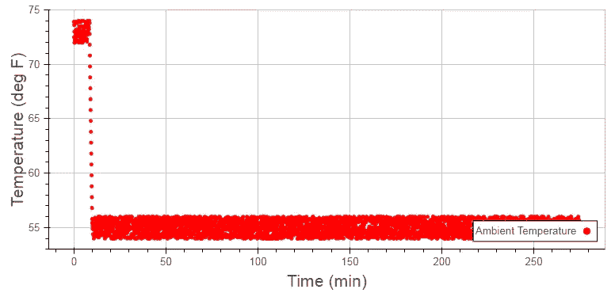

# 拆分数据集

> 原文：<https://towardsdatascience.com/splitting-data-sets-cac104a05386?source=collection_archive---------9----------------------->

## 顶尖科学家如何简化庞大的数据集


科学家提供了非常大的数据集。这是有充分理由的；更多的数据让他们对正在研究的现象有了更透彻的理解。但这也产生了一个问题。随着数据集变得越来越大，它们变得越来越难以理解和使用。

一个很好的解决方案是学习如何自动将这些数据集分割成单独的文件。这样，每个数据文件就变成了一个易于管理的解释现象的一个方面的信息。很容易相处。而且，通过自动完成它，你可以不费吹灰之力就让你的生活变得更加轻松。

本文将教你如何做到这一点。它将引导你完成这个过程，并提供具体的 Python 代码(Python 2.7)。

它是在科学和工程中经常遇到的真实生活问题的背景下进行的。要理解正在研究的概念，请参见[自动化性能图创建教程。](/tutorial-automatically-creating-a-performance-map-of-a-heat-pump-water-heater-7035c7f208b0)

你可以通过阅读这篇文章来学习这些概念。如果您想更进一步，并且对您的技能和有用的工具充满信心，您可以下载[配套数据集](https://peter-grant.my-online.store/HPWH_Performance_Map_Tutorial_Data_Set/p6635995_20036443.aspx)。这个配套数据集将允许您测试您的代码和检查您的结果，确保您正确地学习这个过程。

# 这篇文章将涵盖哪些内容？

在本教程的这一部分，我们将介绍将包含多个实验室测试结果的数据集分割成单个文件的过程。这些文件将分别包含单个测试的结果，并且将具有描述性文件名，说明其中包含的数据。我们将使用在[自动化科学分析第二部分](/automating-scientific-data-analysis-part-2-12331b46003)中描述的技术。

事不宜迟，我们开始吧。第一步是导入将启用数据分析过程的 Python 包。

# 如何用 Python 导入包？

每个 Python 脚本都需要以导入所需包和功能的语句开始。在这个数据文件分割脚本中，我们需要:

*   Pandas :这个包是 Python 中数据分析的首选。它允许您将数据读入数据帧(本质上是表),并提供了大量用于操作数据的工具。关于熊猫的丰富信息可以在创作者的书中找到 [Python 进行数据分析](https://www.amazon.com/gp/product/1491957662/ref=as_li_tl?ie=UTF8&camp=1789&creative=9325&creativeASIN=1491957662&linkCode=as2&tag=1000xfaster-20&linkId=7b4c4d6384add4cc78ac8a016a8c7945)。
*   **os** : os 是一个 Python 包，可以让你使用电脑操作系统的命令，在数据分析过程之外影响电脑。在这种情况下，我们将使用它来创建新的文件夹。
*   Bokeh 是 Python 中的一个交互式绘图工具。它使您能够编写在分析数据时自动生成图的代码，并为用户提供与它们交互的选项。进一步了解散景的一个很好的来源是[用散景进行实际数据可视化](https://www.amazon.com/gp/product/B07DWG4T95/ref=as_li_tl?ie=UTF8&camp=1789&creative=9325&creativeASIN=B07DWG4T95&linkCode=as2&tag=1000xfaster-20&linkId=c503c2259e94061c5d4af3c7408e2223)。

在这种情况下，我们将拉进熊猫和操作系统的整体，但只有从散景特定的功能。为此，请将以下代码添加到程序的开头。

```
import pandas as pd
import os
from bokeh.plotting import figure, save, gridplot, output_file,   ColumnDataSource
from bokeh.models import HoverTool
```

您可以看到这四行输入了指定的包。注意，导入 pandas 的行还指定 pandas 已经作为 pd 导入，这意味着我们可以在代码的其余部分将 pandas 称为“pd”。另请注意，“ColumnDataSource”位于以“from bokeh.plotting”开头的代码行上。

既然我们的包已经导入，下一步就是读取必要的数据，这样脚本就可以使用它了。

# 我如何读取数据文件？

熊猫有一个很棒的导入数据集的工具。是 read_csv 函数。为了读取文件，您调用 pandas.read_csv 函数，指定文件的位置，并将其设置为一个变量。如果需要，您可以使用其他几个修改器来定制导入，但是我们不会在这里使用它们。

这个命令需要用来导入两个文件。首先是数据集本身。如果你下载了配套的数据集，它的标题是'缔约方会议 _HPWH_f_Tamb&Tavg.csv '。如果我们假设您将文件保存在文件夹“C:\ Users \ your name \ Documents \ automated data analysis”中，那么我们可以使用以下代码导入数据:

```
Data = pd.read_csv(r’C:\Users\YourName\Documents\AutomatedDataAnalysis\COP_HPWH_f_Tamb&Tavg.csv’)
```

执行该代码将导致数据集保存到变量“data”中。然后，通过引用数据，可以在数据集上使用 Pandas 的所有数据分析功能。

第二个需要的文件是描述文件中包含的测试的表格。为了便于学习，如果您自己创建表格会很有帮助。数据集包含在不同环境温度(环境温度指被测设备周围的空气温度)下进行的三次测试的结果。要创建此数据集，请生成一个包含以下信息的表格，并将其另存为“Test_Plan.csv ”,保存在与数据集相同的文件夹中。


请注意，您稍后将引用列的名称，因此确保您使用的文本与示例数据中的文本相同非常重要。

现在已经创建并保存了表，您可以通过编写以下内容将其读入 Python:

```
Test_Plan = pd.read_csv(r’C:\Users\YourName\Documents\AutomatedDataAnalysis\Test_Plan.csv’)
```

既然数据已经读入 Python 脚本，下一步就是识别每个测试结束和下一个团队开始的行。

# 我如何识别每个测试的终点？

为了确定每个测试的结束和下一个测试的开始，你需要一些关于测试本身的知识。您需要考虑测试是如何执行的，并确定一个指示测试结束的条件。

在这种情况下，我们正在分析来自研究热泵热水器 (HPWH)测试的[数据，这种热水器使用电力来加热水。因为我们在看加热水消耗了多少电力，所以我们可以知道在每次测试中消耗了多少电力。这意味着*每次测试都在设备停止用电时结束。*](/tutorial-automatically-creating-a-performance-map-of-a-heat-pump-water-heater-7035c7f208b0)

我们需要确定设备停止用电的行。我们可以通过从前一行的用电量中减去每一行的用电量来实现。如果结果是否定的，这意味着 HPWH 消耗的电力比以前少，测试已经结束。

我们可以通过使用。我们数据集上的 shift()函数。这个函数做的和它听起来一样；它将数据移动指定的行数。我们可以利用。shift()在包含耗电量 P_Elec (W)的数据框中创建新行，数据已移动一行。我们可以用下面一行代码来实现这一点:

```
Data[‘P_Elec_Shift (W)’] = Data[‘P_Elec (W)’].shift(periods = -1)
```

这导致数据框中出现两个不同的列来描述 HPWHs 电力消耗。P_Elec (W)表示每行的耗电量，单位为瓦特。P_Elec_Shift (W)表示下一行的耗电量，单位为瓦特。如果我们从 P_Elec_Shift (W)中减去 P_Elec (W)，负值的行将表示 HPWH 已经停止加热。我们可以用下面的代码做到这一点:

```
Data[‘P_Elec_Shift (W)’] = Data[‘P_Elec_Shift (W)’] — Data[‘P_Elec (W)’]
```

此时，我们有一个数据帧，其中每一行*都包含 0，除了每个测试结束的*行。我们可以使用这些信息创建一个列表，告诉我们每次测试何时结束。我们称这个列表为“测试结束”，以清楚地表明其中包含的信息。然后，我们将使用. index.tolist()函数来填充该列表。这可以通过下面的代码来完成:

```
End_Of_Tests = []
End_Of_Tests = End_Of_Tests + Data[Data[‘P_Elec_Shift (W)’] < 0].index.tolist()
```

第一行创建空列表“End_Of_Tests”虽然它最初不保存数据，但它已经准备好接受来自其他命令的数据。第二行向 End_Of_Tests 添加数据。它说要查看数据以识别‘P _ Elec _ Shift(W)’为负的行，识别这些行的索引，并将它们添加到 End_Of_Tests 列表中。

既然我们已经确定了对应于每个测试结束的行，我们可以将数据集分成单独的数据集，每个测试一个。

# 我如何分割数据文件？

可以使用以下步骤将数据文件分割成更易于管理的文件:

*   首先，您需要为每个测试重复这个过程一次。这意味着我们需要为 End_Of_Tests 中的每个条目迭代一次。
*   其次，您需要创建一个新的数据框，该数据框是仅包含来自单个测试的数据的原始数据框的子集。
*   第三，您需要使用测试的条件来识别这个数据所代表的测试计划中的测试。
*   第四，您需要将数据保存到一个新文件中，该文件的文件名说明了文件中包含的数据。

## 迭代测试结束

第一步可以通过一个简单的 for 循环来完成，该循环遍历 End_Of_Tests 列表。这可以通过下面的代码来完成:

```
for i in range(len(End_Of_Tests)):
```

这将创建一个运行 x 次的循环，其中 x 是 End_Of_Tests 中的行数/文件中包含的测试数。请注意，I 将是一个递增的整数(0、1、2 等等),可以用于索引。还要注意，我们现在有一个活动的 for 循环，所以所有未来的代码都需要缩进，直到我们离开 for 循环。

## 使用数据子集创建新的数据框

第二步可以通过使用 End_Of_Tests 的值来标识对应于每个测试的数据行来完成。在第一个测试中，这意味着我们需要选择 End_Of_Tests 中第一行和第一个值之间的数据。在第二个测试中，这意味着我们需要选择 End_Of_Tests 中第一个值和 End_Of_Tests 中第二个值之间的数据。第三次也是如此，如果我们在这个数据集中进行了三次以上的测试，那就更多。

第一个测试(从硬编码的第 0 行开始)和未来的测试(从 End_Of_Tests 中的一个条目开始)在处理上的不同之处在于，我们需要一个 if 语句来改变代码，这取决于我们是否要取出第一个测试。

然后，代码需要使用 End_Of_Test 值来标识我们想要的数据部分，并将其保存到新的数据帧中。

这可以通过下面的代码来实现:

```
if i == 0:
    File_SingleTest = Data[0:End_Of_Tests[i]]
else:
    File_SingleTest = Data[End_Of_Tests[i-1]:End_Of_Tests[i]]
```

第一行检查这段代码是否是第一次执行。如果是，这意味着这是第一次通过循环，我们提取第一个测试。如果是，代码通过 End_Of_Tests 中的第一个条目(用 End_Of_Tests[i]表示，当前是 End_Of_Tests[0])提取第一行数据(索引 0)，并将其存储在名为 File_SingleTest 的新数据帧中。如果不是第一次通过代码，这意味着我们需要从一个不是第一次的测试中提取数据。在这种情况下，我们提取从前一个测试结束时(End_Of_Tests[i-1])到当前测试结束时(End_Of_Tests[i])的数据，并将其保存到 File_SingleTest。

注意，数据总是保存到 File_SingleTest。这意味着包含来自单个测试的数据的数据帧将总是在下一次迭代中被覆盖。在这种情况发生之前保存数据非常重要！

## 确定每个测试的条件

现在我们有了一个包含特定测试数据的数据框架。但是到底是哪个测试呢？我们需要阅读数据来理解测试中发生的事情，并将其与测试计划中的规范进行比较。通过这种方式，我们可以识别数据框中的测试，并给数据框一个描述性的名称。

查看测试计划，我们会发现每次测试的环境温度都会发生变化。测试 1 的环境温度为 55 华氏度，测试 2 的环境温度为 70 华氏度，测试 3 的环境温度为 95 华氏度。这意味着环境温度是我们这里的描述符。

我们可以用以下代码识别测试过程中的环境温度:

```
Temperature_Ambient = File_SingleTest[‘T_Amb (deg F)’][-50:].mean()
```

此行读取 File_SingleTest 数据帧中代表环境温度(' T_Amb(华氏度)')的列的最后 50 个条目([-50:])，并计算平均值(。均值())。然后，它将该值存储在 Temperature_Ambient 中。这样，我们将测试最后几分钟的环境温度存储在一个变量中。

第二步是将这个值与测试计划进行比较，并确定执行了哪个测试。这很重要，因为没有测试数据是完美的，平均环境温度也不会完全符合测试计划中的规格。例如，指定环境温度为 55 度的测试实际环境温度可能为 53.95 度。识别相应的测试使文件管理更容易。

相应的试验可通过 1)计算试验中的平均温度与每次试验中要求的环境温度之间的差值，以及 2)确定具有最小差值的试验来确定。这可以通过下面两行代码来完成:

```
Test_Plan[‘Error_Temperature_Ambient’] = abs(Test_Plan[‘Ambient Temperature (deg F)’] — Temperature_Ambient)
Temperature_Ambient = Test_Plan.loc[Test_Plan[‘Error_Temperature_Ambient’].idxmin(), ‘Ambient Temperature (deg F)’]
```

第一行向 Test_Plan 数据框添加了一个新列，该列说明了该测试中要求的环境温度与活动测试中的平均环境温度之间的差值的绝对值。第二行使用。loc()和。idxmin()函数识别测试中误差最小的环境温度，并将该环境温度设置为我们的 Temperature_Ambient 变量。

现在我们准备将数据保存到一个新文件中。

## 将数据保存到新文件

有了包含单个测试结果的数据框和该测试条件的知识，我们现在可以将结果保存到一个新文件中。本节将向您展示在[中讨论的技术之一，自动存储来自自动化数据集](/automatically-storing-results-from-analyzed-data-sets-ed918d04bc13)的结果。

第一步是确保我们要保存数据的文件夹存在。我们可以手动完成，但这是一篇关于自动化的文章！让我们编写脚本来为我们做这件事。

假设我们希望数据存储在文件“C:\ Users \ your name \ Documents \ automating data analysis \ Files _ individual tests”中。为了确保该文件夹存在，我们可以使用以下代码:

```
Folder = ‘C:\Users\YourName\Documents\AutomatingDataAnalysis\Files_IndividualTests’
if not os.path.exists(Folder):
    os.makedirs(Folder)
```

第一行将所需文件夹的路径设置为变量 folder。第二行使用 os 函数. path.exists()检查并查看该文件夹是否存在。如果它不存在，它将执行第三行代码来创建文件夹。这样我们才能确保它的存在。

一旦文件夹存在，我们可以使用相同的方法将数据文件保存到该文件夹中。我们指定想要使用的文件名，使用变量来包含关于环境温度的数据，并使用熊猫。to_csv()函数将文件保存到我们想要的位置。这可以通过下面的代码来完成:

```
Filename_SingleTest = “\PerformanceMap_HPWH_” + str(int(Temperature_Ambient)) + “.csv” 

File_SingleTest.to_csv(Folder + Filename_SingleTest, index = False)
```

第一行创建了我们想要使用的文件名。它描述性地指出，这是一个包含测试数据的文件，用于创建 HPWH 的性能图。第二部分更重要。它将我们在测试计划中确定的环境温度作为一个变量，将其转换为一个整数，转换为一个字符串，并将其添加到文件名中。现在文件名包含了测试的条件，在你打开它之前告诉你文件到底包含了什么。

第二行做了繁重的工作。它将先前指定的文件夹与当前数据框的文件名合并，并保存它。请注意，它还会删除索引，因为保存索引并不重要，有助于保持文件的整洁。

# 最后一步是什么？

现在，您已经进入了编写这个脚本的有趣部分。你可以经营它。你可以看到程序产生你需要的结果。

注意，这个过程在本教程中有点矫枉过正。伴随数据集有来自三个虚构测试的结果。在一个有三个测试的项目中这样做并不困难、耗时或者乏味。但是如果你有 1000 个测试呢？那么这个过程就变得极其有价值。

# 我如何检查我的结果？

在这个过程中有两个步骤来检查你的结果。

首先是确保您得到了正确的文件作为输出。为此，您将您的新文件夹中的文件与测试计划中所要求的测试进行比较。每个测试应该有一个文件，文件名中的条件与测试计划中要求的条件相匹配。

在此过程中，您应该会在文件夹中看到以下文件:


注意在那个文件夹中有三个文件，并且在测试计划中指定了三个测试。还要注意测试计划是如何要求在 55 度、70 度和 95 度进行测试的，这三个温度是在三个文件名中指定的。到目前为止，看起来一切正常。

第二步是检查每个文件中包含的数据。最简单的方法是绘制数据并直观地检查它(不过，我们将在后面讨论自动完成这个任务的[方法](/checking-automated-data-analysis-for-errors-a97a22a35ad7))。

快速检查是从每个数据文件创建一个显示环境温度的图。这可以通过散景来实现。

首先，我们需要在数据框中创建一个新列，以用户友好的方式给出测试时间。在测试开始后的几分钟内。我们可以通过在程序中添加下面一行来做到这一点(如果我们假设测量之间的时间是 5 秒):

```
File_SingleTest[‘Time_SinceStart (min)’] = File_SingleTest.index * 10./60.
```

这给了我们一个用户友好的时间来作为我们图中的 x 轴。然后我们可以使用散景来创建和保存情节。我们用下面的代码实现了这一点:

```
p1 = figure(width=800, height=400, x_axis_label=’Time (min)’, y_axis_label = ‘Temperature (deg F)’)
p1.circle(File_SingleTest[‘Time_SinceStart (min), File_SingleTest[‘T_Amb (deg F)’], legend=’Ambient Temperature’, color = ‘red’, source = source_temps)
```

第一行创建一个名为 p1 的图形，并指定地块的大小和轴标签。第二行将红色圆圈添加到绘图中，x 值由“自开始时间(分钟)”指定，y 值由“T_Amb(华氏度)”指定。它还规定图例读数应为“环境温度”。

可以使用 gridplot 和 outputfile 功能保存绘图。

```
p=gridplot([[p1]])output_file(Folder + '\PerformanceMap_HPWH_T_Amb=’ + str(int(Temperature_Ambient)) + ‘.html’, title = ‘Temperatures’)save(p)
```

散景有一个方便的功能叫做 gridplot，可以在一个文件中存储多个图。这使得查看相邻的相关图，比较其中的数据变得非常方便。此功能对于本教程不是必需的，因此我们只在网格中输入了当前图(p1)。但你应该了解一下，以防将来需要。

第二行指定文件的保存位置。它放在我们保存。数据的 csv 文件，并使用与以前相同的文件名约定。不同之处在于数据保存在。csv 文件，保存在. html 文件中。

第三行最后保存数据。

如果您重新运行代码，您会看到同样的结果。结果文件夹中的 csv 文件。此外，您现在会发现新的。html 文件。这些。html 文件包含数据集的绘图。

如果你打开这些图，你会看到什么？

首先，您希望测试期间记录的环境温度与测试计划和文件名中指定的值相似。在 55 度下的测试应该具有大约 55 度的环境温度，等等。

其次，这是真实世界的数据，你不应该期望它是完美的。有些值会是 54.5，有些会是 55.2，依此类推。别为那件事大惊小怪。

第三，你应该期望在测试开始时看到温度的调整。原始值将是之前测试的温度，然后实验室需要逐渐将温度更改为新的设置。

如果我们打开 55 度测试的曲线图，我们应该会看到这一点。您的结果应该是这样的:



注意温度是如何从 75 度开始，然后迅速下降到 55 度的。不出所料。注意整个测试过程中的平均温度明显是 55 度。不出所料。还要注意数据是如何在 55 度左右反弹的，而不是像预期的那样准确。

这个文件意味着测试被正确地执行，并且数据文件被正确地分割。你已经准备好进入下一步了！

# 下一步是什么？

本文是指导您如何自动化科学数据分析的教程的第 1 步。既然庞大的数据文件被分成了三个独立的文件，每个测试一个，我们可以开始利用这些数据文件了。下一步是检查过程数据文件，执行我们的分析。当分析完成后，我们可以检查结果，以确保测试和计算正确进行。

## 教程目录

这是一系列文章的一部分，教你自动分析实验室数据和绘制热泵热水器性能图所需的所有技巧。本系列的其他文章可以通过以下链接找到:

[简介](/tutorial-automatically-creating-a-performance-map-of-a-heat-pump-water-heater-7035c7f208b0)

[自动分析实验室测试数据](/automatically-analyzing-laboratory-test-data-32c27e4e3075)

[检查分析实验室数据的错误](/checking-analyzed-laboratory-data-for-errors-4bd63bcc554d)

[如何编写检查数据质量的脚本](https://medium.com/zero-equals-false/how-to-write-scripts-that-check-data-quality-for-you-d8762dab34ca)

[如何在 Python 中自动生成回归](https://medium.com/zero-equals-false/how-to-perform-multivariate-multidimensional-regression-in-python-df986c35b377)