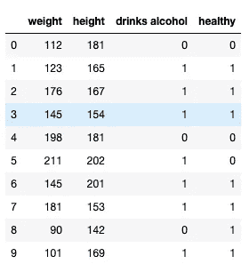

# 拆分数据以适应任何机器学习模型

> 原文：<https://towardsdatascience.com/splitting-your-data-to-fit-any-machine-learning-model-5774473cbed2?source=collection_archive---------14----------------------->

## 使用 scikit-learn，只需几行代码就可以将数据集分成训练和测试，并将特征从目标中分离出来。


**简介**

在您执行了数据清理、数据可视化并了解了数据的详细信息后，是时候将第一个机器学习模型放入其中了。今天，我想与大家分享几行非常简单的代码，这些代码将把任何数据集划分为变量，您可以将这些变量传递给任何机器学习模型，并开始训练它。

这非常简单，但是对于任何数据科学家来说，理解训练和测试数据集的 split 函数是如何工作的是至关重要的。让我们深入研究一下。

**准备数据**

我们将为可视化目的创建一个简单的医疗数据集。想象一下，我们正试图根据患者的体重、身高以及他是否饮酒的信息来预测他是否健康。因此，我们将有三列包含此信息，第四列包含患者是否健康的记录。这是我们的目标变量，我们想要预测的东西。为了简单起见，这里我们将只有 10 个病人。让我们创建这个数据框:

```
import pandas as pd
import numpy as np
client_dictionary = {'weight': [112, 123, 176, 145, 198, 211, 145, 181, 90, 101], 
                     'height': [181, 165, 167, 154, 181, 202, 201, 153, 142, 169],
                     'drinks alcohol': [0, 1, 1, 1, 0, 1, 1, 1, 0, 1],
                     'healthy': [0, 1, 1, 1, 0, 0, 1, 1, 1, 1],}
df = pd.DataFrame(client_dictionary)
df.head(10)
```

我们的数据框如下所示:



**从目标变量中分离特征**

我们应该从将模型的特征从目标变量中分离出来开始。注意，在我们的例子中，除了*‘healthy’*之外的所有列都是我们想要用于模型的特性。我们的目标变量是“健康”。我们可以使用下面的代码来进行目标分离。

```
x_data = df[['weight', 'height', 'drinks alcohol']]
y_data = df['healthy']
```

现在我们的 x_data 看起来像这样:


y_data 是这样的:


**使用 train_test_split**

现在让我们使用 scikit-learn 函数中的 train_test_split 将特征数据(x_data)和目标数据(y_data)进一步划分为 train 和 test。

```
from sklearn.model_selection import train_test_split
x_train, x_test, y_train, y_test = train_test_split(x_data, y_data ,test_size = 0.2, shuffle=False)
```

因此，我们将初始数据框划分为四个不同的数据集，如下图所示:


当调用 train_test_split 函数时，我使用了参数 *shuffle=False* 来实现你在上图中看到的结果。前 80 %的数据用于训练，剩下的 20%用于测试。shuffle 的默认参数是 *True* ，这是您在现实生活中通常使用的参数。这意味着在数据被分成 test 和 train 之前的行被混洗，因此它们的顺序被改变。

**控制测试列车分割比例**

您可以通过使用*测试大小*参数来控制训练测试分割分数。请注意，在我们的示例中，我们将其设置为 0.2。它可以是 0.0 到 1.0 之间的任何数字。您不必指定训练集的分数，因为默认情况下，它将使用测试集未获取的所有剩余数据。

**训练你的机器学习模型**

您准备的数据现在可以输入到机器学习模型中了。我们就用一个非常简单的线性回归模型来说明吧。

```
from sklearn import linear_model
linear_regression_model = linear_model.LinearRegression()
linear_regression_model.fit(x_train, y_train)
```

上面的模型是使用 x_train 和 y_train 样本训练的。现在，您可以使用以下代码对测试集进行预测。

```
y_pred = linear_regression_model.predict(x_test)
```

现在，如果您想评估您的模型有多好，您需要将您在测试集(y_pred)上的预测与测试集(y_test)的实际目标值进行比较。但这是一个不同的故事，我们不会在这里讨论。

**结论**

您已经学习了如何将数据集分成特征和目标变量，然后进一步将其分成测试和训练部分。而这一切只需要几行代码，优雅而简单。

此外，我希望你能理解拆分是如何工作的，并且从现在开始你会明智地使用它，而不是仅仅复制粘贴你找到的代码。

*如果你不时地复制粘贴代码，那也没问题，但是当你真正理解它的时候，你会感到多么满足。*

*最初发表于 aboutdatablog.com:* [拆分你的数据以适合任何机器学习模型](https://www.aboutdatablog.com/post/splitting-your-data-to-fit-any-machine-learning-model)，*2019 年 10 月 23 日。*

*PS:我正在 Medium 和*[***aboutdatablog.com***](https://www.aboutdatablog.com/)*上撰写深入浅出地解释基本数据科学概念的文章。你可以订阅我的* [***邮件列表***](https://medium.com/subscribe/@konkiewicz.m) *以便在我每次写新文章时得到通知。如果你还不是中等会员，你可以在这里加入*[](https://medium.com/@konkiewicz.m/membership)**。**

*下面还有一些你可能喜欢的帖子*

*[](/what-are-lambda-functions-in-python-and-why-you-should-start-using-them-right-now-75ab85655dc6) [## python 中的 lambda 函数是什么，为什么你现在就应该开始使用它们

### 初学者在 python 和 pandas 中开始使用 lambda 函数的快速指南。

towardsdatascience.com](/what-are-lambda-functions-in-python-and-why-you-should-start-using-them-right-now-75ab85655dc6) [](/jupyter-notebook-autocompletion-f291008c66c) [## Jupyter 笔记本自动完成

### 数据科学家的最佳生产力工具，如果您还没有使用它，您应该使用它…

towardsdatascience.com](/jupyter-notebook-autocompletion-f291008c66c) [](/7-practical-pandas-tips-when-you-start-working-with-the-library-e4a9205eb443) [## 当你开始与图书馆合作时，7 个实用的熊猫提示

### 解释一些乍一看不那么明显的东西…

towardsdatascience.com](/7-practical-pandas-tips-when-you-start-working-with-the-library-e4a9205eb443)*