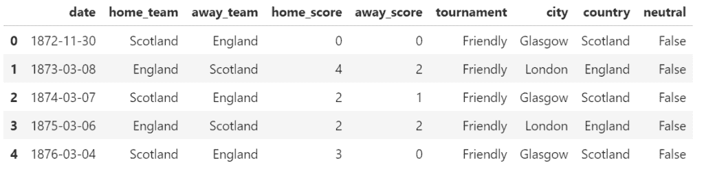
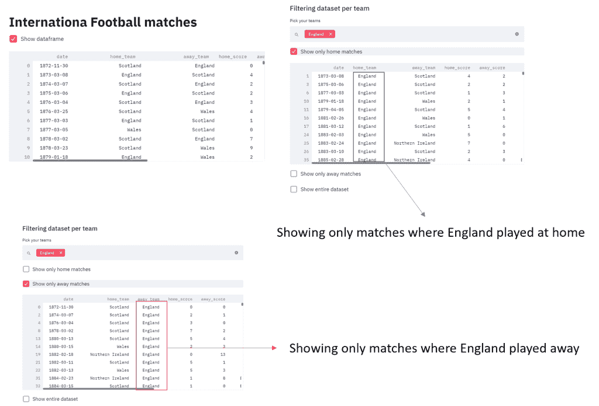
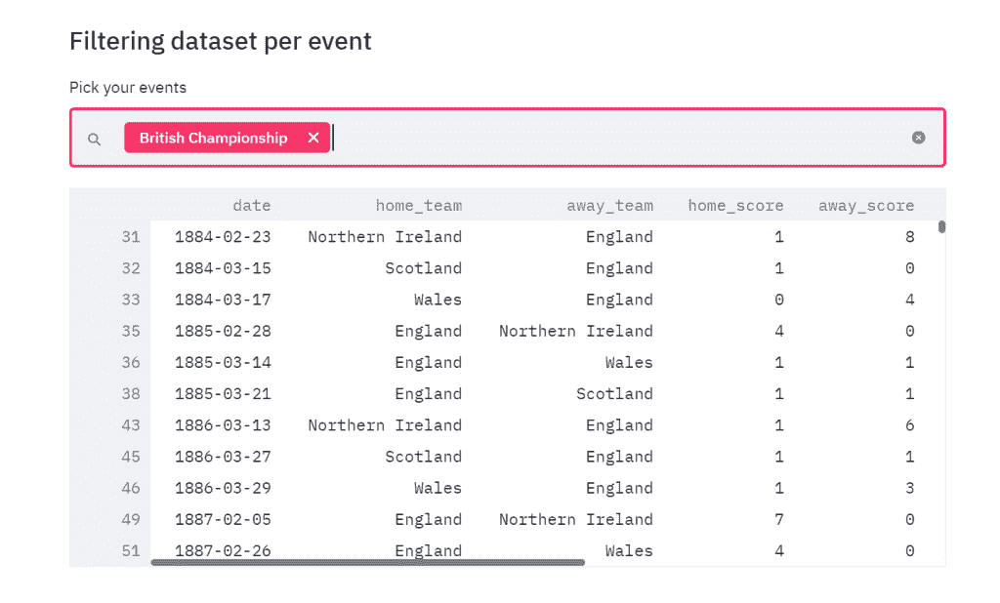
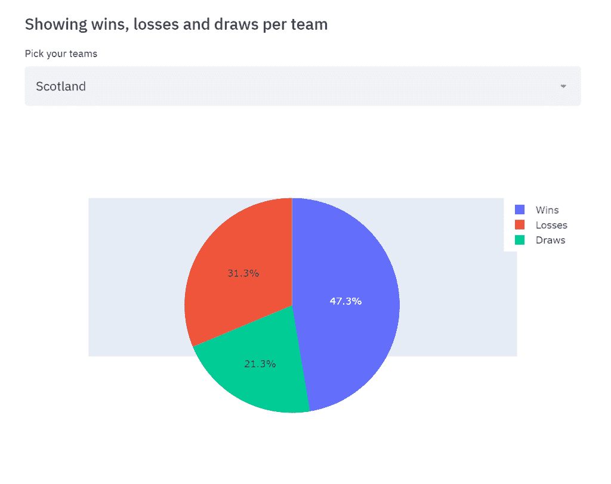
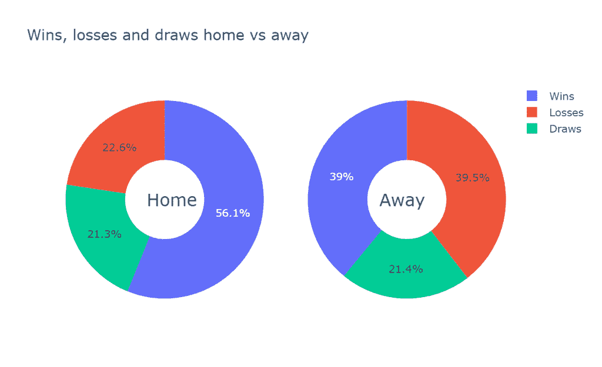
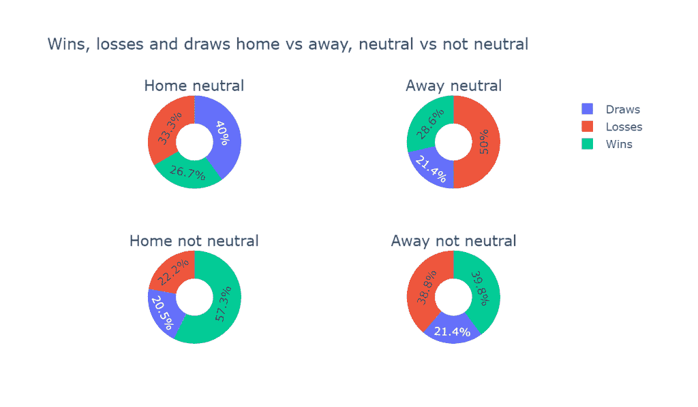
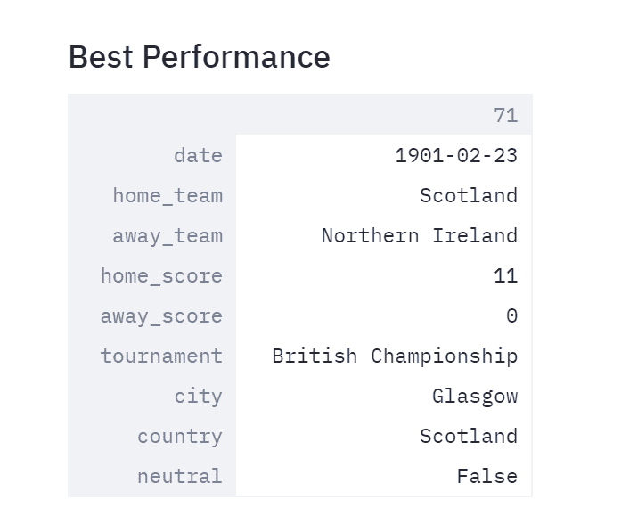

# 体育分析:国际足球比赛的探索性分析-第一部分

> 原文：<https://towardsdatascience.com/sports-analytics-an-exploratory-analysis-of-international-football-matches-part-1-e133798295f7?source=collection_archive---------26----------------------->


数据科学和分析有大量的应用领域，基本上每次这些信息都是以数据的形式提供的。

体育产业也不例外。到处都有很好的业务，通过强大的分析工具研究体育市场的可能性是一个很大的附加值。

在这篇文章中，我将提供一些分析足球比赛的工具。这个想法是用 Python Streamlit 开发一个 web 应用程序(如果你想阅读关于这个工具的介绍，你可以在这里阅读我以前的文章)，它以一种直观和交互的方式，允许用户从庞大的数据集中总结相关信息。为此，我将使用从 1872 年到 2019 年的国际足球比赛结果，可在 [Kaggle](https://www.kaggle.com/martj42/international-football-results-from-1872-to-2017) 上获得。

首先，让我们导入数据集并查看一下:

```
import pandas as pd 
df = pd.read_csv('results.csv') 
df.head()
```



其中:

```
date - date of the match
home_team - the name of the home team
away_team - the name of the away team
home_score - full-time home team score including extra time, not including penalty-shootouts
away_score - full-time away team score including extra time, not including penalty-shootouts
tournament - the name of the tournament
city - the name of the city/town/administrative unit where the match was played
country - the name of the country where the match was played
neutral - TRUE/FALSE column indicating whether the match was played at a neutral venue
```

现在，这个想法是创建一系列与这个数据集的交互，突出我们感兴趣的球队或比赛的特征。我们可以获得大量的信息，本文并不打算列出所有的信息。尽管如此，Streamlit 的优势之一是它能够不断修改，因此您可以随着时间的推移使您的基本框架变得更加复杂，而无需放弃您到目前为止所做的工作。

和我之前的文章一样，我在这里附上了完整的代码:

```
import streamlit as st
import pandas as pd
import numpy as np
import plotly.express as px
import seaborn as sns
import matplotlib.pyplot as plt
import plotly.graph_objects as go
from plotly.subplots import make_subplotsst.title('Internationa Football matches')
df = pd.read_csv("results.csv")if st.checkbox('Show dataframe'):
    st.write(df)st.subheader('Filtering dataset per team')teams = st.multiselect('Pick your teams', df['home_team'].unique())new_df = df[(df['home_team'].isin(teams)) | (df['away_team'].isin(teams)) ]if st.checkbox('Show only home matches'):
    st.write(df[(df['home_team'].isin(teams))])if st.checkbox('Show only away matches'):
    st.write(df[(df['away_team'].isin(teams))])if st.checkbox('Show entire dataset'):    
    st.write(new_df)

st.subheader('Filtering dataset per event')
events = st.multiselect('Pick your events', df['tournament'].unique())
new_df_event = new_df[(new_df['tournament'].isin(events))]
st.write(new_df_event) 

st.subheader('Showing wins, losses and draws per team')team_wins = st.selectbox('Pick your teams', df['home_team'].unique()) 
new_df_wins = df[(df['home_team']==team_wins)|(df['away_team']==team_wins)]
new_df_wins=new_df_wins.reset_index(drop=True)

wins = 0
losses = 0
draw = 0
x = []    

for i in range(len(new_df_wins)):
    if new_df_wins['home_team'][i]==team_wins:
        if new_df_wins['home_score'][i]>new_df_wins['away_score'][i]:
            wins+=1
            x.append(1)
        elif new_df_wins['home_score'][i]<new_df_wins['away_score'][i]:
            losses+=1
            x.append(-1)
        else:
            draw +=1
            x.append(0)
    else:
        if new_df_wins['home_score'][i]<new_df_wins['away_score'][i]:
            wins+=1
            x.append(1)
        elif new_df_wins['home_score'][i]>new_df_wins['away_score'][i]:
            losses+=1
            x.append(-1)
        else:
            draw +=1
            x.append(0)

labels = ['Wins','Losses','Draws']
values = [wins, losses, draw]fig = go.Figure(data=[go.Pie(labels=labels, values=values)])
st.plotly_chart(fig)fig2 = go.Figure()fig2.add_trace(go.Scatter(x=list(new_df_wins['date']), y=x))# Add range slider

fig2.update_layout(
    xaxis=go.layout.XAxis(
        rangeselector=dict(
            buttons=list([
                dict(count=1,
                     label="1m",
                     step="month",
                     stepmode="backward"),
                dict(count=6,
                     label="6m",
                     step="month",
                     stepmode="backward"),
                dict(count=1,
                     label="YTD",
                     step="year",
                     stepmode="todate"),
                dict(count=1,
                     label="1y",
                     step="year",
                     stepmode="backward"),
                dict(step="all")
            ])
        ),
        rangeslider=dict(
            visible=True
        ),
        type="date"
    )
)st.plotly_chart(fig2)wins_h = 0
losses_h = 0
draw_h = 0
wins_a = 0
losses_a = 0
draw_a = 0
for i in range(len(new_df_wins)):
    if new_df_wins['home_team'][i]==team_wins:
        if new_df_wins['home_score'][i]>new_df_wins['away_score'][i]:
            wins_h+=1
        elif new_df_wins['home_score'][i]<new_df_wins['away_score'][i]:
            losses_h+=1
        else:
            draw_h+=1
for i in range(len(new_df_wins)):
    if not new_df_wins['home_team'][i]==team_wins:
        if new_df_wins['home_score'][i]<new_df_wins['away_score'][i]:
            wins_a+=1
        elif new_df_wins['home_score'][i]>new_df_wins['away_score'][i]:
            losses_a+=1
        else:
            draw_a +=1values_home = [wins_h, losses_h, draw_h]
values_away = [wins_a, losses_a, draw_a]
fig3 = make_subplots(rows=1, cols=2, specs=[[{'type':'domain'}, {'type':'domain'}]])
fig3.add_trace(go.Pie(labels=labels, values=values_home, name="Home"),
              1, 1)
fig3.add_trace(go.Pie(labels=labels, values=values_away, name="Away"),
              1, 2)fig3.update_layout(
    title_text="Wins, losses and draws home vs away",
    annotations=[dict(text='Home', x=0.18, y=0.5, font_size=20, showarrow=False),
                 dict(text='Away', x=0.82, y=0.5, font_size=20, showarrow=False)])fig3.update_traces(hole=.4, hoverinfo="label+percent+name")
st.plotly_chart(fig3)#4 subplots to see whether playing in a neutral field is causalwins_h_neutral = 0
losses_h_neutral = 0
draw_h_neutral = 0
wins_h_notneutral = 0
losses_h_notneutral = 0
draw_h_notneutral = 0wins_a_neutral = 0
losses_a_neutral = 0
draw_a_neutral = 0
wins_a_notneutral = 0
losses_a_notneutral = 0
draw_a_notneutral = 0for i in range(len(new_df_wins)):
    if new_df_wins['home_team'][i]==team_wins and new_df_wins['neutral'][i]:
        if new_df_wins['home_score'][i]>new_df_wins['away_score'][i]:
            wins_h_neutral+=1
        elif new_df_wins['home_score'][i]<new_df_wins['away_score'][i]:
            losses_h_neutral+=1
        else:
            draw_h_neutral+=1

for i in range(len(new_df_wins)):
    if new_df_wins['home_team'][i]==team_wins and not new_df_wins['neutral'][i]:
        if new_df_wins['home_score'][i]>new_df_wins['away_score'][i]:
            wins_h_notneutral+=1
        elif new_df_wins['home_score'][i]<new_df_wins['away_score'][i]:
            losses_h_notneutral+=1
        else:
            draw_h_notneutral+=1            

for i in range(len(new_df_wins)):
    if new_df_wins['home_team'][i]!=team_wins and new_df_wins['neutral'][i]:
        if new_df_wins['home_score'][i]<new_df_wins['away_score'][i]:
            wins_a_neutral+=1
        elif new_df_wins['home_score'][i]>new_df_wins['away_score'][i]:
            losses_a_neutral+=1
        else:
            draw_a_neutral +=1

for i in range(len(new_df_wins)):
    if new_df_wins['home_team'][i]!=team_wins and not new_df_wins['neutral'][i]:
        if new_df_wins['home_score'][i]<new_df_wins['away_score'][i]:
            wins_a_notneutral+=1
        elif new_df_wins['home_score'][i]>new_df_wins['away_score'][i]:
            losses_a_notneutral+=1
        else:
            draw_a_notneutral +=1            

values_home_neutral = [wins_h_neutral, losses_h_neutral, draw_h_neutral]
values_away_neutral = [wins_a_neutral, losses_a_neutral, draw_a_neutral]
values_home_notneutral = [wins_h_notneutral, losses_h_notneutral, draw_h_notneutral]
values_away_notneutral = [wins_a_notneutral, losses_a_notneutral, draw_a_notneutral]fig4 = make_subplots(rows=2, cols=2, specs=[[{'type':'domain'}, {'type':'domain'}], [{'type':'domain'}, {'type':'domain'}]],
                    subplot_titles=['Home neutral', 'Away neutral', 'Home not neutral', 'Away not neutral'])
fig4.add_trace(go.Pie(labels=labels, values=values_home_neutral, name="Home neutral"),
              1, 1)
fig4.add_trace(go.Pie(labels=labels, values=values_away_neutral, name="Away neutral"),
              1, 2)
fig4.add_trace(go.Pie(labels=labels, values=values_home_notneutral, name="Home not neutral"),
              2, 1)
fig4.add_trace(go.Pie(labels=labels, values=values_away_notneutral, name="Away not neutral"),
              2, 2)fig4.update_layout(title_text='Wins, losses and draws home vs away, neutral vs not neutral')fig4.update_traces(hole=.4, hoverinfo="label+percent+name")
st.plotly_chart(fig4)#best performance
st.subheader('Best Performance')t = []
for i in range(len(new_df_wins)):
    if new_df_wins['home_team'][i]==team_wins:
        t.append(new_df_wins['home_score'][i])
    else:
        t.append(new_df_wins['away_score'][i])

m = np.argmax(np.array(t), axis=0)
out = new_df_wins.iloc[m]
st.write(out)
```

我将我的脚本内容保存在一个名为 *soccer.py* 的文件中，然后在我的终端上用 *streamlit soccer.py* 运行它。

现在让我们一块一块地检查一下。首先，一旦给了用户可视化整个数据集的可能性，我添加了一些过滤器，以便您可以选择想要在您的数据集中可视化的团队。

```
st.title('International Football matches')
df = pd.read_csv("results.csv")if st.checkbox('Show dataframe'):
    st.write(df)st.subheader('Filtering dataset per team')teams = st.multiselect('Pick your teams', df['home_team'].unique())new_df = df[(df['home_team'].isin(teams)) | (df['away_team'].isin(teams)) ]
```

此外，您可以决定是否可视化您选择的球队在主场或客场进行的比赛:

```
if st.checkbox('Show only home matches'):
    st.write(df[(df['home_team'].isin(teams))])if st.checkbox('Show only away matches'):
    st.write(df[(df['away_team'].isin(teams))])if st.checkbox('Show entire dataset'):    
    st.write(new_df)
```



我还为锦标赛类型添加了一个过滤器:

```
st.subheader('Filtering dataset per event')
events = st.multiselect('Pick your events', df['tournament'].unique())
new_df_event = new_df[(new_df['tournament'].isin(events))]
st.write(new_df_event)
```



很好，现在让我们来研究一些关于赢和输的特性。这个想法是，一旦选择了你感兴趣的球队，你将会看到一系列的信息(主要是图表形式),这些信息是关于不同时间和比赛的输赢趋势。

我们可以为一个团队做的一个非常基本的计算是计算赢、输和平的总数，然后用饼图显示我们的结果:

```
team_wins = st.selectbox('Pick your teams', df['home_team'].unique()) 
new_df_wins = df[(df['home_team']==team_wins)|(df['away_team']==team_wins)]
new_df_wins=new_df_wins.reset_index(drop=True)

wins = 0
losses = 0
draw = 0
x = []    

for i in range(len(new_df_wins)):
    if new_df_wins['home_team'][i]==team_wins:
        if new_df_wins['home_score'][i]>new_df_wins['away_score'][i]:
            wins+=1
            x.append(1)
        elif new_df_wins['home_score'][i]<new_df_wins['away_score'][i]:
            losses+=1
            x.append(-1)
        else:
            draw +=1
            x.append(0)
    else:
        if new_df_wins['home_score'][i]<new_df_wins['away_score'][i]:
            wins+=1
            x.append(1)
        elif new_df_wins['home_score'][i]>new_df_wins['away_score'][i]:
            losses+=1
            x.append(-1)
        else:
            draw +=1
            x.append(0)labels = ['Wins','Losses','Draws']
values = [wins, losses, draw]fig = go.Figure(data=[go.Pie(labels=labels, values=values)])
st.plotly_chart(fig)
```



我们也可以看看这个数据的历史轨迹。可视化一些有意义的信息的一种方法是显示一个时间序列，其中如果在比赛中获胜，输出取值 1，如果失败，取值 1，如果平局，取值 0。通过这样做，如果有一段时间趋势持平于 1(这意味着我们正在检查的球队重复赢得了许多比赛)，我们可能会有兴趣进一步调查这段时间(即，教练的名字，球队是否参加了特定的比赛，是否在主场比赛……)。

让我们来计算我们的时间序列(在我之前的代码中，我已经将我的值存储在数组 x 中):

```
fig2 = go.Figure()fig2.add_trace(go.Scatter(x=list(new_df_wins['date']), y=x))
# Add range slider

fig2.update_layout(
    xaxis=go.layout.XAxis(
        rangeselector=dict(
            buttons=list([
                dict(count=1,
                     label="1m",
                     step="month",
                     stepmode="backward"),
                dict(count=6,
                     label="6m",
                     step="month",
                     stepmode="backward"),
                dict(count=1,
                     label="YTD",
                     step="year",
                     stepmode="todate"),
                dict(count=1,
                     label="1y",
                     step="year",
                     stepmode="backward"),
                dict(step="all")
            ])
        ),
        rangeslider=dict(
            visible=True
        ),
        type="date"
    )
)st.plotly_chart(fig2)
```


如您所见，我添加了交互式小部件(滑块和按钮)，以便您可以关注相关的时间段。

现在，在调查输赢趋势时，可能相关的事情是分析比赛的地点(就主场/客场而言)是否会影响其结果。为此，让我们首先将我们的赢/输/平分为主场赢/输和客场赢/输/平:

```
wins_h = 0
losses_h = 0
draw_h = 0
wins_a = 0
losses_a = 0
draw_a = 0
for i in range(len(new_df_wins)):
    if new_df_wins['home_team'][i]==team_wins:
        if new_df_wins['home_score'][i]>new_df_wins['away_score'][i]:
            wins_h+=1
        elif new_df_wins['home_score'][i]<new_df_wins['away_score'][i]:
            losses_h+=1
        else:
            draw_h+=1
for i in range(len(new_df_wins)):
    if not new_df_wins['home_team'][i]==team_wins:
        if new_df_wins['home_score'][i]<new_df_wins['away_score'][i]:
            wins_a+=1
        elif new_df_wins['home_score'][i]>new_df_wins['away_score'][i]:
            losses_a+=1
        else:
            draw_a +=1
values_home = [wins_h, losses_h, draw_h]
values_away = [wins_a, losses_a, draw_a]
fig3 = make_subplots(rows=1, cols=2, specs=[[{'type':'domain'}, {'type':'domain'}]])
fig3.add_trace(go.Pie(labels=labels, values=values_home, name="Home"),
              1, 1)
fig3.add_trace(go.Pie(labels=labels, values=values_away, name="Away"),
              1, 2)fig3.update_layout(
    title_text="Wins, losses and draws home vs away",
    annotations=[dict(text='Home', x=0.18, y=0.5, font_size=20, showarrow=False),
                 dict(text='Away', x=0.82, y=0.5, font_size=20, showarrow=False)])fig3.update_traces(hole=.4, hoverinfo="label+percent+name")
st.plotly_chart(fig3)
```



正如你所看到的，对于我们感兴趣的球队(苏格兰)，有明确的证据表明，大多数胜利都发生在主场比赛的时候。我们还可以通过考虑位置的中立性来进一步研究这种关系:

```
wins_h_neutral = 0
losses_h_neutral = 0
draw_h_neutral = 0
wins_h_notneutral = 0
losses_h_notneutral = 0
draw_h_notneutral = 0wins_a_neutral = 0
losses_a_neutral = 0
draw_a_neutral = 0
wins_a_notneutral = 0
losses_a_notneutral = 0
draw_a_notneutral = 0for i in range(len(new_df_wins)):
    if new_df_wins['home_team'][i]==team_wins and new_df_wins['neutral'][i]:
        if new_df_wins['home_score'][i]>new_df_wins['away_score'][i]:
            wins_h_neutral+=1
        elif new_df_wins['home_score'][i]<new_df_wins['away_score'][i]:
            losses_h_neutral+=1
        else:
            draw_h_neutral+=1
for i in range(len(new_df_wins)):
    if new_df_wins['home_team'][i]==team_wins and not new_df_wins['neutral'][i]:
        if new_df_wins['home_score'][i]>new_df_wins['away_score'][i]:
            wins_h_notneutral+=1
        elif new_df_wins['home_score'][i]<new_df_wins['away_score'][i]:
            losses_h_notneutral+=1
        else:
            draw_h_notneutral+=1            

for i in range(len(new_df_wins)):
    if new_df_wins['home_team'][i]!=team_wins and new_df_wins['neutral'][i]:
        if new_df_wins['home_score'][i]<new_df_wins['away_score'][i]:
            wins_a_neutral+=1
        elif new_df_wins['home_score'][i]>new_df_wins['away_score'][i]:
            losses_a_neutral+=1
        else:
            draw_a_neutral +=1

for i in range(len(new_df_wins)):
    if new_df_wins['home_team'][i]!=team_wins and not new_df_wins['neutral'][i]:
        if new_df_wins['home_score'][i]<new_df_wins['away_score'][i]:
            wins_a_notneutral+=1
        elif new_df_wins['home_score'][i]>new_df_wins['away_score'][i]:
            losses_a_notneutral+=1
        else:
            draw_a_notneutral +=1
values_home_neutral = [wins_h_neutral, losses_h_neutral, draw_h_neutral]
values_away_neutral = [wins_a_neutral, losses_a_neutral, draw_a_neutral]
values_home_notneutral = [wins_h_notneutral, losses_h_notneutral, draw_h_notneutral]
values_away_notneutral = [wins_a_notneutral, losses_a_notneutral, draw_a_notneutral] fig4 = make_subplots(rows=2, cols=2, specs=[[{'type':'domain'}, {'type':'domain'}], [{'type':'domain'}, {'type':'domain'}]],
                    subplot_titles=['Home neutral', 'Away neutral', 'Home not neutral', 'Away not neutral'])
fig4.add_trace(go.Pie(labels=labels, values=values_home_neutral, name="Home neutral"),
              1, 1)
fig4.add_trace(go.Pie(labels=labels, values=values_away_neutral, name="Away neutral"),
              1, 2)
fig4.add_trace(go.Pie(labels=labels, values=values_home_notneutral, name="Home not neutral"),
              2, 1)
fig4.add_trace(go.Pie(labels=labels, values=values_away_notneutral, name="Away not neutral"),
              2, 2)fig4.update_layout(title_text='Wins, losses and draws home vs away, neutral vs not neutral')fig4.update_traces(hole=.4, hoverinfo="label+percent+name")
st.plotly_chart(fig4)
```



最后，我们可以检索我们团队的最佳表现(这里，我认为最佳表现对应于我的团队进球最多的比赛)。

```
st.subheader('Best Performance')t = []
for i in range(len(new_df_wins)):
    if new_df_wins['home_team'][i]==team_wins:
        t.append(new_df_wins['home_score'][i])
    else:
        t.append(new_df_wins['away_score'][i])

m = np.argmax(np.array(t), axis=0)
out = new_df_wins.iloc[m]
st.write(out)st.subheader('Comparing 2 teams')
team1 = st.selectbox('Pick one team', df['home_team'].unique())
team2 = st.selectbox('Pick one team', df['home_team'].unique())
```



因此，我们使用直观的小部件收集了我们感兴趣的团队的相关信息，主要依靠数据的图形表示。在这里，我着重分析一个团队。在我的下一篇文章中，我将提出这个代码的进一步实现，从比较和检查两个队的比赛开始，然后进行一些预测。

所以敬请期待[第二部](https://medium.com/@valentinaalto/sports-analytics-an-exploratory-analysis-of-international-football-matches-part-2-a20674cca78c)！

**参考文献**:

*   [https://www . ka ggle . com/martj 42/international-football-results-from-1872-to-2017](https://www.kaggle.com/martj42/international-football-results-from-1872-to-2017)
*   [https://streamlit.io/docs/](https://streamlit.io/docs/)

*原载于 2019 年 10 月 25 日*[*http://datasciencechalktalk.com*](https://datasciencechalktalk.com/2019/10/25/sport-analytics-exploratory-analysis-of-international-football-matches-part-1/)*。*